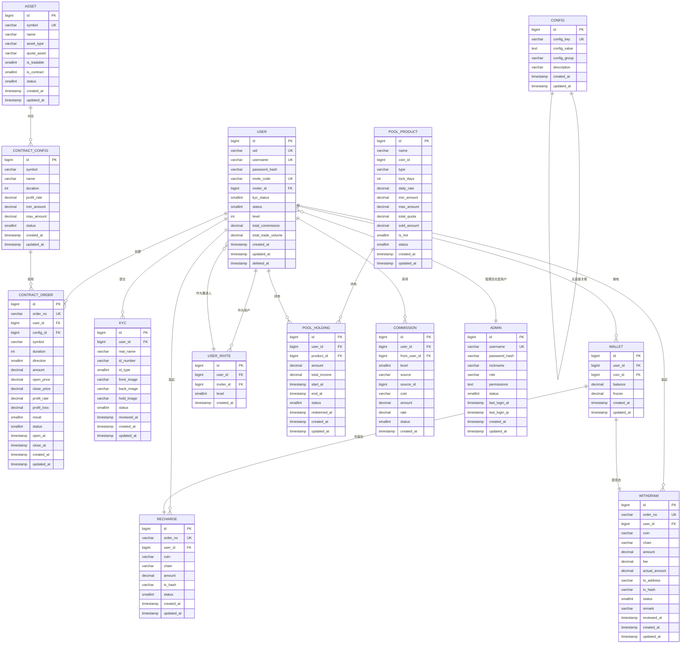

# 数据模型

<cite>
**本文档引用的文件**   
- [user.entity.ts](file://agx-backend/src/entities/user.entity.ts)
- [asset.entity.ts](file://agx-backend/src/entities/asset.entity.ts)
- [contract-order.entity.ts](file://agx-backend/src/entities/contract-order.entity.ts)
- [config.entity.ts](file://agx-backend/src/entities/config.entity.ts)
- [contract-config.entity.ts](file://agx-backend/src/entities/contract-config.entity.ts)
- [kyc.entity.ts](file://agx-backend/src/entities/kyc.entity.ts)
- [wallet.entity.ts](file://agx-backend/src/entities/wallet.entity.ts)
- [recharge.entity.ts](file://agx-backend/src/entities/recharge.entity.ts)
- [withdraw.entity.ts](file://agx-backend/src/entities/withdraw.entity.ts)
- [user-invite.entity.ts](file://agx-backend/src/entities/user-invite.entity.ts)
- [pool-product.entity.ts](file://agx-backend/src/entities/pool-product.entity.ts)
- [pool-holding.entity.ts](file://agx-backend/src/entities/pool-holding.entity.ts)
- [commission.entity.ts](file://agx-backend/src/entities/commission.entity.ts)
- [admin.entity.ts](file://agx-backend/src/entities/admin.entity.ts)
- [schema.sql](file://agx-backend/schema.sql)
</cite>

## 目录
1. [引言](#引言)
2. [核心实体详解](#核心实体详解)
3. [实体关系与ER图](#实体关系与er图)
4. [数据访问与TypeORM实现](#数据访问与typeorm实现)
5. [数据生命周期与安全要求](#数据生命周期与安全要求)
6. [查询优化与事务管理](#查询优化与事务管理)
7. [迁移策略](#迁移策略)
8. [结论](#结论)

## 引言
本数据模型文档旨在全面阐述agx-dev项目的核心数据库实体及其相互关系。文档聚焦于关键实体如User（用户）、Asset（资产）、ContractOrder（合约订单）和Config（配置）的字段定义、数据类型、主外键关系和业务约束。通过分析schema.sql文件和TypeORM实体类，我们将揭示这些实体之间的关联方式，例如用户拥有多个资产、订单关联用户和合约配置等。文档包含基于schema.sql的ER图，为初学者解释基本的数据库概念，并为开发者提供数据访问模式、查询优化和事务管理的指导。同时，文档将说明数据生命周期、安全要求（如KYC信息加密）和迁移策略。

## 核心实体详解

### User（用户实体）
User实体是系统的核心，代表平台的注册用户。它包含了用户的身份信息、账户状态、社交属性和交易统计。

**字段定义与业务约束：**
- **id**: 主键，BIGINT类型，自增。
- **uid**: 用户唯一标识，VARCHAR(32)，唯一约束，用于内部系统识别。
- **username**: 用户名，VARCHAR(50)，唯一约束，用户登录和展示的名称。
- **passwordHash**: 密码哈希值，VARCHAR(255)，存储经过加密的密码，保障账户安全。
- **inviteCode**: 邀请码，VARCHAR(16)，唯一约束，用于邀请新用户。
- **inviterId**: 邀请人ID，BIGINT，外键关联自身，形成用户邀请关系链。
- **kycStatus**: KYC认证状态，SMALLINT，枚举值（0未认证, 1认证中, 2已认证, 3失败），控制用户交易权限。
- **status**: 账户状态，SMALLINT，枚举值（0禁用, 1正常），用于封禁或启用账户。
- **level**: 用户等级，INT，表示用户等级（1=普通, 2=银牌, 3=金牌, 4=钻石, 5=黑金），影响返佣比例等。
- **totalCommission**: 累计返佣，DECIMAL(20,8)，记录用户通过邀请获得的总收益。
- **totalTradeVolume**: 累计交易额，DECIMAL(20,8)，用于用户等级评定和风控。

**Section sources**
- [user.entity.ts](file://agx-backend/src/entities/user.entity.ts#L1-L118)

### Asset（资产实体）
Asset实体定义了平台支持的交易品种，如加密货币、外汇、贵金属等。

**字段定义与业务约束：**
- **id**: 主键，BIGINT类型，自增。
- **symbol**: 资产代码，VARCHAR(32)，唯一约束，如BTC、XAU/USD。
- **name**: 资产名称，VARCHAR(100)，如“比特币”、“黄金/美元”。
- **assetType**: 资产类型，VARCHAR(20)，枚举值（crypto, forex, stock, metal, fund），用于分类管理。
- **quoteAsset**: 报价资产，VARCHAR(50)，默认为USD，表示该资产以何种货币计价。
- **isTradable**: 是否可交易，SMALLINT，标志该资产是否开放交易（1可交易）。
- **isContract**: 是否支持合约，SMALLINT，标志该资产是否支持合约交易模式。
- **decimals**: 价格小数位数，SMALLINT，控制价格显示精度。
- **dataSource**: 数据源，VARCHAR(50)，如binance、coingecko，用于获取实时行情。

**Section sources**
- [asset.entity.ts](file://agx-backend/src/entities/asset.entity.ts#L1-L80)

### ContractOrder（合约订单实体）
ContractOrder实体记录了用户的合约交易订单。

**字段定义与业务约束：**
- **id**: 主键，BIGINT类型，自增。
- **orderNo**: 订单号，VARCHAR(32)，唯一约束，全局唯一的订单标识。
- **userId**: 用户ID，BIGINT，外键关联User表，标识订单所属用户。
- **configId**: 配置ID，BIGINT，外键关联ContractConfig表，标识订单使用的合约配置。
- **symbol**: 交易对，VARCHAR(20)，如XAU/USD，与Asset表的symbol关联。
- **direction**: 方向，SMALLINT，枚举值（1看涨, 2看跌），表示用户预测的价格走势。
- **amount**: 下单金额，DECIMAL(20,8)，用户投入的交易本金。
- **openPrice**: 开仓价，DECIMAL(20,8)，订单创建时的市场价格。
- **profitRate**: 收益率，DECIMAL(10,4)，根据合约配置确定的盈利比例。
- **status**: 订单状态，SMALLINT，枚举值（0进行中, 1已结算），控制订单生命周期。
- **openAt**: 开仓时间，TIMESTAMP，订单创建时间。
- **closeAt**: 平仓时间，TIMESTAMP，订单结算时间。

**Section sources**
- [contract-order.entity.ts](file://agx-backend/src/entities/contract-order.entity.ts#L1-L81)

### Config（配置实体）
Config实体用于存储系统的动态配置项，实现无需重启即可修改参数。

**字段定义与业务约束：**
- **id**: 主键，BIGINT类型，自增。
- **configKey**: 配置键，VARCHAR(50)，唯一约束，如`commission_level1_rate`，作为配置的唯一标识。
- **configValue**: 配置值，TEXT，存储配置的具体值，可以是字符串、数字或JSON。
- **configGroup**: 配置分组，VARCHAR(50)，用于对配置进行分类管理，如“commission”、“system”。
- **description**: 描述，VARCHAR(100)，对配置项的说明。

**Section sources**
- [config.entity.ts](file://agx-backend/src/entities/config.entity.ts#L1-L32)

## 实体关系与ER图

**Diagram sources **
- [schema.sql](file://agx-backend/schema.sql#L6-L206)

## 数据访问与TypeORM实现

### TypeORM关系映射
在agx-dev项目中，使用TypeORM作为ORM框架，通过装饰器（Decorators）在TypeScript实体类中定义数据库表结构和关系。

- **一对一 (One-to-One)**: 例如，一个User对应一个KYC记录。在`Kyc`实体中使用`@ManyToOne`装饰器关联`User`，并在`User`实体中可以使用`@OneToOne`反向关联。
- **一对多 (One-to-Many)**: 这是最常见的关系。例如，一个User可以创建多个`ContractOrder`。在`ContractOrder`实体中，使用`@ManyToOne(() => User)`定义多端，而在`User`实体中，使用`@OneToMany(() => ContractOrder, order => order.user)`定义一端。
- **多对一 (Many-to-One)**: 如上所述，`ContractOrder`对`User`的关系。
- **多对多 (Many-to-Many)**: 项目中未直接体现，但可通过中间表实现，如用户与权限的关联。

### 关键装饰器说明
- `@Entity('table_name')`: 将类标记为实体，并指定对应的数据库表名。
- `@PrimaryGeneratedColumn()`: 定义主键列，并设置为自动生成。
- `@Column()`: 定义普通列，可配置类型、长度、是否可空、默认值和注释等。
- `@ManyToOne()`: 定义多对一关系。
- `@JoinColumn()`: 指定外键列的名称。
- `@CreateDateColumn()` 和 `@UpdateDateColumn()`: 自动管理记录的创建和更新时间戳。
- `@Index()`: 为列创建数据库索引，以提高查询性能。

**Section sources**
- [user.entity.ts](file://agx-backend/src/entities/user.entity.ts#L1-L118)
- [contract-order.entity.ts](file://agx-backend/src/entities/contract-order.entity.ts#L1-L81)
- [contract-config.entity.ts](file://agx-backend/src/entities/contract-config.entity.ts#L1-L47)

## 数据生命周期与安全要求

### 数据生命周期
1.  **创建 (Create)**: 用户注册时创建User记录；用户首次交易时创建Wallet记录；用户提交KYC时创建Kyc记录。
2.  **读取 (Read)**: 应用程序在用户登录、查看资产、查询订单历史时读取数据。
3.  **更新 (Update)**: 用户修改个人信息、订单状态变更（如结算）、钱包余额变动时更新数据。
4.  **删除 (Delete)**: 系统通常采用软删除（Soft Delete），通过`deleted_at`字段标记记录为已删除，而非物理删除，以保留审计日志。例如，User实体中的`@DeleteDateColumn`。

### 安全要求
- **密码安全**: 用户密码绝不以明文存储。`User`实体中的`passwordHash`字段存储的是经过bcrypt等强哈希算法处理后的值。
- **KYC信息加密**: KYC实体（Kyc）中包含用户的身份证号（`idNumber`）和真实姓名（`realName`）等敏感PII（个人身份信息）。这些信息在存储到数据库前必须进行加密处理，确保即使数据库泄露，敏感信息也不会被轻易获取。
- **访问控制**: 通过`Admin`实体的`role`和`permissions`字段实现基于角色的访问控制（RBAC），确保管理员只能访问其权限范围内的数据和功能。
- **审计日志**: `agx_admin_log`和`agx_login_log`表记录了关键操作和登录行为，用于安全审计和问题追溯。

**Section sources**
- [user.entity.ts](file://agx-backend/src/entities/user.entity.ts#L1-L118)
- [kyc.entity.ts](file://agx-backend/src/entities/kyc.entity.ts#L1-L57)
- [admin.entity.ts](file://agx-backend/src/entities/admin.entity.ts#L1-L46)

## 查询优化与事务管理

### 查询优化
- **索引 (Indexes)**: 合理使用索引是查询优化的关键。例如，在`User`表的`username`、`uid`、`invite_code`上创建了唯一索引，确保查询效率和数据唯一性。在`ContractOrder`表的`user_id`和`status`上创建索引，便于快速查询特定用户或状态的订单。
- **避免N+1查询**: 使用TypeORM的`relations`选项或`JOIN`查询一次性加载关联数据，避免为每个主记录单独发起一次关联查询。
- **分页 (Pagination)**: 对于订单历史、交易记录等大量数据的查询，必须使用分页（如`skip`和`take`），避免一次性加载过多数据导致性能问题。

### 事务管理
在涉及多个数据表更新的业务场景中，必须使用数据库事务来保证数据的一致性。例如：
- **用户提现**: 需要同时更新`Wallet`表的余额和创建一条`Withdraw`记录。这两个操作必须在同一个事务中完成，要么全部成功，要么全部回滚，防止出现“钱扣了但提现记录没生成”的情况。
- **合约订单结算**: 结算时需要更新`ContractOrder`的状态和结果，并可能触发返佣逻辑，更新`Commission`和`Wallet`表。这同样需要一个跨多个表的事务来保证原子性。

**Section sources**
- [wallet.entity.ts](file://agx-backend/src/entities/wallet.entity.ts#L1-L42)
- [withdraw.entity.ts](file://agx-backend/src/entities/withdraw.entity.ts#L1-L63)
- [contract-order.entity.ts](file://agx-backend/src/entities/contract-order.entity.ts#L1-L81)

## 迁移策略
数据库迁移（Migration）是管理数据库模式变更的可靠方式。agx-dev项目使用TypeORM的迁移功能。

- **迁移文件**: 在`agx-backend/migrations/`目录下，每个迁移文件（如`001_extend_modules.sql`）都包含`up`（应用变更）和`down`（回滚变更）两个方法。
- **变更流程**: 当需要修改数据库结构时（如添加新字段、创建新表），开发者使用TypeORM CLI生成一个新的迁移文件，并在其中编写SQL语句。部署时，系统会按顺序执行所有未应用的迁移脚本。
- **与schema.sql的关系**: `schema.sql`文件是数据库的完整结构快照，通常用于初始化一个全新的数据库。而迁移文件则记录了从一个版本到另一个版本的增量变更，适用于已有数据库的升级。

**Section sources**
- [schema.sql](file://agx-backend/schema.sql#L1-L472)

## 结论
本文档详细阐述了agx-dev项目的核心数据模型，涵盖了User、Asset、ContractOrder、Config等关键实体的结构、关系和业务逻辑。通过ER图清晰地展示了实体间的关联，解释了如何利用TypeORM实现这些关系。文档还强调了数据生命周期管理、安全要求（特别是KYC信息的加密）以及查询优化和事务管理的最佳实践。遵循此数据模型，开发者可以确保数据的一致性、安全性和高效访问，为平台的稳定运行奠定坚实基础。