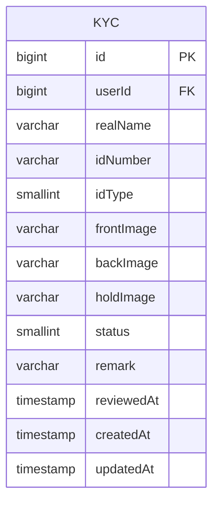
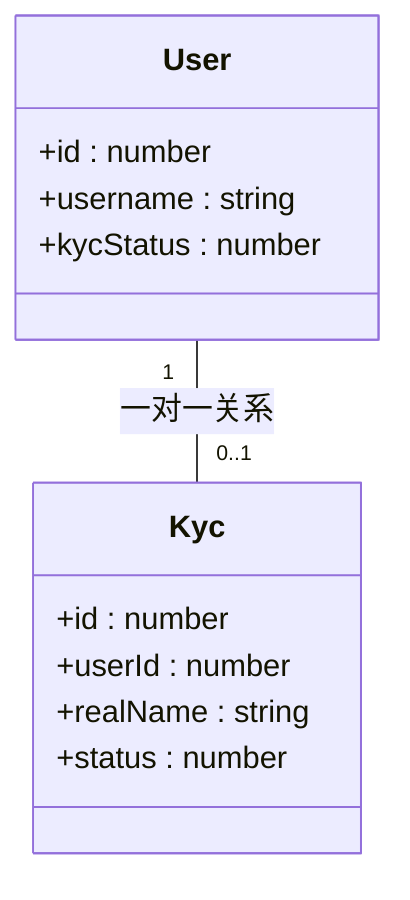
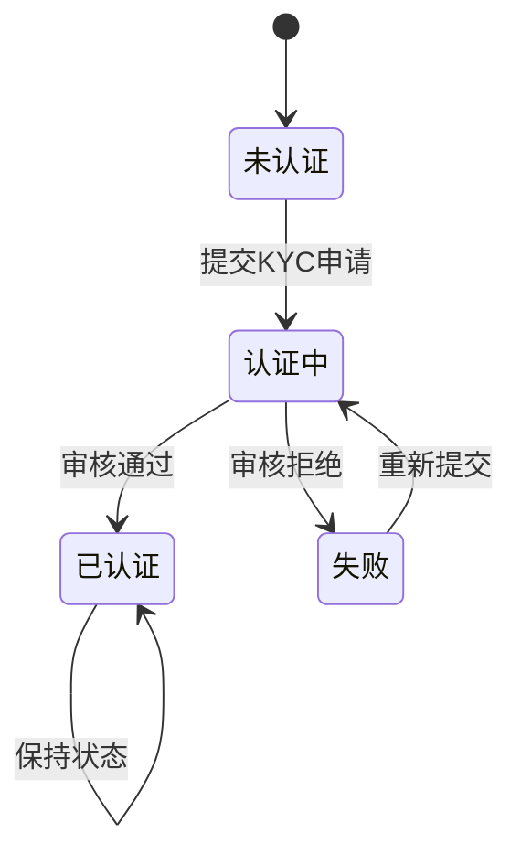
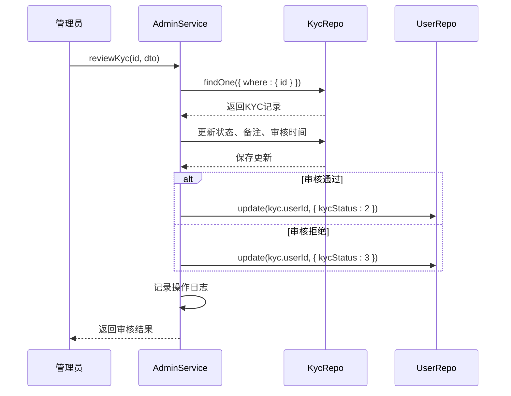
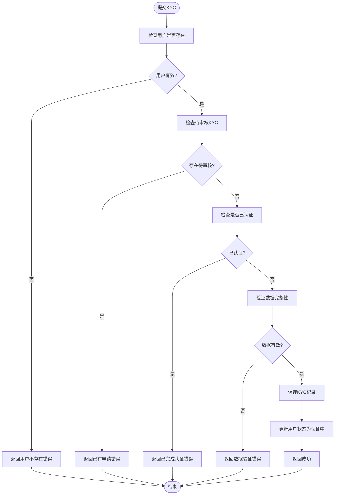

# KYC认证

<cite>
**本文档引用文件**   
- [kyc.entity.ts](file://agx-backend/src/entities/kyc.entity.ts)
- [user.entity.ts](file://agx-backend/src/entities/user.entity.ts)
- [account.service.ts](file://agx-backend/src/modules/account/account.service.ts)
- [account.controller.ts](file://agx-backend/src/modules/account/account.controller.ts)
- [admin.service.ts](file://agx-backend/src/modules/admin/admin.service.ts)
- [kyc.vue](file://agx-admin/src/views/agx/kyc.vue)
</cite>

## 目录
1. [简介](#简介)
2. [KYC实体数据模型](#kyc实体数据模型)
3. [用户与KYC关系实现](#用户与kyc关系实现)
4. [KYC认证流程与状态变迁](#kyc认证流程与状态变迁)
5. [敏感信息存储与安全策略](#敏感信息存储与安全策略)
6. [审核逻辑与通知机制](#审核逻辑与通知机制)
7. [开发者最佳实践](#开发者最佳实践)
8. [结论](#结论)

## 简介
本文档详细描述了KYC（了解你的客户）认证系统的实现，重点关注身份验证数据模型的设计与实现。文档涵盖了KYC实体的字段定义、与用户实体的关系、认证流程的状态变迁、敏感信息的安全存储策略以及审核逻辑的实现。通过本文档，开发者可以全面了解KYC系统的架构和实现细节，以便进行开发、维护和扩展。

## KYC实体数据模型

KYC实体定义了用户身份验证所需的所有信息，包括个人身份信息、证件照片和审核状态。该实体通过`agx_kyc`数据库表实现，包含以下字段：

| 字段名 | 数据类型 | 约束条件 | 描述 |
|--------|---------|---------|------|
| id | BIGINT | 主键，自增 | KYC记录的唯一标识符 |
| userId | BIGINT | 非空，外键 | 关联的用户ID |
| realName | VARCHAR(50) | 非空 | 用户真实姓名 |
| idNumber | VARCHAR(50) | 非空 | 证件号码 |
| idType | SMALLINT | 默认值1 | 证件类型：1身份证，2护照 |
| frontImage | VARCHAR(255) | 可为空 | 证件正面照片URL |
| backImage | VARCHAR(255) | 可为空 | 证件背面照片URL |
| holdImage | VARCHAR(255) | 可为空 | 手持证件照片URL |
| status | SMALLINT | 默认值0 | 审核状态：0待审核，1通过，2拒绝 |
| remark | VARCHAR(255) | 可为空 | 审核备注 |
| reviewedAt | TIMESTAMP | 可为空 | 审核时间 |
| createdAt | TIMESTAMP | 非空 | 创建时间 |
| updatedAt | TIMESTAMP | 非空 | 更新时间 |



**图表来源**
- [kyc.entity.ts](file://agx-backend/src/entities/kyc.entity.ts#L14-L56)

**本节来源**
- [kyc.entity.ts](file://agx-backend/src/entities/kyc.entity.ts#L14-L56)

## 用户与KYC关系实现

KYC实体与用户实体之间存在一对一的关系，通过外键约束实现。这种关系确保了每个用户最多只能有一个KYC记录处于待审核状态，防止重复提交。

### 关系实现方式
在`kyc.entity.ts`文件中，通过`@ManyToOne`装饰器和`@JoinColumn`装饰器实现了与用户实体的关系：

```typescript
@ManyToOne(() => User)
@JoinColumn({ name: 'user_id' })
user: User;
```

同时，在用户实体中，`kycStatus`字段用于跟踪用户的KYC认证状态，实现了状态的同步更新。

### 级联操作
系统实现了以下级联操作：
- 当KYC记录被审核通过（状态变为1）时，用户的`kycStatus`自动更新为2（已认证）
- 当KYC记录被拒绝（状态变为2）时，用户的`kycStatus`自动更新为3（失败）
- 创建KYC记录时，用户的`kycStatus`会更新为1（认证中）



**图表来源**
- [kyc.entity.ts](file://agx-backend/src/entities/kyc.entity.ts#L20-L22)
- [user.entity.ts](file://agx-backend/src/entities/user.entity.ts#L41-L42)

**本节来源**
- [kyc.entity.ts](file://agx-backend/src/entities/kyc.entity.ts#L17-L22)
- [user.entity.ts](file://agx-backend/src/entities/user.entity.ts#L41-L42)

## KYC认证流程与状态变迁

KYC认证流程包含多个状态，从用户提交申请到最终审核结果，系统通过状态机模式管理整个流程。

### 状态定义
KYC实体的`status`字段定义了以下状态：
- **0 (待审核)**: 用户已提交KYC申请，等待管理员审核
- **1 (通过)**: 管理员已审核通过，用户完成实名认证
- **2 (已拒绝)**: 管理员审核未通过，用户需要重新提交

同时，用户实体的`kycStatus`字段定义了更详细的状态：
- **0 (未认证)**: 用户尚未开始KYC认证
- **1 (认证中)**: 用户已提交KYC申请，正在审核中
- **2 (已认证)**: KYC认证已通过
- **3 (失败)**: KYC认证被拒绝

### 状态变迁流程


### 防止重复提交
系统通过以下机制防止用户重复提交KYC申请：
1. 在提交KYC时检查是否存在待审核的记录
2. 如果存在待审核的KYC记录，则抛出异常阻止重复提交
3. 用户完成认证后，不允许再次提交新的KYC申请

```typescript
// 检查是否已有待审核的KYC
const pending = await this.kycRepo.findOne({
  where: { userId, status: 0 },
});
if (pending) {
  throw new BusinessException(5002, '您已有待审核的认证申请');
}

// 检查是否已认证通过
if (user.kycStatus === 2) {
  throw new BusinessException(5003, '您已完成实名认证');
}
```

**图表来源**
- [kyc.entity.ts](file://agx-backend/src/entities/kyc.entity.ts#L42-L43)
- [user.entity.ts](file://agx-backend/src/entities/user.entity.ts#L41-L42)

**本节来源**
- [account.service.ts](file://agx-backend/src/modules/account/account.service.ts#L301-L312)

## 敏感信息存储与安全策略

系统采用多层次的安全策略来保护用户的敏感身份信息，确保数据的机密性和完整性。

### 数据加密存储
虽然代码中未直接显示加密实现，但系统设计考虑了敏感信息的安全存储：
- 证件号码在返回给前端时进行了部分掩码处理
- 系统应配置为对敏感字段进行加密存储
- 图片文件存储在安全的文件服务器上，通过URL引用

### 访问控制
系统实现了严格的访问控制机制：
- KYC信息只能由用户本人和管理员访问
- 普通用户只能查看自己的KYC信息
- 管理员需要特定权限才能审核KYC申请

### 数据脱敏
在API响应中，对敏感信息进行了脱敏处理：
```typescript
// 返回KYC信息时对证件号码进行脱敏
idNumber: kyc.idNumber.replace(/^(.{4}).*(.{4})$/, '$1****$2'),
```

### 安全审计
系统记录了所有KYC相关的操作日志，包括：
- KYC申请提交
- KYC审核操作
- 状态变更记录

这些日志可用于安全审计和问题追踪。

**本节来源**
- [account.service.ts](file://agx-backend/src/modules/account/account.service.ts#L361-L363)
- [admin.service.ts](file://agx-backend/src/modules/admin/admin.service.ts#L771-L779)

## 审核逻辑与通知机制

KYC审核逻辑由管理员服务实现，包含完整的审核流程和通知机制。

### 审核逻辑实现
审核逻辑在`admin.service.ts`文件中实现，主要流程如下：



### 审核代码示例
```typescript
async reviewKyc(id: number, dto: any, adminId?: number, ip?: string) {
  const kyc = await this.kycRepo.findOne({ where: { id } });
  if (!kyc) {
    throw new BusinessException(5001, 'KYC记录不存在');
  }

  kyc.status = dto.status;
  kyc.remark = dto.remark || '';
  kyc.reviewedAt = new Date();
  await this.kycRepo.save(kyc);

  // 同步更新用户KYC状态
  if (dto.status === 1) {
    await this.userRepo.update(kyc.userId, { kycStatus: 2 });
  } else if (dto.status === 2) {
    await this.userRepo.update(kyc.userId, { kycStatus: 3 });
  }

  // 记录操作日志
  if (adminId) {
    const statusText = dto.status === 1 ? '通过' : '拒绝';
    await this.logAdminAction(
      adminId,
      'KYC审核',
      statusText,
      `KYC ID:${id}, 用户ID:${kyc.userId}, 原因:${dto.remark || '无'}`,
      ip
    );
  }

  return {};
}
```

### 通知机制
系统通过以下方式实现通知：
1. **前端通知**: 使用Message组件向管理员显示操作结果
2. **操作日志**: 记录所有审核操作，便于追踪和审计
3. **状态同步**: 实时更新用户状态，确保一致性

```typescript
// 前端审核通过处理
const handleApprove = async (record) => {
  try {
    const res = await agxApi.reviewKyc(record.id, { status: 1 })
    if (res.code === 0) {
      Message.success('已通过')
      fetchData()
    }
  } catch (e) {
    Message.error('操作失败')
  }
}
```

**图表来源**
- [admin.service.ts](file://agx-backend/src/modules/admin/admin.service.ts#L753-L784)
- [kyc.vue](file://agx-admin/src/views/agx/kyc.vue#L149-L158)

**本节来源**
- [admin.service.ts](file://agx-backend/src/modules/admin/admin.service.ts#L753-L784)
- [kyc.vue](file://agx-admin/src/views/agx/kyc.vue#L149-L158)

## 开发者最佳实践

为确保KYC系统的稳定性和安全性，开发者应遵循以下最佳实践。

### KYC数据查询
查询KYC数据时，应使用适当的服务方法并处理分页：

```typescript
// 获取KYC列表（管理员端）
async getKycList(dto: any) {
  const { page = 1, pageSize = 20, status } = dto;

  const query = this.kycRepo
    .createQueryBuilder('k')
    .leftJoinAndSelect('k.user', 'user');

  if (status !== undefined && status !== '') {
    query.andWhere('k.status = :status', { status: parseInt(status) });
  }

  query
    .orderBy('k.createdAt', 'DESC')
    .skip((page - 1) * pageSize)
    .take(pageSize);

  const [list, total] = await query.getManyAndCount();
  // ... 转换数据格式
}
```

### 审核操作
执行审核操作时，应注意事务完整性和错误处理：

```typescript
// 审核操作应包含完整的错误处理
async reviewKyc(id: number, dto: any, adminId?: number, ip?: string) {
  // 验证KYC记录存在
  const kyc = await this.kycRepo.findOne({ where: { id } });
  if (!kyc) {
    throw new BusinessException(5001, 'KYC记录不存在');
  }

  // 更新KYC状态
  kyc.status = dto.status;
  kyc.remark = dto.remark || '';
  kyc.reviewedAt = new Date();
  await this.kycRepo.save(kyc);

  // 同步更新用户状态
  if (dto.status === 1) {
    await this.userRepo.update(kyc.userId, { kycStatus: 2 });
  } else if (dto.status === 2) {
    await this.userRepo.update(kyc.userId, { kycStatus: 3 });
  }

  // 记录审计日志
  if (adminId) {
    await this.logAdminAction(/* ... */);
  }
}
```

### 合规性检查
实施以下合规性检查以确保数据一致性：



### 防止重复提交
通过以下方法防止重复提交：
1. 在服务层检查待审核的KYC记录
2. 使用数据库唯一约束（如适用）
3. 在前端禁用重复提交按钮

### 确保数据一致性
确保数据一致性的关键措施：
- 使用事务处理相关更新
- 实现级联状态更新
- 记录详细的操作日志
- 定期进行数据一致性检查

**图表来源**
- [account.service.ts](file://agx-backend/src/modules/account/account.service.ts#L295-L340)
- [admin.service.ts](file://agx-backend/src/modules/admin/admin.service.ts#L753-L784)

**本节来源**
- [account.service.ts](file://agx-backend/src/modules/account/account.service.ts#L295-L340)
- [admin.service.ts](file://agx-backend/src/modules/admin/admin.service.ts#L753-L784)

## 结论
本文档详细描述了KYC认证系统的实现，涵盖了数据模型、关系实现、流程状态、安全策略和审核逻辑等关键方面。通过TypeORM实体定义、NestJS服务实现和Vue前端界面的协同工作，系统提供了一个完整、安全且易于使用的KYC认证解决方案。

核心要点总结：
- KYC实体与用户实体通过外键实现一对一关系
- 系统通过状态机模式管理KYC认证流程
- 实现了防止重复提交和确保数据一致性的机制
- 敏感信息通过脱敏和访问控制进行保护
- 审核逻辑包含完整的状态更新和审计日志记录

开发者在进行相关开发时，应遵循文档中描述的最佳实践，确保系统的安全性、一致性和可维护性。