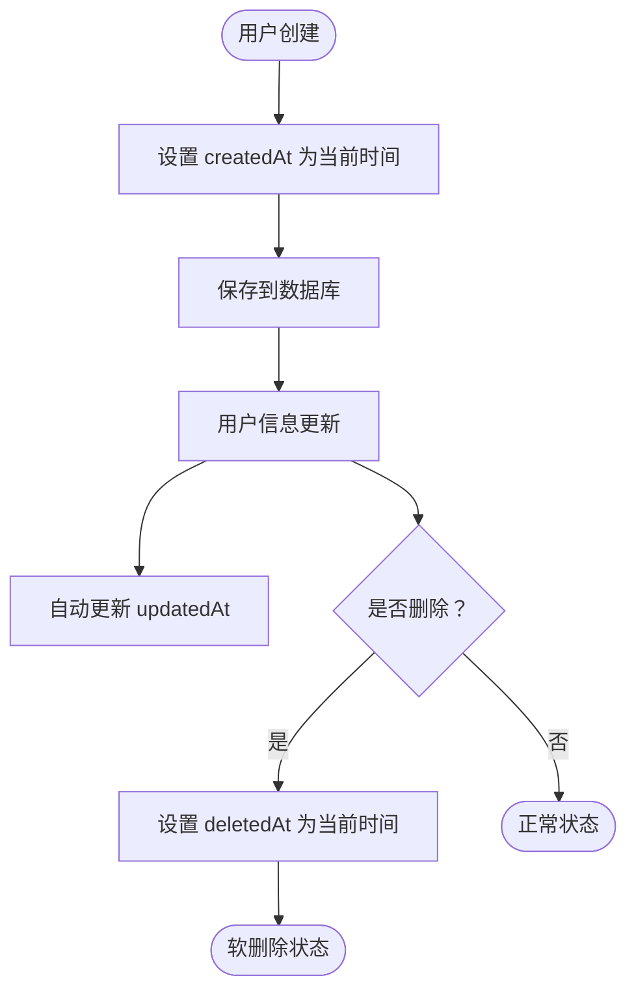
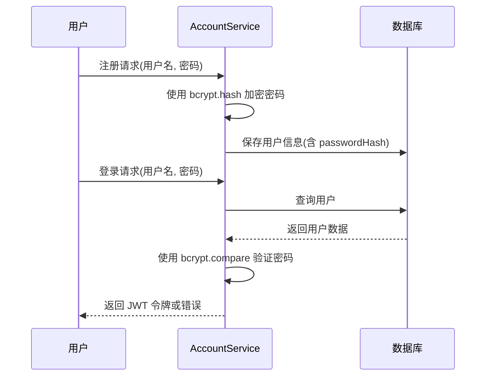

# 核心用户

<cite>
**本文档引用的文件**  
- [user.entity.ts](file://agx-backend/src/entities/user.entity.ts)
- [account.service.ts](file://agx-backend/src/modules/account/account.service.ts)
- [account.dto.ts](file://agx-backend/src/modules/account/account.dto.ts)
- [admin.service.ts](file://agx-backend/src/modules/admin/admin.service.ts)
</cite>

## 目录
1. [用户实体概述](#用户实体概述)
2. [字段定义与业务含义](#字段定义与业务含义)
3. [生命周期钩子与时间戳字段](#生命周期钩子与时间戳字段)
4. [密码加密与安全机制](#密码加密与安全机制)
5. [TypeORM实体配置详解](#typeorm实体配置详解)
6. [用户标准操作流程](#用户标准操作流程)
7. [数据验证规则](#数据验证规则)
8. [用户数据查询最佳实践](#用户数据查询最佳实践)
9. [性能优化建议](#性能优化建议)

## 用户实体概述

`User` 实体是系统中的核心数据模型，用于管理平台用户的基本信息、账户状态、社交属性和业务数据。该实体通过 TypeORM 映射到数据库表 `agx_user`，采用主键自增的 `bigint` 类型作为唯一标识。实体设计遵循高内聚原则，整合了账户、等级、社交、KYC 等多维度信息，支持平台的金融交易、社交互动和用户增长功能。

**Section sources**
- [user.entity.ts](file://agx-backend/src/entities/user.entity.ts#L11-L117)

## 字段定义与业务含义

`User` 实体包含多个字段，涵盖基础信息、安全控制、等级体系、社交状态等类别。以下是关键字段的详细说明：

| 字段名 | 数据类型 | 约束条件 | 业务含义 |
|--------|--------|--------|--------|
| `id` | `number` (bigint) | 主键，自增 | 用户唯一标识符 |
| `uid` | `string` (varchar 32) | 唯一索引 | 用户UID，用于对外展示和交易关联 |
| `username` | `string` (varchar 50) | 唯一索引 | 登录用户名，仅包含字母、数字和下划线 |
| `passwordHash` | `string` (varchar 255) | 非空 | 密码哈希值，使用 bcrypt 加密存储 |
| `nickname` | `string` (varchar 50) | 可为空 | 用户昵称，用于界面展示 |
| `avatar` | `string` (varchar 255) | 可为空 | 头像URL，指向用户上传的头像图片 |
| `inviteCode` | `string` (varchar 16) | 唯一索引 | 用户的邀请码，用于推广和返佣 |
| `inviterId` | `number` (bigint) | 可为空 | 邀请人ID，形成用户邀请关系链 |
| `kycStatus` | `number` (smallint) | 默认值 0 | KYC认证状态：0未认证 1认证中 2已认证 3失败 |
| `status` | `number` (smallint) | 默认值 1 | 账户状态：0禁用 1正常 |
| `level` | `number` (int) | 默认值 1 | 用户等级：1=普通 2=银牌 3=金牌 4=钻石 5=黑金 |
| `isVerified` | `number` (smallint) | 默认值 0 | 是否为认证用户（大V标识）：0否 1是 |
| `socialStatus` | `number` (smallint) | 默认值 1 | 社交状态：1正常 0禁言 -1社交封禁 |
| `totalCommission` | `string` (decimal 20,8) | 默认值 '0' | 累计返佣金额，高精度存储 |
| `totalTradeVolume` | `string` (decimal 20,8) | 默认值 '0' | 累计交易额，高精度存储 |
| `lastLoginAt` | `Date` (timestamp) | 可为空 | 最后登录时间，用于活跃度分析 |
| `lastLoginIp` | `string` (varchar 45) | 可为空 | 最后登录IP地址，用于安全审计 |

**Section sources**
- [user.entity.ts](file://agx-backend/src/entities/user.entity.ts#L13-L117)

## 生命周期钩子与时间戳字段

`User` 实体通过 TypeORM 提供的生命周期装饰器自动管理时间戳字段，确保数据的时效性和可追溯性：

- `@CreateDateColumn`：`createdAt` 字段在实体首次保存时自动设置为当前时间，表示用户创建时间。
- `@UpdateDateColumn`：`updatedAt` 字段在每次实体更新时自动更新为当前时间，反映最近修改时间。
- `@DeleteDateColumn`：`deletedAt` 字段在调用软删除方法时自动设置，实现逻辑删除而非物理删除。

这些字段共同构成了用户实体的生命周期管理机制，支持数据审计、状态追踪和软删除恢复功能。



**Diagram sources**
- [user.entity.ts](file://agx-backend/src/entities/user.entity.ts#L109-L116)

**Section sources**
- [user.entity.ts](file://agx-backend/src/entities/user.entity.ts#L109-L116)

## 密码加密与安全机制

系统采用 `bcryptjs` 库对用户密码进行安全加密，确保敏感信息不以明文形式存储。密码加密策略如下：

- **哈希算法**：使用 bcrypt 算法，具有盐值自动生成和抗彩虹表攻击的特性。
- **加密强度**：哈希轮数（salt rounds）设置为 10，平衡安全性和性能。
- **字段存储**：原始密码不存储，仅存储哈希值于 `passwordHash` 字段。

密码操作流程包括注册、登录和修改密码，均通过 `AccountService` 中的 bcrypt 方法实现：



**Diagram sources**
- [account.service.ts](file://agx-backend/src/modules/account/account.service.ts#L94)
- [account.service.ts](file://agx-backend/src/modules/account/account.service.ts#L168)

**Section sources**
- [account.service.ts](file://agx-backend/src/modules/account/account.service.ts#L94-L269)

## TypeORM实体配置详解

`User` 实体使用 TypeORM 的装饰器进行完整配置，确保与数据库模式精确映射。以下是核心配置说明：

```mermaid
classDiagram
class User {
+id : number
+uid : string
+username : string
+passwordHash : string
+nickname : string
+avatar : string
+inviteCode : string
+inviterId : number
+kycStatus : number
+status : number
+level : number
+isVerified : number
+socialStatus : number
+totalCommission : string
+totalTradeVolume : string
+createdAt : Date
+updatedAt : Date
+deletedAt : Date
}
User : @Entity('agx_user')
User : @PrimaryGeneratedColumn({ type : 'bigint' })
User : @Column({ unique : true }) uid
User : @Column({ unique : true }) username
User : @Column({ name : 'password_hash' }) passwordHash
User : @Index('idx_invite_code', { unique : true })
User : @CreateDateColumn({ name : 'created_at' })
User : @UpdateDateColumn({ name : 'updated_at' })
User : @DeleteDateColumn({ name : 'deleted_at' })
```

**Diagram sources**
- [user.entity.ts](file://agx-backend/src/entities/user.entity.ts#L11-L117)

**Section sources**
- [user.entity.ts](file://agx-backend/src/entities/user.entity.ts#L11-L117)

## 用户标准操作流程

用户实体的标准操作包括创建、更新和删除，均通过服务层封装为原子性事务：

- **创建流程**：注册时生成唯一 UID 和邀请码，加密密码，创建用户并初始化钱包。
- **更新流程**：修改用户信息时，仅更新指定字段，自动更新 `updatedAt` 时间戳。
- **删除流程**：采用软删除策略，设置 `deletedAt` 字段，保留历史数据用于审计。

这些操作均通过 `Repository` 模式实现，确保数据一致性。

**Section sources**
- [account.service.ts](file://agx-backend/src/modules/account/account.service.ts#L65-L151)

## 数据验证规则

用户数据的输入验证通过 `class-validator` 在 DTO 层完成，确保数据的完整性和安全性：

- **注册验证**：用户名 4-20 位，仅允许字母、数字和下划线；密码 8-20 位；邀请码 6 位。
- **登录验证**：用户名 4-50 位，密码 8-20 位。
- **KYC验证**：真实姓名 2-50 字符，证件号码 6-50 字符。

验证规则在 `RegisterDto` 和 `LoginDto` 中定义，通过 NestJS 的管道自动执行。

**Section sources**
- [account.dto.ts](file://agx-backend/src/modules/account/account.dto.ts#L3-L26)

## 用户数据查询最佳实践

查询用户数据时应遵循以下最佳实践：

- **使用索引字段**：优先使用 `uid`、`username`、`inviteCode` 等唯一索引字段进行精确查询。
- **避免全表扫描**：在 `WHERE` 条件中使用索引字段，如 `userId`、`inviterId`。
- **分页查询**：对于列表查询，使用 `skip` 和 `take` 实现分页，避免一次性加载大量数据。
- **关联查询**：需要关联数据时，使用 `relations` 选项或 `QueryBuilder` 进行联表查询。

```typescript
// 示例：通过用户名查询用户
const user = await userRepo.findOne({ where: { username: 'example' } });

// 示例：分页查询用户列表
const [users, total] = await userRepo.findAndCount({
  skip: (page - 1) * pageSize,
  take: pageSize,
});
```

**Section sources**
- [account.service.ts](file://agx-backend/src/modules/account/account.service.ts#L66-L156)

## 性能优化建议

为提升用户数据访问性能，建议采取以下措施：

- **索引优化**：确保 `uid`、`username`、`inviteCode`、`inviterId` 等常用查询字段已建立数据库索引。
- **查询缓存**：对频繁访问但不常变更的数据（如用户公开资料）使用 Redis 缓存。
- **字段选择**：仅查询必要字段，避免 `SELECT *`，减少网络传输和内存占用。
- **批量操作**：在处理大量用户数据时，使用批量插入或更新，减少数据库往返次数。

通过合理使用 TypeORM 的 `QueryBuilder` 和原生 SQL，可进一步优化复杂查询性能。

**Section sources**
- [user.entity.ts](file://agx-backend/src/entities/user.entity.ts#L17-L39)
- [admin.service.ts](file://agx-backend/src/modules/admin/admin.service.ts#L168-L188)