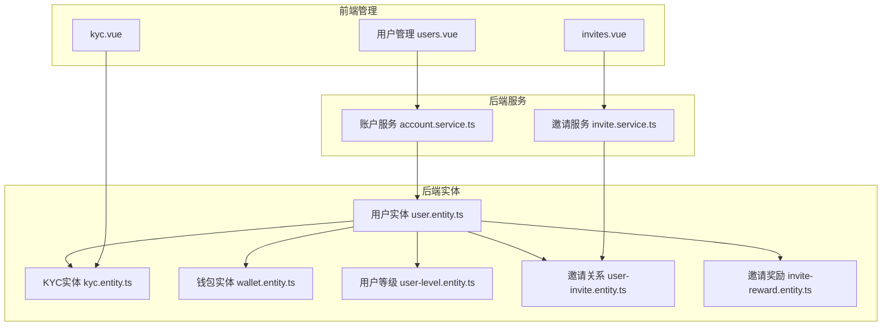
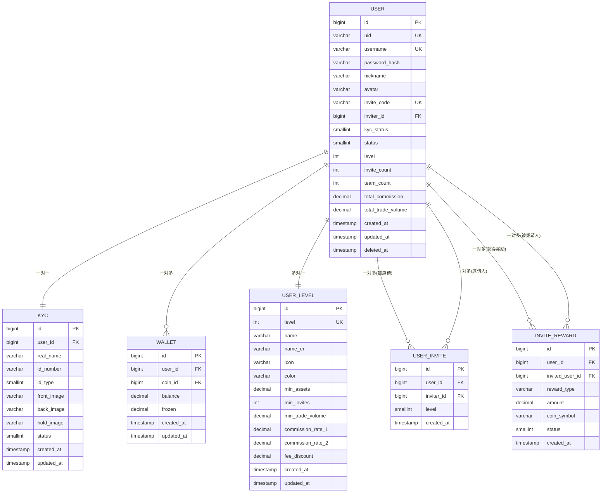
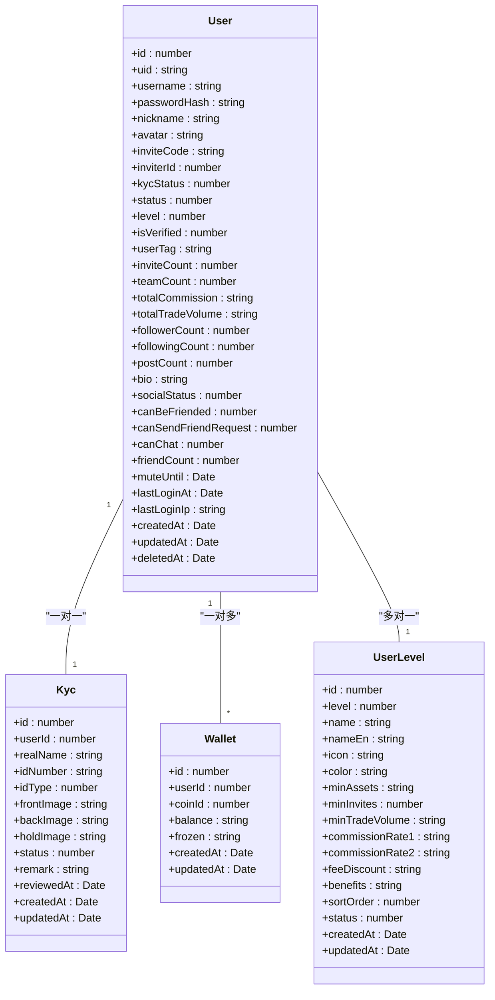
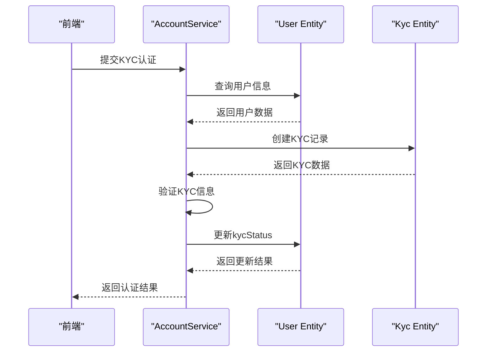
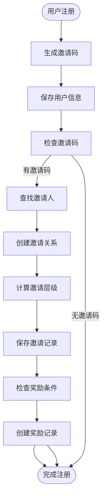
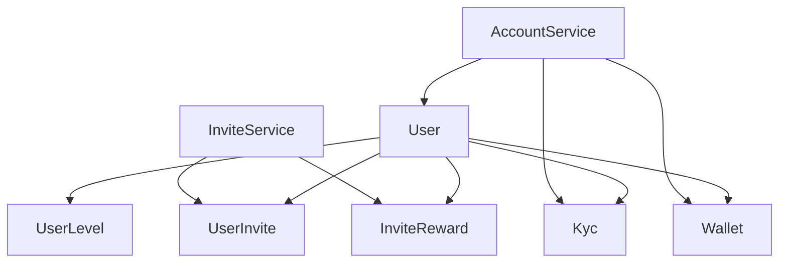

# 用户模型

<cite>
**本文档中引用的文件**  
- [user.entity.ts](file://agx-backend/src/entities/user.entity.ts)
- [kyc.entity.ts](file://agx-backend/src/entities/kyc.entity.ts)
- [wallet.entity.ts](file://agx-backend/src/entities/wallet.entity.ts)
- [user-level.entity.ts](file://agx-backend/src/entities/user-level.entity.ts)
- [user-invite.entity.ts](file://agx-backend/src/entities/user-invite.entity.ts)
- [invite-reward.entity.ts](file://agx-backend/src/entities/invite-reward.entity.ts)
- [account.service.ts](file://agx-backend/src/modules/account/account.service.ts)
- [invite.service.ts](file://agx-backend/src/modules/invite/invite.service.ts)
</cite>

## 目录
1. [简介](#简介)
2. [项目结构](#项目结构)
3. [核心组件](#核心组件)
4. [架构概述](#架构概述)
5. [详细组件分析](#详细组件分析)
6. [依赖分析](#依赖分析)
7. [性能考虑](#性能考虑)
8. [故障排除指南](#故障排除指南)
9. [结论](#结论)

## 简介
本文档全面描述了用户数据模型，重点关注User实体及其相关实体（如KYC、Wallet、UserLevel、UserInvite等）。文档详细说明了用户实体的字段定义、数据类型、索引和约束条件，以及与其他实体的关联关系。同时涵盖用户数据生命周期管理、KYC信息的安全存储策略、邀请奖励机制的数据结构，并提供TypeORM关系映射代码示例和开发者最佳实践。

## 项目结构
用户数据模型主要位于`agx-backend/src/entities/`目录下，相关业务逻辑在`agx-backend/src/modules/`中实现。前端管理界面位于`agx-admin/src/views/agx/`路径下。

**图示来源**  
- [user.entity.ts](file://agx-backend/src/entities/user.entity.ts)
- [kyc.entity.ts](file://agx-backend/src/entities/kyc.entity.ts)
- [wallet.entity.ts](file://agx-backend/src/entities/wallet.entity.ts)
- [user-level.entity.ts](file://agx-backend/src/entities/user-level.entity.ts)
- [user-invite.entity.ts](file://agx-backend/src/entities/user-invite.entity.ts)
- [invite-reward.entity.ts](file://agx-backend/src/entities/invite-reward.entity.ts)
- [account.service.ts](file://agx-backend/src/modules/account/account.service.ts)
- [invite.service.ts](file://agx-backend/src/modules/invite/invite.service.ts)

**本节来源**  
- [user.entity.ts](file://agx-backend/src/entities/user.entity.ts)
- [kyc.entity.ts](file://agx-backend/src/entities/kyc.entity.ts)
- [wallet.entity.ts](file://agx-backend/src/entities/wallet.entity.ts)

## 核心组件
核心用户数据模型由User实体及其相关实体构成，实现了用户信息管理、身份认证、钱包系统、等级体系和邀请奖励机制的完整闭环。

**本节来源**  
- [user.entity.ts](file://agx-backend/src/entities/user.entity.ts#L12-L117)
- [kyc.entity.ts](file://agx-backend/src/entities/kyc.entity.ts#L13-L56)
- [wallet.entity.ts](file://agx-backend/src/entities/wallet.entity.ts#L15-L41)

## 架构概述
用户数据模型采用分层架构设计，以User实体为核心，通过TypeORM关系映射连接各个相关实体，形成完整的用户数据生态系统。

**图示来源**  
- [user.entity.ts](file://agx-backend/src/entities/user.entity.ts#L12-L117)
- [kyc.entity.ts](file://agx-backend/src/entities/kyc.entity.ts#L13-L56)
- [wallet.entity.ts](file://agx-backend/src/entities/wallet.entity.ts#L15-L41)
- [user-level.entity.ts](file://agx-backend/src/entities/user-level.entity.ts#L14-L66)
- [user-invite.entity.ts](file://agx-backend/src/entities/user-invite.entity.ts#L13-L38)
- [invite-reward.entity.ts](file://agx-backend/src/entities/invite-reward.entity.ts#L13-L42)

## 详细组件分析

### 用户实体分析
User实体是整个用户数据模型的核心，包含用户基本信息、状态控制、等级信息和社交属性。

**图示来源**  
- [user.entity.ts](file://agx-backend/src/entities/user.entity.ts#L12-L117)
- [kyc.entity.ts](file://agx-backend/src/entities/kyc.entity.ts#L13-L56)
- [wallet.entity.ts](file://agx-backend/src/entities/wallet.entity.ts#L15-L41)
- [user-level.entity.ts](file://agx-backend/src/entities/user-level.entity.ts#L14-L66)

### KYC实体分析
KYC实体用于管理用户身份认证信息，与User实体形成一对一关系。

**图示来源**  
- [kyc.entity.ts](file://agx-backend/src/entities/kyc.entity.ts#L13-L56)
- [account.service.ts](file://agx-backend/src/modules/account/account.service.ts)

### 邀请系统分析
邀请系统通过UserInvite和InviteReward实体实现完整的邀请关系追踪和奖励发放机制。

**图示来源**  
- [user-invite.entity.ts](file://agx-backend/src/entities/user-invite.entity.ts#L13-L38)
- [invite-reward.entity.ts](file://agx-backend/src/entities/invite-reward.entity.ts#L13-L42)
- [invite.service.ts](file://agx-backend/src/modules/invite/invite.service.ts)

**本节来源**  
- [user.entity.ts](file://agx-backend/src/entities/user.entity.ts#L12-L117)
- [kyc.entity.ts](file://agx-backend/src/entities/kyc.entity.ts#L13-L56)
- [wallet.entity.ts](file://agx-backend/src/entities/wallet.entity.ts#L15-L41)
- [user-level.entity.ts](file://agx-backend/src/entities/user-level.entity.ts#L14-L66)
- [user-invite.entity.ts](file://agx-backend/src/entities/user-invite.entity.ts#L13-L38)
- [invite-reward.entity.ts](file://agx-backend/src/entities/invite-reward.entity.ts#L13-L42)

## 依赖分析
用户数据模型的依赖关系清晰，各实体通过外键关联，服务层实现业务逻辑。

**图示来源**  
- [user.entity.ts](file://agx-backend/src/entities/user.entity.ts)
- [account.service.ts](file://agx-backend/src/modules/account/account.service.ts)
- [invite.service.ts](file://agx-backend/src/modules/invite/invite.service.ts)

**本节来源**  
- [user.entity.ts](file://agx-backend/src/entities/user.entity.ts)
- [account.service.ts](file://agx-backend/src/modules/account/account.service.ts)
- [invite.service.ts](file://agx-backend/src/modules/invite/invite.service.ts)

## 性能考虑
用户数据模型在设计时考虑了性能优化，通过索引、缓存和批量操作提高查询效率。

**本节来源**  
- [user.entity.ts](file://agx-backend/src/entities/user.entity.ts)
- [account.service.ts](file://agx-backend/src/modules/account/account.service.ts)

## 故障排除指南
常见问题包括用户注册失败、KYC认证状态不更新、邀请奖励未发放等，主要检查数据库约束、服务逻辑和事务处理。

**本节来源**  
- [account.service.ts](file://agx-backend/src/modules/account/account.service.ts#L1-L200)
- [invite.service.ts](file://agx-backend/src/modules/invite/invite.service.ts#L1-L150)

## 结论
用户数据模型设计完整，通过TypeORM实现了清晰的实体关系映射，支持用户管理、身份认证、钱包系统和邀请奖励等核心功能。建议在查询时充分利用索引，在事务处理时注意数据一致性。