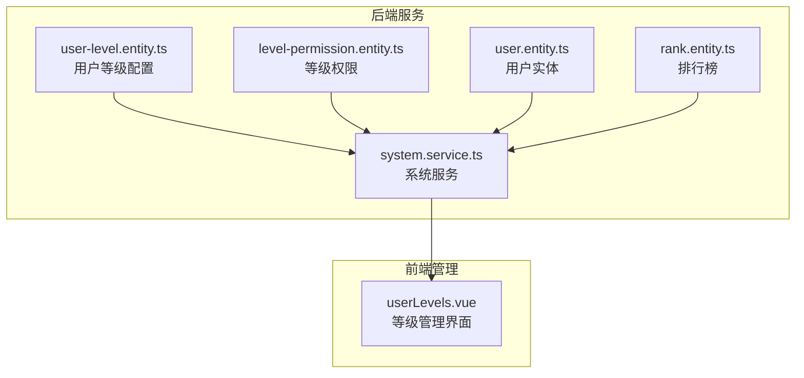
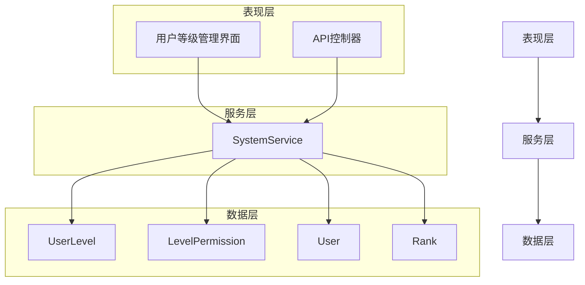
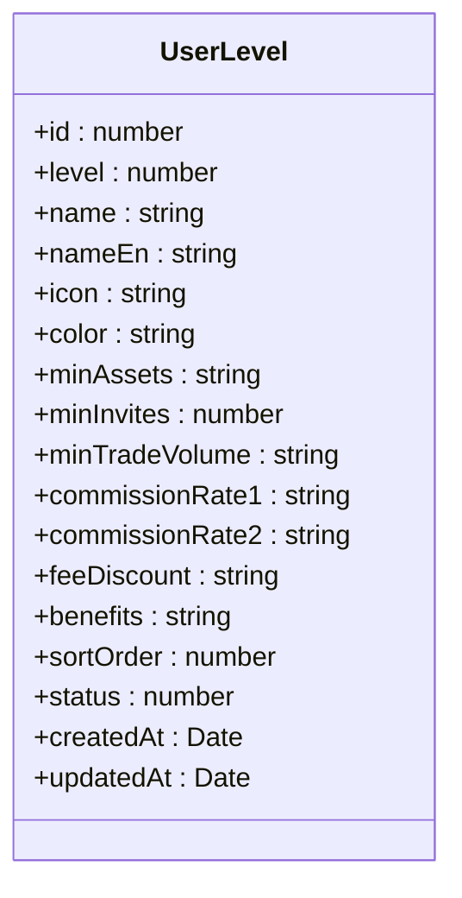
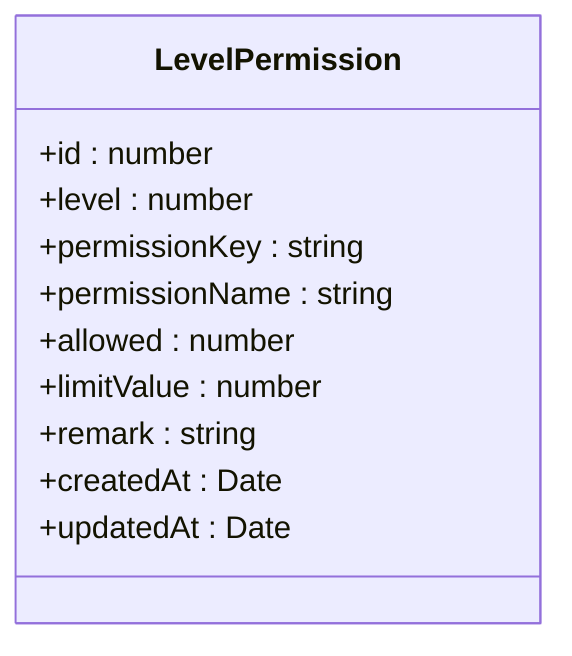
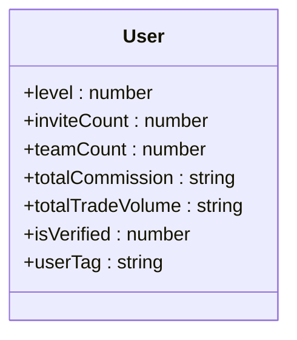
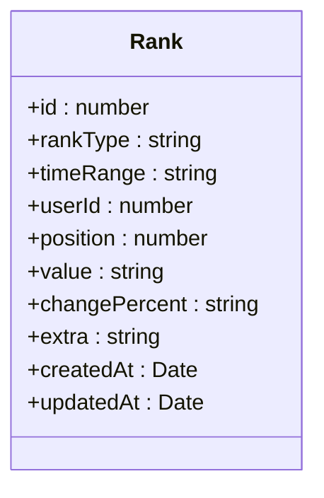
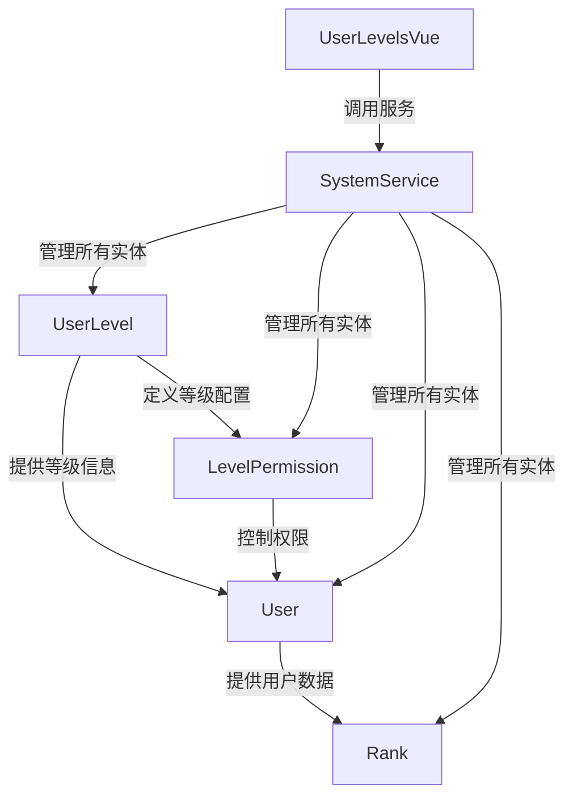

# 用户等级

<cite>
**本文档引用的文件**  
- [user-level.entity.ts](file://agx-backend/src/entities/user-level.entity.ts)
- [level-permission.entity.ts](file://agx-backend/src/entities/level-permission.entity.ts)
- [system.service.ts](file://agx-backend/src/modules/system/system.service.ts)
- [user.entity.ts](file://agx-backend/src/entities/user.entity.ts)
- [rank.entity.ts](file://agx-backend/src/entities/rank.entity.ts)
- [userLevels.vue](file://agx-admin/src/views/agx/userLevels.vue)
</cite>

## 目录
1. [简介](#简介)
2. [项目结构](#项目结构)
3. [核心组件](#核心组件)
4. [架构概述](#架构概述)
5. [详细组件分析](#详细组件分析)
6. [依赖分析](#依赖分析)
7. [性能考虑](#性能考虑)
8. [故障排除指南](#故障排除指南)
9. [结论](#结论)
10. [附录](#附录)（如有必要）

## 简介
本文档详细描述了用户等级系统的数据模型和实现机制。系统通过用户等级（UserLevel）实体定义等级配置，通过等级权限（LevelPermission）实体管理不同等级的权限和限制。用户实体（User）中的`level`字段与用户等级配置形成关联，实现等级体系的管理。系统还包含排行榜功能，用于展示用户在不同维度的表现。

## 项目结构
用户等级系统主要分布在后端服务的实体和模块中，前端提供管理界面。核心文件包括用户等级实体、等级权限实体、系统服务以及前端管理页面。

**图示来源**  
- [user-level.entity.ts](file://agx-backend/src/entities/user-level.entity.ts)
- [level-permission.entity.ts](file://agx-backend/src/entities/level-permission.entity.ts)
- [system.service.ts](file://agx-backend/src/modules/system/system.service.ts)
- [user.entity.ts](file://agx-backend/src/entities/user.entity.ts)
- [rank.entity.ts](file://agx-backend/src/entities/rank.entity.ts)
- [userLevels.vue](file://agx-admin/src/views/agx/userLevels.vue)

**本节来源**  
- [user-level.entity.ts](file://agx-backend/src/entities/user-level.entity.ts)
- [level-permission.entity.ts](file://agx-backend/src/entities/level-permission.entity.ts)
- [system.service.ts](file://agx-backend/src/modules/system/system.service.ts)

## 核心组件
用户等级系统的核心组件包括用户等级配置、等级权限矩阵、用户实体中的等级字段以及排行榜系统。这些组件共同实现了用户成长体系的完整功能。

**本节来源**  
- [user-level.entity.ts](file://agx-backend/src/entities/user-level.entity.ts)
- [level-permission.entity.ts](file://agx-backend/src/entities/level-permission.entity.ts)
- [user.entity.ts](file://agx-backend/src/entities/user.entity.ts)

## 架构概述
用户等级系统采用分层架构，包括数据层、服务层和表现层。数据层由TypeORM实体构成，服务层提供业务逻辑，表现层提供API接口和管理界面。

**图示来源**  
- [user-level.entity.ts](file://agx-backend/src/entities/user-level.entity.ts)
- [level-permission.entity.ts](file://agx-backend/src/entities/level-permission.entity.ts)
- [system.service.ts](file://agx-backend/src/modules/system/system.service.ts)
- [user.entity.ts](file://agx-backend/src/entities/user.entity.ts)
- [rank.entity.ts](file://agx-backend/src/entities/rank.entity.ts)

## 详细组件分析
### 用户等级实体分析
用户等级实体（UserLevel）定义了平台中所有等级的配置信息，包括等级数值、名称、图标、颜色以及各种业务相关的阈值和权益。

#### 用户等级实体字段定义

**图示来源**  
- [user-level.entity.ts](file://agx-backend/src/entities/user-level.entity.ts)

**本节来源**  
- [user-level.entity.ts](file://agx-backend/src/entities/user-level.entity.ts)

### 等级权限实体分析
等级权限实体（LevelPermission）定义了不同等级用户的功能权限和使用限制，实现了精细化的权限控制。

#### 等级权限实体字段定义

**图示来源**  
- [level-permission.entity.ts](file://agx-backend/src/entities/level-permission.entity.ts)

**本节来源**  
- [level-permission.entity.ts](file://agx-backend/src/entities/level-permission.entity.ts)

### 用户实体中的等级字段
用户实体（User）通过`level`字段与用户等级配置关联，实现了用户与等级体系的绑定。

#### 用户实体等级相关字段

**图示来源**  
- [user.entity.ts](file://agx-backend/src/entities/user.entity.ts)

**本节来源**  
- [user.entity.ts](file://agx-backend/src/entities/user.entity.ts)

### 排行榜系统分析
排行榜系统（Rank）用于展示用户在不同维度的表现，支持多种排行榜类型和时间范围。

#### 排行榜实体字段定义

**图示来源**  
- [rank.entity.ts](file://agx-backend/src/entities/rank.entity.ts)

**本节来源**  
- [rank.entity.ts](file://agx-backend/src/entities/rank.entity.ts)

## 依赖分析
用户等级系统各组件之间存在明确的依赖关系，形成了完整的用户成长体系。

**图示来源**  
- [user-level.entity.ts](file://agx-backend/src/entities/user-level.entity.ts)
- [level-permission.entity.ts](file://agx-backend/src/entities/level-permission.entity.ts)
- [user.entity.ts](file://agx-backend/src/entities/user.entity.ts)
- [rank.entity.ts](file://agx-backend/src/entities/rank.entity.ts)
- [system.service.ts](file://agx-backend/src/modules/system/system.service.ts)
- [userLevels.vue](file://agx-admin/src/views/agx/userLevels.vue)

**本节来源**  
- [user-level.entity.ts](file://agx-backend/src/entities/user-level.entity.ts)
- [level-permission.entity.ts](file://agx-backend/src/entities/level-permission.entity.ts)
- [user.entity.ts](file://agx-backend/src/entities/user.entity.ts)
- [rank.entity.ts](file://agx-backend/src/entities/rank.entity.ts)
- [system.service.ts](file://agx-backend/src/modules/system/system.service.ts)

## 性能考虑
用户等级系统在设计时考虑了性能优化，通过数据库索引、缓存机制和批量处理来确保系统的高效运行。

**本节来源**  
- [user-level.entity.ts](file://agx-backend/src/entities/user-level.entity.ts)
- [level-permission.entity.ts](file://agx-backend/src/entities/level-permission.entity.ts)
- [system.service.ts](file://agx-backend/src/modules/system/system.service.ts)

## 故障排除指南
当用户等级系统出现问题时，可以检查数据库连接、实体配置、服务依赖等关键环节。

**本节来源**  
- [system.service.ts](file://agx-backend/src/modules/system/system.service.ts)
- [user-level.entity.ts](file://agx-backend/src/entities/user-level.entity.ts)

## 结论
用户等级系统通过清晰的实体设计和合理的架构布局，实现了完整的用户成长体系。系统具有良好的扩展性和维护性，能够满足平台对用户等级管理的需求。

## 附录
### 用户等级配置表
| 字段名 | 数据类型 | 约束条件 | 描述 |
|-------|--------|--------|------|
| id | number | 主键，自增 | 主键ID |
| level | number | 唯一索引 | 等级数值: 1, 2, 3... |
| name | string | 长度50 | 等级名称: 普通会员, 银牌会员, 金牌会员... |
| nameEn | string | 长度50，可为空 | 英文名称 |
| icon | string | 长度10，可为空 | 等级图标emoji |
| color | string | 长度20，可为空 | 等级颜色 |
| minAssets | string | decimal(20,2)，默认'0' | 最低资产要求(USDT) |
| minInvites | number | 默认0 | 最低邀请人数 |
| minTradeVolume | string | decimal(20,2)，默认'0' | 最低交易量要求 |
| commissionRate1 | string | decimal(5,4)，默认'0.20' | 一级返佣比例 |
| commissionRate2 | string | decimal(5,4)，默认'0.10' | 二级返佣比例 |
| feeDiscount | string | decimal(5,4)，默认'1.00' | 手续费折扣: 0.9=9折 |
| benefits | string | text，可为空 | 等级权益描述JSON |
| sortOrder | number | 默认0 | 排序 |
| status | number | smallint，默认1 | 状态: 0禁用 1启用 |
| createdAt | Date | timestamp | 创建时间 |
| updatedAt | Date | timestamp | 更新时间 |

**本节来源**  
- [user-level.entity.ts](file://agx-backend/src/entities/user-level.entity.ts)

### 等级权限配置表
| 字段名 | 数据类型 | 约束条件 | 描述 |
|-------|--------|--------|------|
| id | number | 主键，自增 | 主键ID |
| level | number | 索引 | 用户等级: 1=普通, 2=银牌, 3=金牌, 4=钻石, 5=黑金 |
| permissionKey | string | 长度50，索引 | 权限键名 |
| permissionName | string | 长度100 | 权限名称 |
| allowed | number | smallint，默认1 | 是否允许：0不允许 1允许 |
| limitValue | number | int，可为空 | 限制值（如每日发帖数、好友上限等） |
| remark | string | 长度255，可为空 | 备注说明 |
| createdAt | Date | timestamp | 创建时间 |
| updatedAt | Date | timestamp | 更新时间 |

**本节来源**  
- [level-permission.entity.ts](file://agx-backend/src/entities/level-permission.entity.ts)