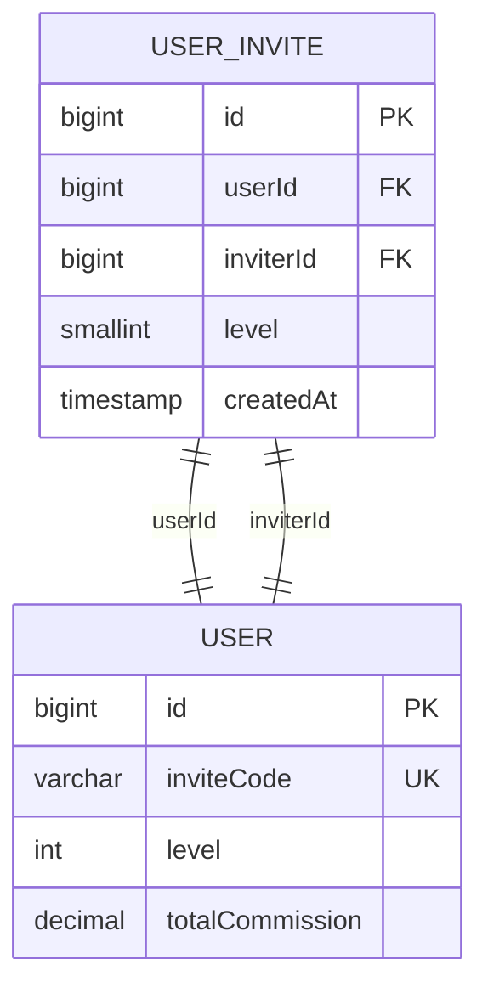
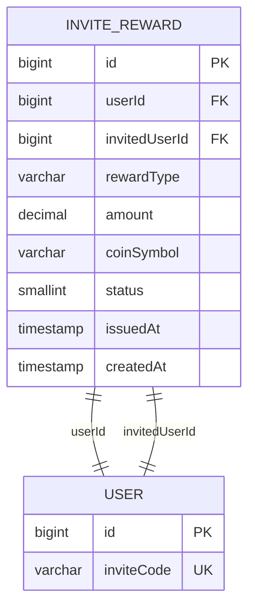
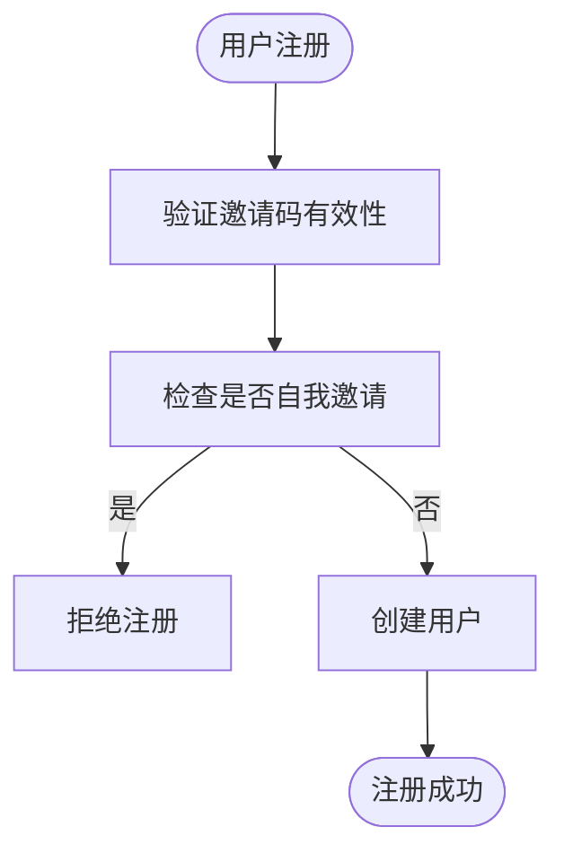
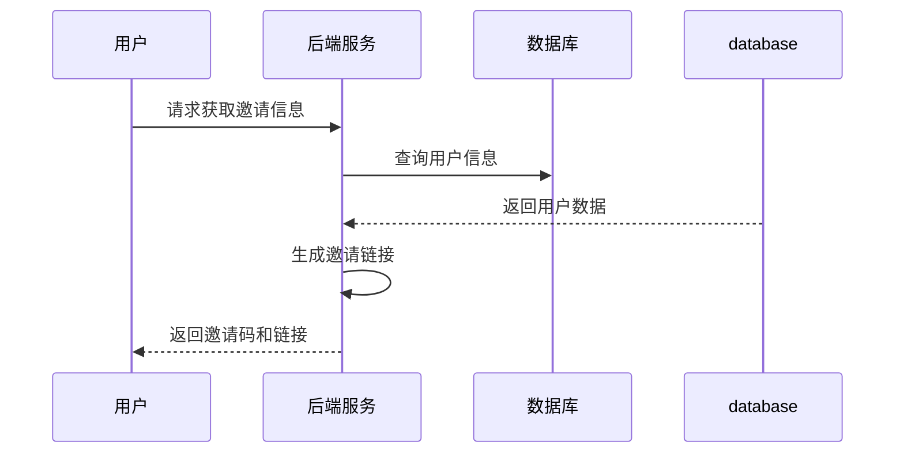
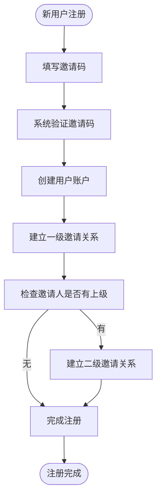
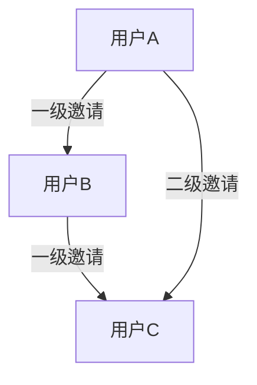
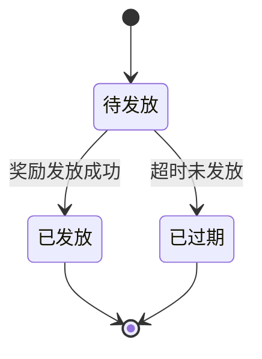
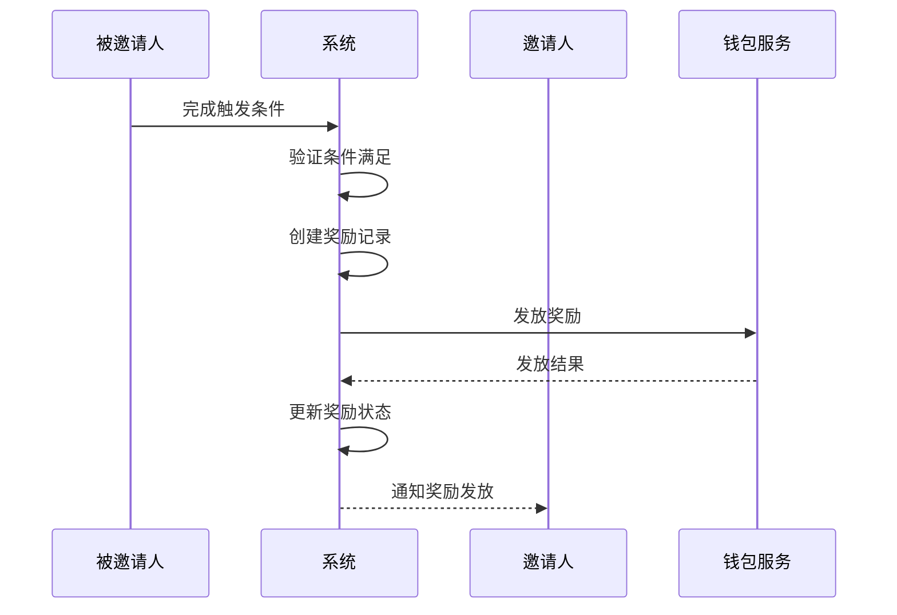
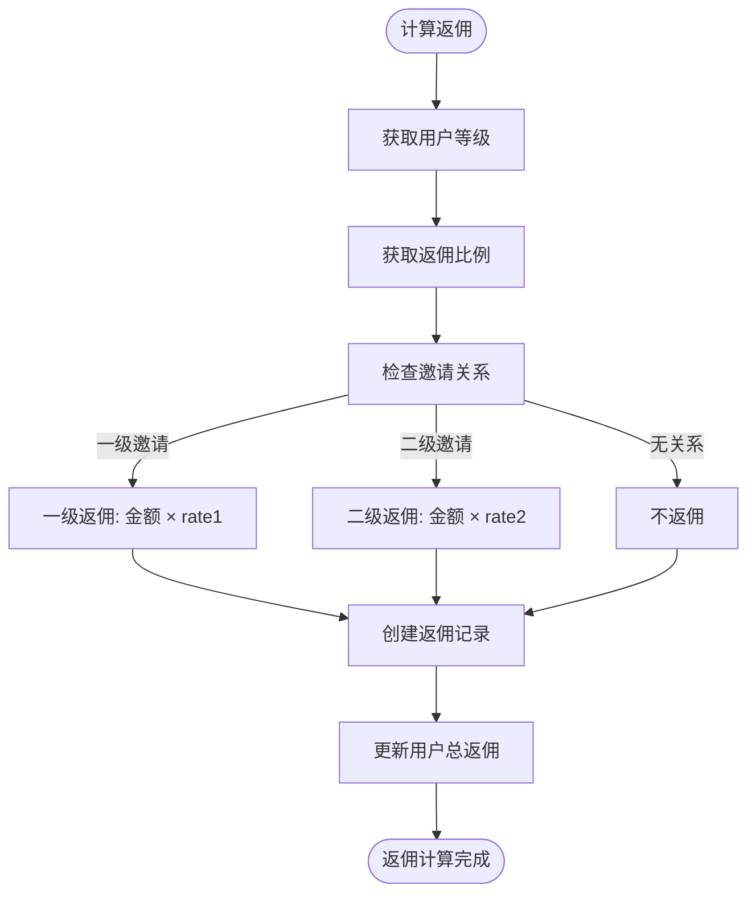
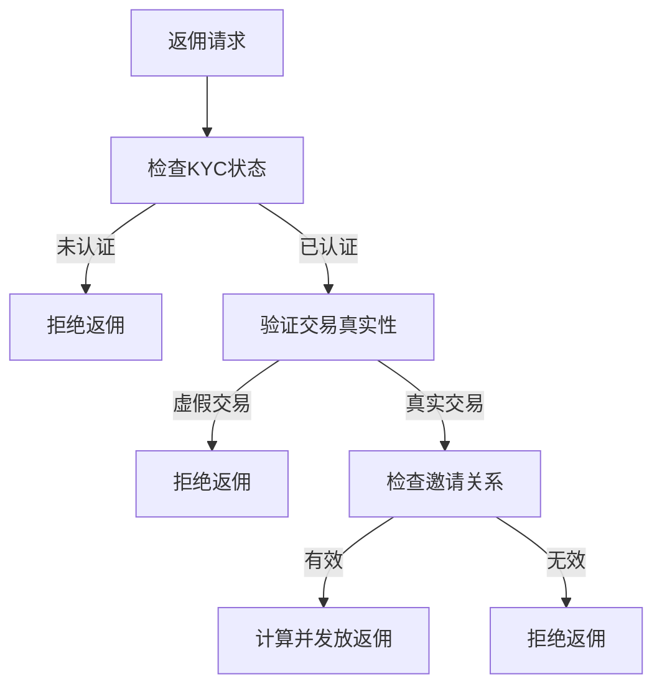

# 邀请系统

<cite>
**本文档引用文件**  
- [user-invite.entity.ts](file://agx-backend/src/entities/user-invite.entity.ts)
- [invite-reward.entity.ts](file://agx-backend/src/entities/invite-reward.entity.ts)
- [invite.service.ts](file://agx-backend/src/modules/invite/invite.service.ts)
- [invite.controller.ts](file://agx-backend/src/modules/invite/invite.controller.ts)
- [user.entity.ts](file://agx-backend/src/entities/user.entity.ts)
- [user-level.entity.ts](file://agx-backend/src/entities/user-level.entity.ts)
- [commission.entity.ts](file://agx-backend/src/entities/commission.entity.ts)
- [account.service.ts](file://agx-backend/src/modules/account/account.service.ts)
- [rank.entity.ts](file://agx-backend/src/entities/rank.entity.ts)
</cite>

## 目录
1. [简介](#简介)
2. [用户邀请数据模型](#用户邀请数据模型)
3. [邀请关系建立与约束机制](#邀请关系建立与约束机制)
4. [邀请链接生成与确认流程](#邀请链接生成与确认流程)
5. [多级邀请实现机制](#多级邀请实现机制)
6. [邀请奖励发放流程](#邀请奖励发放流程)
7. [返佣计算与分配](#返佣计算与分配)
8. [邀请数据查询与统计](#邀请数据查询与统计)
9. [反作弊机制与事务一致性](#反作弊机制与事务一致性)
10. [开发者最佳实践](#开发者最佳实践)

## 简介

邀请系统是平台用户增长的核心机制，通过建立用户间的邀请关系，实现用户裂变和生态扩展。本系统采用多级分销模型，支持一级和二级邀请关系，为邀请人提供注册奖励、交易返佣等多种激励。系统通过严格的数据模型设计和约束机制，确保邀请关系的准确性和奖励发放的可靠性。

**本文档引用文件**  
- [user-invite.entity.ts](file://agx-backend/src/entities/user-invite.entity.ts)
- [invite-reward.entity.ts](file://agx-backend/src/entities/invite-reward.entity.ts)
- [invite.service.ts](file://agx-backend/src/modules/invite/invite.service.ts)

## 用户邀请数据模型

### UserInvite 实体字段定义

`UserInvite` 实体定义了用户间的邀请关系，其核心字段如下：

| 字段名 | 数据类型 | 约束条件 | 说明 |
|--------|---------|---------|------|
| id | bigint | 主键，自增 | 记录唯一标识 |
| userId | bigint | 非空，索引 | 被邀请用户ID |
| inviterId | bigint | 非空，索引 | 邀请人ID |
| level | smallint | 默认值1 | 邀请层级：1=直接邀请，2=间接邀请 |
| createdAt | timestamp | 创建时间 | 记录创建时间 |



**图表来源**  
- [user-invite.entity.ts](file://agx-backend/src/entities/user-invite.entity.ts)
- [user.entity.ts](file://agx-backend/src/entities/user.entity.ts)

### InviteReward 实体字段定义

`InviteReward` 实体记录了邀请奖励的发放情况，其核心字段如下：

| 字段名 | 数据类型 | 约束条件 | 说明 |
|--------|---------|---------|------|
| id | bigint | 主键，自增 | 奖励记录唯一标识 |
| userId | bigint | 非空，索引 | 获得奖励的用户ID |
| invitedUserId | bigint | 非空，索引 | 被邀请用户ID |
| rewardType | varchar(50) | 非空 | 奖励类型：signup=注册奖励, kyc=实名奖励, first_trade=首笔交易, first_deposit=首充 |
| amount | decimal(20,8) | 非空 | 奖励金额 |
| coinSymbol | varchar(20) | 默认USDT | 奖励币种 |
| status | smallint | 默认1 | 状态：0=待发放, 1=已发放, 2=已过期 |
| issuedAt | timestamp | 可为空 | 发放时间 |
| createdAt | timestamp | 创建时间 | 记录创建时间 |



**图表来源**  
- [invite-reward.entity.ts](file://agx-backend/src/entities/invite-reward.entity.ts)
- [user.entity.ts](file://agx-backend/src/entities/user.entity.ts)

**本节来源**  
- [user-invite.entity.ts](file://agx-backend/src/entities/user-invite.entity.ts#L1-L39)
- [invite-reward.entity.ts](file://agx-backend/src/entities/invite-reward.entity.ts#L1-L43)

## 邀请关系建立与约束机制

### 防止自我邀请

系统通过注册流程中的业务逻辑验证来防止用户自我邀请。在用户注册时，系统会检查邀请码对应的邀请人ID，确保被邀请人不会成为自己的邀请人。



### 防止重复邀请

系统通过数据库唯一约束和业务逻辑双重保障来防止重复邀请。`UserInvite` 表中，`userId` 和 `inviterId` 的组合确保了同一用户只能被同一邀请人邀请一次。

**本节来源**  
- [account.service.ts](file://agx-backend/src/modules/account/account.service.ts#L74-L80)
- [user-invite.entity.ts](file://agx-backend/src/entities/user-invite.entity.ts#L17-L27)

## 邀请链接生成与确认流程

### 邀请链接生成

每个用户都有唯一的邀请码，系统根据此邀请码生成专属邀请链接。邀请链接格式为：`https://agx.bi/register?ref={inviteCode}`。



**图表来源**  
- [invite.service.ts](file://agx-backend/src/modules/invite/invite.service.ts#L42-L43)

### 邀请关系确认流程

当新用户通过邀请链接注册时，系统会自动建立邀请关系：

1. 新用户填写邀请码并提交注册
2. 系统验证邀请码的有效性
3. 创建用户账户
4. 建立一级邀请关系
5. 如果邀请人也有邀请人，则建立二级邀请关系



**本节来源**  
- [invite.service.ts](file://agx-backend/src/modules/invite/invite.service.ts#L30-L62)
- [account.service.ts](file://agx-backend/src/modules/account/account.service.ts#L110-L126)

## 多级邀请实现机制

### 二级分销模型

系统实现了二级分销模型，邀请层级分为：

- **一级邀请**：直接邀请人
- **二级邀请**：邀请人的邀请人

当用户A邀请用户B，用户B邀请用户C时：
- A是B的**一级邀请人**
- A是C的**二级邀请人**



### 邀请层级数据存储

系统通过 `UserInvite` 表的 `level` 字段存储邀请层级信息。每个被邀请用户会生成两条记录（如果存在二级邀请人）：

```sql
-- 一级邀请关系
INSERT INTO agx_user_invite (userId, inviterId, level) VALUES (C, B, 1);

-- 二级邀请关系
INSERT INTO agx_user_invite (userId, inviterId, level) VALUES (C, A, 2);
```

**本节来源**  
- [user-invite.entity.ts](file://agx-backend/src/entities/user-invite.entity.ts#L33-L34)
- [account.service.ts](file://agx-backend/src/modules/account/account.service.ts#L119-L125)

## 邀请奖励发放流程

### 奖励类型与触发条件

系统支持多种邀请奖励类型，每种奖励有特定的触发条件：

| 奖励类型 | 触发条件 | 说明 |
|---------|---------|------|
| signup | 被邀请人成功注册 | 注册奖励 |
| kyc | 被邀请人完成实名认证 | KYC奖励 |
| first_trade | 被邀请人完成首笔交易 | 交易奖励 |
| first_deposit | 被邀请人完成首充 | 充值奖励 |

### 奖励发放状态机

邀请奖励的状态流转如下：



### 奖励发放流程



**本节来源**  
- [invite-reward.entity.ts](file://agx-backend/src/entities/invite-reward.entity.ts#L25-L35)
- [invite.service.ts](file://agx-backend/src/modules/invite/invite.service.ts)

## 返佣计算与分配

### 返佣计算逻辑

返佣金额根据邀请层级和用户等级的返佣比例计算：

```
返佣金额 = 交易金额 × 返佣比例
```

系统通过 `calculateCommission` 方法实现返佣计算：



### 用户等级与返佣比例

用户等级配置决定了返佣比例，等级越高，返佣比例越高：

```mermaid
classDiagram
class UserLevel {
+int level
+string name
+string commissionRate1
+string commissionRate2
+string feeDiscount
}
UserLevel : "等级越高，返佣比例越高"
UserLevel : "金牌会员 : 一级25%，二级12%"
UserLevel : "钻石会员 : 一级28%，二级14%"
```

**本节来源**  
- [invite.service.ts](file://agx-backend/src/modules/invite/invite.service.ts#L67-L131)
- [user-level.entity.ts](file://agx-backend/src/entities/user-level.entity.ts#L43-L47)

## 邀请数据查询与统计

### 邀请记录查询

系统提供分页查询邀请记录的接口，支持按层级筛选：

```typescript
async getInviteRecords(userId: number, page: number = 1, pageSize: number = 20) {
  const [list, total] = await this.userInviteRepository.findAndCount({
    where: { inviterId: userId },
    order: { createdAt: 'DESC' },
    skip: (page - 1) * pageSize,
    take: pageSize,
  });
  // 填充用户信息...
  return { list: records, total };
}
```

### 统计指标

系统提供以下核心统计指标：

| 指标 | 说明 | 数据来源 |
|------|------|---------|
| inviteCount | 直接邀请人数 | user.inviteCount |
| teamCount | 团队总人数 | user.teamCount |
| totalCommission | 累计返佣 | user.totalCommission |

**本节来源**  
- [invite.service.ts](file://agx-backend/src/modules/invite/invite.service.ts#L163-L190)
- [user.entity.ts](file://agx-backend/src/entities/user.entity.ts#L60-L67)

## 反作弊机制与事务一致性

### 反作弊机制

系统通过以下机制防止邀请系统作弊：

1. **KYC验证**：只有完成实名认证的用户才能获得返佣
2. **交易验证**：返佣基于真实交易金额计算
3. **唯一性约束**：防止重复邀请和奖励发放
4. **行为监控**：异常邀请行为监控



### 事务一致性保证

系统在关键操作中使用数据库事务确保数据一致性。例如，在创建返佣记录时，同时更新用户总返佣：

```typescript
// 在 calculateCommission 方法中
await this.commissionRepository.save(commission);
// 更新用户总返佣
user.totalCommission = (parseFloat(user.totalCommission) + parseFloat(commissionAmount)).toFixed(8);
await this.userRepository.save(user);
```

**本节来源**  
- [invite.service.ts](file://agx-backend/src/modules/invite/invite.service.ts#L73-L76)
- [invite.service.ts](file://agx-backend/src/modules/invite/invite.service.ts#L126-L128)

## 开发者最佳实践

### 邀请关系追溯

查询用户的邀请关系链：

```typescript
// 获取用户的直接邀请人
const directInviter = await userRepository.findOne({
  where: { id: user.inviterId }
});

// 获取用户的被邀请人列表
const invitees = await userInviteRepository.find({
  where: { inviterId: userId }
});
```

### 奖励发放最佳实践

1. **异步处理**：奖励发放使用异步任务，避免阻塞主流程
2. **幂等性设计**：确保奖励发放接口的幂等性
3. **状态机管理**：使用状态机管理奖励发放流程
4. **日志记录**：详细记录奖励发放过程，便于审计

### 性能优化建议

1. **索引优化**：为 `userId` 和 `inviterId` 字段创建索引
2. **缓存策略**：缓存用户邀请统计信息
3. **分页查询**：大数据量使用分页查询
4. **批量操作**：批量处理奖励发放

**本节来源**  
- [invite.service.ts](file://agx-backend/src/modules/invite/invite.service.ts)
- [user-invite.entity.ts](file://agx-backend/src/entities/user-invite.entity.ts)
- [invite-reward.entity.ts](file://agx-backend/src/entities/invite-reward.entity.ts)