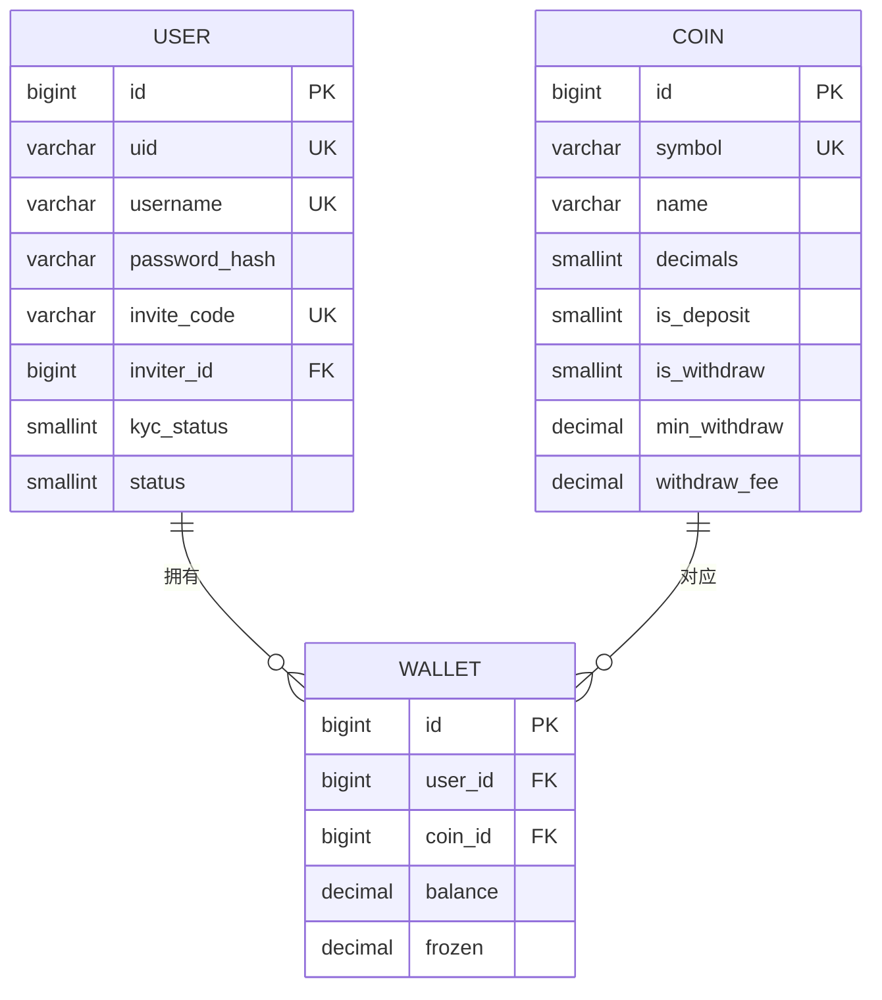
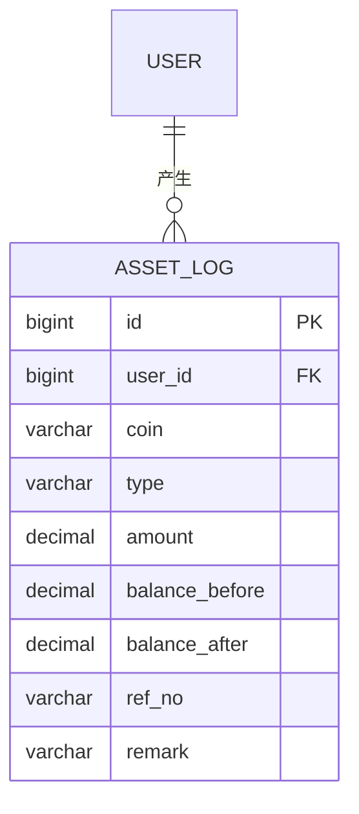
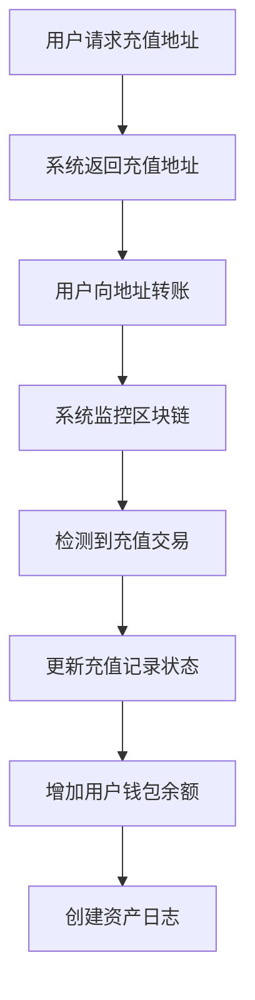
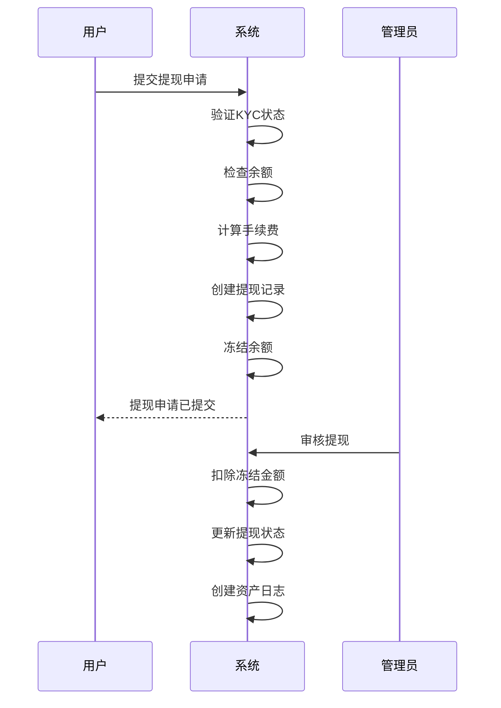
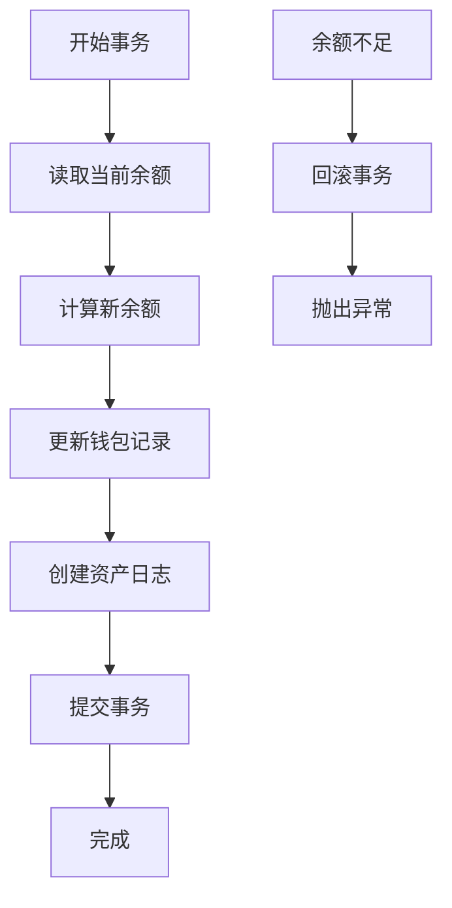
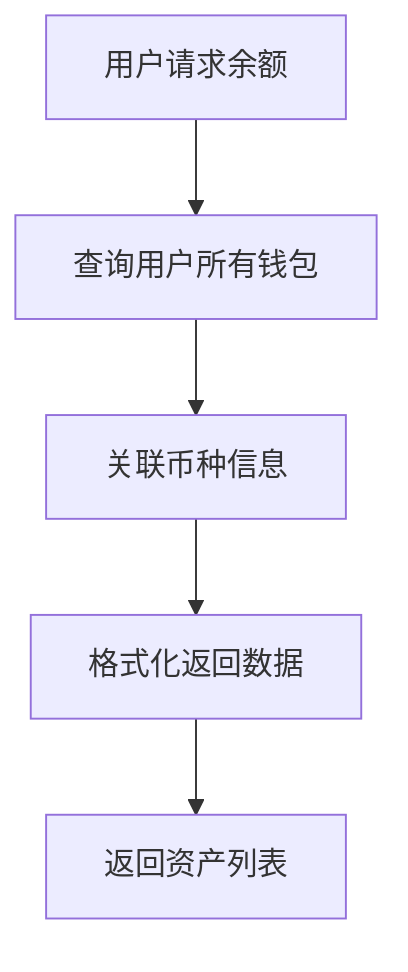
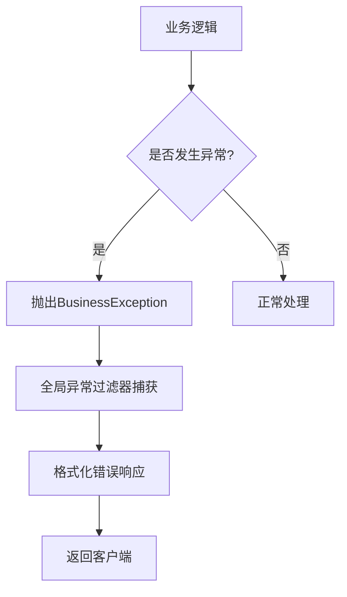

# 钱包管理

<cite>
**本文档引用的文件**
- [wallet.entity.ts](file://agx-backend/src/entities/wallet.entity.ts)
- [user.entity.ts](file://agx-backend/src/entities/user.entity.ts)
- [asset-log.entity.ts](file://agx-backend/src/entities/asset-log.entity.ts)
- [account.service.ts](file://agx-backend/src/modules/account/account.service.ts)
- [admin.service.ts](file://agx-backend/src/modules/admin/admin.service.ts)
- [schema.sql](file://agx-backend/schema.sql)
</cite>

## 目录
1. [简介](#简介)
2. [核心数据模型](#核心数据模型)
3. [钱包与用户关系](#钱包与用户关系)
4. [资产变动日志机制](#资产变动日志机制)
5. [核心操作数据流程](#核心操作数据流程)
6. [余额一致性与资金安全](#余额一致性与资金安全)
7. [开发者最佳实践](#开发者最佳实践)
8. [结论](#结论)

## 简介
本文档详细阐述了钱包管理系统中用户资产数据模型的设计与实现。文档聚焦于Wallet实体的字段定义、数据类型和约束条件，深入解析了Wallet实体与User实体的一对一关系实现方式，以及资产变动的日志记录机制。同时，文档涵盖了钱包创建、充值、提现、转账等核心操作的数据流程，以及余额一致性和资金安全的保障措施（如乐观锁、事务处理）。为开发者提供了钱包数据查询、资产对账和异常处理的最佳实践，包括余额校验和交易溯源的方法。

## 核心数据模型

### Wallet实体字段定义
Wallet实体是钱包管理系统的核心数据结构，用于存储用户的资产信息。其字段定义如下：

- **id**: 主键，bigint类型，无符号，自动生成
- **userId**: 用户ID，bigint类型，无符号，对应用户表的主键
- **coinId**: 币种ID，bigint类型，无符号，对应币种表的主键
- **balance**: 可用余额，decimal类型，精度20，小数位8，默认值0，注释为"可用余额"
- **frozen**: 冻结余额，decimal类型，精度20，小数位8，默认值0，注释为"冻结余额"
- **createdAt**: 创建时间，timestamp类型，自动记录创建时间
- **updatedAt**: 更新时间，timestamp类型，自动记录更新时间

该实体通过`@Index('idx_user_coin', ['userId', 'coinId'], { unique: true })`定义了唯一索引，确保每个用户对每个币种只能有一个钱包。

**Section sources**
- [wallet.entity.ts](file://agx-backend/src/entities/wallet.entity.ts#L1-L41)

### Coin实体字段定义
Coin实体定义了系统支持的币种信息，与Wallet实体通过外键关联。其主要字段包括：

- **id**: 主键，bigint类型，无符号，自动生成
- **symbol**: 币种符号，varchar类型，长度20，唯一，如"USDT"、"BTC"
- **name**: 币种名称，varchar类型，长度50，如"泰达币"、"比特币"
- **decimals**: 小数位数，smallint类型，默认8
- **isDeposit**: 是否可充值，smallint类型，默认1（可充值）
- **isWithdraw**: 是否可提现，smallint类型，默认1（可提现）
- **minWithdraw**: 最小提现金额，decimal类型，精度20，小数位8
- **withdrawFee**: 提现手续费，decimal类型，精度20，小数位8

**Section sources**
- [coin.entity.ts](file://agx-backend/src/entities/coin.entity.ts#L1-L52)

## 钱包与用户关系

### 一对一关系实现
在本系统中，Wallet实体与User实体的关系并非简单的一对一，而是通过用户ID和币种ID的组合实现了一种"一对多"的关系。具体来说，一个用户可以拥有多个钱包，每个钱包对应一种不同的币种。

这种设计通过Wallet实体中的`userId`和`coinId`两个字段实现，并通过唯一索引`idx_user_coin`确保了每个用户对每种币种只能有一个钱包实例。这种设计模式既保证了数据的唯一性，又支持了多币种资产管理的需求。

**Diagram sources**
- [user.entity.ts](file://agx-backend/src/entities/user.entity.ts#L1-L118)
- [coin.entity.ts](file://agx-backend/src/entities/coin.entity.ts#L1-L52)
- [wallet.entity.ts](file://agx-backend/src/entities/wallet.entity.ts#L1-L41)

### 钱包创建流程
当新用户注册时，系统会为其创建所有启用币种的默认钱包。这一过程在`AccountService.register`方法中实现：

1. 检查用户名和邀请码的有效性
2. 生成用户唯一标识（UID）和邀请码
3. 加密用户密码并创建用户记录
4. 查询所有状态为启用的币种
5. 为每个启用的币种创建一个初始余额为0的钱包记录

此流程确保了新用户一注册就能立即使用所有支持的币种进行交易。

**Section sources**
- [account.service.ts](file://agx-backend/src/modules/account/account.service.ts#L65-L138)

## 资产变动日志机制

### AssetLog实体设计
系统通过AssetLog实体来记录所有资产变动的历史，确保资金流动的可追溯性。其主要字段包括：

- **id**: 主键，bigint类型，无符号，自动生成
- **userId**: 用户ID，bigint类型，无符号，关联用户
- **coin**: 币种，varchar类型，长度20，记录变动的币种
- **type**: 变动类型，varchar类型，长度20，如"recharge"（充值）、"withdraw"（提现）、"pool_in"（矿池存入）、"pool_out"（矿池取出）、"contract"（合约）、"commission"（返佣）等
- **amount**: 变动金额，decimal类型，精度30，小数位8
- **balanceBefore**: 变动前余额，decimal类型，精度30，小数位8
- **balanceAfter**: 变动后余额，decimal类型，精度30，小数位8
- **refNo**: 关联单号，varchar类型，长度50，可为空
- **remark**: 备注，varchar类型，长度255，可为空
- **createdAt**: 创建时间，timestamp类型，自动记录

**Diagram sources**
- [asset-log.entity.ts](file://agx-backend/src/entities/asset-log.entity.ts#L1-L49)
- [user.entity.ts](file://agx-backend/src/entities/user.entity.ts#L1-L118)

### 日志记录流程
资产变动日志的记录遵循严格的流程，确保每笔交易都有据可查：

1. 在执行任何资产变动操作前，先查询当前钱包的余额
2. 执行业务逻辑计算新的余额
3. 更新钱包余额
4. 创建资产日志记录，包含变动前后的余额、变动金额、类型等信息
5. 将日志记录保存到数据库

例如，在管理员调整用户资产时，系统会先记录调整前的余额，然后计算新的余额，更新钱包，最后创建一条类型为"admin_add"或"admin_sub"的资产日志。

**Section sources**
- [admin.service.ts](file://agx-backend/src/modules/admin/admin.service.ts#L1055-L1094)

## 核心操作数据流程

### 充值流程
充值操作的数据流程如下：

1. 用户请求获取特定币种和链网络的充值地址
2. 系统根据币种和链网络生成或返回预设的充值地址
3. 用户向该地址转账
4. 系统监控区块链网络，检测到充值交易后更新充值记录状态
5. 系统增加用户钱包的可用余额

**Section sources**
- [account.service.ts](file://agx-backend/src/modules/account/account.service.ts#L371-L394)

### 提现流程
提现操作是系统中最关键的资金流出操作，其数据流程如下：

1. 用户提交提现申请，包含币种、链网络、提现金额和目标地址
2. 系统验证用户KYC状态和余额是否充足
3. 系统计算提现手续费（1%）
4. 系统创建提现记录，状态为"待审核"
5. 系统冻结相应金额（从可用余额转移到冻结余额）
6. 管理员审核提现申请
7. 审核通过后，系统扣除冻结金额，完成提现

**Section sources**
- [account.service.ts](file://agx-backend/src/modules/account/account.service.ts#L433-L484)

## 余额一致性与资金安全

### 余额校验机制
系统在多个关键点实施余额校验，防止超支和资金安全问题：

1. **提现校验**: 在用户申请提现时，系统会检查可用余额是否大于等于提现金额
2. **管理员调整校验**: 在管理员调整用户资产时，如果为减少操作，系统会检查调整后的余额是否非负
3. **合约交易校验**: 在合约交易中，系统会检查用户是否有足够的保证金

这些校验通过在业务逻辑层进行数值比较实现，如`if (balance < amount) { throw new BusinessException(6004, '余额不足'); }`。

**Section sources**
- [account.service.ts](file://agx-backend/src/modules/account/account.service.ts#L459-L461)
- [admin.service.ts](file://agx-backend/src/modules/admin/admin.service.ts#L1075-L1077)

### 并发更新处理
系统通过数据库的乐观锁机制和事务处理来应对并发更新问题：

1. **数据库约束**: 通过唯一索引和外键约束确保数据完整性
2. **事务处理**: 在关键操作中使用数据库事务，确保一系列操作的原子性
3. **数值精度**: 使用decimal类型存储余额，避免浮点数计算误差
4. **余额更新**: 在更新余额时，先读取当前余额，计算新余额，然后更新，避免直接的增量更新

虽然当前代码中未显式使用悲观锁或乐观锁，但通过事务和数据库约束，系统能够有效处理大多数并发场景。

**Section sources**
- [schema.sql](file://agx-backend/schema.sql#L54-L64)

## 开发者最佳实践

### 钱包数据查询
开发者在查询钱包数据时应遵循以下最佳实践：

1. **批量查询**: 使用`relations: ['coin']`一次性加载关联的币种信息，避免N+1查询问题
2. **分页处理**: 对于大量数据的查询，使用分页参数控制返回结果数量
3. **索引利用**: 确保查询条件中的字段有适当的数据库索引，如`userId`字段

**Section sources**
- [account.service.ts](file://agx-backend/src/modules/account/account.service.ts#L236-L251)

### 资产对账方法
进行资产对账时，开发者应采用以下方法：

1. **余额校验**: 定期核对钱包余额与资产日志的累计变动是否一致
2. **交易溯源**: 通过资产日志追踪每笔资金变动的来源和去向
3. **异常检测**: 监控异常的余额变动模式，如短时间内大额资金流动

对账公式：`当前余额 = 初始余额 + Σ(所有正向变动) - Σ(所有负向变动)`

**Section sources**
- [asset-log.entity.ts](file://agx-backend/src/entities/asset-log.entity.ts#L1-L49)

### 异常处理策略
系统采用统一的异常处理策略，确保错误信息的一致性和安全性：

1. **业务异常**: 使用`BusinessException`类抛出业务相关的错误，如余额不足、KYC未完成等
2. **错误码系统**: 每个错误都有唯一的错误码，便于定位和处理
3. **全局异常过滤器**: 使用`AllExceptionsFilter`统一处理所有异常，返回标准化的错误响应

**Section sources**
- [business.exception.ts](file://agx-backend/src/common/filters/business.exception.ts)
- [all-exceptions.filter.ts](file://agx-backend/src/common/filters/all-exceptions.filter.ts)

## 结论
本钱包管理系统通过精心设计的数据模型和严谨的业务逻辑，实现了安全可靠的资产管理功能。系统采用Wallet实体存储用户资产，通过与User和Coin实体的关联实现多币种管理。资产变动日志机制确保了所有资金流动的可追溯性，而严格的余额校验和事务处理保障了资金安全。对于开发者而言，理解这些核心机制有助于更好地维护和扩展系统功能，确保系统的稳定运行和数据的准确性。