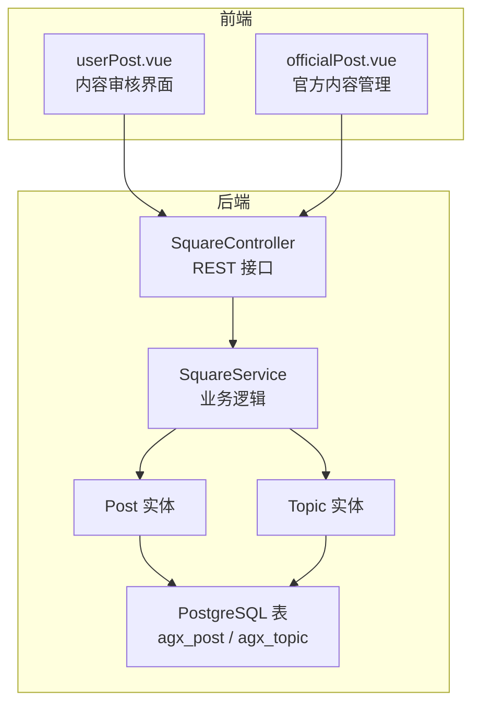
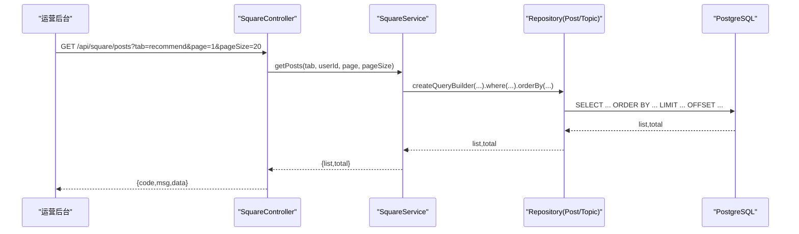
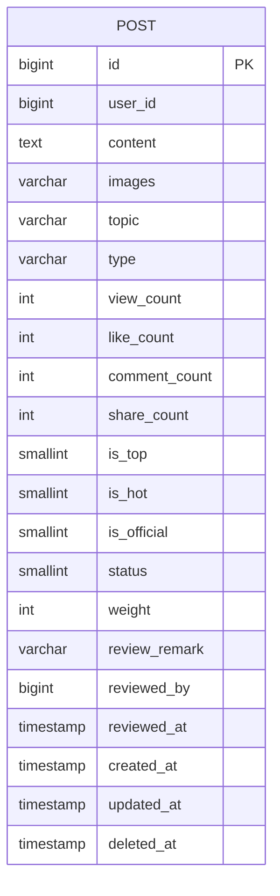
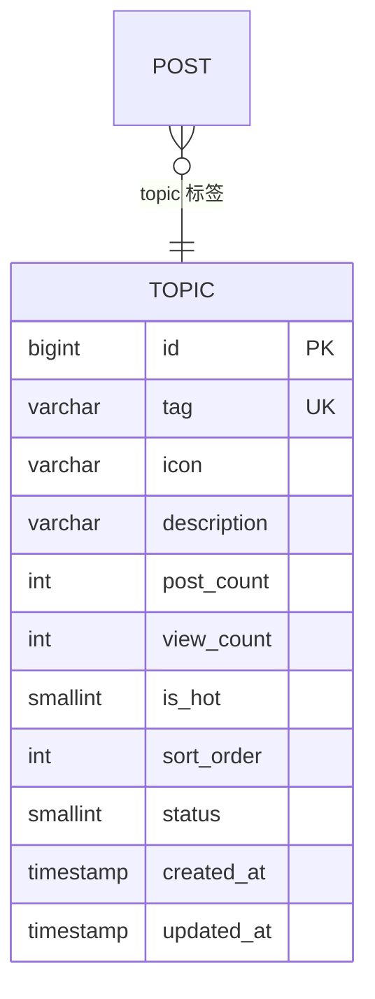
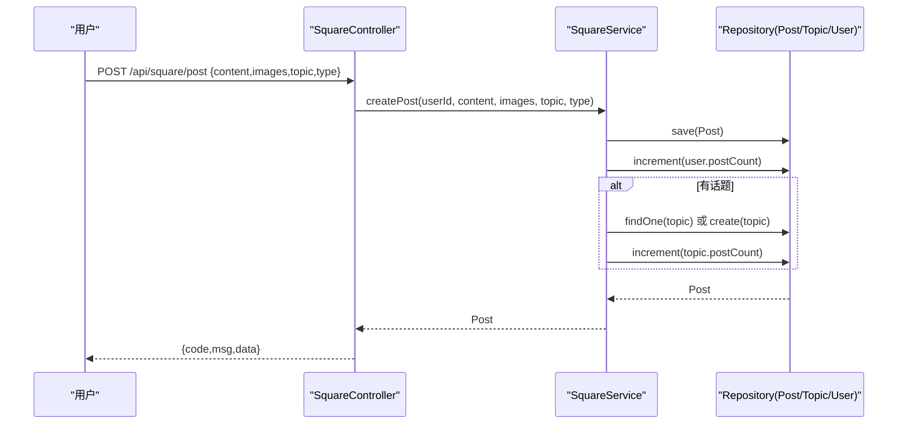
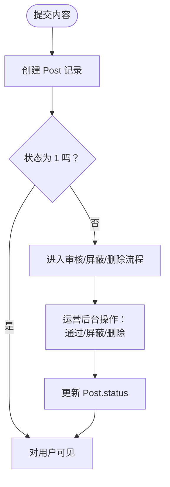
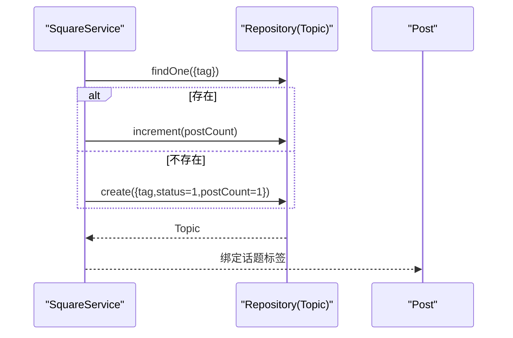
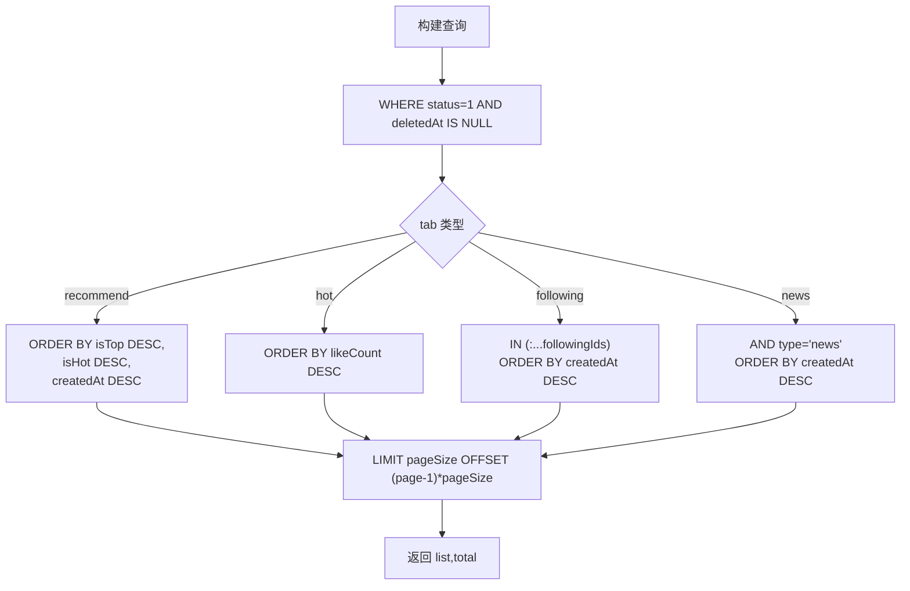
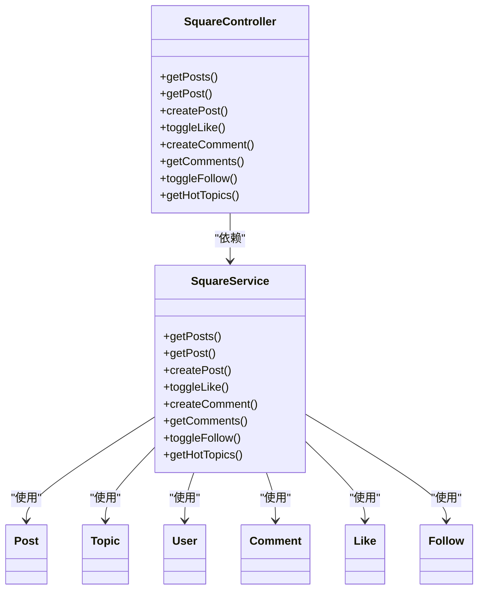

# 内容管理

<cite>
**本文引用的文件**
- [post.entity.ts](file://agx-backend/src/entities/post.entity.ts)
- [topic.entity.ts](file://agx-backend/src/entities/topic.entity.ts)
- [square.service.ts](file://agx-backend/src/modules/square/square.service.ts)
- [square.controller.ts](file://agx-backend/src/modules/square/square.controller.ts)
- [schema.sql](file://agx-backend/schema.sql)
- [social-migration.sql](file://agx-backend/social-migration.sql)
- [001_extend_modules.sql](file://agx-backend/migrations/001_extend_modules.sql)
- [userPost.vue](file://agx-admin/src/views/agx/userPost.vue)
- [officialPost.vue](file://agx-admin/src/views/agx/officialPost.vue)
</cite>

## 目录
1. [简介](#简介)
2. [项目结构](#项目结构)
3. [核心组件](#核心组件)
4. [架构总览](#架构总览)
5. [详细组件分析](#详细组件分析)
6. [依赖分析](#依赖分析)
7. [性能考量](#性能考量)
8. [故障排查指南](#故障排查指南)
9. [结论](#结论)
10. [附录](#附录)

## 简介
本文件聚焦于内容管理的数据模型与实现，围绕 Post（帖子）与 Topic（话题）两大实体展开，系统性阐述：
- Post 实体字段定义、索引策略与存储设计
- Topic 实体结构及其与 Post 的关联关系
- 内容发布流程、内容审核机制、话题分类体系
- 内容分页查询的性能优化方案
- 大规模内容数据的存储与检索策略
- 内容版本控制策略与数据归档方案

## 项目结构
内容管理相关的核心位于后端 NestJS 模块 social 的 square 子模块，采用 TypeORM 实体映射 PostgreSQL 表，并通过控制器暴露 REST 接口；前端 agx-admin 提供内容审核与运营界面。

图表来源
- [square.controller.ts](file://agx-backend/src/modules/square/square.controller.ts#L1-L140)
- [square.service.ts](file://agx-backend/src/modules/square/square.service.ts#L1-L334)
- [post.entity.ts](file://agx-backend/src/entities/post.entity.ts#L1-L80)
- [topic.entity.ts](file://agx-backend/src/entities/topic.entity.ts#L1-L49)
- [schema.sql](file://agx-backend/schema.sql#L250-L266)
- [social-migration.sql](file://agx-backend/social-migration.sql#L161-L171)
- [001_extend_modules.sql](file://agx-backend/migrations/001_extend_modules.sql#L287-L308)
- [userPost.vue](file://agx-admin/src/views/agx/userPost.vue#L81-L100)
- [officialPost.vue](file://agx-admin/src/views/agx/officialPost.vue#L30-L55)

章节来源
- [square.controller.ts](file://agx-backend/src/modules/square/square.controller.ts#L1-L140)
- [square.service.ts](file://agx-backend/src/modules/square/square.service.ts#L1-L334)
- [post.entity.ts](file://agx-backend/src/entities/post.entity.ts#L1-L80)
- [topic.entity.ts](file://agx-backend/src/entities/topic.entity.ts#L1-L49)
- [schema.sql](file://agx-backend/schema.sql#L250-L266)
- [social-migration.sql](file://agx-backend/social-migration.sql#L161-L171)
- [001_extend_modules.sql](file://agx-backend/migrations/001_extend_modules.sql#L287-L308)
- [userPost.vue](file://agx-admin/src/views/agx/userPost.vue#L81-L100)
- [officialPost.vue](file://agx-admin/src/views/agx/officialPost.vue#L30-L55)

## 核心组件
- Post 实体：承载帖子内容、统计指标、状态与审核信息，支持按用户、状态、时间等维度查询与排序。
- Topic 实体：承载话题标签、热度与排序，用于内容分类与聚合。
- SquareService：提供帖子列表、详情、发布、点赞、评论、关注、热门话题等核心能力。
- SquareController：对外暴露 REST 接口，负责参数校验与响应封装。
- 前端审核界面：提供内容屏蔽、删除、批量操作等运营能力。

章节来源
- [post.entity.ts](file://agx-backend/src/entities/post.entity.ts#L1-L80)
- [topic.entity.ts](file://agx-backend/src/entities/topic.entity.ts#L1-L49)
- [square.service.ts](file://agx-backend/src/modules/square/square.service.ts#L1-L334)
- [square.controller.ts](file://agx-backend/src/modules/square/square.controller.ts#L1-L140)

## 架构总览
内容管理采用“控制器-服务-实体-数据库”的分层架构，Post 与 Topic 通过 TypeORM 映射到 PostgreSQL 表，服务层负责业务编排与查询优化，控制器负责接口契约与鉴权上下文注入。

图表来源
- [square.controller.ts](file://agx-backend/src/modules/square/square.controller.ts#L16-L26)
- [square.service.ts](file://agx-backend/src/modules/square/square.service.ts#L30-L76)
- [schema.sql](file://agx-backend/schema.sql#L250-L266)

章节来源
- [square.controller.ts](file://agx-backend/src/modules/square/square.controller.ts#L16-L26)
- [square.service.ts](file://agx-backend/src/modules/square/square.service.ts#L30-L76)
- [schema.sql](file://agx-backend/schema.sql#L250-L266)

## 详细组件分析

### Post 实体与索引策略
- 字段定义要点
  - 主键与时间戳：自增主键、创建/更新/软删时间戳
  - 用户与内容：用户标识、内容主体、图片 URL 数组（JSON）
  - 话题与类型：话题标签、帖子类型（普通/快讯/分析）
  - 统计指标：浏览数、点赞数、评论数、分享数
  - 状态与权重：置顶/热门/官方标记、状态（-1 下架/0 审核中/1 正常）、权重分值
  - 审核信息：审核备注、审核人、审核时间
- 索引策略
  - 用户索引：按用户 ID 查询发帖与关注流
  - 状态索引：过滤正常内容
  - 话题索引：迁移脚本新增 topic_id 索引
  - 软删索引：删除时间为空时才显示
- 存储设计
  - 文本字段使用 TEXT 类型承载长内容
  - JSON 字符串存储图片 URL 列表，便于扩展但需注意查询限制
  - 小整型布尔位（0/1）用于状态与标记字段，节省空间且语义清晰

图表来源
- [post.entity.ts](file://agx-backend/src/entities/post.entity.ts#L1-L80)
- [schema.sql](file://agx-backend/schema.sql#L250-L266)
- [001_extend_modules.sql](file://agx-backend/migrations/001_extend_modules.sql#L287-L308)

章节来源
- [post.entity.ts](file://agx-backend/src/entities/post.entity.ts#L1-L80)
- [schema.sql](file://agx-backend/schema.sql#L250-L266)
- [001_extend_modules.sql](file://agx-backend/migrations/001_extend_modules.sql#L287-L308)

### Topic 实体与与 Post 的关联
- 字段定义要点
  - 标签唯一索引：保证话题标签唯一性
  - 图标、描述、统计与排序：用于前端展示与排序
  - 状态与热度：启用/禁用、热门标记
- 与 Post 的关联
  - Post.topic 字段可作为话题标签的外键参考（通过唯一索引与迁移脚本的 topic_id 索引实现）
  - 服务层在发布内容时自动维护话题计数与创建缺失话题

图表来源
- [topic.entity.ts](file://agx-backend/src/entities/topic.entity.ts#L1-L49)
- [post.entity.ts](file://agx-backend/src/entities/post.entity.ts#L1-L80)
- [001_extend_modules.sql](file://agx-backend/migrations/001_extend_modules.sql#L287-L308)

章节来源
- [topic.entity.ts](file://agx-backend/src/entities/topic.entity.ts#L1-L49)
- [post.entity.ts](file://agx-backend/src/entities/post.entity.ts#L1-L80)
- [001_extend_modules.sql](file://agx-backend/migrations/001_extend_modules.sql#L287-L308)

### 内容发布流程
- 控制器接收参数并注入用户上下文
- 服务层创建 Post 记录，写入图片 URL JSON、话题标签、类型等
- 增加用户发帖计数
- 若存在话题标签，则更新话题计数或创建新话题
- 返回新建的 Post

图表来源
- [square.controller.ts](file://agx-backend/src/modules/square/square.controller.ts#L46-L57)
- [square.service.ts](file://agx-backend/src/modules/square/square.service.ts#L105-L126)
- [social-migration.sql](file://agx-backend/social-migration.sql#L161-L171)

章节来源
- [square.controller.ts](file://agx-backend/src/modules/square/square.controller.ts#L46-L57)
- [square.service.ts](file://agx-backend/src/modules/square/square.service.ts#L105-L126)
- [social-migration.sql](file://agx-backend/social-migration.sql#L161-L171)

### 内容审核机制
- Post.status 字段支持三态：-1 已下架、0 审核中、1 正常
- 审核备注、审核人、审核时间字段用于审计与追踪
- 前端运营界面提供批量操作：批量通过、批量屏蔽、批量删除
- 审核状态变更由运营后台触发，服务层不直接参与审核逻辑

图表来源
- [post.entity.ts](file://agx-backend/src/entities/post.entity.ts#L56-L69)
- [userPost.vue](file://agx-admin/src/views/agx/userPost.vue#L81-L100)
- [officialPost.vue](file://agx-admin/src/views/agx/officialPost.vue#L30-L55)

章节来源
- [post.entity.ts](file://agx-backend/src/entities/post.entity.ts#L56-L69)
- [userPost.vue](file://agx-admin/src/views/agx/userPost.vue#L81-L100)
- [officialPost.vue](file://agx-admin/src/views/agx/officialPost.vue#L30-L55)

### 话题分类体系
- Topic.tag 唯一索引确保标签唯一
- 服务层在发布内容时自动维护话题计数，缺失则创建新话题
- 热门话题查询按状态、热门、计数、排序综合排序

图表来源
- [square.service.ts](file://agx-backend/src/modules/square/square.service.ts#L252-L261)
- [topic.entity.ts](file://agx-backend/src/entities/topic.entity.ts#L18-L20)

章节来源
- [square.service.ts](file://agx-backend/src/modules/square/square.service.ts#L252-L261)
- [topic.entity.ts](file://agx-backend/src/entities/topic.entity.ts#L18-L20)

### 内容分页查询与性能优化
- 查询逻辑
  - 默认过滤：status=1 且 deletedAt 为空
  - 推荐：优先置顶/热门，再按时间倒序
  - 热榜：按点赞数降序
  - 关注：按关注用户 ID 列表过滤
  - 新闻：按类型 news 过滤
- 性能优化建议
  - 使用复合索引覆盖常用过滤条件（如 user_id、status、created_at）
  - 对排序字段建立索引（如 like_count、created_at）
  - 使用 COUNT(*) 估算总条目，避免昂贵的 COUNT(*)
  - 分页采用 OFFSET/LIMIT，大数据量场景建议使用“游标分页”或“基于索引的范围查询”
  - 缓存热点内容（如热门话题、置顶内容）

图表来源
- [square.service.ts](file://agx-backend/src/modules/square/square.service.ts#L30-L76)
- [schema.sql](file://agx-backend/schema.sql#L250-L266)

章节来源
- [square.service.ts](file://agx-backend/src/modules/square/square.service.ts#L30-L76)
- [schema.sql](file://agx-backend/schema.sql#L250-L266)

### 大规模内容数据的存储与检索
- 存储层面
  - 文本字段使用 TEXT，长内容分页加载
  - JSON 字段存储图片 URL 列表，建议在查询时仅投影必要字段
  - 使用软删除（deleted_at）避免物理删除带来的数据丢失
- 检索层面
  - 为高频过滤与排序字段建立索引
  - 对热点内容进行缓存（如 Redis）
  - 异步任务处理统计更新（如浏览量、点赞数），减少写放大

章节来源
- [post.entity.ts](file://agx-backend/src/entities/post.entity.ts#L23-L27)
- [schema.sql](file://agx-backend/schema.sql#L250-L266)

### 内容版本控制策略
- 当前实现未见显式版本表或历史快照机制
- 建议方案
  - 新增内容版本表，记录 content、images、topic、type 的历史版本
  - 通过时间戳或序列号标识版本，支持回滚与审计
  - 对敏感字段（如 topic、type）变更进行审核与通知

章节来源
- [post.entity.ts](file://agx-backend/src/entities/post.entity.ts#L23-L33)
- [square.service.ts](file://agx-backend/src/modules/square/square.service.ts#L105-L126)

### 数据归档方案
- 归档目标
  - 低活跃度内容（如长时间无互动、非热点）迁移至归档表
  - 保留必要元数据（如作者、发布时间、统计指标），删除冗余字段
- 归档策略
  - 基于时间阈值（如 90 天未互动）与统计阈值（如 low like/comment ratio）
  - 异步批量迁移，避免阻塞主表
  - 提供查询路由：区分在线表与归档表

章节来源
- [schema.sql](file://agx-backend/schema.sql#L250-L266)
- [square.service.ts](file://agx-backend/src/modules/square/square.service.ts#L30-L76)

## 依赖分析
- 控制器依赖服务：SquareController 注入 SquareService
- 服务依赖仓库：SquareService 注入 Post/Topic/User/Comment/Like/Follow 仓库
- 实体依赖 TypeORM：Post/Topic 通过装饰器映射到 PostgreSQL 表
- 前端依赖后端接口：运营界面调用 /api/square/* 接口

图表来源
- [square.controller.ts](file://agx-backend/src/modules/square/square.controller.ts#L1-L140)
- [square.service.ts](file://agx-backend/src/modules/square/square.service.ts#L1-L334)
- [post.entity.ts](file://agx-backend/src/entities/post.entity.ts#L1-L80)
- [topic.entity.ts](file://agx-backend/src/entities/topic.entity.ts#L1-L49)

章节来源
- [square.controller.ts](file://agx-backend/src/modules/square/square.controller.ts#L1-L140)
- [square.service.ts](file://agx-backend/src/modules/square/square.service.ts#L1-L334)
- [post.entity.ts](file://agx-backend/src/entities/post.entity.ts#L1-L80)
- [topic.entity.ts](file://agx-backend/src/entities/topic.entity.ts#L1-L49)

## 性能考量
- 查询路径
  - 推荐流：isTop + isHot + createdAt 三列排序，建议建立复合索引
  - 热榜流：likeCount 降序，建议单独索引
  - 关注流：IN 子句配合 user_id 索引
- 写入路径
  - 发布内容：单次 INSERT + 可选 increment（用户计数、话题计数）
  - 点赞/取消：单次 upsert + increment/decrement
- 缓存与异步
  - 热门话题、置顶内容、用户画像等可缓存
  - 统计更新采用异步队列，降低写放大

章节来源
- [square.service.ts](file://agx-backend/src/modules/square/square.service.ts#L30-L76)
- [schema.sql](file://agx-backend/schema.sql#L250-L266)

## 故障排查指南
- 常见问题
  - 分页结果为空：检查 status 与 deletedAt 条件是否正确
  - 热榜排序异常：确认 likeCount 索引是否存在
  - 话题计数不更新：确认发布流程是否调用 updateTopicCount
- 排查步骤
  - 核对 SQL 索引：idx_post_user、idx_post_status、idx_post_topic
  - 核对迁移脚本：确认扩展字段与索引已执行
  - 核对前端参数：page、pageSize、tab 参数是否正确传递

章节来源
- [schema.sql](file://agx-backend/schema.sql#L250-L266)
- [001_extend_modules.sql](file://agx-backend/migrations/001_extend_modules.sql#L287-L308)
- [square.service.ts](file://agx-backend/src/modules/square/square.service.ts#L252-L261)

## 结论
本内容管理数据模型以 Post 与 Topic 为核心，结合 TypeORM 与 PostgreSQL 提供了清晰的实体映射与查询路径。通过合理的索引策略、分页优化与运营审核机制，能够支撑中小规模到中等规模的内容场景。针对大规模数据，建议引入版本控制与归档策略，并结合缓存与异步任务进一步提升性能与稳定性。

## 附录
- 关键字段与含义
  - Post.userId：发帖用户 ID
  - Post.content：帖子内容（TEXT）
  - Post.images：图片 URL 数组（JSON）
  - Post.topic：话题标签
  - Post.type：帖子类型（normal/news/analysis）
  - Post.status：状态（-1/0/1）
  - Post.reviewRemark/reviewedBy/reviewedAt：审核相关信息
  - Topic.tag：话题标签（唯一）
  - Topic.postCount：帖子数量
  - Topic.isHot/sortOrder/status：热门与排序控制

章节来源
- [post.entity.ts](file://agx-backend/src/entities/post.entity.ts#L1-L80)
- [topic.entity.ts](file://agx-backend/src/entities/topic.entity.ts#L1-L49)
- [schema.sql](file://agx-backend/schema.sql#L250-L266)
- [social-migration.sql](file://agx-backend/social-migration.sql#L161-L171)
- [001_extend_modules.sql](file://agx-backend/migrations/001_extend_modules.sql#L287-L308)