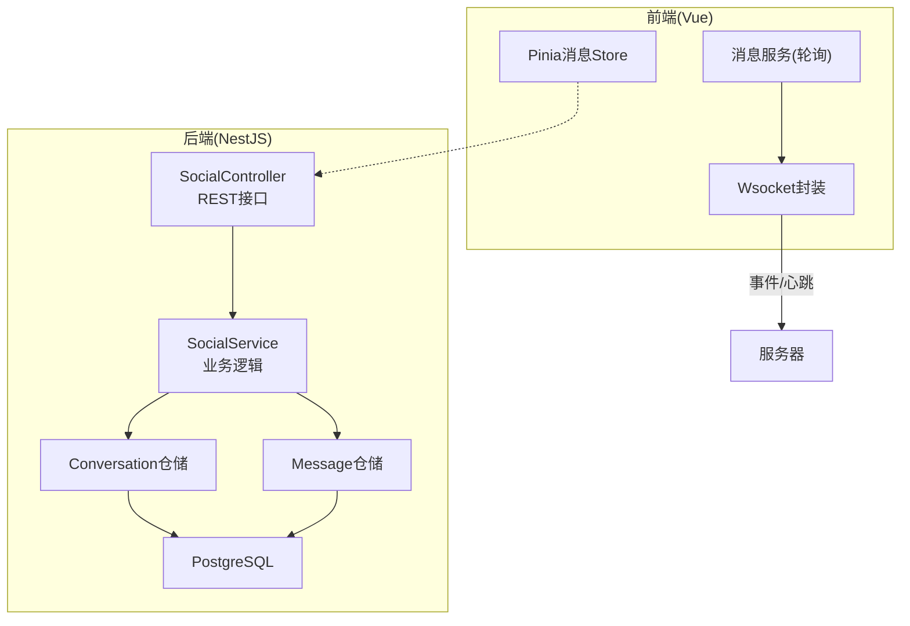
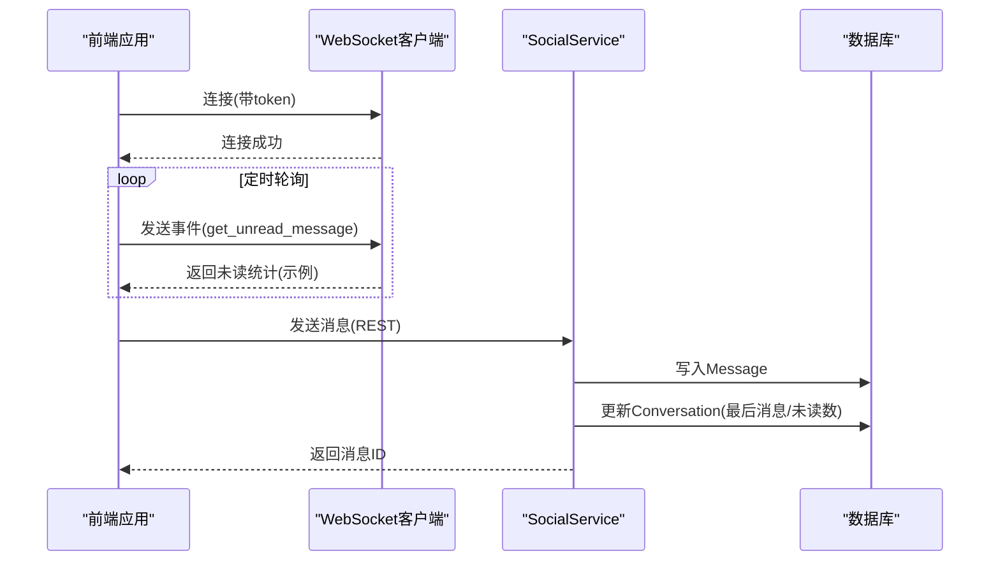
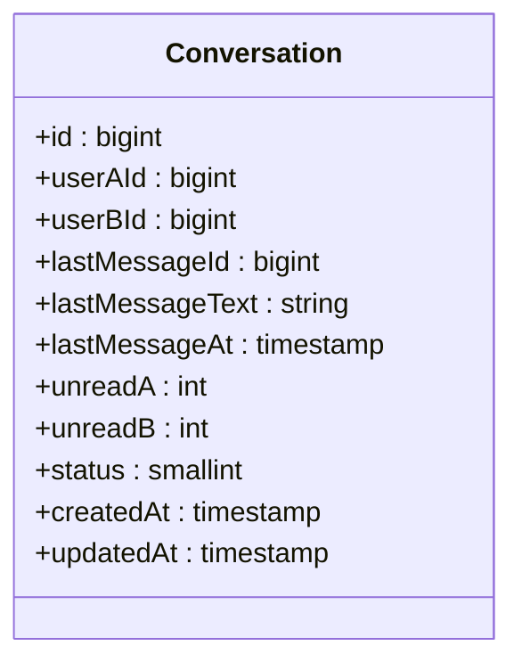
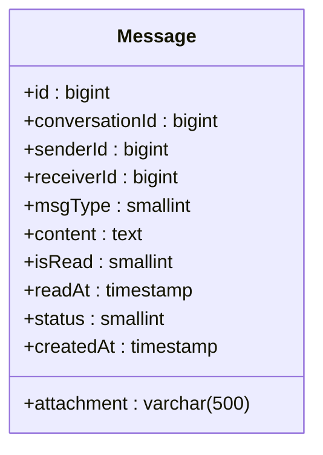
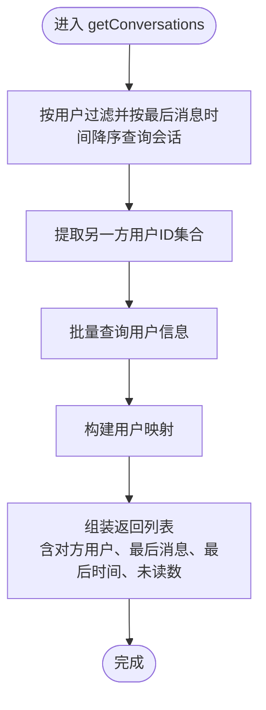
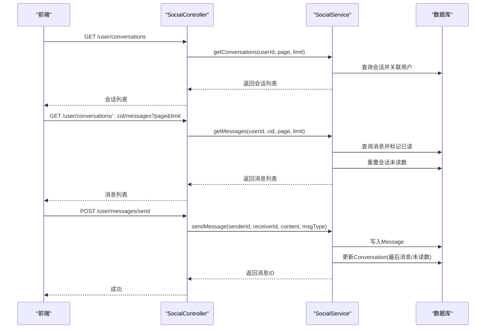
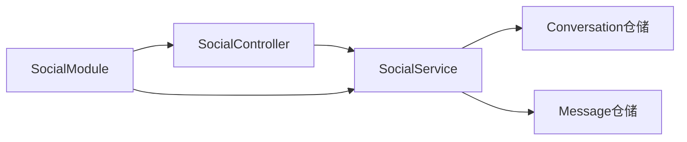

# 消息通信

<cite>
**本文引用的文件**
- [conversation.entity.ts](file://agx-backend/src/entities/conversation.entity.ts)
- [message.entity.ts](file://agx-backend/src/entities/message.entity.ts)
- [social.controller.ts](file://agx-backend/src/modules/social/social.controller.ts)
- [social.service.ts](file://agx-backend/src/modules/social/social.service.ts)
- [social.module.ts](file://agx-backend/src/modules/social/social.module.ts)
- [schema.sql](file://agx-backend/schema.sql)
- [social-migration.sql](file://agx-backend/social-migration.sql)
- [message.js](file://agx-admin/src/store/modules/message.js)
- [Wsocket.js](file://agx-admin/src/utils/Wsocket.js)
- [message.js](file://agx-admin/src/ws-serve/message.js)
</cite>

## 目录
1. [引言](#引言)
2. [项目结构](#项目结构)
3. [核心组件](#核心组件)
4. [架构总览](#架构总览)
5. [详细组件分析](#详细组件分析)
6. [依赖分析](#依赖分析)
7. [性能考虑](#性能考虑)
8. [故障排查指南](#故障排查指南)
9. [结论](#结论)
10. [附录](#附录)

## 引言
本文件围绕消息通信的数据模型与业务流程，聚焦 Conversation 与 Message 实体，系统性阐述：
- 会话元数据与消息内容结构
- 会话列表生成逻辑与消息同步机制
- 消息可靠性保障（持久化、离线推送、已读状态管理）
- 消息加密传输与存储安全建议
- 前后端交互路径与关键调用序列

## 项目结构
消息通信相关代码主要分布在后端 NestJS 的社交模块与前端 Vue 应用的消息服务中：
- 后端：TypeORM 实体定义、社交控制器与服务层、模块装配
- 前端：Pinia 状态管理、WebSocket 封装与心跳重连、消息轮询

图表来源
- [social.controller.ts](file://agx-backend/src/modules/social/social.controller.ts#L1-L123)
- [social.service.ts](file://agx-backend/src/modules/social/social.service.ts#L1-L421)
- [conversation.entity.ts](file://agx-backend/src/entities/conversation.entity.ts#L1-L52)
- [message.entity.ts](file://agx-backend/src/entities/message.entity.ts#L1-L51)
- [Wsocket.js](file://agx-admin/src/utils/Wsocket.js#L1-L195)
- [message.js](file://agx-admin/src/ws-serve/message.js#L1-L42)
- [message.js](file://agx-admin/src/store/modules/message.js#L1-L24)

章节来源
- [social.controller.ts](file://agx-backend/src/modules/social/social.controller.ts#L1-L123)
- [social.service.ts](file://agx-backend/src/modules/social/social.service.ts#L1-L421)
- [social.module.ts](file://agx-backend/src/modules/social/social.module.ts#L1-L34)

## 核心组件
- Conversation 实体：承载私聊会话元数据，包括参与用户、最后消息、未读数、状态与时间戳。
- Message 实体：承载消息内容，包括发送者、接收者、消息类型、内容、附件、已读状态与时间、状态与创建时间。
- SocialController：对外暴露 REST 接口，如获取会话列表、获取消息分页、发送消息等。
- SocialService：实现业务规则，如好友校验、会话创建/更新、消息持久化与已读标记、管理端社交控制。

章节来源
- [conversation.entity.ts](file://agx-backend/src/entities/conversation.entity.ts#L1-L52)
- [message.entity.ts](file://agx-backend/src/entities/message.entity.ts#L1-L51)
- [social.controller.ts](file://agx-backend/src/modules/social/social.controller.ts#L1-L123)
- [social.service.ts](file://agx-backend/src/modules/social/social.service.ts#L1-L421)

## 架构总览
消息通信采用“REST + WebSocket 轮询”的混合模式：
- REST：用于会话列表、消息分页、发送消息等请求-响应式交互
- WebSocket：前端通过心跳与重连维持长连接；当前仓库中存在心跳与重连封装，但未见具体事件绑定与消息推送实现；消息轮询通过定时任务触发

图表来源
- [Wsocket.js](file://agx-admin/src/utils/Wsocket.js#L1-L195)
- [message.js](file://agx-admin/src/ws-serve/message.js#L1-L42)
- [social.service.ts](file://agx-backend/src/modules/social/social.service.ts#L320-L373)
- [social.controller.ts](file://agx-backend/src/modules/social/social.controller.ts#L68-L77)

## 详细组件分析

### Conversation 实体
- 参与用户：userAId、userBId，按较小ID在前的约定存储，确保每对好友仅有一条会话
- 最后消息：lastMessageId、lastMessageText、lastMessageAt，用于会话列表展示
- 未读数：unreadA、unreadB，分别记录双方未读数量
- 状态与时间：status、createdAt、updatedAt
- 索引：对 userAId、userBId 建唯一索引，保证好友会话唯一性

图表来源
- [conversation.entity.ts](file://agx-backend/src/entities/conversation.entity.ts#L1-L52)
- [social-migration.sql](file://agx-backend/social-migration.sql#L67-L76)

章节来源
- [conversation.entity.ts](file://agx-backend/src/entities/conversation.entity.ts#L1-L52)
- [social-migration.sql](file://agx-backend/social-migration.sql#L67-L76)

### Message 实体
- 关联：conversationId、senderId、receiverId
- 类型与内容：msgType（文本/图片/语音/系统消息）、content、attachment
- 已读与时间：isRead、readAt
- 状态与时间：status（正常/撤回/删除）、createdAt
- 索引：对 conversation_id、sender_id、receiver_id、created_at 建立索引，支持查询与排序

图表来源
- [message.entity.ts](file://agx-backend/src/entities/message.entity.ts#L1-L51)
- [social-migration.sql](file://agx-backend/social-migration.sql#L76-L94)

章节来源
- [message.entity.ts](file://agx-backend/src/entities/message.entity.ts#L1-L51)
- [social-migration.sql](file://agx-backend/social-migration.sql#L76-L94)

### 会话列表生成逻辑
- 查询条件：筛选包含当前用户的会话，且状态为正常
- 排序：按最后消息时间降序
- 分页：支持 page、limit
- 对方用户信息：根据会话另一方用户ID批量查询用户信息，组装返回字段（头像、昵称等）
- 未读数：根据当前用户归属，选择对应未读字段

图表来源
- [social.service.ts](file://agx-backend/src/modules/social/social.service.ts#L245-L285)

章节来源
- [social.service.ts](file://agx-backend/src/modules/social/social.service.ts#L245-L285)

### 消息同步机制
- 分页拉取：按 conversationId 查询消息，按创建时间倒序分页，返回时再反转顺序以保证显示顺序
- 已读标记：当某用户查看某会话消息时，将该会话下该用户未读消息标记为已读，并重置会话未读数
- 发送消息：校验开关与权限，确认好友关系，获取或创建会话，写入消息，更新会话最后消息与未读数

图表来源
- [social.controller.ts](file://agx-backend/src/modules/social/social.controller.ts#L51-L77)
- [social.service.ts](file://agx-backend/src/modules/social/social.service.ts#L287-L373)

章节来源
- [social.controller.ts](file://agx-backend/src/modules/social/social.controller.ts#L51-L77)
- [social.service.ts](file://agx-backend/src/modules/social/social.service.ts#L287-L373)

### 消息可靠性保障方案
- 持久化
  - Message 与 Conversation 均持久化至 PostgreSQL，具备索引优化查询与排序
  - 会话最后消息冗余字段便于列表展示，减少联表查询
- 离线消息推送
  - 前端提供 WebSocket 封装与心跳重连，但当前仓库未见具体事件绑定与消息推送实现；消息轮询通过定时任务触发
  - 建议：在后端建立消息推送通道（如 Redis Pub/Sub 或 WebSocket 广播），在消息写入后向接收方推送增量
- 已读状态管理
  - 查看会话消息时，自动标记未读为已读并清零未读数，避免重复标记
- 加密传输与存储安全
  - 传输：建议使用 HTTPS/WS-Secure，结合后端 JWT 鉴权与前端 token 管理
  - 存储：敏感字段（如用户头像、内容）建议在应用层做最小化暴露与脱敏；数据库层面启用强密码与最小权限

章节来源
- [Wsocket.js](file://agx-admin/src/utils/Wsocket.js#L1-L195)
- [message.js](file://agx-admin/src/ws-serve/message.js#L1-L42)
- [social.service.ts](file://agx-backend/src/modules/social/social.service.ts#L287-L373)
- [schema.sql](file://agx-backend/schema.sql#L1-L472)

### 数据模型与索引
- 表结构与索引由 schema.sql 与 social-migration.sql 定义，确保查询效率与一致性
- 关键索引：Conversation(userAId、userBId 唯一索引)，Message(conversation_id、sender_id、receiver_id、created_at)

章节来源
- [schema.sql](file://agx-backend/schema.sql#L1-L472)
- [social-migration.sql](file://agx-backend/social-migration.sql#L67-L94)

## 依赖分析
- 控制器依赖服务：SocialController 注入 SocialService
- 服务依赖仓储：SocialService 注入 Friend、FriendRequest、Conversation、Message、Follow、User、SystemToggle、LevelPermission 等仓储
- 模块装配：SocialModule 使用 TypeOrmModule.forFeature 注册实体仓储

图表来源
- [social.controller.ts](file://agx-backend/src/modules/social/social.controller.ts#L1-L123)
- [social.service.ts](file://agx-backend/src/modules/social/social.service.ts#L1-L421)
- [social.module.ts](file://agx-backend/src/modules/social/social.module.ts#L1-L34)

章节来源
- [social.controller.ts](file://agx-backend/src/modules/social/social.controller.ts#L1-L123)
- [social.service.ts](file://agx-backend/src/modules/social/social.service.ts#L1-L421)
- [social.module.ts](file://agx-backend/src/modules/social/social.module.ts#L1-L34)

## 性能考虑
- 查询优化
  - 会话列表按最后消息时间倒序，需确保索引有效
  - 消息分页按 created_at 倒序，需保持索引命中
- 写入优化
  - 发送消息时先写 Message，再更新 Conversation，避免跨事务复杂度
- 缓存策略
  - 会话列表可引入短期缓存（如 Redis），降低高频查询压力
- 分页参数
  - 合理设置 page/limit，避免超大偏移导致慢查询

## 故障排查指南
- 权限与开关
  - 私聊与加好友等功能受系统开关与用户权限控制，若失败需检查开关状态与用户状态
- 会话访问
  - 仅会话双方可访问对应消息，非会话成员将被拒绝
- 已读标记
  - 查看消息后应自动标记已读并清零未读数；若未生效，检查服务层更新逻辑
- WebSocket
  - 若心跳失败或断线重连频繁，检查网络与服务端心跳配置；当前仓库未见事件绑定，需补充事件处理

章节来源
- [social.service.ts](file://agx-backend/src/modules/social/social.service.ts#L320-L373)
- [social.controller.ts](file://agx-backend/src/modules/social/social.controller.ts#L51-L77)
- [Wsocket.js](file://agx-admin/src/utils/Wsocket.js#L1-L195)

## 结论
本项目的消息通信以 Conversation 与 Message 为核心数据模型，配合 REST 与 WebSocket 轮询实现消息的可靠存储与基本同步。建议后续完善：
- WebSocket 事件绑定与消息推送
- 加密传输与存储安全加固
- 会话列表与消息分页的缓存策略
- 管理端社交控制与审计能力

## 附录
- 前端消息状态管理：Pinia Store 提供基础状态更新能力
- WebSocket 封装：提供心跳与重连机制，便于扩展消息推送

章节来源
- [message.js](file://agx-admin/src/store/modules/message.js#L1-L24)
- [Wsocket.js](file://agx-admin/src/utils/Wsocket.js#L1-L195)
- [message.js](file://agx-admin/src/ws-serve/message.js#L1-L42)