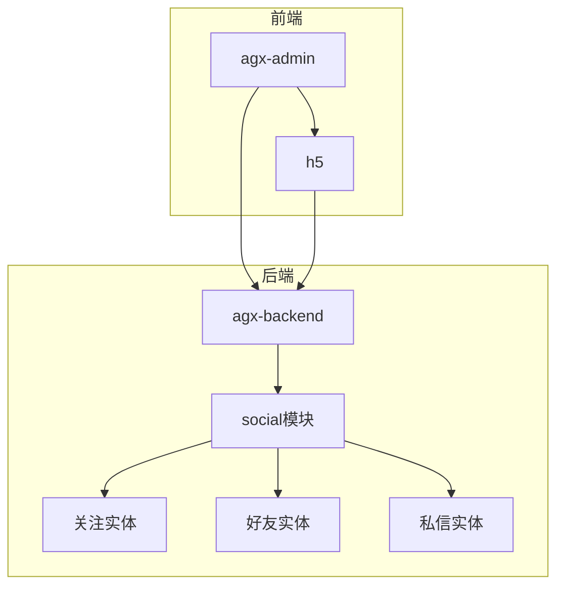
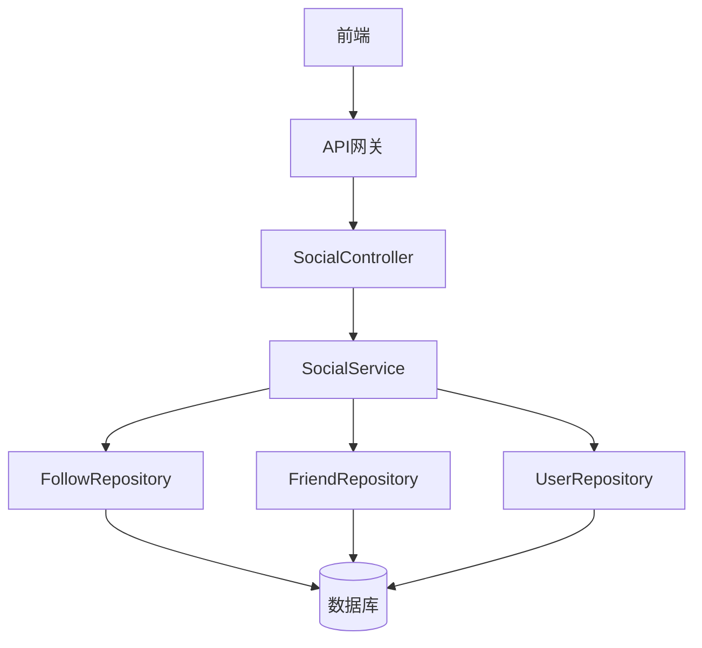
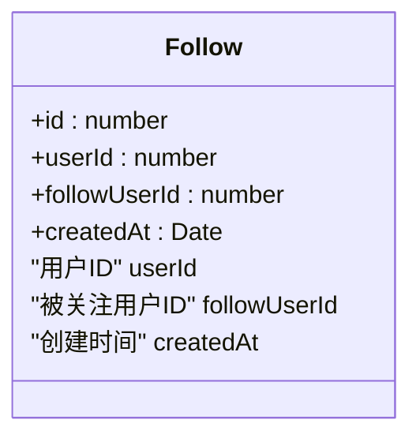
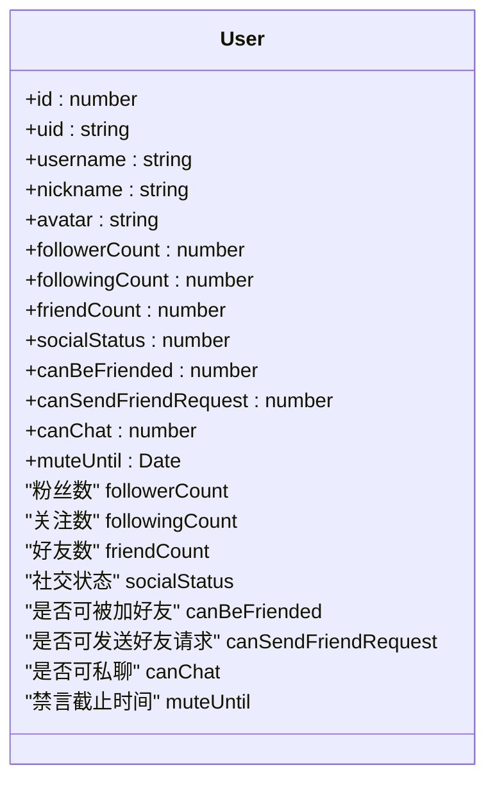
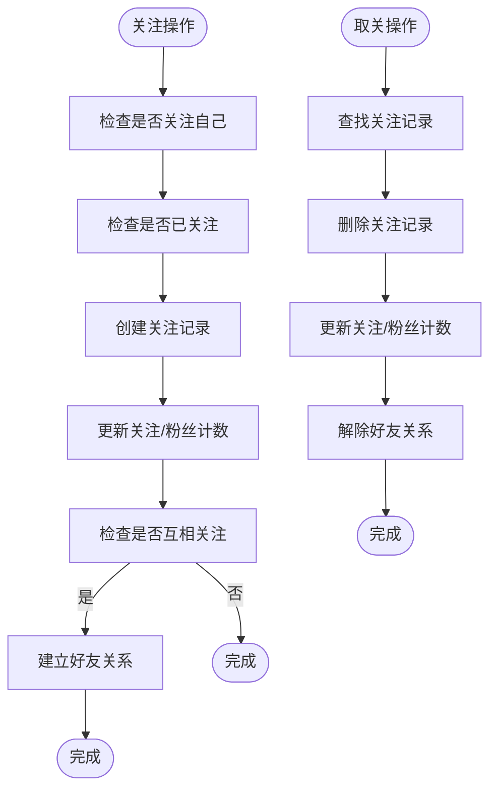
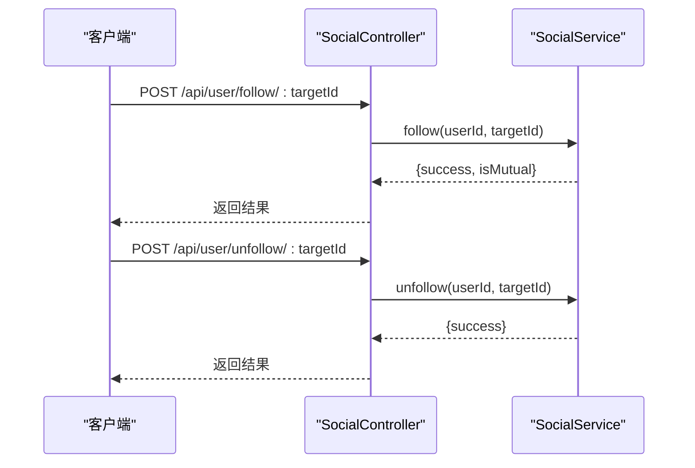
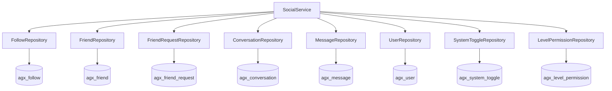

# 关注关系

<cite>
**本文档引用的文件**  
- [follow.entity.ts](file://agx-backend/src/entities/follow.entity.ts)
- [social.service.ts](file://agx-backend/src/modules/social/social.service.ts)
- [social.controller.ts](file://agx-backend/src/modules/social/social.controller.ts)
- [user.entity.ts](file://agx-backend/src/entities/user.entity.ts)
- [system-toggle.entity.ts](file://agx-backend/src/entities/system-toggle.entity.ts)
- [level-permission.entity.ts](file://agx-backend/src/entities/level-permission.entity.ts)
</cite>

## 目录
1. [项目结构](#项目结构)
2. [核心组件](#核心组件)
3. [架构概述](#架构概述)
4. [详细组件分析](#详细组件分析)
5. [依赖分析](#依赖分析)
6. [性能考虑](#性能考虑)
7. [故障排除指南](#故障排除指南)
8. [结论](#结论)

## 项目结构

该系统包含三个主要部分：管理后台（agx-admin）、后端服务（agx-backend）和移动端（h5）。关注关系功能主要在后端实现，位于 `agx-backend/src/modules/social/` 目录下。

**图表来源**  
- [social.module.ts](file://agx-backend/src/modules/social/social.module.ts)

**章节来源**  
- [social.module.ts](file://agx-backend/src/modules/social/social.module.ts)

## 核心组件

关注关系管理的核心组件包括关注实体（Follow）、用户实体（User）、社交服务（SocialService）和社交控制器（SocialController）。这些组件共同实现了关注/取关、好友关系建立、私信通信等社交功能。

**章节来源**  
- [follow.entity.ts](file://agx-backend/src/entities/follow.entity.ts)
- [user.entity.ts](file://agx-backend/src/entities/user.entity.ts)
- [social.service.ts](file://agx-backend/src/modules/social/social.service.ts)
- [social.controller.ts](file://agx-backend/src/modules/social/social.controller.ts)

## 架构概述

系统采用分层架构，前端通过API与后端交互，后端使用NestJS框架实现业务逻辑，数据存储在数据库中。社交功能模块独立封装，通过服务层提供清晰的接口。

**图表来源**  
- [social.controller.ts](file://agx-backend/src/modules/social/social.controller.ts)
- [social.service.ts](file://agx-backend/src/modules/social/social.service.ts)

## 详细组件分析

### 关注实体分析

关注实体（Follow）是实现关注关系的基础，存储用户之间的关注关系。

**图表来源**  
- [follow.entity.ts](file://agx-backend/src/entities/follow.entity.ts)

### 用户实体分析

用户实体（User）包含与社交相关的多个字段，用于支持关注关系的完整功能。

**图表来源**  
- [user.entity.ts](file://agx-backend/src/entities/user.entity.ts)

### 社交服务分析

社交服务（SocialService）是关注关系管理的核心业务逻辑实现。

**图表来源**  
- [social.service.ts](file://agx-backend/src/modules/social/social.service.ts)

### 社交控制器分析

社交控制器（SocialController）处理HTTP请求，提供RESTful API接口。

**图表来源**  
- [social.controller.ts](file://agx-backend/src/modules/social/social.controller.ts)

## 依赖分析

社交模块依赖于多个实体和存储库，形成了清晰的依赖关系。

**图表来源**  
- [social.service.ts](file://agx-backend/src/modules/social/social.service.ts)
- [social.module.ts](file://agx-backend/src/modules/social/social.module.ts)

## 性能考虑

系统通过多种方式优化关注关系的性能：
- 使用数据库索引加速查询
- 在用户实体中缓存计数器（粉丝数、关注数等）
- 通过功能开关和权限控制限制恶意操作
- 支持分页查询以处理大量数据

## 故障排除指南

常见问题及解决方案：
- **无法关注**：检查是否已关注或是否在黑名单中
- **计数不一致**：检查事务完整性或缓存同步
- **好友关系未建立**：确认是否互相关注
- **私信功能不可用**：检查双方是否为好友且功能未被禁用

**章节来源**  
- [social.service.ts](file://agx-backend/src/modules/social/social.service.ts)
- [social.controller.ts](file://agx-backend/src/modules/social/social.controller.ts)

## 结论

本系统实现了完整的关注关系管理功能，包括关注/取关、好友关系建立、私信通信等。通过合理的数据结构设计和业务逻辑实现，确保了功能的完整性和性能的高效性。同时，系统提供了完善的管理接口，便于运营人员进行监控和干预。