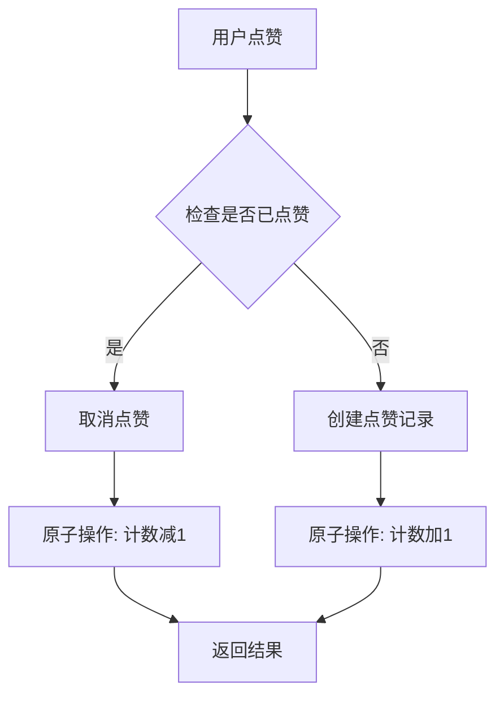

# 点赞机制

<cite>
**本文档引用文件**   
- [like.entity.ts](file://agx-backend/src/entities/like.entity.ts)
- [square.service.ts](file://agx-backend/src/modules/square/square.service.ts)
- [square.controller.ts](file://agx-backend/src/modules/square/square.controller.ts)
- [schema.sql](file://agx-backend/schema.sql)
</cite>

## 目录
1. [简介](#简介)
2. [Like实体设计](#like实体设计)
3. [唯一性约束实现](#唯一性约束实现)
4. [点赞计数更新与缓存策略](#点赞计数更新与缓存策略)
5. [点赞状态查询与取消点赞](#点赞状态查询与取消点赞)
6. [接口设计](#接口设计)

## 简介
本文档详细描述了AGX系统中点赞机制的设计与实现。该机制支持对帖子和评论的点赞功能，通过数据库唯一索引和业务逻辑双重保障防止用户重复点赞，并实现了点赞计数的实时更新。系统采用NestJS框架和TypeORM进行开发，确保了高并发场景下的数据一致性和性能表现。

## Like实体设计

点赞功能的核心是`Like`实体，该实体记录了用户对特定目标（帖子或评论）的点赞行为。实体包含以下关键字段：

- `id`: 主键，自增的bigint类型
- `userId`: 点赞用户ID，建立索引以提高查询效率
- `targetType`: 目标类型，支持'post'(帖子)和'comment'(评论)两种类型
- `targetId`: 目标ID，指向具体的帖子或评论
- `createdAt`: 创建时间，自动记录点赞时间

该设计支持对不同类型的资源进行点赞，具有良好的扩展性。

**Section sources**
- [like.entity.ts](file://agx-backend/src/entities/like.entity.ts#L1-L34)

## 唯一性约束实现

为防止用户重复点赞，系统采用了数据库层面和应用层面的双重保障机制。

在数据库层面，通过在`agx_like`表上创建联合唯一索引确保数据完整性：

```sql
CREATE TABLE IF NOT EXISTS agx_like (
  id              BIGSERIAL PRIMARY KEY,
  user_id         BIGINT NOT NULL,
  target_type     VARCHAR(20) NOT NULL,
  target_id       BIGINT NOT NULL,
  created_at      TIMESTAMP NOT NULL DEFAULT CURRENT_TIMESTAMP,
  UNIQUE(user_id, target_type, target_id)
);
```

在应用层面，`SquareService`中的`toggleLike`方法首先检查是否存在已有的点赞记录，如果存在则执行取消点赞操作，否则创建新的点赞记录。这种先查询后操作的模式确保了业务逻辑的正确性。

```typescript
async toggleLike(userId: number, targetType: 'post' | 'comment', targetId: number) {
  const existing = await this.likeRepository.findOne({
    where: { userId, targetType, targetId }
  });
  
  if (existing) {
    // 取消点赞
    await this.likeRepository.remove(existing);
    // 更新计数
  } else {
    // 添加点赞
    const like = this.likeRepository.create({ userId, targetType, targetId });
    await this.likeRepository.save(like);
    // 更新计数
  }
}
```

这种双重保障机制既利用了数据库的完整性约束，又通过应用逻辑提供了更好的用户体验和错误处理能力。

**Section sources**
- [schema.sql](file://agx-backend/schema.sql#L282-L290)
- [square.service.ts](file://agx-backend/src/modules/square/square.service.ts#L131-L160)

## 点赞计数更新与缓存策略

点赞计数的更新采用数据库原子操作实现，确保高并发场景下的数据一致性。当用户点赞或取消点赞时，系统使用TypeORM的`increment`和`decrement`方法直接在数据库层面进行计数更新，避免了读取-修改-写入的竞态条件。

```typescript
if (targetType === 'post') {
  await this.postRepository.increment({ id: targetId }, 'likeCount', 1);
} else {
  await this.commentRepository.increment({ id: targetId }, 'likeCount', 1);
}
```

对于缓存策略，系统通过管理后台提供了Redis监控功能，可以实时查看Redis的使用情况，包括内存占用、连接数等关键指标。虽然当前代码中未直接体现点赞数据的缓存逻辑，但系统已具备完整的Redis监控能力，为后续实现点赞数据缓存提供了基础。



**Diagram sources **
- [square.service.ts](file://agx-backend/src/modules/square/square.service.ts#L136-L157)
- [index.vue](file://agx-admin/src/views/system/monitor/cache/index.vue#L1-L126)

## 点赞状态查询与取消点赞

点赞状态的查询主要在获取帖子详情时实现。`SquareService`的`getPost`方法在返回帖子信息时，会检查当前用户是否已经点赞该帖子，并在返回结果中包含`isLiked`字段。

```typescript
async getPost(postId: number, userId?: number) {
  const post = await this.postRepository.findOne({ where: { id: postId } });
  
  let isLiked = false;
  if (userId) {
    const like = await this.likeRepository.findOne({
      where: { userId, targetType: 'post', targetId: postId }
    });
    isLiked = !!like;
  }
  
  return { ...post, isLiked };
}
```

取消点赞功能与点赞功能共享同一个接口，通过`toggleLike`方法实现。当用户对已点赞的内容再次点击时，系统会检测到已存在的点赞记录并执行移除操作，实现"取消点赞"的效果。

**Section sources**
- [square.service.ts](file://agx-backend/src/modules/square/square.service.ts#L81-L99)
- [square.service.ts](file://agx-backend/src/modules/square/square.service.ts#L131-L160)

## 接口设计

点赞功能通过RESTful API提供服务，主要接口如下：

### 点赞/取消点赞接口
- **URL**: `POST /api/square/like`
- **请求参数**:
  - `targetType`: 目标类型 ('post' 或 'comment')
  - `targetId`: 目标ID
- **响应**:
  ```json
  {
    "code": 0,
    "msg": "ok",
    "data": {
      "liked": true
    }
  }
  ```

### 获取帖子详情接口
- **URL**: `GET /api/square/post/:id`
- **响应**:
  ```json
  {
    "code": 0,
    "msg": "ok",
    "data": {
      "id": 1,
      "userId": 1,
      "content": "帖子内容",
      "likeCount": 10,
      "commentCount": 5,
      "isLiked": true,
      "createdAt": "2025-01-01T00:00:00Z"
    }
  }
  ```

这些接口设计简洁明了，符合RESTful规范，便于前端调用和集成。

**Section sources**
- [square.controller.ts](file://agx-backend/src/modules/square/square.controller.ts#L63-L74)
- [square.controller.ts](file://agx-backend/src/modules/square/square.controller.ts#L32-L40)