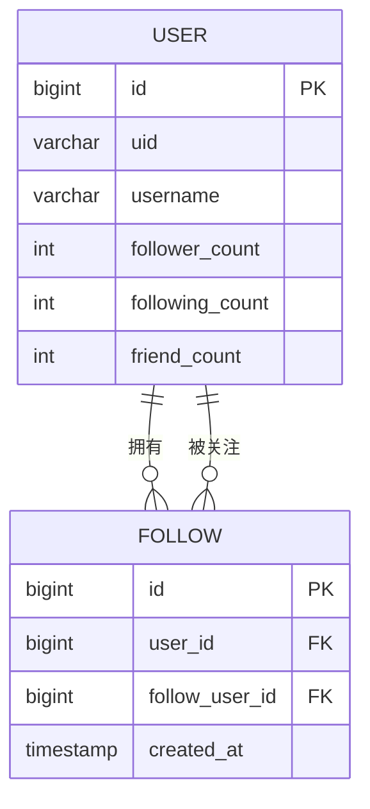
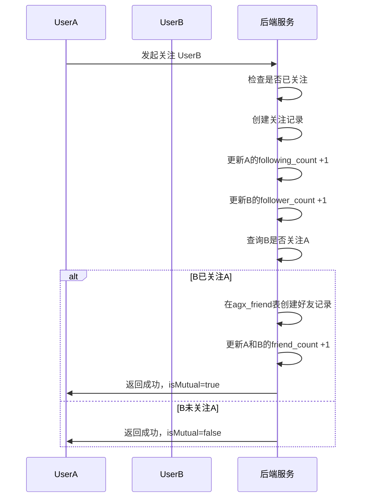

# 社交互动

<cite>
**本文档引用的文件**
- [comment.entity.ts](file://agx-backend/src/entities/comment.entity.ts)
- [like.entity.ts](file://agx-backend/src/entities/like.entity.ts)
- [follow.entity.ts](file://agx-backend/src/entities/follow.entity.ts)
- [user.entity.ts](file://agx-backend/src/entities/user.entity.ts)
- [social.service.ts](file://agx-backend/src/modules/social/social.service.ts)
- [social.controller.ts](file://agx-backend/src/modules/social/social.controller.ts)
- [social-migration.sql](file://agx-backend/social-migration.sql)
- [schema.sql](file://agx-backend/schema.sql)
</cite>

## 目录
1. [引言](#引言)
2. [核心实体数据模型](#核心实体数据模型)
3. [社交图谱与关系管理](#社交图谱与关系管理)
4. [高并发性能优化策略](#高并发性能优化策略)
5. [反垃圾与异常行为检测](#反垃圾与异常行为检测)
6. [结论](#结论)

## 引言
本文档详细阐述了AGX平台社交互动功能的数据模型设计，重点聚焦于评论（Comment）、点赞（Like）和关注（Follow）三大核心实体。文档深入分析了多级评论的层级结构、点赞去重机制、关注与好友的双向关系管理，并探讨了在高并发场景下的性能优化方案，如使用Redis缓存计数器。同时，文档还涵盖了社交互动的反垃圾过滤和异常行为检测机制，确保平台的健康和安全。

## 核心实体数据模型

### 评论实体（Comment）
评论实体支持多级嵌套回复，形成了一个树状层级结构。其核心设计如下：
- **`id`**: 评论的唯一标识符。
- **`postId`**: 关联的帖子ID，通过索引`idx_post_id`加速查询。
- **`userId`**: 发表评论的用户ID。
- **`parentId`**: 父评论ID，用于实现多级回复。如果为`null`，则表示该评论是直接对帖子的回复（一级评论）。
- **`replyToUserId`**: 被回复的用户ID，用于在回复时@特定用户。
- **`content`**: 评论内容，最大长度为1000个字符。
- **`likeCount`**: 该评论的点赞数，用于快速展示，避免实时计算。
- **`status`**: 评论状态（0隐藏，1正常）。
- **`createdAt`**: 评论创建时间。

此设计允许用户对帖子进行评论，并对任意一条评论进行回复，从而构建出复杂的讨论线程。

**Section sources**
- [comment.entity.ts](file://agx-backend/src/entities/comment.entity.ts#L1-L48)
- [schema.sql](file://agx-backend/schema.sql#L267-L281)

### 点赞实体（Like）
点赞实体采用通用设计，支持对多种目标（如帖子、评论）进行点赞，并通过数据库约束防止重复点赞。
- **`id`**: 点赞记录的唯一标识符。
- **`userId`**: 执行点赞操作的用户ID。
- **`targetType`**: 目标类型，如`post`（帖子）或`comment`（评论）。
- **`targetId`**: 被点赞目标的ID。
- **`createdAt`**: 点赞时间。

关键设计在于**联合唯一索引**（UNIQUE INDEX idx_user_target (user_id, target_type, target_id)）。该索引确保了同一个用户对同一目标（例如，对某一条特定的评论）只能点赞一次，从根本上解决了重复点赞的问题。

**Section sources**
- [like.entity.ts](file://agx-backend/src/entities/like.entity.ts#L1-L34)
- [schema.sql](file://agx-backend/schema.sql#L282-L290)

### 关注实体（Follow）
关注实体管理用户间的单向关注关系，是构建社交图谱的基础。
- **`id`**: 关注记录的唯一标识符。
- **`userId`**: 关注者（粉丝）的用户ID。
- **`followUserId`**: 被关注者（博主）的用户ID。
- **`createdAt`**: 关注时间。

同样，通过**联合唯一索引**（UNIQUE INDEX idx_user_follow (user_id, follow_user_id)）来防止用户重复关注同一人。

**Section sources**
- [follow.entity.ts](file://agx-backend/src/entities/follow.entity.ts#L1-L30)

## 社交图谱与关系管理

### 粉丝/关注列表存储方案
粉丝和关注列表的存储直接基于`agx_follow`表。查询一个用户的关注列表，即查询`userId`等于该用户ID的所有记录；查询一个用户的粉丝列表，即查询`followUserId`等于该用户ID的所有记录。为了提高查询效率，数据库为`userId`和`followUserId`字段分别建立了独立索引（`idx_user_id`和`idx_follow_user_id`）。

**Diagram sources**
- [follow.entity.ts](file://agx-backend/src/entities/follow.entity.ts#L1-L30)
- [user.entity.ts](file://agx-backend/src/entities/user.entity.ts#L72-L79)

### 双向关系管理（关注与好友）
系统通过业务逻辑将单向的“关注”关系升级为双向的“好友”关系。
1.  **关注触发**：当用户A关注用户B时，系统会检查用户B是否也关注了用户A。
2.  **互相关注判定**：如果存在从B到A的关注记录，则判定为“互相关注”。
3.  **创建好友关系**：一旦判定为互相关注，系统会自动在`agx_friend`表中创建一条好友记录（`user_id`和`friend_id`按大小排序存储，确保唯一性），并更新双方的`friend_count`。
4.  **解除关系**：当任意一方取消关注时，系统会自动删除好友关系，并减少双方的好友计数。

这种设计将“关注”作为建立好友关系的前置条件，简化了好友系统的逻辑。

**Diagram sources**
- [social.service.ts](file://agx-backend/src/modules/social/social.service.ts#L57-L83)
- [social-migration.sql](file://agx-backend/social-migration.sql#L8-L28)

## 高并发性能优化策略

### Redis缓存计数器
在高并发场景下，频繁地对数据库进行`UPDATE ... SET like_count = like_count + 1`操作会成为性能瓶颈。为此，系统采用Redis缓存计数器策略：
1.  **写入缓存**：当用户点赞或评论时，操作首先在Redis中对`post:like_count:{postId}`或`comment:like_count:{commentId}`等键进行原子性递增（INCR）。
2.  **异步持久化**：通过后台任务或消息队列，定期（如每分钟）将Redis中的计数器值批量同步回数据库，更新`agx_post.like_count`和`agx_comment.like_count`字段。
3.  **读取优化**：前端展示点赞数时，优先从Redis缓存中读取，速度极快。

此策略将高频率的写操作从数据库转移到内存数据库Redis，极大地减轻了数据库的压力，保证了系统的高吞吐量。

### 其他优化措施
- **数据库索引**：为所有高频查询字段（如`post_id`, `user_id`, `target_id`等）建立索引，确保查询效率。
- **分页查询**：对于评论列表、粉丝列表等可能返回大量数据的接口，强制使用分页（page, limit），避免一次性加载过多数据。

## 反垃圾与异常行为检测

### 反垃圾过滤机制
系统通过多层次的控制来防止垃圾信息和滥用行为：
1.  **功能开关**：通过`agx_system_toggle`表全局控制“允许评论”、“允许点赞”等功能的开启与关闭。
2.  **用户权限**：通过`agx_level_permission`表为不同等级的用户设置权限和限制，例如“每日发帖上限”、“好友数量上限”。
3.  **用户状态控制**：`agx_user`表中的`social_status`字段用于管理用户社交状态（正常、禁言、封禁），`can_chat`、`can_be_friended`等字段用于精细化控制用户行为。
4.  **服务端校验**：在`SocialService`中进行严格的业务逻辑校验，例如禁止用户关注自己、禁止重复点赞等。

### 异常行为检测方案
- **频率限制**：虽然代码中未直接体现，但通常会结合Redis实现对API接口的频率限制（Rate Limiting），例如限制用户每分钟最多点赞10次。
- **行为分析**：管理员后台提供了对好友关系、私聊记录等的管理接口，可以人工或通过自动化脚本分析异常行为模式（如短时间内大量关注/取关）。
- **禁言与封禁**：管理员可以通过`adminMuteUser`等接口对违规用户进行临时禁言或永久封禁，`mute_until`字段记录了禁言的截止时间。

## 结论
AGX平台的社交互动数据模型设计清晰、高效。通过`Comment`、`Like`、`Follow`三个核心实体，构建了完整的社交功能基础。利用数据库的联合唯一索引有效防止了重复操作，通过业务逻辑巧妙地将单向关注升级为双向好友关系。面对高并发挑战，采用Redis缓存计数器的策略是性能优化的关键。同时，系统通过功能开关、等级权限、用户状态控制等多维度机制，构建了有效的反垃圾和异常行为检测体系，保障了社区的健康发展。