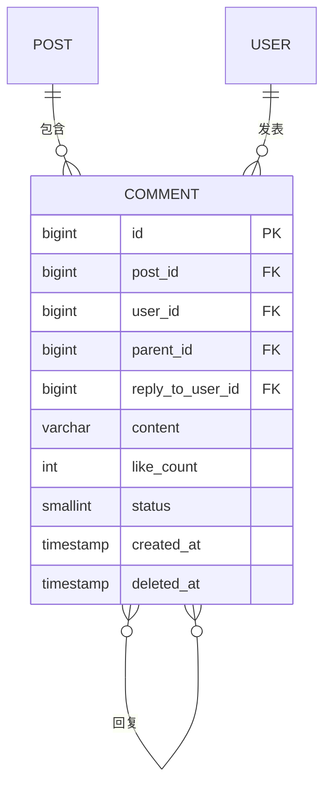
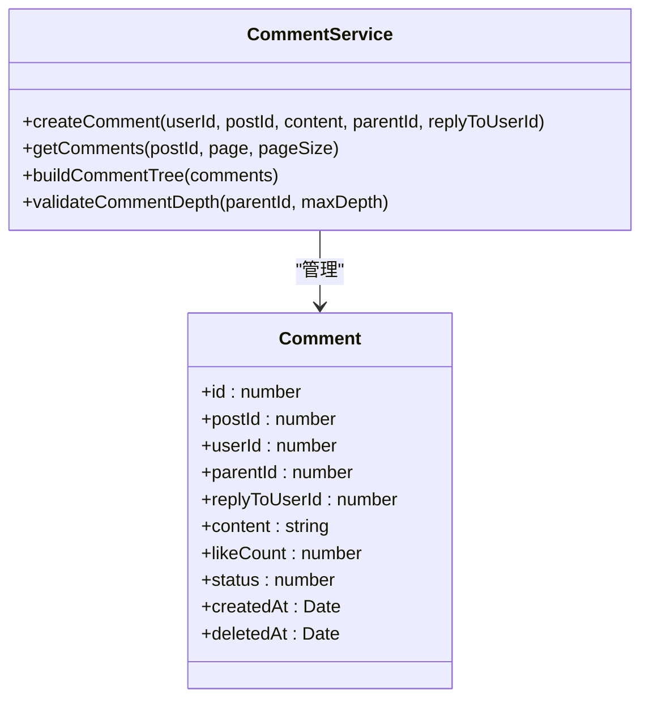
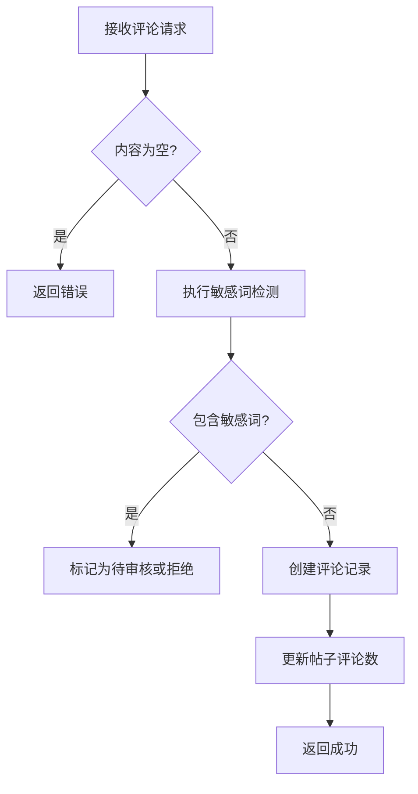
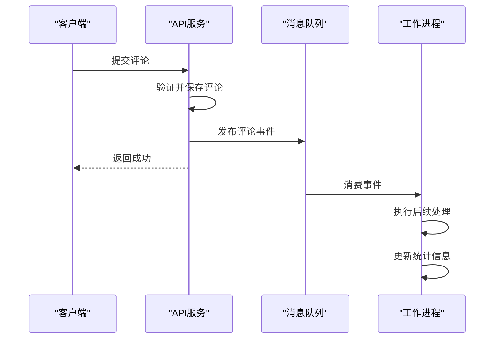
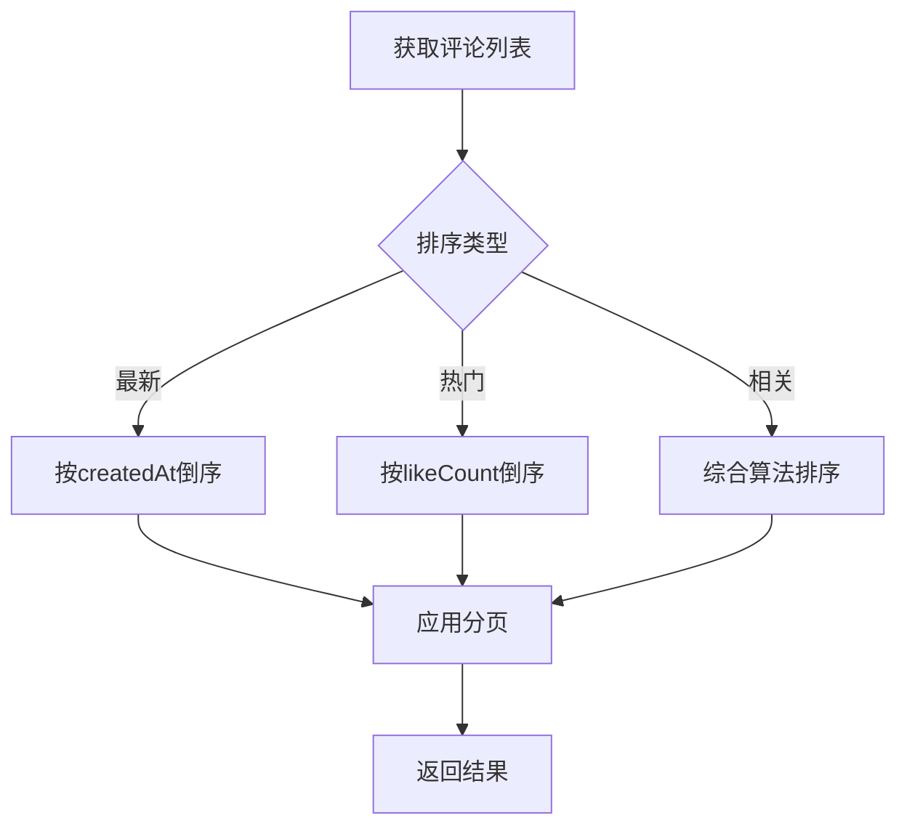
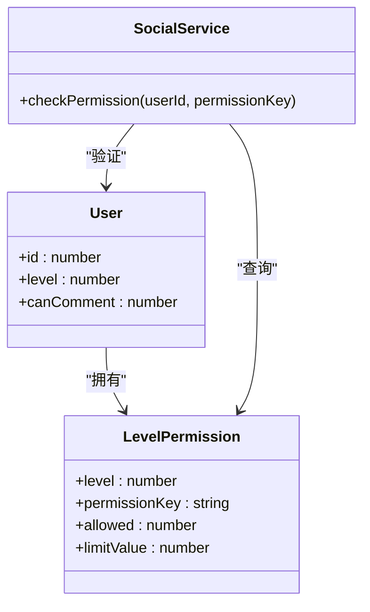
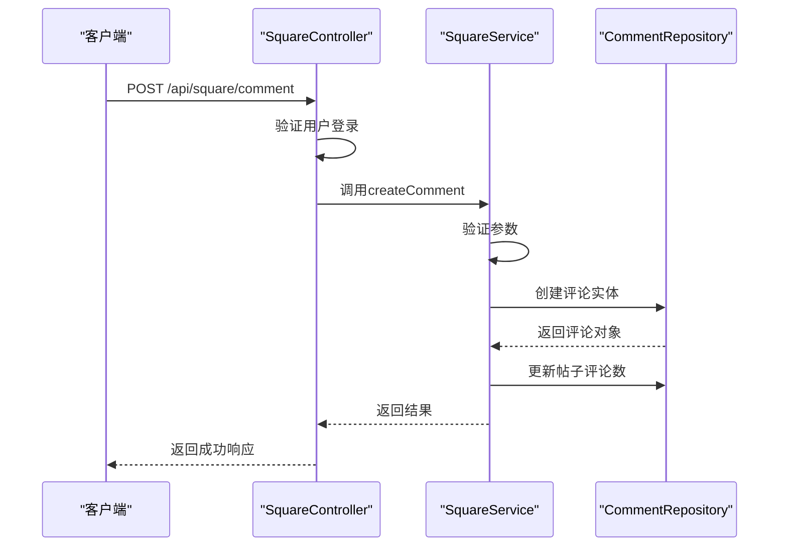

# 评论系统

<cite>
**本文档引用文件**  
- [comment.entity.ts](file://agx-backend/src/entities/comment.entity.ts)
- [square.service.ts](file://agx-backend/src/modules/square/square.service.ts)
- [square.controller.ts](file://agx-backend/src/modules/square/square.controller.ts)
- [social-migration.sql](file://agx-backend/social-migration.sql)
- [userPost.vue](file://agx-admin/src/views/agx/userPost.vue)
</cite>

## 目录
1. [引言](#引言)
2. [评论实体设计](#评论实体设计)
3. [多级嵌套结构实现](#多级嵌套结构实现)
4. [评论内容存储与审核](#评论内容存储与审核)
5. [高并发性能优化](#高并发性能优化)
6. [评论查询与排序](#评论查询与排序)
7. [防刷机制与权限控制](#防刷机制与权限控制)
8. [评论操作实现](#评论操作实现)
9. [总结](#总结)

## 引言

本系统实现了一个完整的社交评论功能，支持多级嵌套评论、点赞、审核等核心功能。评论系统与帖子、用户、权限等模块紧密集成，提供了高性能、可扩展的解决方案。系统采用TypeORM进行数据持久化，通过NestJS框架构建RESTful API，实现了前后端分离的架构设计。

## 评论实体设计

评论系统的核心是`Comment`实体，该实体定义了评论的所有属性和关系。实体采用关系型数据库设计，通过外键关联帖子和用户。



**图源**  
- [comment.entity.ts](file://agx-backend/src/entities/comment.entity.ts#L1-L48)

**本节来源**  
- [comment.entity.ts](file://agx-backend/src/entities/comment.entity.ts#L1-L48)

## 多级嵌套结构实现

评论系统支持无限层级的嵌套回复，通过`parentId`字段实现树形结构。每个评论可以引用其父评论，形成多级对话。

### 父评论ID设计

`parentId`字段是实现多级嵌套的核心，其设计特点包括：

- **可为空**：顶级评论的`parentId`为null
- **外键约束**：指向同一表的`id`字段，确保引用完整性
- **索引优化**：创建`idx_parent_id`索引，加速父子关系查询

### 层级深度控制

系统通过服务层逻辑控制评论层级深度，防止过深的嵌套影响用户体验和性能。



**图源**  
- [square.service.ts](file://agx-backend/src/modules/square/square.service.ts#L165-L181)
- [comment.entity.ts](file://agx-backend/src/entities/comment.entity.ts#L1-L48)

**本节来源**  
- [square.service.ts](file://agx-backend/src/modules/square/square.service.ts#L165-L181)
- [comment.entity.ts](file://agx-backend/src/entities/comment.entity.ts#L1-L48)

## 评论内容存储与审核

### 存储策略

评论内容采用以下存储策略：

- **内容字段**：`content`字段使用`varchar(1000)`，限制单条评论长度
- **状态管理**：`status`字段控制评论可见性（0隐藏，1正常）
- **软删除**：通过`deletedAt`字段实现软删除，保留数据完整性

### 审核机制

系统实现了完善的审核机制，确保内容合规：

- **自动审核**：通过敏感词过滤系统自动检测违规内容
- **人工审核**：管理员可在后台对评论进行审核管理
- **状态流转**：评论经历"待审核→正常/隐藏"的状态变化

### 敏感词过滤流程

敏感词过滤在评论创建时执行，流程如下：



**图源**  
- [square.service.ts](file://agx-backend/src/modules/square/square.service.ts#L165-L181)

**本节来源**  
- [square.service.ts](file://agx-backend/src/modules/square/square.service.ts#L165-L181)
- [social-migration.sql](file://agx-backend/social-migration.sql#L176-L177)

## 高并发性能优化

### 消息队列异步处理

为应对高并发场景，系统采用异步处理模式：

- **发布订阅模式**：评论创建事件发布到消息队列
- **后台任务处理**：由消费者服务异步处理通知、统计等耗时操作
- **解耦系统组件**：降低API响应时间，提高系统吞吐量

### 数据库优化

数据库层面实施了多项优化措施：

- **索引优化**：为`postId`、`userId`、`parentId`等常用查询字段创建索引
- **计数器优化**：使用数据库原子操作更新点赞数和评论数
- **批量操作**：支持批量评论处理，减少数据库交互次数



**图源**  
- [square.service.ts](file://agx-backend/src/modules/square/square.service.ts#L175-L178)
- [square.controller.ts](file://agx-backend/src/modules/square/square.controller.ts#L80-L93)

**本节来源**  
- [square.service.ts](file://agx-backend/src/modules/square/square.service.ts#L175-L178)
- [square.controller.ts](file://agx-backend/src/modules/square/square.controller.ts#L80-L93)

## 评论查询与排序

### 分页查询优化

评论列表采用分页查询，优化用户体验和性能：

- **分页参数**：支持`page`和`pageSize`参数控制分页
- **游标分页**：基于创建时间的游标分页，避免深度分页性能问题
- **总数统计**：提供评论总数，支持分页导航

### 热门评论排序算法

系统实现了多种排序策略：

- **时间排序**：按创建时间倒序，最新评论优先
- **热度排序**：基于点赞数和时间的复合算法
- **相关性排序**：考虑用户关系的个性化排序



**图源**  
- [square.service.ts](file://agx-backend/src/modules/square/square.service.ts#L186-L195)

**本节来源**  
- [square.service.ts](file://agx-backend/src/modules/square/square.service.ts#L186-L195)

## 防刷机制与权限控制

### 功能开关控制

系统通过功能开关控制评论相关功能：

```sql
INSERT INTO agx_system_toggle (key, name, module, enabled, description, sort)
VALUES 
    ('allow_post', '允许发帖', 'social', 1, '是否允许用户发帖', 1),
    ('allow_comment', '允许评论', 'social', 1, '是否允许用户评论', 2),
    ('allow_like', '允许点赞', 'social', 1, '是否允许用户点赞', 3)
ON CONFLICT (key) DO NOTHING;
```

### 用户权限管理

基于用户等级的权限控制：

- **等级权限**：不同用户等级有不同的评论权限
- **行为限制**：限制单位时间内的评论数量
- **状态控制**：管理员可禁用用户的评论功能



**图源**  
- [social-migration.sql](file://agx-backend/social-migration.sql#L176-L177)
- [userPost.vue](file://agx-admin/src/views/agx/userPost.vue#L77-L84)

**本节来源**  
- [social-migration.sql](file://agx-backend/social-migration.sql#L176-L177)
- [userPost.vue](file://agx-admin/src/views/agx/userPost.vue#L77-L84)

## 评论操作实现

### 创建评论

创建评论的API流程：



**图源**  
- [square.controller.ts](file://agx-backend/src/modules/square/square.controller.ts#L80-L93)
- [square.service.ts](file://agx-backend/src/modules/square/square.service.ts#L165-L181)

**本节来源**  
- [square.controller.ts](file://agx-backend/src/modules/square/square.controller.ts#L80-L93)
- [square.service.ts](file://agx-backend/src/modules/square/square.service.ts#L165-L181)

### 回复评论

回复评论时需要指定`parentId`和`replyToUserId`：

- **parentId**：被回复评论的ID
- **replyToUserId**：被回复用户的ID
- **内容格式**：系统可选择是否在前端显示"回复@用户名"

### 删除评论

删除评论采用软删除机制：

- **标记删除**：设置`deletedAt`字段为当前时间
- **状态更新**：前端根据`deletedAt`字段决定是否显示
- **级联处理**：子评论的处理策略（保留或一并删除）

## 总结

本评论系统实现了完整的多级嵌套评论功能，具有以下特点：

1. **结构清晰**：通过`parentId`实现树形结构，支持无限层级回复
2. **性能优化**：采用异步处理和索引优化，应对高并发场景
3. **安全可控**：完善的审核机制和权限控制，确保内容安全
4. **用户体验**：多种排序算法和分页策略，提升用户交互体验

系统设计考虑了可扩展性和维护性，为未来的功能迭代奠定了良好基础。