# 社交模型

<cite>
**本文档引用的文件**  
- [post.entity.ts](file://agx-backend/src/entities/post.entity.ts)
- [comment.entity.ts](file://agx-backend/src/entities/comment.entity.ts)
- [like.entity.ts](file://agx-backend/src/entities/like.entity.ts)
- [topic.entity.ts](file://agx-backend/src/entities/topic.entity.ts)
- [follow.entity.ts](file://agx-backend/src/entities/follow.entity.ts)
- [conversation.entity.ts](file://agx-backend/src/entities/conversation.entity.ts)
- [message.entity.ts](file://agx-backend/src/entities/message.entity.ts)
- [user.entity.ts](file://agx-backend/src/entities/user.entity.ts)
- [social.service.ts](file://agx-backend/src/modules/social/social.service.ts)
- [social.controller.ts](file://agx-backend/src/modules/social/social.controller.ts)
- [system-toggle.entity.ts](file://agx-backend/src/entities/system-toggle.entity.ts)
- [level-permission.entity.ts](file://agx-backend/src/entities/level-permission.entity.ts)
- [schema.sql](file://agx-backend/schema.sql)
</cite>

## 目录
1. [简介](#简介)
2. [内容发布实体](#内容发布实体)
3. [社交互动实体](#社交互动实体)
4. [通信实体](#通信实体)
5. [社交图谱与关注机制](#社交图谱与关注机制)
6. [内容审核与状态管理](#内容审核与状态管理)
7. [社交互动计数器实现](#社交互动计数器实现)
8. [高并发场景性能优化](#高并发场景性能优化)
9. [隐私保护与内容安全](#隐私保护与内容安全)
10. [功能开关与权限控制](#功能开关与权限控制)

## 简介
本文档详细描述了社交数据模型的核心设计，涵盖内容发布、用户互动和消息通信三大模块。系统通过Post、Comment、Like等实体构建内容生态，通过Follow、Conversation、Message等实体实现用户通信，同时包含Topic话题系统和完整的社交图谱。文档还阐述了内容审核机制、高并发处理策略、隐私保护措施和权限控制系统，为社交功能的稳定运行提供全面保障。

## 内容发布实体

### Post实体结构
Post实体是内容发布的核心，存储用户发布的帖子信息。该实体包含丰富的元数据，支持内容展示、排序和审核。

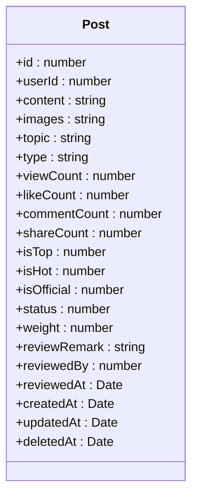

**图表来源**  
- [post.entity.ts](file://agx-backend/src/entities/post.entity.ts#L1-L80)

**本节来源**  
- [post.entity.ts](file://agx-backend/src/entities/post.entity.ts#L1-L80)
- [schema.sql](file://agx-backend/schema.sql#L250-L263)

### Post实体字段说明
| 字段名 | 类型 | 说明 |
|--------|------|------|
| postId | bigint | 帖子唯一标识符 |
| userId | bigint | 发帖用户ID |
| content | text | 帖子内容 |
| images | varchar | 图片URL数组的JSON字符串 |
| topic | varchar | 话题标签（如 #BTC） |
| type | varchar | 帖子类型：normal=普通, news=快讯, analysis=分析 |
| status | smallint | 状态：-1已下架, 0审核中, 1正常 |
| viewCount | int | 浏览数 |
| likeCount | int | 点赞数 |
| commentCount | int | 评论数 |
| shareCount | int | 分享数 |
| isTop | smallint | 是否置顶：0否, 1是 |
| isHot | smallint | 是否热门：0否, 1是 |
| isOfficial | smallint | 是否官方：0否, 1是 |
| weight | int | 权重分值（用于推荐和热度排序） |
| reviewRemark | varchar | 审核备注 |
| reviewedBy | bigint | 审核人ID |
| reviewedAt | timestamp | 审核时间 |

## 社交互动实体

### Comment评论实体
Comment实体用于存储用户对帖子的评论信息，支持多级评论结构。

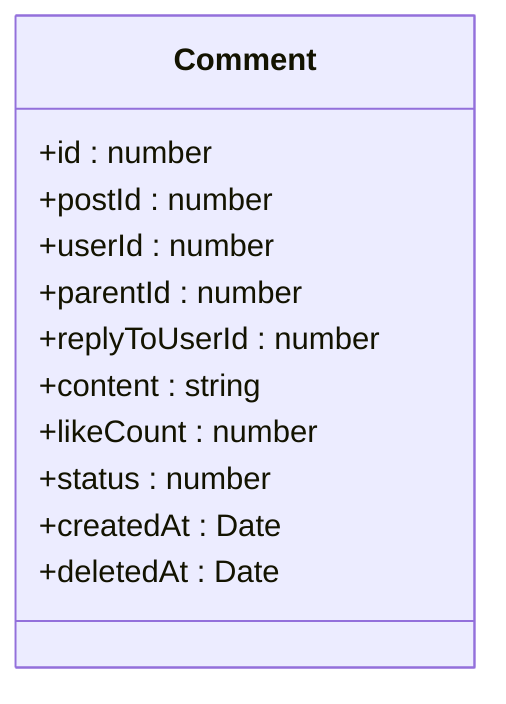

**图表来源**  
- [comment.entity.ts](file://agx-backend/src/entities/comment.entity.ts#L1-L48)

**本节来源**  
- [comment.entity.ts](file://agx-backend/src/entities/comment.entity.ts#L1-L48)
- [schema.sql](file://agx-backend/schema.sql#L267-L281)

### Like点赞实体
Like实体实现对帖子和评论的点赞功能，通过target_type和target_id实现多目标支持。

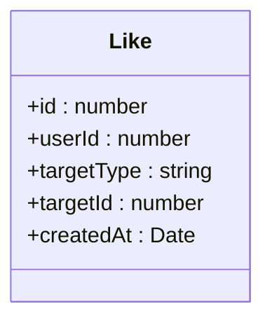

**图表来源**  
- [like.entity.ts](file://agx-backend/src/entities/like.entity.ts#L1-L34)

**本节来源**  
- [like.entity.ts](file://agx-backend/src/entities/like.entity.ts#L1-L34)
- [schema.sql](file://agx-backend/schema.sql#L282-L290)

### Topic话题实体
Topic实体管理热门话题，支持话题标签的发现和聚合。

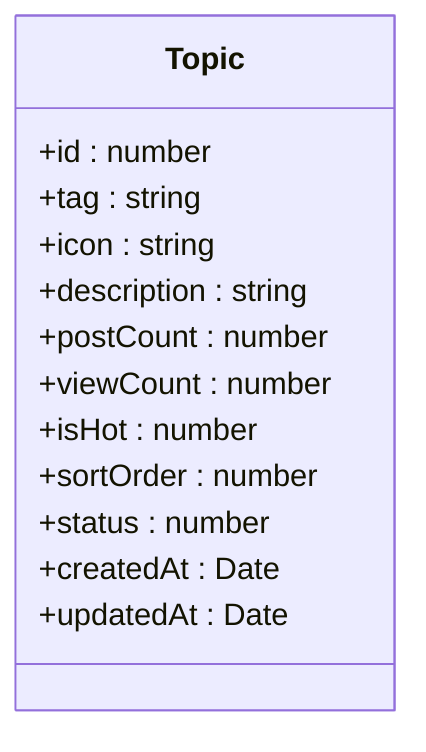

**图表来源**  
- [topic.entity.ts](file://agx-backend/src/entities/topic.entity.ts#L1-L49)

**本节来源**  
- [topic.entity.ts](file://agx-backend/src/entities/topic.entity.ts#L1-L49)
- [schema.sql](file://agx-backend/schema.sql#L282-L290)

## 通信实体

### Conversation会话实体
Conversation实体表示用户之间的私聊会话，采用用户ID排序存储，确保每对用户只有一个会话记录。

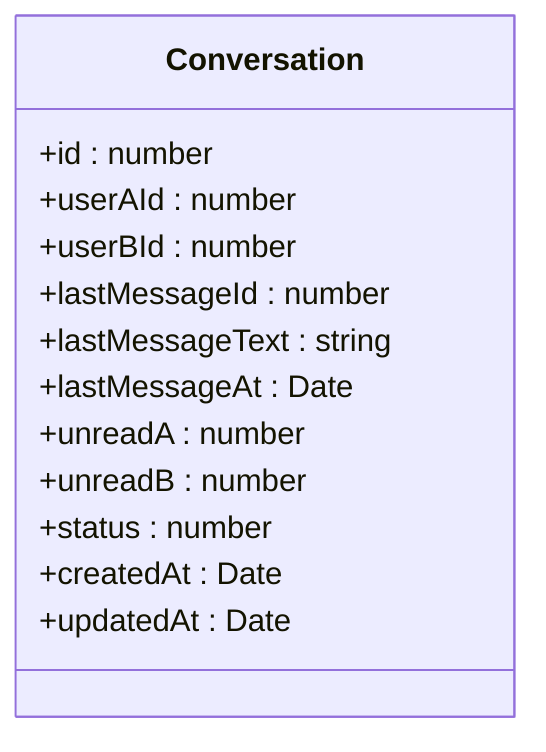

**图表来源**  
- [conversation.entity.ts](file://agx-backend/src/entities/conversation.entity.ts#L1-L52)

**本节来源**  
- [conversation.entity.ts](file://agx-backend/src/entities/conversation.entity.ts#L1-L52)
- [schema.sql](file://agx-backend/schema.sql#L282-L290)

### Message消息实体
Message实体存储会话中的具体消息内容，包含消息类型、内容和状态信息。

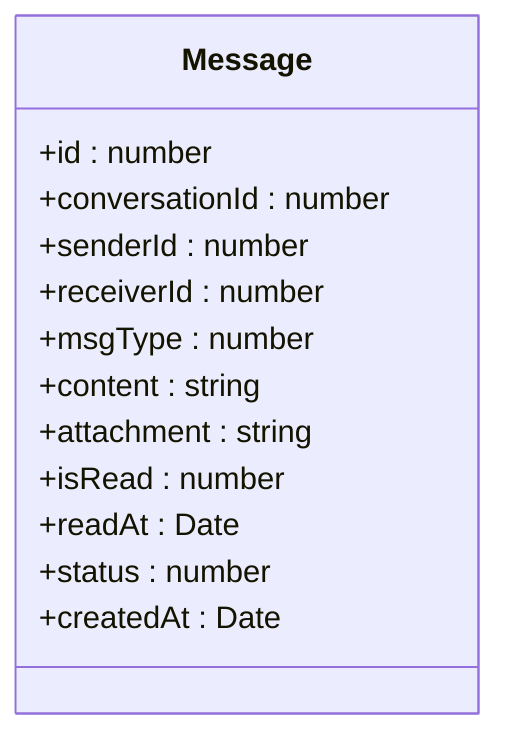

**图表来源**  
- [message.entity.ts](file://agx-backend/src/entities/message.entity.ts#L1-L51)

**本节来源**  
- [message.entity.ts](file://agx-backend/src/entities/message.entity.ts#L1-L51)
- [schema.sql](file://agx-backend/schema.sql#L282-L290)

## 社交图谱与关注机制

### Follow关注实体
Follow实体记录用户之间的关注关系，是构建社交图谱的基础。

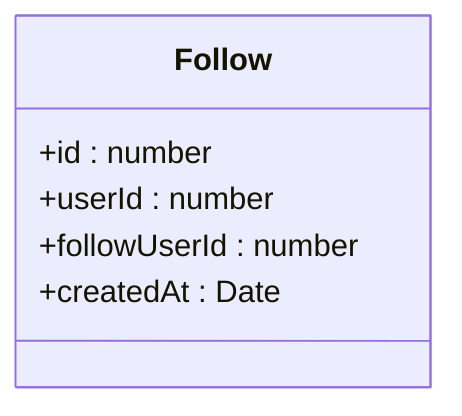

**图表来源**  
- [follow.entity.ts](file://agx-backend/src/entities/follow.entity.ts#L1-L30)

**本节来源**  
- [follow.entity.ts](file://agx-backend/src/entities/follow.entity.ts#L1-L30)
- [schema.sql](file://agx-backend/schema.sql#L282-L290)

### 用户社交状态
User实体包含丰富的社交状态字段，支持精细化的社交功能控制。

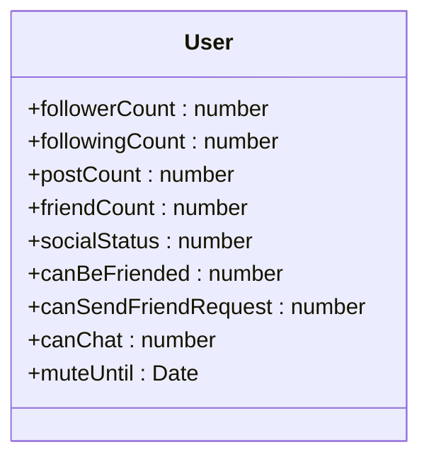

**图表来源**  
- [user.entity.ts](file://agx-backend/src/entities/user.entity.ts#L1-L118)

**本节来源**  
- [user.entity.ts](file://agx-backend/src/entities/user.entity.ts#L1-L118)

## 内容审核与状态管理

### 内容状态流转
Post实体通过status字段实现内容状态的完整生命周期管理。

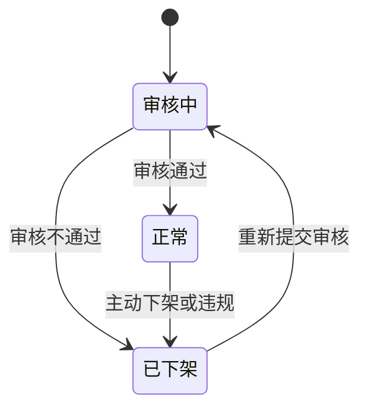

**本节来源**  
- [post.entity.ts](file://agx-backend/src/entities/post.entity.ts#L56-L58)

### 审核信息记录
系统记录详细的审核信息，包括审核人、审核时间和审核备注。

| 审核字段 | 类型 | 说明 |
|---------|------|------|
| status | smallint | 内容状态 |
| reviewRemark | varchar | 审核备注 |
| reviewedBy | bigint | 审核人ID |
| reviewedAt | timestamp | 审核时间 |

## 社交互动计数器实现

### 计数器更新机制
系统采用直接更新计数器字段的方式，确保数据一致性。

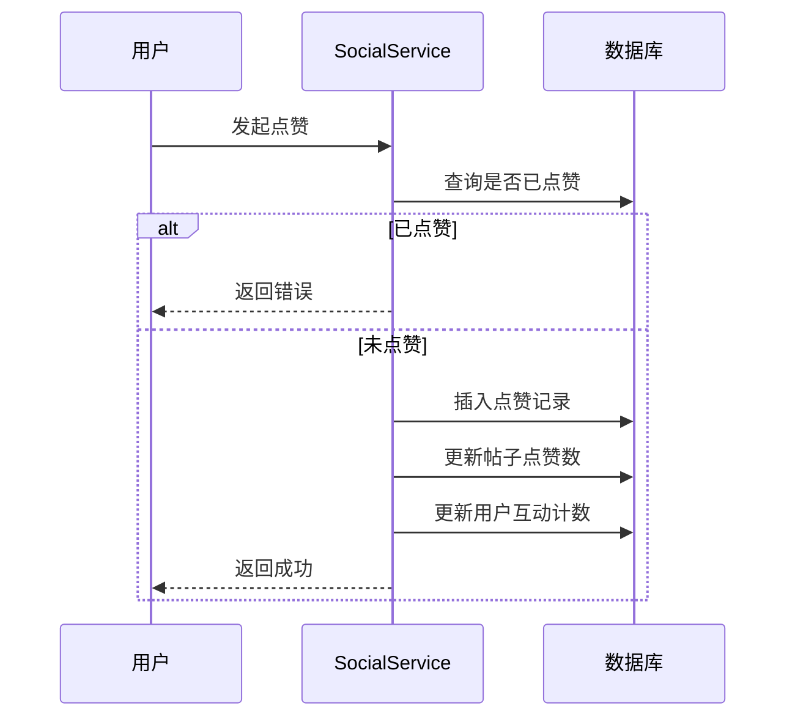

**图表来源**  
- [social.service.ts](file://agx-backend/src/modules/social/social.service.ts#L1-L421)

**本节来源**  
- [social.service.ts](file://agx-backend/src/modules/social/social.service.ts#L1-L421)

### 计数器字段
| 实体 | 计数器字段 | 说明 |
|------|-----------|------|
| Post | likeCount | 点赞数 |
| Post | commentCount | 评论数 |
| Post | shareCount | 分享数 |
| Post | viewCount | 浏览数 |
| Topic | postCount | 帖子数量 |
| Topic | viewCount | 浏览数 |
| User | followerCount | 粉丝数 |
| User | followingCount | 关注数 |
| User | postCount | 帖子数 |
| User | friendCount | 好友数 |
| Conversation | unreadA | 用户A未读数 |
| Conversation | unreadB | 用户B未读数 |

## 高并发场景性能优化

### 点赞防重机制
系统通过数据库联合唯一索引防止重复点赞。

```sql
-- 在数据库层面创建联合唯一索引
CREATE UNIQUE INDEX idx_user_target ON agx_like (user_id, target_type, target_id);
```

**本节来源**  
- [like.entity.ts](file://agx-backend/src/entities/like.entity.ts#L32-L34)
- [schema.sql](file://agx-backend/schema.sql#L289)

### 评论性能优化
评论表设计考虑了查询性能，通过索引优化常见查询场景。

```sql
-- 为常见查询字段创建索引
CREATE INDEX idx_comment_post ON agx_comment(post_id);
CREATE INDEX idx_comment_user ON agx_comment(user_id);
CREATE INDEX idx_comment_parent ON agx_comment(parent_id);
```

**本节来源**  
- [comment.entity.ts](file://agx-backend/src/entities/comment.entity.ts#L19-L28)
- [schema.sql](file://agx-backend/schema.sql#L280)

## 隐私保护与内容安全

### 用户隐私控制
系统提供多维度的隐私控制选项，用户可自主设置社交权限。

| 隐私设置 | 字段 | 取值 | 说明 |
|---------|------|------|------|
| 被加好友 | canBeFriended | 0/1 | 是否允许被其他用户添加为好友 |
| 发起好友请求 | canSendFriendRequest | 0/1 | 是否允许向其他用户发送好友请求 |
| 私聊 | canChat | 0/1 | 是否允许接收私聊消息 |
| 社交状态 | socialStatus | 1/0/-1 | 1正常, 0禁言, -1社交封禁 |
| 禁言截止时间 | muteUntil | timestamp | 禁言状态的结束时间 |

**本节来源**  
- [user.entity.ts](file://agx-backend/src/entities/user.entity.ts#L84-L101)

### 内容安全过滤
系统通过功能开关和权限控制实现内容安全。

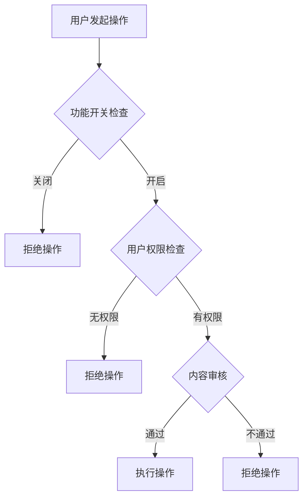

**本节来源**  
- [social.service.ts](file://agx-backend/src/modules/social/social.service.ts#L37-L54)

## 功能开关与权限控制

### 系统功能开关
SystemToggle实体实现全局功能的动态开关控制。

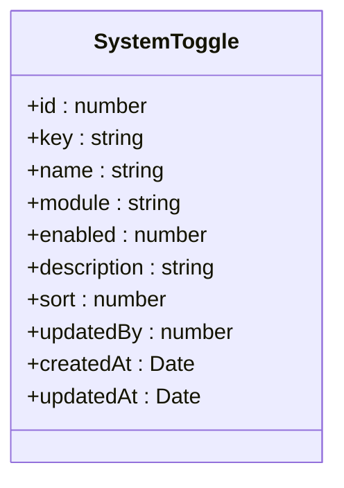

**图表来源**  
- [system-toggle.entity.ts](file://agx-backend/src/entities/system-toggle.entity.ts#L1-L48)

**本节来源**  
- [system-toggle.entity.ts](file://agx-backend/src/entities/system-toggle.entity.ts#L1-L48)

### 等级权限矩阵
LevelPermission实体定义不同等级用户的权限和限制。

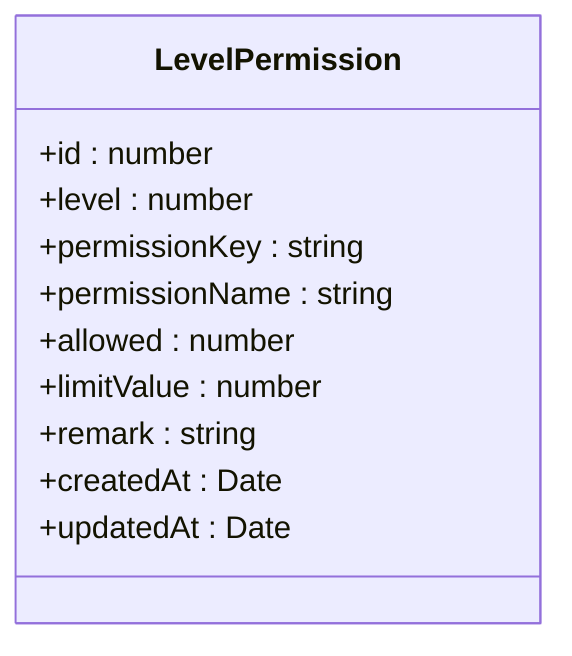

**图表来源**  
- [level-permission.entity.ts](file://agx-backend/src/entities/level-permission.entity.ts#L1-L46)

**本节来源**  
- [level-permission.entity.ts](file://agx-backend/src/entities/level-permission.entity.ts#L1-L46)

### 权限检查流程
系统在执行敏感操作前进行权限验证。

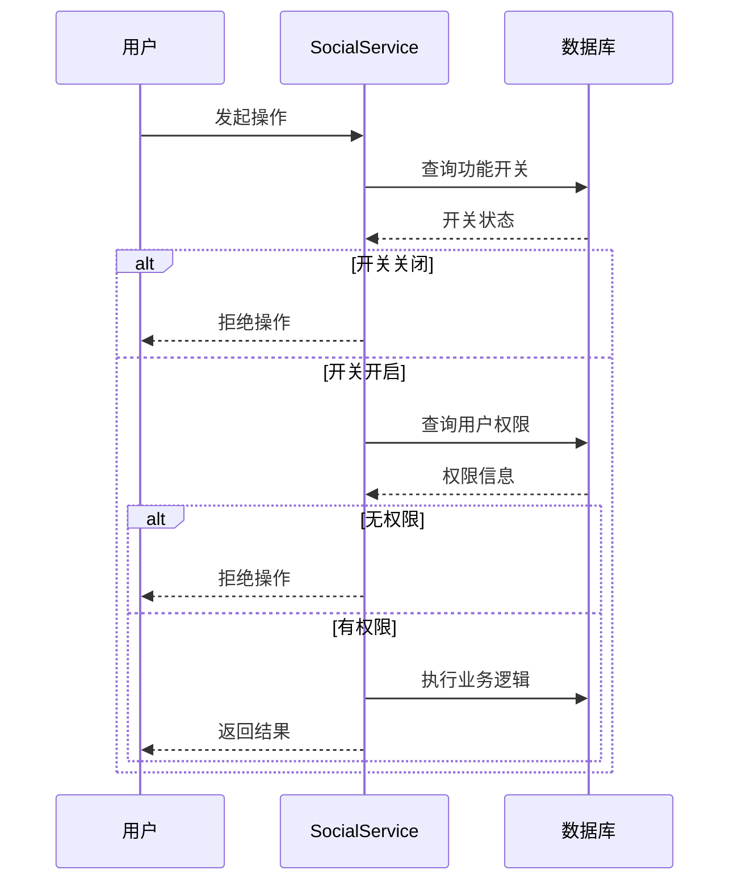

**本节来源**  
- [social.service.ts](file://agx-backend/src/modules/social/social.service.ts#L37-L54)
- [social.service.ts](file://agx-backend/src/modules/social/social.service.ts#L42-L54)