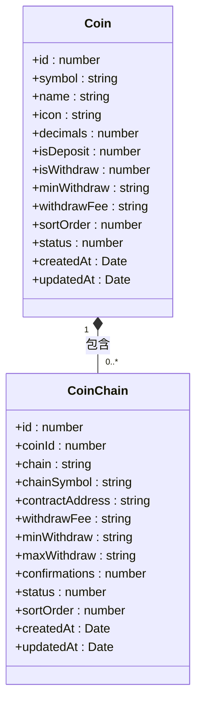
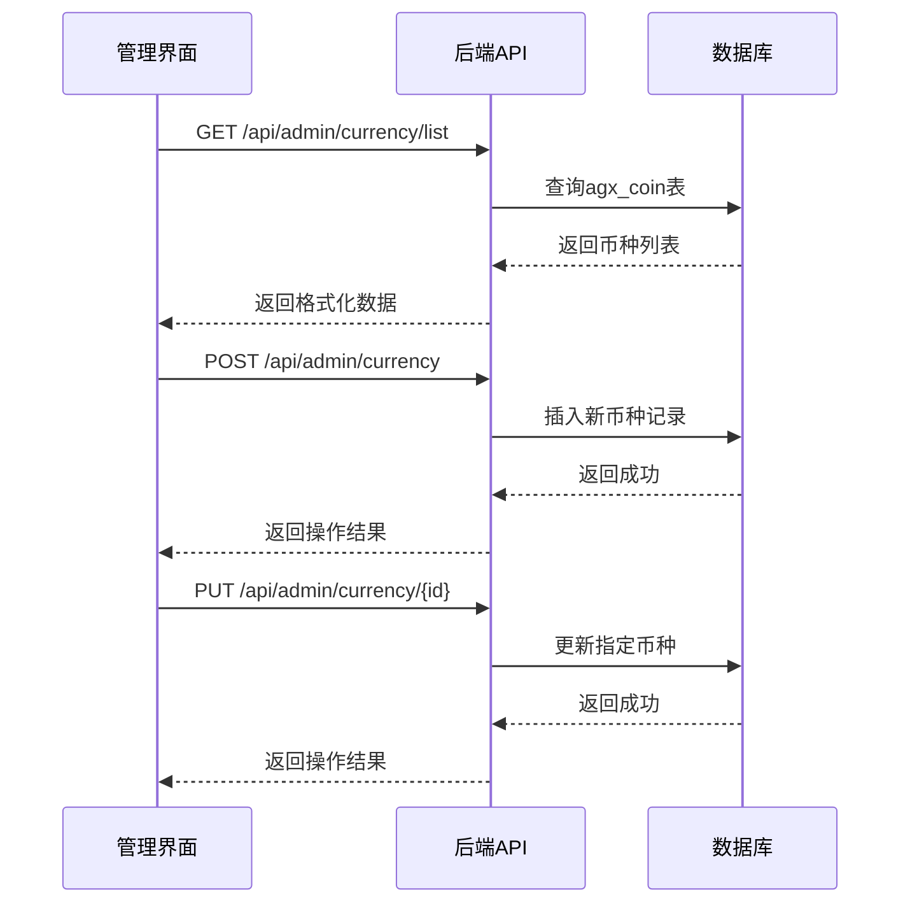

# 币种管理

<cite>
**本文档引用文件**  
- [coin.entity.ts](file://agx-backend/src/entities/coin.entity.ts)
- [coin-chain.entity.ts](file://agx-backend/src/entities/coin-chain.entity.ts)
- [admin.service.ts](file://agx-backend/src/modules/admin/admin.service.ts)
- [admin.controller.ts](file://agx-backend/src/modules/admin/admin.controller.ts)
- [index.js](file://agx-admin/src/api/agx/index.js)
- [coinChain.vue](file://agx-admin/src/views/agx/coinChain.vue)
</cite>

## 目录
1. [引言](#引言)
2. [核心实体分析](#核心实体分析)
3. [币种实体字段详解](#币种实体字段详解)
4. [币种精度与状态的业务影响](#币种精度与状态的业务影响)
5. [管理界面与API交互逻辑](#管理界面与api交互逻辑)
6. [多币种系统支持与资产关联](#多币种系统支持与资产关联)
7. [缓存策略与数据一致性](#缓存策略与数据一致性)

## 引言
币种管理是多币种交易系统的核心组成部分，负责维护所有支持的数字货币及其配置信息。本系统通过`Coin`实体管理基础币种信息，并通过`CoinChain`实体管理同一币种在不同区块链网络上的配置。该设计支持一个币种（如USDT）在多个链（如ERC20、TRC20）上运行，满足了现代加密货币交易所的复杂需求。

## 核心实体分析

**图示来源**  
- [coin.entity.ts](file://agx-backend/src/entities/coin.entity.ts)
- [coin-chain.entity.ts](file://agx-backend/src/entities/coin-chain.entity.ts)

**本节来源**  
- [coin.entity.ts](file://agx-backend/src/entities/coin.entity.ts#L10-L52)
- [coin-chain.entity.ts](file://agx-backend/src/entities/coin-chain.entity.ts#L12-L57)

## 币种实体字段详解

`Coin`实体定义了币种的核心属性，每个字段都有明确的业务含义和数据类型约束。

| 字段名 | 数据类型 | 约束 | 说明 |
|--------|---------|------|------|
| id | number | 主键，自增 | 币种唯一标识 |
| symbol | string | varchar(20)，唯一索引 | 币种符号，如BTC、USDT |
| name | string | varchar(50) | 币种全称，如比特币、泰达币 |
| icon | string | varchar(255)，可为空 | 图标URL地址 |
| decimals | number | smallint，默认8 | 小数位数，影响资产计算精度 |
| isDeposit | number | smallint，默认1 | 是否可充值（1是，0否） |
| isWithdraw | number | smallint，默认1 | 是否可提现（1是，0否） |
| minWithdraw | string | decimal(20,8)，默认0 | 最小提现金额 |
| withdrawFee | string | decimal(20,8)，默认0 | 提现手续费 |
| sortOrder | number | int，默认0 | 排序值，用于前端展示顺序 |
| status | number | smallint，默认1 | 状态（1启用，0禁用） |
| createdAt | Date | timestamp | 创建时间 |
| updatedAt | Date | timestamp | 更新时间 |

**本节来源**  
- [coin.entity.ts](file://agx-backend/src/entities/coin.entity.ts#L10-L52)

## 币种精度与状态的业务影响

### 币种精度（decimals）对资产计算的影响
币种精度`decimals`字段决定了该币种在系统中可以支持的最小单位。例如，当`decimals=8`时，系统可以精确到0.00000001个单位，这对于比特币等高价值加密货币至关重要。在资产计算中，所有金额运算都必须考虑精度设置，以避免舍入误差。系统使用`string`类型存储金额（如`minWithdraw`、`withdrawFee`），而非`number`，以防止JavaScript浮点数精度问题。

### 币种状态对交易流程的影响
币种状态`status`字段直接控制该币种是否可用于交易。当`status=0`（禁用）时，系统将：
- 禁止用户进行该币种的充值和提现操作
- 在交易市场中隐藏该币种的交易对
- 阻止新的交易订单创建

同时，`isDeposit`和`isWithdraw`字段提供了更细粒度的控制，允许单独开启或关闭充值和提现功能，这在维护或风险控制时非常有用。

**本节来源**  
- [coin.entity.ts](file://agx-backend/src/entities/coin.entity.ts#L25-L44)
- [admin.service.ts](file://agx-backend/src/modules/admin/admin.service.ts#L123-L165)

## 管理界面与API交互逻辑

### 前后端交互流程
币种管理的前后端交互遵循标准的RESTful API模式，管理员通过前端界面操作，后端提供相应的CRUD接口。

**图示来源**  
- [admin.controller.ts](file://agx-backend/src/modules/admin/admin.controller.ts)
- [index.js](file://agx-admin/src/api/agx/index.js)

**本节来源**  
- [admin.controller.ts](file://agx-backend/src/modules/admin/admin.controller.ts#L32-L87)
- [index.js](file://agx-admin/src/api/agx/index.js#L29-L67)

## 多币种系统支持与资产关联

### 多链支持架构
系统通过`Coin`和`CoinChain`两个实体的关联关系实现多链支持。`Coin`实体代表一个逻辑币种（如USDT），而`CoinChain`实体代表该币种在特定区块链上的实现（如USDT-ERC20、USDT-TRC20）。这种设计允许系统灵活地支持同一币种的多种链类型，满足不同用户的网络偏好和手续费需求。

### 与资产实体的关联
币种实体与资产实体（Asset）通过`symbol`字段建立关联，支持多币种交易系统。资产实体不仅包含加密货币，还支持外汇、股票、贵金属等多种资产类型，通过`assetType`字段进行区分。这种设计使得系统能够统一管理不同类型的金融产品，为用户提供综合性的交易体验。

**本节来源**  
- [coin.entity.ts](file://agx-backend/src/entities/coin.entity.ts)
- [coin-chain.entity.ts](file://agx-backend/src/entities/coin-chain.entity.ts)
- [asset.entity.ts](file://agx-backend/src/entities/asset.entity.ts)

## 缓存策略与数据一致性

### 数据缓存机制
系统采用多层缓存策略确保币种数据的高性能访问：
1. **内存缓存**：常用币种列表在应用启动时加载到内存中，减少数据库查询
2. **Redis缓存**：频繁访问的币种配置信息存储在Redis中，支持快速读取
3. **浏览器缓存**：前端对币种列表进行本地缓存，减少重复请求

### 数据一致性维护
为确保数据一致性，系统实施以下机制：
- **数据库事务**：币种的创建、更新操作使用数据库事务，确保数据完整性
- **缓存失效**：当币种信息更新时，自动清除相关缓存，保证数据新鲜度
- **唯一约束**：`symbol`字段设置唯一索引，防止重复币种的创建
- **业务规则验证**：在服务层进行业务规则验证，如检查symbol是否已存在

这些机制共同确保了币种配置的准确性和系统的稳定性。

**本节来源**  
- [admin.service.ts](file://agx-backend/src/modules/admin/admin.service.ts)
- [coin.entity.ts](file://agx-backend/src/entities/coin.entity.ts)