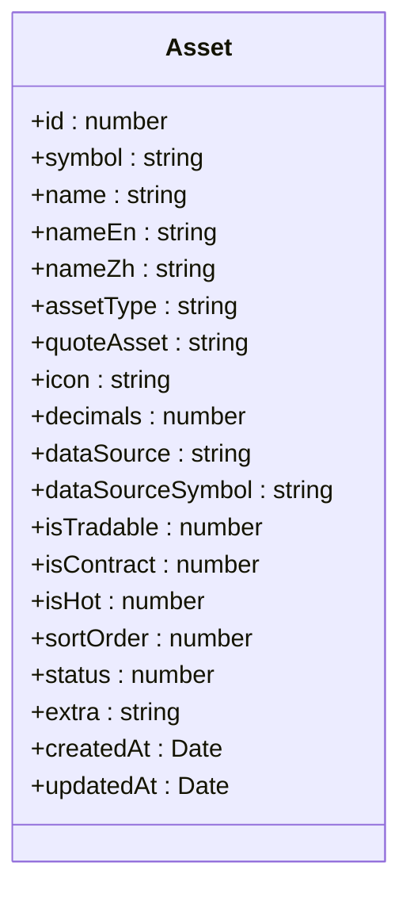
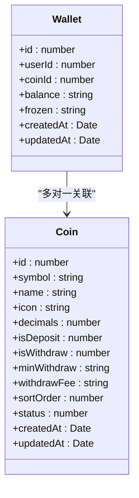
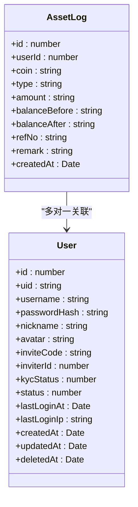
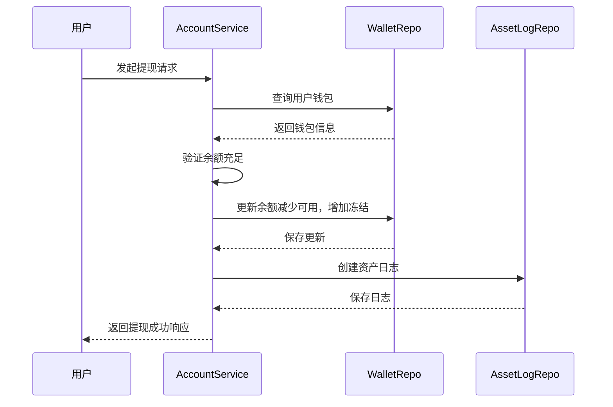
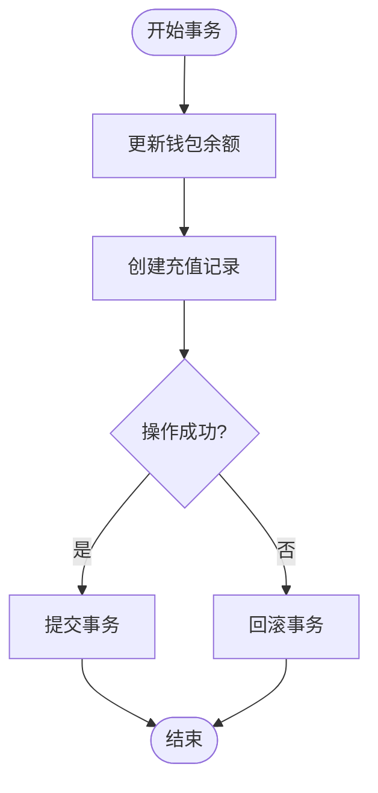
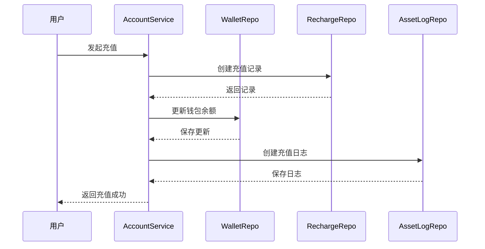
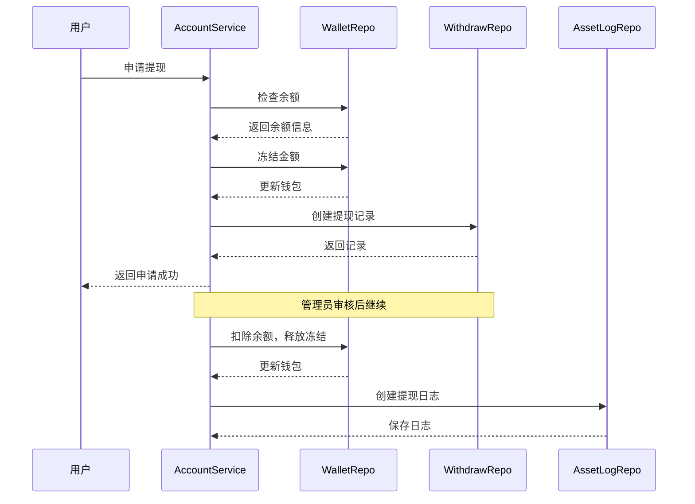
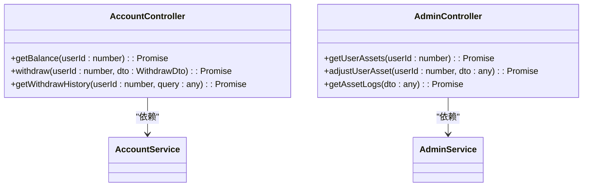

# 核心资产

<cite>
**本文档引用的文件**
- [asset.entity.ts](file://agx-backend/src/entities/asset.entity.ts)
- [wallet.entity.ts](file://agx-backend/src/entities/wallet.entity.ts)
- [asset-log.entity.ts](file://agx-backend/src/entities/asset-log.entity.ts)
- [account.service.ts](file://agx-backend/src/modules/account/account.service.ts)
- [admin.service.ts](file://agx-backend/src/modules/admin/admin.service.ts)
- [schema.sql](file://agx-backend/schema.sql)
</cite>

## 目录
1. [简介](#简介)
2. [核心资产实体定义](#核心资产实体定义)
3. [资产余额管理机制](#资产余额管理机制)
4. [数据一致性保障](#数据一致性保障)
5. [核心业务流程中的资产实体](#核心业务流程中的资产实体)
6. [系统集成与服务交互](#系统集成与服务交互)
7. [性能优化与查询策略](#性能优化与查询策略)
8. [结论](#结论)

## 简介
本文档详细描述了AGX系统中的核心资产实体实现，重点关注资产配置、用户钱包、资产日志等关键数据结构。文档深入分析了资产余额与冻结余额的管理机制，以及如何通过数据库约束和业务逻辑保证数据一致性。同时，文档还涵盖了资产在交易、充值、提现等业务流程中的作用，以及与其他服务的集成方式，并提供了性能优化建议。

## 核心资产实体定义

### 资产配置实体 (Asset)
资产配置实体定义了系统支持的各种资产类型，包括加密货币、外汇、股票、贵金属、基金等。该实体存储了资产的基本信息和配置参数。



**图表来源**
- [asset.entity.ts](file://agx-backend/src/entities/asset.entity.ts#L1-L80)

### 用户钱包实体 (Wallet)
用户钱包实体是核心资产实体的关键组成部分，用于管理用户的资产余额。每个用户对每种币种都有一个独立的钱包记录。



**图表来源**
- [wallet.entity.ts](file://agx-backend/src/entities/wallet.entity.ts#L1-L41)

### 资产日志实体 (AssetLog)
资产日志实体记录了所有资产变动的历史，确保了资产操作的可追溯性和审计能力。



**图表来源**
- [asset-log.entity.ts](file://agx-backend/src/entities/asset-log.entity.ts#L1-L48)

**本节来源**
- [asset.entity.ts](file://agx-backend/src/entities/asset.entity.ts#L1-L80)
- [wallet.entity.ts](file://agx-backend/src/entities/wallet.entity.ts#L1-L41)
- [asset-log.entity.ts](file://agx-backend/src/entities/asset-log.entity.ts#L1-L48)

## 资产余额管理机制

### 可用余额与冻结余额
系统采用双余额机制来管理用户资产，包括可用余额（balance）和冻结余额（frozen）。这种设计确保了在交易、提现等操作中能够正确锁定资金，防止重复使用。

- **可用余额 (balance)**：用户可以自由使用的资产数量
- **冻结余额 (frozen)**：因交易、提现等操作而暂时锁定的资产数量

当用户发起提现申请时，系统会将相应金额从可用余额转移到冻结余额，确保资金不会被重复使用。提现成功后，冻结余额减少，同时总余额相应减少；若提现被拒绝或取消，冻结余额会返还到可用余额。

### 余额变动流程
以下是提现操作中余额管理的典型流程：



**图表来源**
- [account.service.ts](file://agx-backend/src/modules/account/account.service.ts#L433-L484)

### 并发安全处理
在多用户并发场景下，系统通过数据库事务和乐观锁机制来保证数据安全。所有余额更新操作都在事务中执行，确保了操作的原子性。

当多个请求同时尝试修改同一钱包记录时，数据库的行级锁会自动处理并发访问，防止数据竞争。此外，系统在更新余额时会基于当前余额值进行计算，而不是使用缓存值，确保了数据的一致性。

**本节来源**
- [account.service.ts](file://agx-backend/src/modules/account/account.service.ts#L433-L484)
- [admin.service.ts](file://agx-backend/src/modules/admin/admin.service.ts#L833-L843)

## 数据一致性保障

### 数据库约束
系统通过多种数据库约束来保证数据的完整性和一致性：

1. **唯一性约束**：钱包表中的`userId`和`coinId`组合具有唯一性索引，确保每个用户对每种币种只有一个钱包记录
2. **外键约束**：钱包表通过`coinId`字段与币种表关联，确保引用的币种存在
3. **非空约束**：关键字段如`userId`、`coinId`、`balance`等都设置为非空，防止数据缺失

### 业务逻辑验证
除了数据库层面的约束，系统还在业务逻辑层进行了多重验证：

- **余额充足验证**：在任何扣除余额的操作前，都会检查可用余额是否足够
- **状态验证**：检查用户和资产的状态是否允许进行特定操作
- **KYC验证**：在提现等敏感操作前，验证用户是否已完成实名认证

### 事务管理
所有涉及余额变动的操作都使用数据库事务来保证原子性。如果操作过程中发生任何错误，事务将回滚，确保数据不会处于不一致状态。

例如，在手动充值操作中，系统会同时更新用户钱包余额和创建充值记录，这两个操作在同一个事务中完成：



**图表来源**
- [admin.service.ts](file://agx-backend/src/modules/admin/admin.service.ts#L851-L878)

**本节来源**
- [wallet.entity.ts](file://agx-backend/src/entities/wallet.entity.ts#L14)
- [admin.service.ts](file://agx-backend/src/modules/admin/admin.service.ts#L833-L878)
- [schema.sql](file://agx-backend/schema.sql#L54-L63)

## 核心业务流程中的资产实体

### 充值流程
充值流程是资产进入系统的主要途径。当用户充值时，系统会：

1. 接收充值请求并验证参数
2. 创建充值记录
3. 更新用户钱包的可用余额
4. 记录资产变动日志



**图表来源**
- [admin.service.ts](file://agx-backend/src/modules/admin/admin.service.ts#L836-L878)

### 提现流程
提现流程涉及更复杂的余额管理，需要处理冻结余额：

1. 用户申请提现，系统检查KYC状态和余额
2. 冻结相应金额，更新钱包的冻结余额
3. 创建提现记录
4. 管理员审核后，实际扣除余额并释放冻结资金



**图表来源**
- [account.service.ts](file://agx-backend/src/modules/account/account.service.ts#L433-L484)

### 交易流程
在交易场景中，资产实体与其他服务紧密集成：

1. 交易系统发起资产变动请求
2. 钱包服务验证余额并锁定资金
3. 执行交易逻辑
4. 更新最终余额并记录日志

**本节来源**
- [account.service.ts](file://agx-backend/src/modules/account/account.service.ts#L433-L484)
- [admin.service.ts](file://agx-backend/src/modules/admin/admin.service.ts#L836-L878)

## 系统集成与服务交互

### 与交易系统的集成
资产实体与交易系统通过服务间调用进行交互。当交易发生时，交易系统会调用账户服务的接口来检查和更新余额。

### 与钱包服务的集成
钱包服务是资产实体的主要消费者，负责处理所有与余额相关的操作。其他服务通过钱包服务的API来查询余额、执行转账等操作。

### API接口设计
系统提供了清晰的API接口来访问和操作资产数据：



**图表来源**
- [account.controller.ts](file://agx-backend/src/modules/account/account.controller.ts)
- [admin.service.ts](file://agx-backend/src/modules/admin/admin.service.ts)

**本节来源**
- [account.controller.ts](file://agx-backend/src/modules/account/account.controller.ts)
- [admin.service.ts](file://agx-backend/src/modules/admin/admin.service.ts)

## 性能优化与查询策略

### 索引设计
系统通过精心设计的索引来优化查询性能：

```sql
-- 用户钱包表索引
CREATE INDEX IF NOT EXISTS idx_wallet_user ON agx_wallet(user_id);
CREATE INDEX IF NOT EXISTS idx_user_coin ON agx_wallet(user_id, coin_id);

-- 资产日志表索引
CREATE INDEX IF NOT EXISTS idx_asset_log_user ON agx_asset_log(user_id);
CREATE INDEX IF NOT EXISTS idx_asset_log_type ON agx_asset_log(type);
```

这些索引确保了以下查询的高效执行：
- 按用户ID查询所有钱包
- 按用户ID和币种查询特定钱包
- 按用户ID查询资产日志
- 按日志类型查询特定类型的资产变动

### 查询优化
系统采用了多种查询优化策略：

1. **批量查询**：在获取用户余额时，一次性查询所有币种的钱包记录，减少数据库往返次数
2. **关联查询**：使用JOIN操作一次性获取钱包和币种信息，避免N+1查询问题
3. **分页查询**：对日志等大量数据使用分页查询，避免一次性加载过多数据

### 缓存策略
虽然文档主要关注数据库层面的优化，但系统还可能使用缓存来进一步提升性能，例如缓存常用的资产配置信息，减少数据库查询压力。

**本节来源**
- [schema.sql](file://agx-backend/schema.sql#L65)
- [wallet.entity.ts](file://agx-backend/src/entities/wallet.entity.ts#L14)
- [asset-log.entity.ts](file://agx-backend/src/entities/asset-log.entity.ts#L18)

## 结论
本文档详细描述了AGX系统中核心资产实体的设计与实现。通过双余额机制、严格的数据库约束和事务管理，系统确保了资产数据的高度一致性和安全性。资产实体在充值、提现、交易等核心业务流程中扮演着关键角色，并通过清晰的API与其他服务进行集成。精心设计的索引和查询优化策略保证了系统在高并发场景下的性能表现。整体设计既满足了业务需求，又确保了数据的完整性和系统的可扩展性。