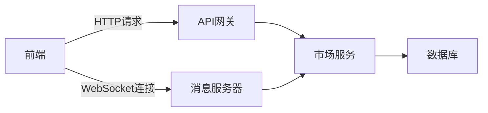
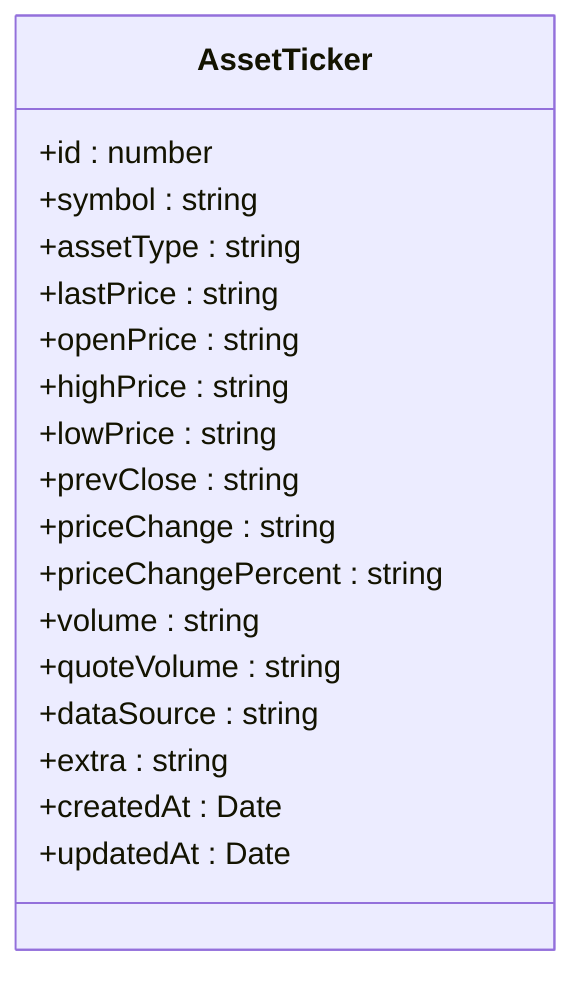
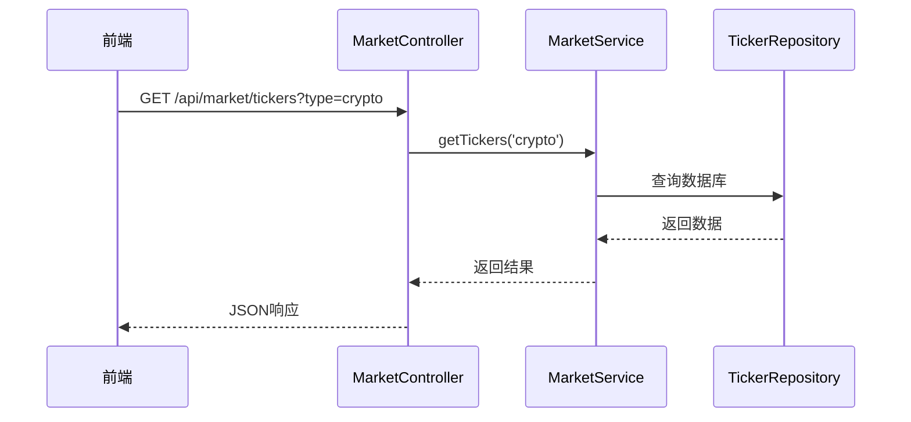
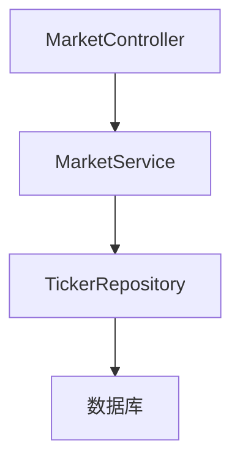

# 行情数据

<cite>
**本文档引用的文件**
- [asset-ticker.entity.ts](file://agx-backend/src/entities/asset-ticker.entity.ts)
- [market.service.ts](file://agx-backend/src/modules/market/market.service.ts)
- [market.controller.ts](file://agx-backend/src/modules/market/market.controller.ts)
- [Wsocket.js](file://agx-admin/src/utils/Wsocket.js)
- [message.js](file://agx-admin/src/ws-serve/message.js)
</cite>

## 目录
1. [介绍](#介绍)
2. [项目结构](#项目结构)
3. [核心组件](#核心组件)
4. [架构概述](#架构概述)
5. [详细组件分析](#详细组件分析)
6. [依赖分析](#依赖分析)
7. [性能考虑](#性能考虑)
8. [故障排除指南](#故障排除指南)
9. [结论](#结论)

## 介绍
本文件详细描述了行情数据实体的设计与实现，重点关注AssetTicker实体在实时数据管理中的作用。文档涵盖了该实体的字段定义、数据类型、更新机制，以及如何支持交易界面的实时行情展示。此外，还介绍了行情数据的订阅模式、缓存策略和性能优化措施，并提供了通过WebSocket推送最新行情给前端的代码示例。

## 项目结构
项目结构清晰地划分了前后端代码，其中后端主要负责处理业务逻辑和数据存储，前端则专注于用户界面展示。`agx-backend`目录包含了所有后端服务相关的代码，而`agx-admin`目录则存放了前端应用的所有资源。

```mermaid
graph TB
subgraph "前端"
A[agx-admin]
A --> B[src]
B --> C[api]
B --> D[components]
B --> E[views]
B --> F[utils]
end
subgraph "后端"
G[agx-backend]
G --> H[src]
H --> I[entities]
H --> J[modules]
H --> K[controllers]
H --> L[services]
end
A < --> G
```

**图表来源**
- [asset-ticker.entity.ts](file://agx-backend/src/entities/asset-ticker.entity.ts)
- [market.service.ts](file://agx-backend/src/modules/market/market.service.ts)

**章节来源**
- [asset-ticker.entity.ts](file://agx-backend/src/entities/asset-ticker.entity.ts)
- [market.service.ts](file://agx-backend/src/modules/market/market.service.ts)

## 核心组件
AssetTicker实体是整个系统中用于存储和管理实时行情数据的核心组件。它不仅记录了各种资产的最新价格信息，还包括了24小时内的最高价、最低价、成交量等关键指标。

**章节来源**
- [asset-ticker.entity.ts](file://agx-backend/src/entities/asset-ticker.entity.ts)
- [market.service.ts](file://agx-backend/src/modules/market/market.service.ts)

## 架构概述
系统采用微服务架构，后端使用NestJS框架构建，前端基于Vue.js开发。后端服务通过RESTful API和WebSocket协议与前端进行通信，确保了数据的实时性和高效性。



**图表来源**
- [market.controller.ts](file://agx-backend/src/modules/market/market.controller.ts)
- [Wsocket.js](file://agx-admin/src/utils/Wsocket.js)

## 详细组件分析

### AssetTicker实体分析
AssetTicker实体定义了一系列字段来存储行情数据，包括但不限于`symbol`（资产代码）、`assetType`（资产类型）、`lastPrice`（最新价格）、`highPrice`（24H最高价）、`lowPrice`（24H最低价）和`volume`（24H成交量）等。这些字段的数据类型均为字符串或数字，以确保精度和灵活性。

#### 类图


**图表来源**
- [asset-ticker.entity.ts](file://agx-backend/src/entities/asset-ticker.entity.ts)

**章节来源**
- [asset-ticker.entity.ts](file://agx-backend/src/entities/asset-ticker.entity.ts)

### 市场服务分析
MarketService提供了获取行情数据的主要方法，如`getTickers`、`getTicker`和`getKlines`。这些方法通过调用数据库查询来获取最新的行情数据，并支持按不同条件筛选和排序。

#### 序列图


**图表来源**
- [market.controller.ts](file://agx-backend/src/modules/market/market.controller.ts)
- [market.service.ts](file://agx-backend/src/modules/market/market.service.ts)

**章节来源**
- [market.service.ts](file://agx-backend/src/modules/market/market.service.ts)

## 依赖分析
系统内部各组件之间存在明确的依赖关系。例如，MarketController依赖于MarketService，而MarketService又依赖于AssetTickerRepository来访问数据库。这种分层设计有助于提高代码的可维护性和可测试性。



**图表来源**
- [market.controller.ts](file://agx-backend/src/modules/market/market.controller.ts)
- [market.service.ts](file://agx-backend/src/modules/market/market.service.ts)

**章节来源**
- [market.controller.ts](file://agx-backend/src/modules/market/market.controller.ts)
- [market.service.ts](file://agx-backend/src/modules/market/market.service.ts)

## 性能考虑
为了保证系统的高性能，采用了多种优化措施。例如，使用索引加速数据库查询，利用缓存减少对数据库的直接访问，以及通过WebSocket实现实时数据推送，减少了HTTP轮询带来的开销。

## 故障排除指南
当遇到数据不一致或更新延迟的问题时，首先检查数据库连接是否正常，然后确认MarketService中的数据获取逻辑是否有误。对于WebSocket连接问题，可以查看前端的Wsocket.js文件，确保心跳机制和重连逻辑正确无误。

**章节来源**
- [Wsocket.js](file://agx-admin/src/utils/Wsocket.js)
- [message.js](file://agx-admin/src/ws-serve/message.js)

## 结论
本文档全面介绍了行情数据实体的设计与实现，特别是AssetTicker实体在实时数据管理中的关键作用。通过合理的架构设计和性能优化，系统能够高效地支持交易界面的实时行情展示，为用户提供准确、及时的市场信息。