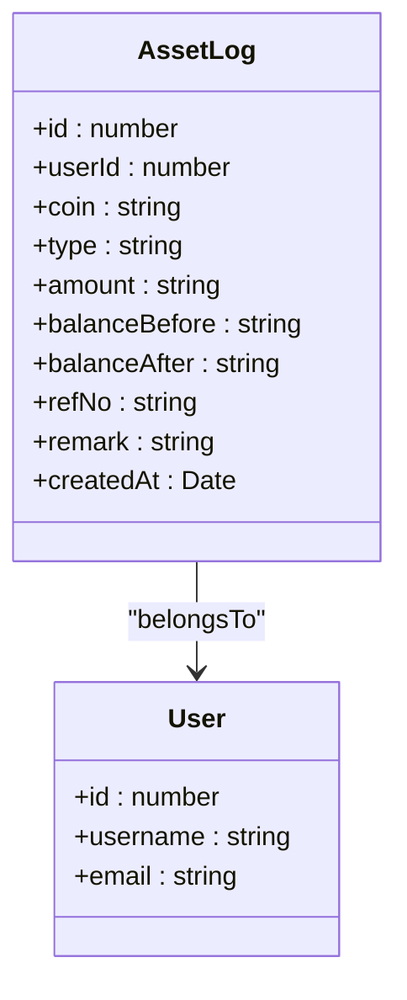
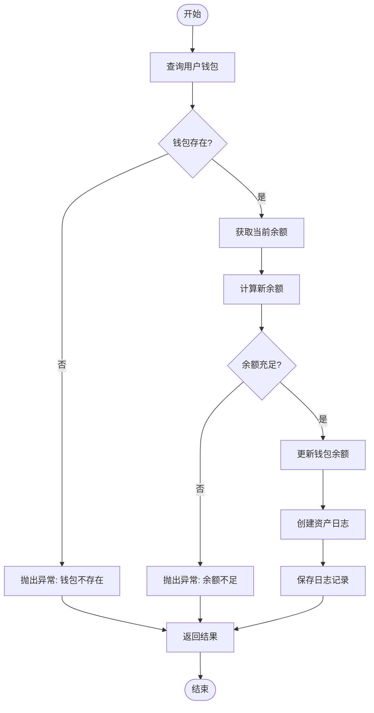
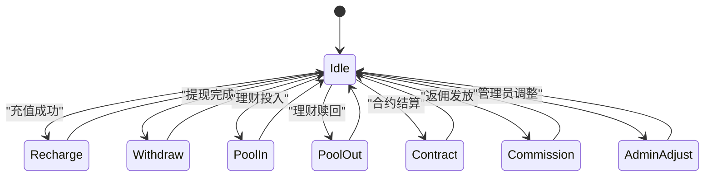
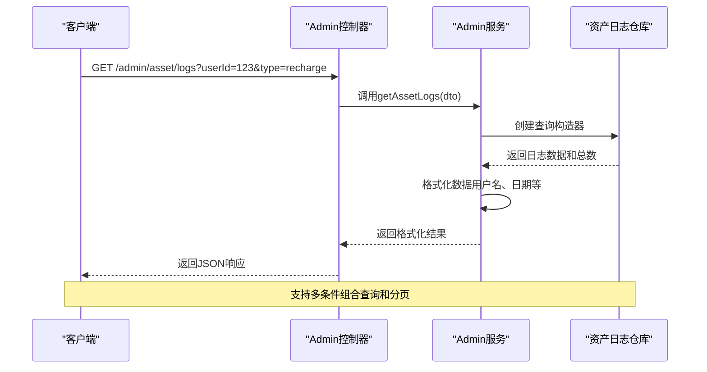
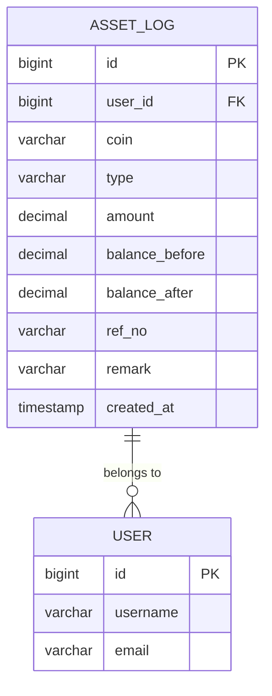

# 资产日志

<cite>
**本文档引用的文件**  
- [asset-log.entity.ts](file://agx-backend/src/entities/asset-log.entity.ts)
- [admin.service.ts](file://agx-backend/src/modules/admin/admin.service.ts)
- [admin.controller.ts](file://agx-backend/src/modules/admin/admin.controller.ts)
- [wallet.entity.ts](file://agx-backend/src/entities/wallet.entity.ts)
</cite>

## 目录
1. [简介](#简介)
2. [资产日志实体结构](#资产日志实体结构)
3. [审计追踪机制](#审计追踪机制)
4. [日志生成时机](#日志生成时机)
5. [查询接口与管理功能](#查询接口与管理功能)
6. [状态转换图](#状态转换图)
7. [数据存储与性能优化](#数据存储与性能优化)
8. [安全审计要求](#安全审计要求)

## 简介
资产日志（AssetLog）实体是系统中用于记录用户资产变动的核心审计组件。该实体为每一笔资产变动提供完整的追溯能力，确保所有交易、充值、提现等操作都有据可查。通过精确记录变动前后的余额、操作类型和关联信息，实现了金融级的审计追踪功能。

## 资产日志实体结构
资产日志实体定义了完整的资产变动记录结构，包含以下关键字段：

| 字段名 | 数据类型 | 说明 |
|-------|--------|------|
| id | number | 主键，自增的bigint类型 |
| userId | number | 用户ID，关联用户表 |
| coin | string | 币种，如USDT、BTC等 |
| type | string | 操作类型：recharge/withdraw/pool_in/pool_out/contract/commission |
| amount | string | 变动金额，decimal(30,8)精度 |
| balanceBefore | string | 变动前余额 |
| balanceAfter | string | 变动后余额 |
| refNo | string | 关联单号，可为空 |
| remark | string | 备注信息，可为空 |
| createdAt | Date | 创建时间，自动记录 |

**字段业务用途说明：**
- **logId**：系统自动生成的唯一标识符，作为日志记录的主键
- **assetId**：通过userId和coin字段组合确定特定用户的特定资产
- **changeAmount**：amount字段表示资产变动的绝对值
- **balanceAfter**：balanceAfter字段记录变动后的最终余额
- **operationType**：type字段标识操作类型，支持多种业务场景
- **operator**：虽然没有直接的operator字段，但通过userId可追溯操作主体

**Diagram sources**
- [asset-log.entity.ts](file://agx-backend/src/entities/asset-log.entity.ts#L12-L48)

**Section sources**
- [asset-log.entity.ts](file://agx-backend/src/entities/asset-log.entity.ts#L12-L48)

## 审计追踪机制
资产日志系统通过严格的事务处理和余额校验机制确保审计的完整性。每当发生资产变动时，系统会先记录变动前的余额，执行资产调整，然后记录变动后的余额，形成完整的审计链条。

在管理员调整用户资产的场景中，系统执行以下步骤：
1. 查询用户钱包信息
2. 验证余额是否充足（对于扣减操作）
3. 计算新的余额
4. 更新钱包余额
5. 创建资产日志记录

**Diagram sources**
- [admin.service.ts](file://agx-backend/src/modules/admin/admin.service.ts#L1058-L1094)

**Section sources**
- [admin.service.ts](file://agx-backend/src/modules/admin/admin.service.ts#L1058-L1094)

## 日志生成时机
资产日志在多种业务场景下自动生成，确保所有资产变动都有完整记录：

### 交易场景
- 充值成功后生成recharge类型的日志
- 提现审核通过后生成withdraw类型的日志
- 参与理财计划时生成pool_in类型的日志
- 赎回理财计划时生成pool_out类型的日志
- 合约交易结算时生成contract类型的日志
- 返佣发放时生成commission类型的日志

### 管理操作
- 管理员手动调整资产时生成admin_add或admin_sub类型的日志
- 系统自动调整（如奖励发放）时生成相应的系统类型日志

**Diagram sources**
- [asset-log.entity.ts](file://agx-backend/src/entities/asset-log.entity.ts#L28)
- [admin.service.ts](file://agx-backend/src/modules/admin/admin.service.ts#L1087-L1088)

## 查询接口与管理功能
系统提供了完善的资产日志查询接口，支持多维度筛选和分页查询。

### API接口
- **GET /admin/asset/logs**：查询资产日志列表
  - 支持按用户ID过滤
  - 支持按操作类型过滤
  - 支持分页查询（page, pageSize参数）

### 查询逻辑

**Diagram sources**
- [admin.controller.ts](file://agx-backend/src/modules/admin/admin.controller.ts#L262-L266)
- [admin.service.ts](file://agx-backend/src/modules/admin/admin.service.ts#L1101-L1137)

**Section sources**
- [admin.controller.ts](file://agx-backend/src/modules/admin/admin.controller.ts#L262-L266)
- [admin.service.ts](file://agx-backend/src/modules/admin/admin.service.ts#L1101-L1137)

## 数据存储与性能优化
资产日志采用关系型数据库存储，通过合理的索引设计和数据结构确保查询性能。

### 存储策略
- 使用PostgreSQL数据库存储日志数据
- 表名为agx_asset_log
- 对userId字段建立索引（idx_user_id），提高按用户查询的性能
- createdAt字段自动记录创建时间

### 性能优化
- 采用分页查询机制，避免一次性加载大量数据
- 通过索引优化常用查询条件
- 考虑未来可能的分表策略，按时间或用户ID进行水平分表

**Diagram sources**
- [asset-log.entity.ts](file://agx-backend/src/entities/asset-log.entity.ts#L12-L48)
- [wallet.entity.ts](file://agx-backend/src/entities/wallet.entity.ts#L13-L14)

## 安全审计要求
资产日志系统遵循严格的安全审计标准，确保数据的完整性和可追溯性。

### 安全特性
- 所有资产变动必须通过事务处理，确保数据一致性
- 日志一旦创建不可修改，保证审计的可靠性
- 敏感操作（如管理员调整）需记录详细信息
- 提供完整的查询接口，支持审计人员进行数据核查

### 归档策略
- 建议定期将历史日志归档到数据仓库
- 对于超过一定期限的日志，可考虑迁移到低成本存储
- 保留完整的审计链条，确保任何时候都能重建账户状态

**Section sources**
- [asset-log.entity.ts](file://agx-backend/src/entities/asset-log.entity.ts#L12-L48)
- [admin.service.ts](file://agx-backend/src/modules/admin/admin.service.ts#L1058-L1094)