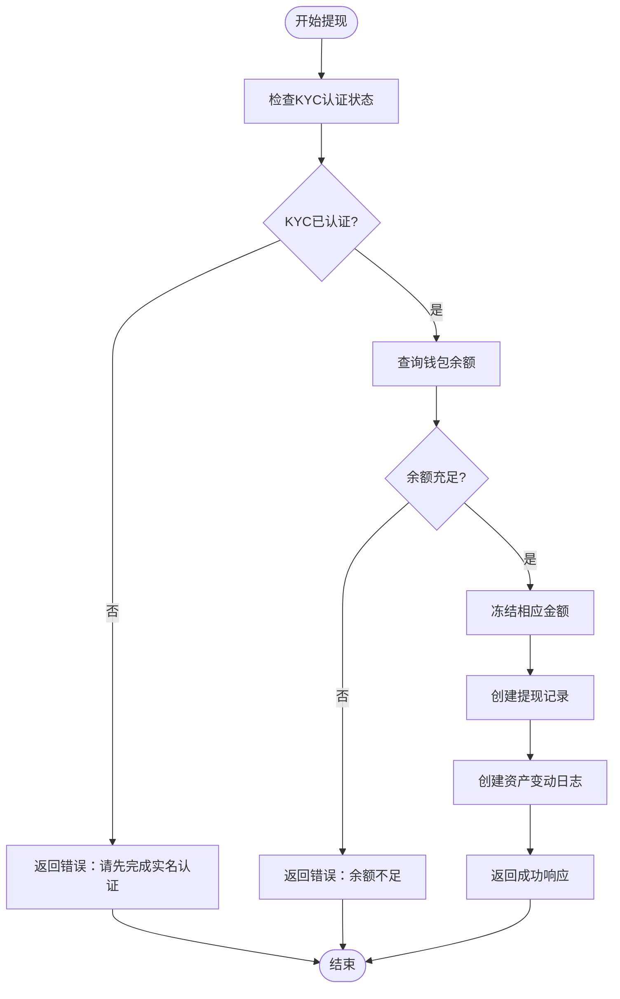

# 资产模型

<cite>
**本文档引用的文件**
- [asset.entity.ts](file://agx-backend/src/entities/asset.entity.ts)
- [coin.entity.ts](file://agx-backend/src/entities/coin.entity.ts)
- [coin-chain.entity.ts](file://agx-backend/src/entities/coin-chain.entity.ts)
- [wallet.entity.ts](file://agx-backend/src/entities/wallet.entity.ts)
- [asset-log.entity.ts](file://agx-backend/src/entities/asset-log.entity.ts)
- [asset-ticker.entity.ts](file://agx-backend/src/entities/asset-ticker.entity.ts)
- [user.entity.ts](file://agx-backend/src/entities/user.entity.ts)
- [account.service.ts](file://agx-backend/src/modules/account/account.service.ts)
- [recharge.entity.ts](file://agx-backend/src/entities/recharge.entity.ts)
- [withdraw.entity.ts](file://agx-backend/src/entities/withdraw.entity.ts)
</cite>

## 目录
1. [项目结构](#项目结构)
2. [核心资产实体](#核心资产实体)
3. [相关实体与关系](#相关实体与关系)
4. [资产变动审计追踪](#资产变动审计追踪)
5. [余额一致性保证](#余额一致性保证)
6. [多链资产支持](#多链资产支持)
7. [资产查询性能优化](#资产查询性能优化)
8. [安全审计要求](#安全审计要求)

## 项目结构

系统采用分层架构，前端位于`agx-admin`目录，后端服务位于`agx-backend`目录。资产相关的核心逻辑集中在后端的实体层和账户服务模块中。


**图示来源**
- [asset.entity.ts](file://agx-backend/src/entities/asset.entity.ts)
- [account.service.ts](file://agx-backend/src/modules/account/account.service.ts)

**本节来源**
- [agx-backend/src/entities](file://agx-backend/src/entities)
- [agx-backend/src/modules/account](file://agx-backend/src/modules/account)

## 核心资产实体

`Asset`实体定义了平台支持的各类资产（如加密货币、外汇、股票、贵金属等）的基本信息和配置。该实体不直接存储用户余额，而是作为资产元数据的定义。


**图示来源**
- [asset.entity.ts](file://agx-backend/src/entities/asset.entity.ts#L1-L80)

**本节来源**
- [asset.entity.ts](file://agx-backend/src/entities/asset.entity.ts#L1-L80)

## 相关实体与关系

资产系统涉及多个核心实体，包括币种(Coin)、用户钱包(Wallet)、资产日志(AssetLog)、行情数据(AssetTicker)等，它们共同构成了完整的资产管理体系。


**图示来源**
- [asset.entity.ts](file://agx-backend/src/entities/asset.entity.ts)
- [coin.entity.ts](file://agx-backend/src/entities/coin.entity.ts)
- [coin-chain.entity.ts](file://agx-backend/src/entities/coin-chain.entity.ts)
- [wallet.entity.ts](file://agx-backend/src/entities/wallet.entity.ts)
- [asset-log.entity.ts](file://agx-backend/src/entities/asset-log.entity.ts)
- [asset-ticker.entity.ts](file://agx-backend/src/entities/asset-ticker.entity.ts)
- [user.entity.ts](file://agx-backend/src/entities/user.entity.ts)

**本节来源**
- [coin.entity.ts](file://agx-backend/src/entities/coin.entity.ts)
- [coin-chain.entity.ts](file://agx-backend/src/entities/coin-chain.entity.ts)
- [wallet.entity.ts](file://agx-backend/src/entities/wallet.entity.ts)
- [asset-log.entity.ts](file://agx-backend/src/entities/asset-log.entity.ts)
- [asset-ticker.entity.ts](file://agx-backend/src/entities/asset-ticker.entity.ts)

## 资产变动审计追踪

系统通过`AssetLog`实体记录所有资产变动，确保完整的审计追踪能力。每次资产变动都会生成一条日志，包含变动前后的余额、变动金额、类型和关联单号。


**图示来源**
- [account.service.ts](file://agx-backend/src/modules/account/account.service.ts#L433-L483)
- [asset-log.entity.ts](file://agx-backend/src/entities/asset-log.entity.ts)

**本节来源**
- [account.service.ts](file://agx-backend/src/modules/account/account.service.ts#L433-L483)
- [asset-log.entity.ts](file://agx-backend/src/entities/asset-log.entity.ts)

## 余额一致性保证

系统通过事务性操作和双重校验机制保证余额一致性。在资产变动时，先检查余额是否充足，然后更新钱包余额并创建审计日志。



**图示来源**
- [account.service.ts](file://agx-backend/src/modules/account/account.service.ts#L433-L483)
- [wallet.entity.ts](file://agx-backend/src/entities/wallet.entity.ts)

**本节来源**
- [account.service.ts](file://agx-backend/src/modules/account/account.service.ts#L433-L483)

## 多链资产支持

系统通过`CoinChain`实体支持同一币种在不同区块链网络上的提现和充值。每个币种可以配置多条链，每条链有独立的手续费、最小提现额等参数。

```mermaid
classDiagram
class Coin {
+id : bigint
+symbol : string
+name : string
+decimals : number
+isDeposit : number
+isWithdraw : number
+minWithdraw : string
+withdrawFee : string
}
class CoinChain {
+id : bigint
+coinId : number
+chain : string
+chainSymbol : string
+contractAddress : string
+withdrawFee : string
+minWithdraw : string
+maxWithdraw : string
+confirmations : number
+status : number
}
Coin ||--o{ CoinChain : "支持多链"
```

**图示来源**
- [coin.entity.ts](file://agx-backend/src/entities/coin.entity.ts)
- [coin-chain.entity.ts](file://agx-backend/src/entities/coin-chain.entity.ts)

**本节来源**
- [coin-chain.entity.ts](file://agx-backend/src/entities/coin-chain.entity.ts)

## 资产查询性能优化

系统通过索引设计和缓存机制优化资产查询性能。关键字段如用户ID、币种符号等都建立了数据库索引，同时行情数据通过`AssetTicker`表进行缓存。


**图示来源**
- [wallet.entity.ts](file://agx-backend/src/entities/wallet.entity.ts)
- [asset.entity.ts](file://agx-backend/src/entities/asset.entity.ts)
- [asset-ticker.entity.ts](file://agx-backend/src/entities/asset-ticker.entity.ts)
- [recharge.entity.ts](file://agx-backend/src/entities/recharge.entity.ts)
- [withdraw.entity.ts](file://agx-backend/src/entities/withdraw.entity.ts)

**本节来源**
- [wallet.entity.ts](file://agx-backend/src/entities/wallet.entity.ts)
- [asset-ticker.entity.ts](file://agx-backend/src/entities/asset-ticker.entity.ts)

## 安全审计要求

系统实现了严格的安全审计机制，所有敏感操作都需要身份验证和KYC认证。资产变动操作都会记录详细日志，便于追踪和审计。


**图示来源**
- [account.service.ts](file://agx-backend/src/modules/account/account.service.ts)
- [user.entity.ts](file://agx-backend/src/entities/user.entity.ts)

**本节来源**
- [account.service.ts](file://agx-backend/src/modules/account/account.service.ts)
- [user.entity.ts](file://agx-backend/src/entities/user.entity.ts)