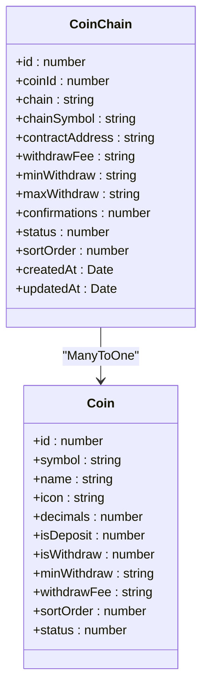
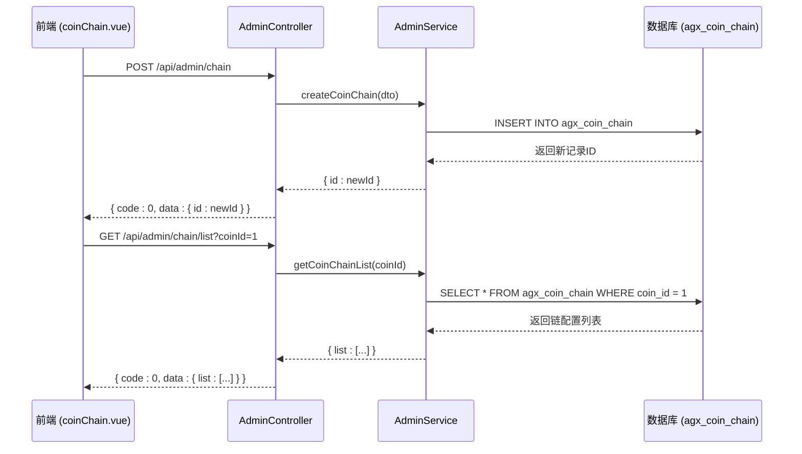
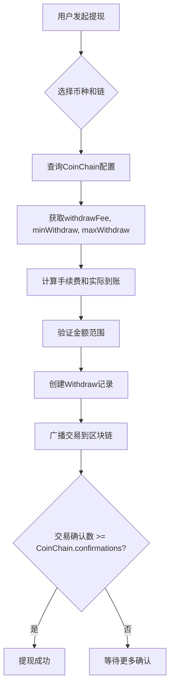

# 链信息

<cite>
**本文档引用的文件**  
- [coin-chain.entity.ts](file://agx-backend/src/entities/coin-chain.entity.ts)
- [coin.entity.ts](file://agx-backend/src/entities/coin.entity.ts)
- [admin.service.ts](file://agx-backend/src/modules/admin/admin.service.ts)
- [admin.controller.ts](file://agx-backend/src/modules/admin/admin.controller.ts)
- [account.service.ts](file://agx-backend/src/modules/account/account.service.ts)
- [recharge.entity.ts](file://agx-backend/src/entities/recharge.entity.ts)
- [withdraw.entity.ts](file://agx-backend/src/entities/withdraw.entity.ts)
- [coinChain.vue](file://agx-admin/src/views/agx/coinChain.vue)
</cite>

## 目录
1. [引言](#引言)
2. [CoinChain实体设计](#coinchain实体设计)
3. [核心字段详解](#核心字段详解)
4. [链信息与币种的关联关系](#链信息与币种的关联关系)
5. [链配置管理逻辑](#链配置管理逻辑)
6. [链信息查询与验证](#链信息查询与验证)
7. [充值与提现中的链信息应用](#充值与提现中的链信息应用)
8. [链信息变更处理与向后兼容性](#链信息变更处理与向后兼容性)
9. [总结](#总结)

## 引言

本文档详细阐述了CoinChain实体的设计与实现，该实体用于管理多链资产（如ERC20、BEP20）的链信息。文档将深入分析其字段定义、数据类型、业务含义，以及在充值、提现等核心业务流程中的应用。同时，将介绍链配置的管理、查询和验证机制，以及链信息变更的处理流程。

## CoinChain实体设计

CoinChain实体是系统中管理币种在不同区块链网络上配置的核心数据结构。它通过与Coin实体的关联，实现了对多链资产的精细化管理。

**Diagram sources**
- [coin-chain.entity.ts](file://agx-backend/src/entities/coin-chain.entity.ts)
- [coin.entity.ts](file://agx-backend/src/entities/coin.entity.ts)

**Section sources**
- [coin-chain.entity.ts](file://agx-backend/src/entities/coin-chain.entity.ts)

## 核心字段详解

CoinChain实体包含以下关键字段，每个字段都有其特定的业务含义和数据类型：

| 字段名 | 数据类型 | 业务含义 |
| :--- | :--- | :--- |
| `id` | bigint | 主键，唯一标识一条链配置记录。 |
| `coinId` | bigint | 外键，关联到`agx_coin`表的`id`，标识该链配置属于哪个币种。 |
| `chain` | varchar(50) | 链的名称，例如 "Tron"、"Ethereum"。 |
| `chainSymbol` | varchar(20) | 链的标识符，用于区分同一币种在不同网络上的版本，例如 "TRC20"、"ERC20"。 |
| `contractAddress` | varchar(200) | 代币的合约地址（可为空）。对于USDT等代币，此字段存储其在该链上的智能合约地址。 |
| `withdrawFee` | decimal(30,8) | 用户提现时需要支付的手续费，以该币种为单位。默认值为'0'。 |
| `minWithdraw` | decimal(30,8) | 允许的最小提现金额，以该币种为单位。默认值为'0'。 |
| `maxWithdraw` | decimal(30,8) | 允许的最大提现金额，以该币种为单位。默认值为'0'。 |
| `confirmations` | int | 区块链交易需要的确认数，达到此数量后充值才被视为成功。默认值为6。 |
| `status` | smallint | 链配置的状态：0表示禁用，1表示启用。 |
| `sortOrder` | int | 排序字段，用于在前端界面中控制链的显示顺序。 |

**Section sources**
- [coin-chain.entity.ts](file://agx-backend/src/entities/coin-chain.entity.ts)

## 链信息与币种的关联关系

CoinChain实体通过`coinId`字段与Coin实体建立多对一（ManyToOne）的关联关系。这种设计模式支持一个币种（如USDT）在多个不同的区块链网络（如TRC20、ERC20）上进行管理。

- **数据模型**：一个`Coin`记录可以对应多个`CoinChain`记录。例如，一个`Coin`记录（symbol='USDT'）可以有两条`CoinChain`记录，一条`chainSymbol='TRC20'`，另一条`chainSymbol='ERC20'`。
- **业务意义**：这种设计使得系统能够灵活地支持多链资产。用户在进行充值或提现时，可以选择不同的链网络，系统会根据所选链的配置（如合约地址、手续费）来执行相应的操作。
- **实现方式**：在TypeORM中，通过`@ManyToOne`和`@JoinColumn`装饰器实现关联，确保了数据的一致性和完整性。

**Section sources**
- [coin-chain.entity.ts](file://agx-backend/src/entities/coin-chain.entity.ts)
- [coin.entity.ts](file://agx-backend/src/entities/coin.entity.ts)

## 链配置管理逻辑

链配置的管理主要通过后台管理系统的API接口实现，包括创建、查询、更新和删除（CRUD）操作。

**Diagram sources**
- [admin.controller.ts](file://agx-backend/src/modules/admin/admin.controller.ts)
- [admin.service.ts](file://agx-backend/src/modules/admin/admin.service.ts)
- [coinChain.vue](file://agx-admin/src/views/agx/coinChain.vue)

**Section sources**
- [admin.controller.ts](file://agx-backend/src/modules/admin/admin.controller.ts)
- [admin.service.ts](file://agx-backend/src/modules/admin/admin.service.ts)
- [coinChain.vue](file://agx-admin/src/views/agx/coinChain.vue)

## 链信息查询与验证

系统在多个业务场景中需要查询和验证链信息。

1.  **后台管理查询**：管理员可以通过`GET /api/admin/chain/list`接口，按`coinId`查询特定币种的所有链配置。
2.  **用户端查询**：在用户进行充值或提现时，前端需要获取可用的链列表。虽然在提供的代码中未直接体现，但逻辑上应存在一个供用户端调用的API，用于获取启用状态的链配置。
3.  **业务逻辑验证**：在提现等操作中，系统会验证用户选择的`chain`是否有效。例如，在`account.service.ts`的`withdraw`方法中，虽然没有直接查询`CoinChain`，但会检查`dto.chain`参数，后续的链上操作逻辑会依赖于`CoinChain`中配置的`confirmations`和`withdrawFee`。

**Section sources**
- [admin.service.ts](file://agx-backend/src/modules/admin/admin.service.ts)
- [account.service.ts](file://agx-backend/src/modules/account/account.service.ts)

## 充值与提现中的链信息应用

链信息在充值和提现流程中扮演着至关重要的角色。

- **充值流程**：
    1.  用户选择币种和链（如USDT-TRC20）。
    2.  系统调用`getDepositAddress`接口。
    3.  后端根据`coin`和`chain`参数，查询`CoinChain`配置，获取该链的`confirmations`（确认数）。
    4.  系统生成或返回一个该链网络上的充值地址。
    5.  当用户发起链上交易后，系统监控交易哈希，当确认数达到`CoinChain`中配置的`confirmations`值时，才将充值金额记入用户账户。

- **提现流程**：
    1.  用户选择币种、链和提现金额。
    2.  系统根据用户选择的`chain`，查询`CoinChain`记录。
    3.  系统使用`CoinChain`中的`withdrawFee`计算实际到账金额，并验证提现金额是否在`minWithdraw`和`maxWithdraw`范围内。
    4.  系统创建`Withdraw`记录，其中`chain`字段存储用户选择的链标识。
    5.  提现成功后，系统会根据`CoinChain`中的`confirmations`来监控交易状态。

**Diagram sources**
- [account.service.ts](file://agx-backend/src/modules/account/account.service.ts)
- [withdraw.entity.ts](file://agx-backend/src/entities/withdraw.entity.ts)
- [coin-chain.entity.ts](file://agx-backend/src/entities/coin-chain.entity.ts)

**Section sources**
- [account.service.ts](file://agx-backend/src/modules/account/account.service.ts)
- [withdraw.entity.ts](file://agx-backend/src/entities/withdraw.entity.ts)

## 链信息变更处理与向后兼容性

当需要变更链信息（如调整手续费、更改合约地址）时，必须考虑向后兼容性。

- **变更流程**：
    1.  管理员在后台通过`PUT /api/admin/chain/:id`接口更新`CoinChain`记录。
    2.  系统更新数据库中的配置。
    3.  对于正在进行中的交易（如已创建但未广播的提现订单），应使用创建时的快照配置，避免因配置变更导致计算错误。
- **向后兼容性考虑**：
    - **历史数据**：已生成的`Recharge`和`Withdraw`记录中的`chain`字段存储的是当时的链标识，这些历史记录不会因`CoinChain`配置的更新而改变，保证了数据的可追溯性。
    - **新旧并存**：系统设计允许一个币种同时存在多个链配置（如同时支持TRC20和ERC20），这本身就是一种兼容性设计。当需要停用旧链时，只需将`status`改为0，而无需删除记录，确保了历史数据的完整性。
    - **通知用户**：重大变更（如合约地址迁移）应通过公告系统（`Notice`实体）提前通知用户，避免造成资产损失。

**Section sources**
- [admin.service.ts](file://agx-backend/src/modules/admin/admin.service.ts)
- [recharge.entity.ts](file://agx-backend/src/entities/recharge.entity.ts)
- [withdraw.entity.ts](file://agx-backend/src/entities/withdraw.entity.ts)
- [notice.entity.ts](file://agx-backend/src/entities/notice.entity.ts)

## 总结

CoinChain实体是支撑多链资产管理功能的核心。它通过精细化的字段设计，将币种与具体的区块链网络解耦，实现了灵活的配置管理。该实体与Coin、Recharge、Withdraw等实体紧密协作，确保了充值、提现等业务流程的准确性和安全性。其管理接口和变更处理机制也充分考虑了系统的稳定性和向后兼容性。