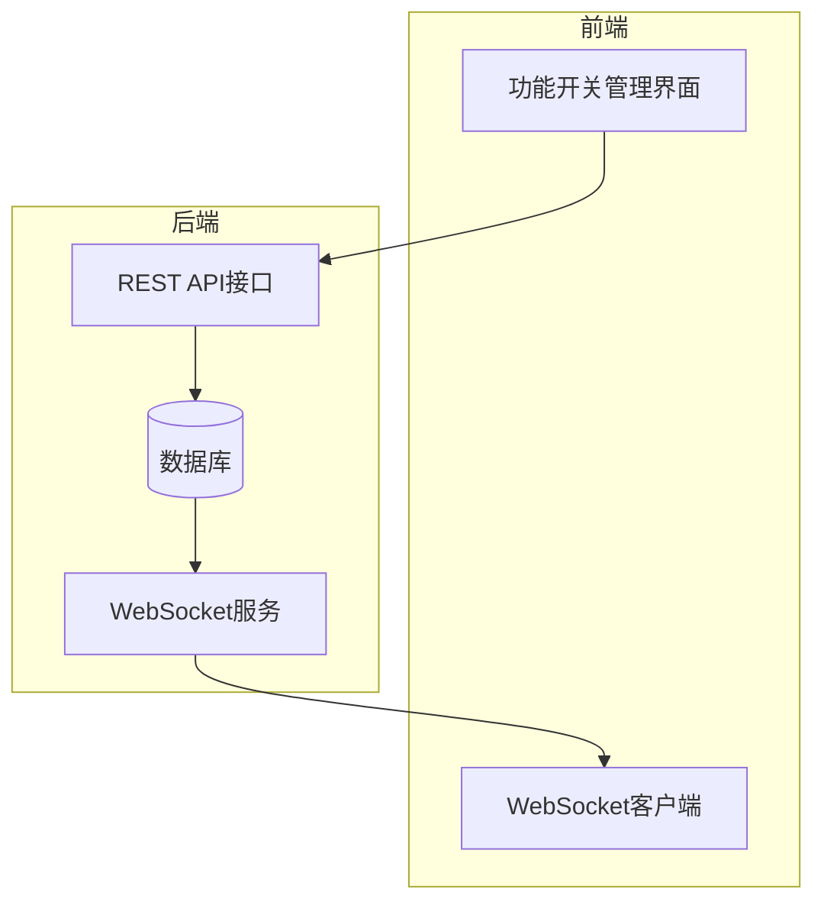
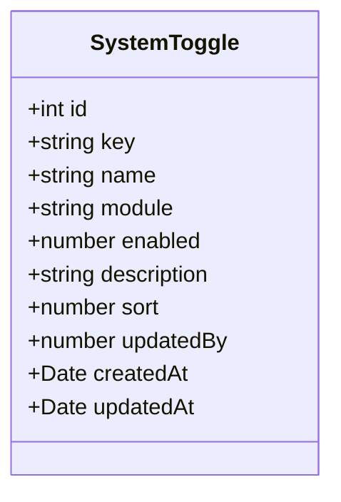
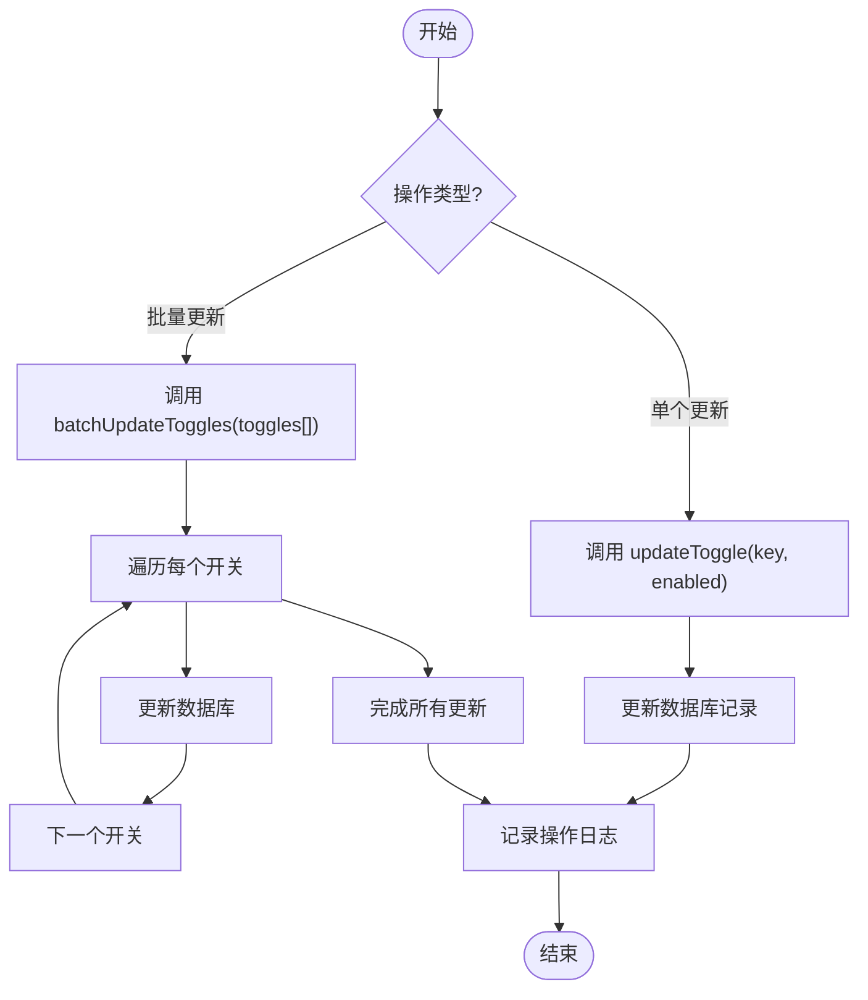
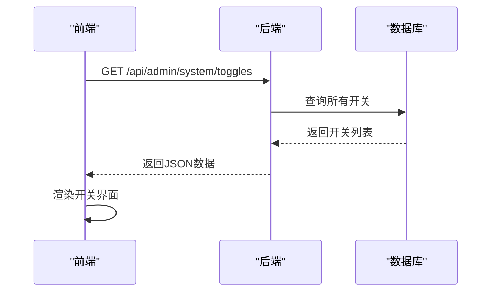
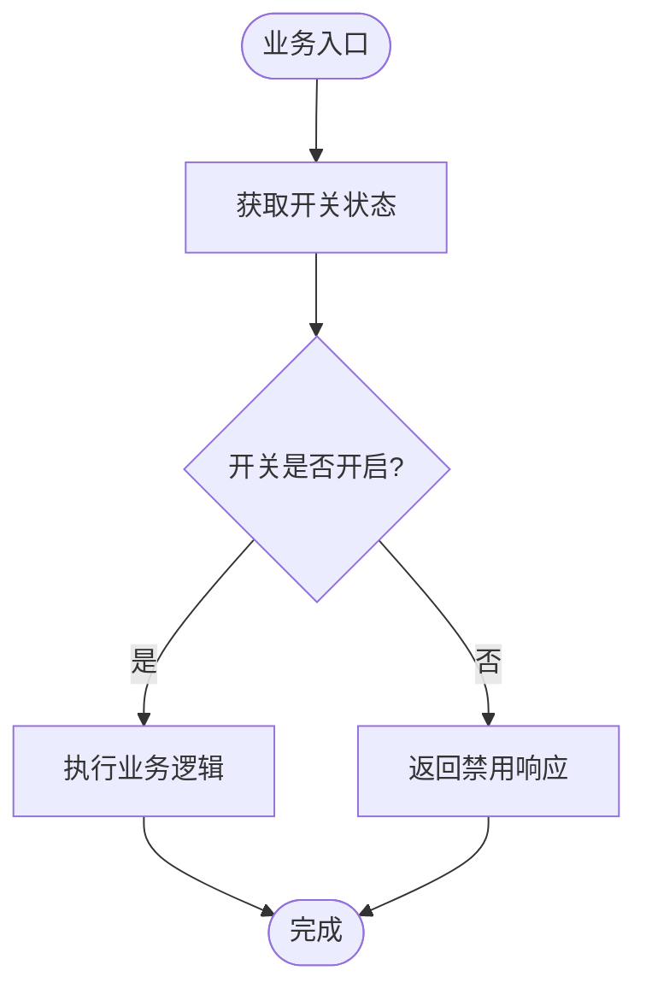
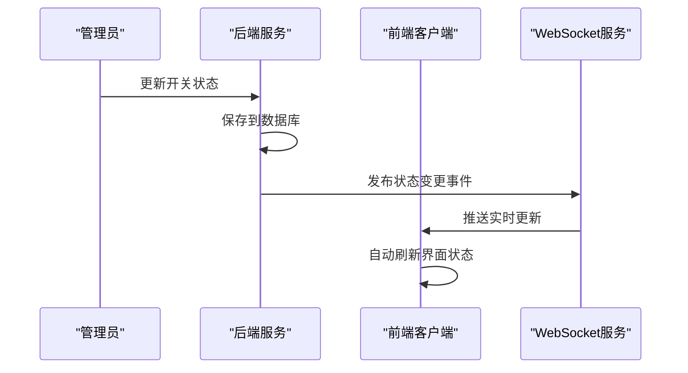
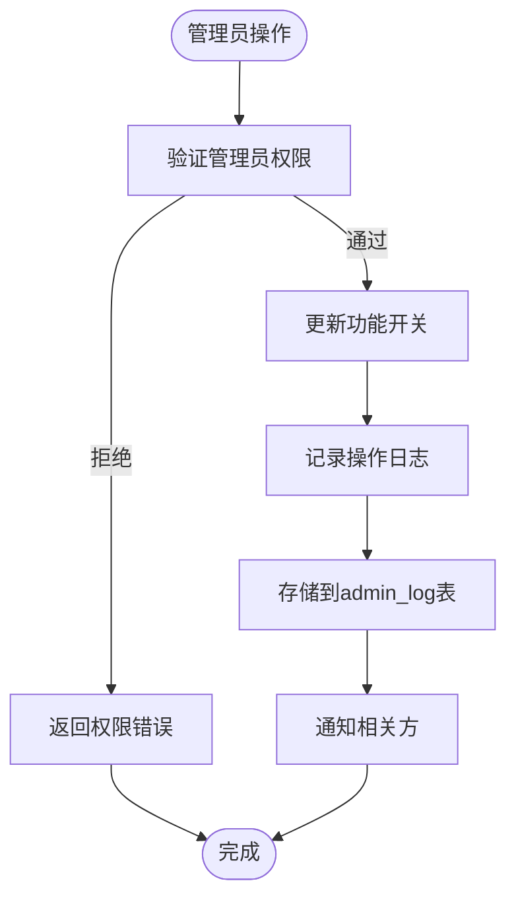

# 功能开关

<cite>
**本文档引用文件**   
- [system-toggle.entity.ts](file://agx-backend/src/entities/system-toggle.entity.ts)
- [system.controller.ts](file://agx-backend/src/modules/system/system.controller.ts)
- [system.service.ts](file://agx-backend/src/modules/system/system.service.ts)
- [featureSwitch.vue](file://agx-admin/src/views/agx/featureSwitch.vue)
- [Wsocket.js](file://agx-admin/src/utils/Wsocket.js)
- [message.js](file://agx-admin/src/ws-serve/message.js)
- [admin-log.entity.ts](file://agx-backend/src/entities/admin-log.entity.ts)
- [admin.service.ts](file://agx-backend/src/modules/admin/admin.service.ts)
</cite>

## 目录
1. [简介](#简介)
2. [系统架构](#系统架构)
3. [核心组件](#核心组件)
4. [功能开关实体模型](#功能开关实体模型)
5. [动态更新策略](#动态更新策略)
6. [前端状态获取](#前端状态获取)
7. [后端业务逻辑控制](#后端业务逻辑控制)
8. [WebSocket实时同步](#websocket实时同步)
9. [权限控制与审计日志](#权限控制与审计日志)
10. [应用场景](#应用场景)
11. [结论](#结论)

## 简介
功能开关（Feature Toggle）是一种在系统运行时动态控制功能开启与关闭的机制。本系统通过`SystemToggle`实体实现全局功能的实时控制，支持灰度发布、功能测试、紧急下线等关键场景。该机制允许管理员在不重启服务的情况下，即时调整系统行为，确保业务的灵活性和稳定性。

## 系统架构
系统采用前后端分离架构，功能开关的配置存储在数据库中，通过REST API进行管理，并利用WebSocket实现前端的实时状态同步。

**图表来源**
- [featureSwitch.vue](file://agx-admin/src/views/agx/featureSwitch.vue)
- [system.controller.ts](file://agx-backend/src/modules/system/system.controller.ts)
- [Wsocket.js](file://agx-admin/src/utils/Wsocket.js)

## 核心组件
系统的核心组件包括功能开关实体、管理控制器、服务层以及前端管理界面，它们共同协作实现功能开关的全生命周期管理。

**章节来源**
- [system-toggle.entity.ts](file://agx-backend/src/entities/system-toggle.entity.ts)
- [system.controller.ts](file://agx-backend/src/modules/system/system.controller.ts)
- [system.service.ts](file://agx-backend/src/modules/system/system.service.ts)
- [featureSwitch.vue](file://agx-admin/src/views/agx/featureSwitch.vue)

## 功能开关实体模型
`SystemToggle`实体定义了功能开关的核心数据结构，包含以下字段：

| 字段 | 类型 | 说明 |
|------|------|------|
| id | int | 主键ID |
| key | varchar(50) | 开关键名（唯一） |
| name | varchar(100) | 开关名称 |
| module | varchar(50) | 所属模块（social, trade, content, asset, user） |
| enabled | smallint | 是否开启（0关闭，1开启） |
| description | varchar(255) | 描述说明 |
| sort | int | 排序 |
| updatedBy | bigint | 最后修改人ID |
| createdAt | timestamp | 创建时间 |
| updatedAt | timestamp | 更新时间 |

**图表来源**
- [system-toggle.entity.ts](file://agx-backend/src/entities/system-toggle.entity.ts#L15-L47)

**章节来源**
- [system-toggle.entity.ts](file://agx-backend/src/entities/system-toggle.entity.ts#L1-L47)

## 动态更新策略
系统提供灵活的更新策略，支持单个开关更新和批量更新操作。

**图表来源**
- [system.service.ts](file://agx-backend/src/modules/system/system.service.ts#L23-L33)

**章节来源**
- [system.controller.ts](file://agx-backend/src/modules/system/system.controller.ts#L18-L29)
- [system.service.ts](file://agx-backend/src/modules/system/system.service.ts#L23-L33)

## 前端状态获取
前端通过API接口获取功能开关状态，并在界面中展示和管理。

**图表来源**
- [system.controller.ts](file://agx-backend/src/modules/system/system.controller.ts#L13-L16)
- [featureSwitch.vue](file://agx-admin/src/views/agx/featureSwitch.vue)

**章节来源**
- [system.controller.ts](file://agx-backend/src/modules/system/system.controller.ts#L13-L16)
- [featureSwitch.vue](file://agx-admin/src/views/agx/featureSwitch.vue)

## 后端业务逻辑控制
后端服务根据功能开关状态来决定是否执行特定业务逻辑。

**章节来源**
- [system.service.ts](file://agx-backend/src/modules/system/system.service.ts#L18-L21)

## WebSocket实时同步
系统通过WebSocket实现功能开关状态的实时同步，避免配置延迟问题。

**图表来源**
- [Wsocket.js](file://agx-admin/src/utils/Wsocket.js)
- [message.js](file://agx-admin/src/ws-serve/message.js)

**章节来源**
- [Wsocket.js](file://agx-admin/src/utils/Wsocket.js)
- [message.js](file://agx-admin/src/ws-serve/message.js)

## 权限控制与审计日志
系统实现了完整的权限控制和操作审计机制，确保开关变更可追溯。

**图表来源**
- [admin-log.entity.ts](file://agx-backend/src/entities/admin-log.entity.ts)
- [admin.service.ts](file://agx-backend/src/modules/admin/admin.service.ts)

**章节来源**
- [admin-log.entity.ts](file://agx-backend/src/entities/admin-log.entity.ts)
- [admin.service.ts](file://agx-backend/src/modules/admin/admin.service.ts)

## 应用场景
功能开关在系统中支持多种关键应用场景：

### 灰度发布
通过逐步开启功能，将新功能先对部分用户开放，观察系统表现和用户反馈，再逐步扩大范围。

### 功能测试
在生产环境中临时开启测试功能，供特定用户或测试团队使用，不影响其他用户。

### 紧急下线
当某个功能出现严重问题时，可立即关闭该功能开关，快速恢复系统稳定，无需回滚代码。

### 模块化控制
根据不同业务模块（社交、交易、资产等）独立控制功能，实现精细化管理。

**章节来源**
- [system.service.ts](file://agx-backend/src/modules/system/system.service.ts#L115-L141)
- [featureSwitch.vue](file://agx-admin/src/views/agx/featureSwitch.vue)

## 结论
本功能开关模型通过`SystemToggle`实体实现了灵活、可靠的功能控制机制。系统支持实时更新、WebSocket同步、权限控制和操作审计，能够有效支持灰度发布、功能测试和紧急下线等关键场景。该设计提高了系统的灵活性和稳定性，为业务的快速迭代提供了有力支持。