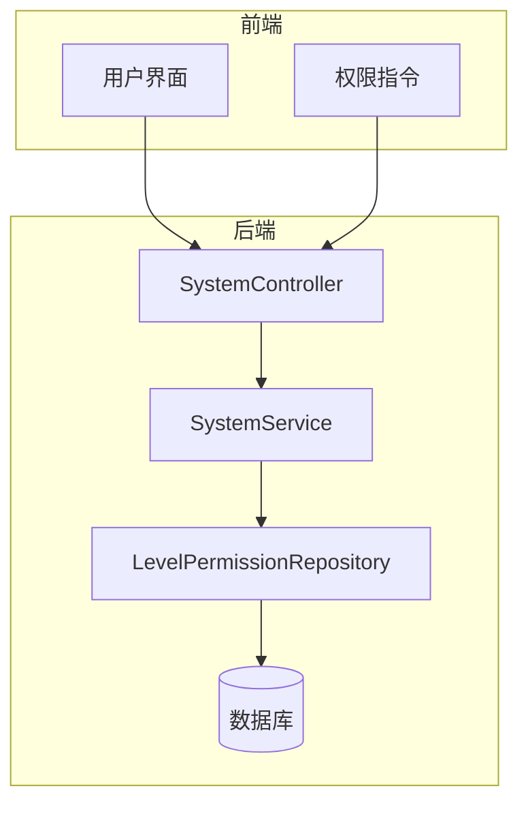
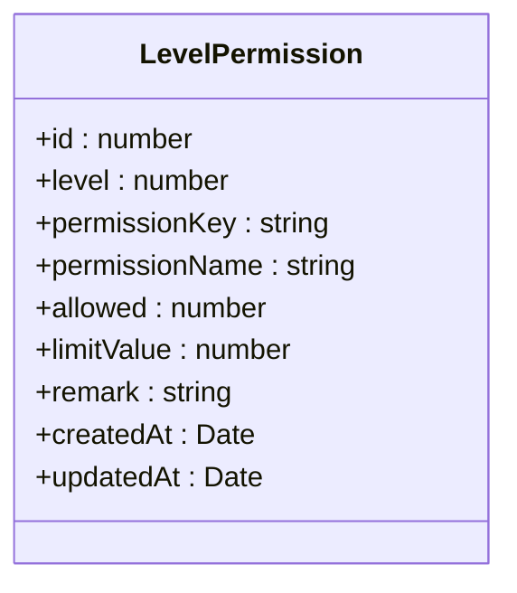
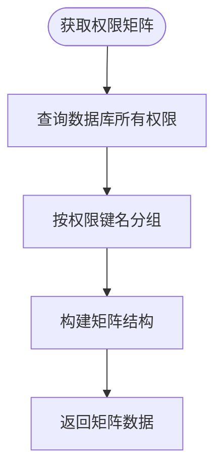
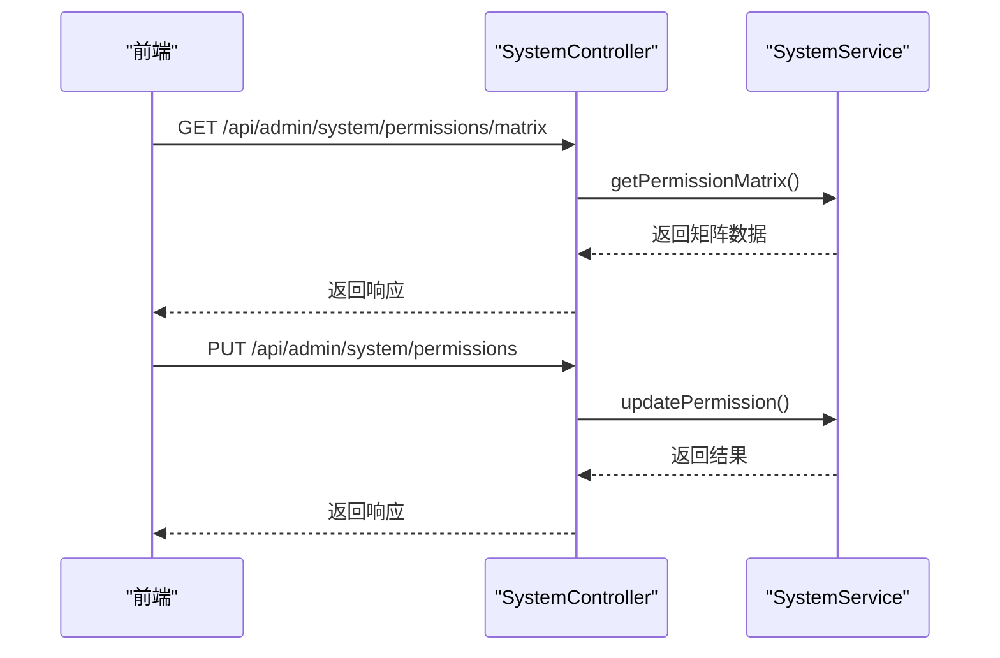
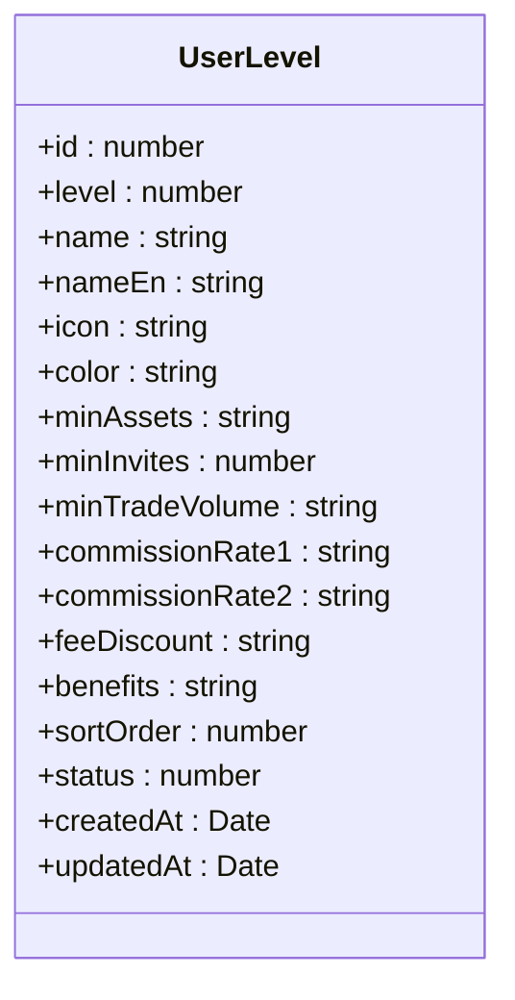
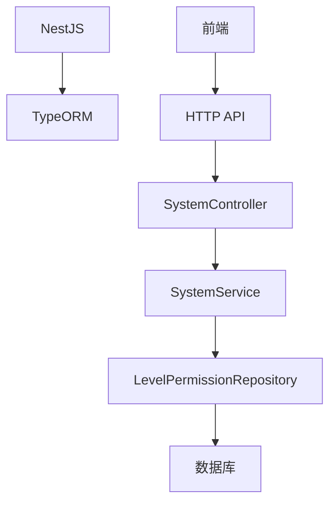

# 等级权限

<cite>
**本文档引用文件**  
- [level-permission.entity.ts](file://agx-backend/src/entities/level-permission.entity.ts)
- [system.service.ts](file://agx-backend/src/modules/system/system.service.ts)
- [system.controller.ts](file://agx-backend/src/modules/system/system.controller.ts)
- [user-level.entity.ts](file://agx-backend/src/entities/user-level.entity.ts)
- [auth.js](file://agx-admin/src/directives/auth/index.js)
</cite>

## 目录
1. [介绍](#介绍)
2. [项目结构](#项目结构)
3. [核心组件](#核心组件)
4. [架构概述](#架构概述)
5. [详细组件分析](#详细组件分析)
6. [依赖分析](#依赖分析)
7. [性能考虑](#性能考虑)
8. [故障排除指南](#故障排除指南)
9. [结论](#结论)

## 介绍
本文档详细描述了系统中的等级权限模型，重点关注 `LevelPermission` 实体。文档涵盖了用户等级与权限的映射关系、字段结构、权限继承机制、动态配置、权限验证流程、细粒度权限控制、权限缓存策略、权限变更广播机制、客户端权限刷新方案、权限配置的版本管理和回滚策略。

## 项目结构
项目分为前端（agx-admin）和后端（agx-backend）两部分。后端使用 NestJS 框架，前端使用 Vue.js。等级权限相关的实体和逻辑主要位于后端的 `agx-backend/src/entities` 和 `agx-backend/src/modules/system` 目录下。

## 核心组件
核心组件包括 `LevelPermission` 实体、`SystemService` 服务和 `SystemController` 控制器。这些组件共同实现了等级权限的定义、查询、更新和管理功能。

**本文档引用文件**  
- [level-permission.entity.ts](file://agx-backend/src/entities/level-permission.entity.ts)
- [system.service.ts](file://agx-backend/src/modules/system/system.service.ts)
- [system.controller.ts](file://agx-backend/src/modules/system/system.controller.ts)

## 架构概述
系统采用分层架构，前端通过 API 与后端交互。后端使用 TypeORM 进行数据库操作，NestJS 提供依赖注入和模块化管理。等级权限数据存储在 `agx_level_permission` 表中，通过 `SystemService` 提供业务逻辑，`SystemController` 暴露 REST API。

**图表来源**  
- [system.controller.ts](file://agx-backend/src/modules/system/system.controller.ts)
- [system.service.ts](file://agx-backend/src/modules/system/system.service.ts)
- [level-permission.entity.ts](file://agx-backend/src/entities/level-permission.entity.ts)

## 详细组件分析

### LevelPermission 实体分析
`LevelPermission` 实体定义了不同用户等级的功能权限和限制。每个权限记录包含等级、权限键名、权限名称、是否允许、限制值等字段。

**图表来源**  
- [level-permission.entity.ts](file://agx-backend/src/entities/level-permission.entity.ts)

**本节来源**  
- [level-permission.entity.ts](file://agx-backend/src/entities/level-permission.entity.ts)

### 权限服务分析
`SystemService` 提供了权限矩阵的查询、单个权限更新、批量权限更新和默认权限初始化等功能。权限矩阵将权限按键名分组，便于前端展示和管理。

**图表来源**  
- [system.service.ts](file://agx-backend/src/modules/system/system.service.ts)

**本节来源**  
- [system.service.ts](file://agx-backend/src/modules/system/system.service.ts)

### 权限控制器分析
`SystemController` 暴露了 REST API，允许前端通过 HTTP 请求管理权限。包括获取权限矩阵、更新单个权限、批量更新权限和初始化默认权限。

**图表来源**  
- [system.controller.ts](file://agx-backend/src/modules/system/system.controller.ts)
- [system.service.ts](file://agx-backend/src/modules/system/system.service.ts)

**本节来源**  
- [system.controller.ts](file://agx-backend/src/modules/system/system.controller.ts)

### 用户等级实体分析
`UserLevel` 实体定义了用户等级的配置，包括等级数值、名称、图标、颜色、最低资产要求、最低邀请人数等。这些配置与 `LevelPermission` 实体协同工作，实现完整的等级权限体系。

**图表来源**  
- [user-level.entity.ts](file://agx-backend/src/entities/user-level.entity.ts)

**本节来源**  
- [user-level.entity.ts](file://agx-backend/src/entities/user-level.entity.ts)

## 依赖分析
系统依赖于 TypeORM 进行数据库操作，NestJS 提供框架支持。前端通过 HTTP API 与后端通信，使用权限指令控制 UI 元素的显示。

**图表来源**  
- [system.controller.ts](file://agx-backend/src/modules/system/system.controller.ts)
- [system.service.ts](file://agx-backend/src/modules/system/system.service.ts)
- [level-permission.entity.ts](file://agx-backend/src/entities/level-permission.entity.ts)

**本节来源**  
- [system.controller.ts](file://agx-backend/src/modules/system/system.controller.ts)
- [system.service.ts](file://agx-backend/src/modules/system/system.service.ts)
- [level-permission.entity.ts](file://agx-backend/src/entities/level-permission.entity.ts)

## 性能考虑
权限数据可以缓存以提高性能。当权限变更时，可以通过消息广播通知客户端刷新权限。批量更新权限时，应使用事务确保数据一致性。

## 故障排除指南
如果权限变更未生效，请检查数据库中的 `agx_level_permission` 表，确认数据已正确更新。检查后端日志，确认没有异常。确保前端正确处理了权限变更的广播消息。

**本节来源**  
- [system.service.ts](file://agx-backend/src/modules/system/system.service.ts)
- [system.controller.ts](file://agx-backend/src/modules/system/system.controller.ts)

## 结论
本文档详细描述了系统的等级权限模型，包括实体结构、服务逻辑、API 接口和前端集成。通过合理的架构设计和实现，系统能够灵活、高效地管理用户权限，支持细粒度的权限控制和动态配置。