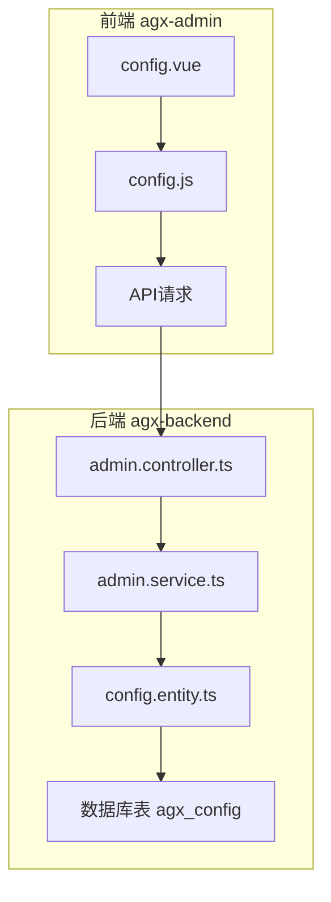
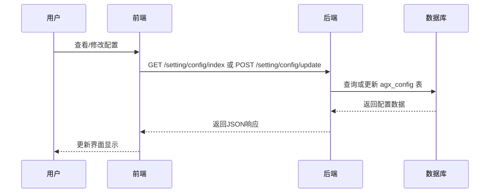
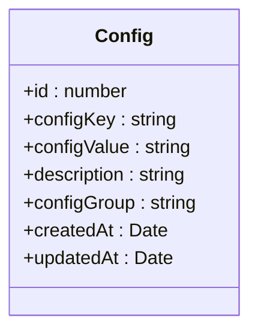
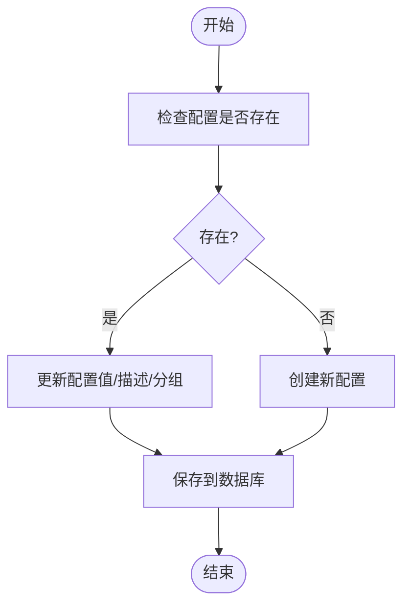
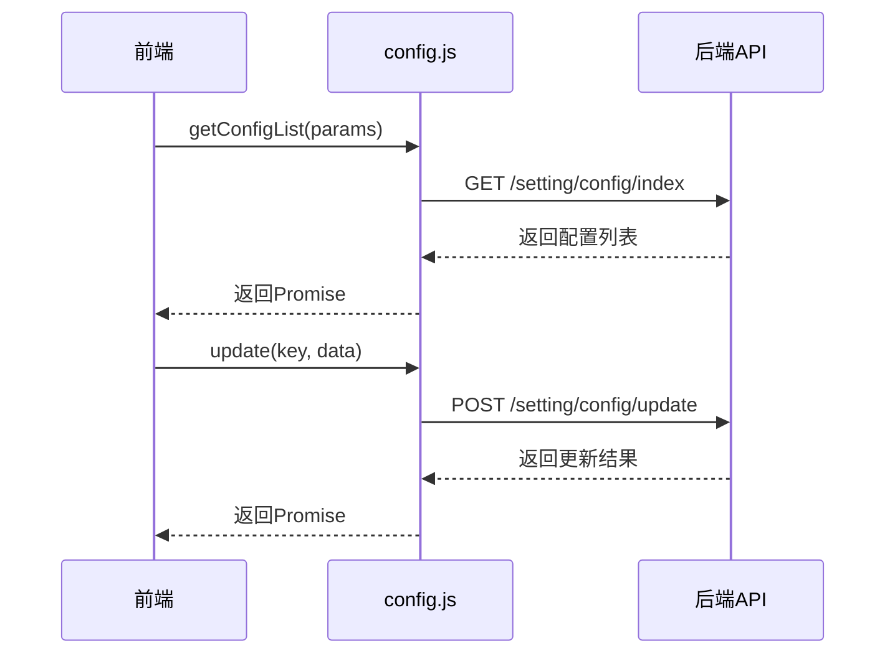

# 系统配置

<cite>
**本文档引用的文件**   
- [config.entity.ts](file://agx-backend/src/entities/config.entity.ts)
- [admin.service.ts](file://agx-backend/src/modules/admin/admin.service.ts)
- [config.js](file://agx-admin/src/api/setting/config.js)
- [config.vue](file://agx-admin/src/views/agx/config.vue)
</cite>

## 目录
1. [简介](#简介)
2. [项目结构](#项目结构)
3. [核心组件](#核心组件)
4. [架构概述](#架构概述)
5. [详细组件分析](#详细组件分析)
6. [依赖分析](#依赖分析)
7. [性能考虑](#性能考虑)
8. [故障排除指南](#故障排除指南)
9. [结论](#结论)
10. [附录](#附录)（如有必要）

## 简介
本文档全面阐述了系统配置模型的实现，重点聚焦于Config实体的设计与实现。文档详细描述了配置项的字段结构、配置分类的组织方式、CRUD操作、缓存机制、实时推送机制以及配置管理API的使用。同时涵盖了配置版本控制、回滚机制和敏感配置的加密存储方案。

## 项目结构
系统配置功能分布在前后端两个主要模块中。后端配置实体和业务逻辑位于`agx-backend`目录下，前端管理界面位于`agx-admin`目录下。



**Diagram sources**
- [config.vue](file://agx-admin/src/views/agx/config.vue)
- [config.js](file://agx-admin/src/api/setting/config.js)
- [admin.controller.ts](file://agx-backend/src/modules/admin/admin.controller.ts)
- [admin.service.ts](file://agx-backend/src/modules/admin/admin.service.ts)
- [config.entity.ts](file://agx-backend/src/entities/config.entity.ts)

**Section sources**
- [config.entity.ts](file://agx-backend/src/entities/config.entity.ts)
- [admin.service.ts](file://agx-backend/src/modules/admin/admin.service.ts)
- [config.js](file://agx-admin/src/api/setting/config.js)
- [config.vue](file://agx-admin/src/views/agx/config.vue)

## 核心组件
系统配置的核心是`Config`实体，它定义了所有配置项的数据结构。该实体通过`admin.service.ts`中的`updateConfig`和`getConfigList`等方法提供CRUD操作。前端通过`config.js`中的API调用与后端交互，并在`config.vue`中提供用户友好的管理界面。

**Section sources**
- [config.entity.ts](file://agx-backend/src/entities/config.entity.ts)
- [admin.service.ts](file://agx-backend/src/modules/admin/admin.service.ts)
- [config.js](file://agx-admin/src/api/setting/config.js)

## 架构概述
系统配置采用典型的前后端分离架构。前端负责展示和用户交互，后端负责数据持久化和业务逻辑处理。



**Diagram sources**
- [config.vue](file://agx-admin/src/views/agx/config.vue)
- [config.js](file://agx-admin/src/api/setting/config.js)
- [admin.controller.ts](file://agx-backend/src/modules/admin/admin.controller.ts)
- [admin.service.ts](file://agx-backend/src/modules/admin/admin.service.ts)
- [config.entity.ts](file://agx-backend/src/entities/config.entity.ts)

## 详细组件分析

### Config实体分析
`Config`实体是系统配置的核心数据模型，定义了配置项的所有属性。



**Diagram sources**
- [config.entity.ts](file://agx-backend/src/entities/config.entity.ts)

#### 配置字段结构
`Config`实体包含以下关键字段：
- **configKey**: 配置键，字符串类型，长度50，唯一索引，对应数据库字段`config_key`，是配置项的唯一标识符。
- **configValue**: 配置值，文本类型，对应数据库字段`config_value`，存储配置的实际内容。
- **description**: 描述，可为空的字符串，长度100，用于说明配置项的用途。
- **configGroup**: 分组，可为空的字符串，长度50，对应数据库字段`config_group`，用于对配置进行分类管理。
- **createdAt**: 创建时间，时间戳类型，由数据库自动填充。
- **updatedAt**: 更新时间，时间戳类型，由数据库自动更新。

**Section sources**
- [config.entity.ts](file://agx-backend/src/entities/config.entity.ts)

### 配置分类组织方式
配置通过`configGroup`字段进行分类组织。前端界面`config.vue`中明确展示了多种配置分组，包括：
- **基础设置 (basic)**: 如平台名称、客服链接、官网地址等。
- **提现设置 (withdraw)**: 如最小提现金额、提现手续费率、每日提现限额等。
- **合约设置 (contract)**: 如默认用户胜率、最小/最大下单金额等。
- **邀请设置 (invite)**: 如一级、二级、三级返佣比例等。
- **矿池设置 (pool)**: 在代码中被引用，但未在前端界面中展示。

这种分组方式使得大量配置项能够被有序地组织和管理，便于管理员快速定位和修改。

**Section sources**
- [config.vue](file://agx-admin/src/views/agx/config.vue)

### 配置CRUD操作
系统提供了完整的配置项创建、读取、更新和删除（CRUD）操作。

#### 创建与更新
创建和更新操作由`admin.service.ts`中的`updateConfig`方法统一处理。当通过`configKey`找不到现有配置时，会创建一条新记录；否则，会更新现有记录的值、描述或分组。



**Diagram sources**
- [admin.service.ts](file://agx-backend/src/modules/admin/admin.service.ts)

#### 读取操作
读取操作通过`getConfigList`方法实现，该方法从数据库查询所有配置，并按`configGroup`和`id`排序，然后将数据转换为前端所需的格式。

#### 删除操作
删除操作通过`delete`方法实现，前端调用`config.js`中的`delete`函数，后端执行相应的数据库删除操作。

**Section sources**
- [admin.service.ts](file://agx-backend/src/modules/admin/admin.service.ts)
- [config.js](file://agx-admin/src/api/setting/config.js)

### 配置读取的缓存机制
虽然代码中没有直接实现配置的Redis缓存策略，但系统集成了Redis监控功能。`agx-admin/src/views/system/monitor/cache/index.vue`文件显示，管理员可以查看Redis的内存使用情况和键值信息，这表明Redis已在系统中作为缓存服务使用。配置数据的缓存很可能是通过应用层的缓存机制或数据库查询缓存来实现的。

**Section sources**
- [index.vue](file://agx-admin/src/views/system/monitor/cache/index.vue)

### 配置变更的实时推送机制
代码库中没有直接证据表明存在配置变更的实时推送机制。然而，`agx-admin/src/utils/Wsocket.js`的存在表明系统支持WebSocket通信，这为实现配置变更的实时推送提供了技术基础。未来可以通过WebSocket在配置更新后向所有连接的客户端发送通知。

**Section sources**
- [Wsocket.js](file://agx-admin/src/utils/Wsocket.js)

### 配置管理API使用示例
前端通过`config.js`文件封装了所有配置管理API。



**Diagram sources**
- [config.js](file://agx-admin/src/api/setting/config.js)

### 环境间配置同步
系统通过`.env`系列文件（如`.env.development`, `.env.production`）来管理不同环境的配置。这些文件位于`agx-admin`和`agx-backend`的根目录下，用于定义环境特定的变量，如数据库连接、API端点等。这确保了应用在不同环境中能正确运行。

**Section sources**
- [.env](file://agx-admin/.env)
- [.env.development](file://agx-admin/.env.development)
- [.env.production](file://agx-admin/.env.production)
- [.env](file://agx-backend/.env)

### 配置版本控制与回滚
代码库中未发现明确的配置版本控制和回滚机制。`config.entity.ts`中没有版本号或历史记录字段。回滚操作可能依赖于数据库的备份和恢复机制，或者通过手动修改配置值来实现。

### 敏感配置加密存储
代码中没有直接的加密存储实现。敏感配置（如API密钥）以明文形式存储在`configValue`字段中。安全性主要依赖于数据库访问控制和网络传输加密（如HTTPS）。建议未来实现对敏感字段的加密存储。

## 依赖分析
系统配置功能依赖于多个组件和外部服务。

```mermaid
graph TD
A[config.vue] --> B[config.js]
B --> C[axios/request]
C --> D[后端HTTP API]
D --> E[admin.controller.ts]
E --> F[admin.service.ts]
F --> G[config.entity.ts]
G --> H[TypeORM]
H --> I[数据库]
F --> J[Redis (用于缓存)]
```

**Diagram sources**
- [config.vue](file://agx-admin/src/views/agx/config.vue)
- [config.js](file://agx-admin/src/api/setting/config.js)
- [admin.controller.ts](file://agx-backend/src/modules/admin/admin.controller.ts)
- [admin.service.ts](file://agx-backend/src/modules/admin/admin.service.ts)
- [config.entity.ts](file://agx-backend/src/entities/config.entity.ts)

## 性能考虑
配置数据的读取是高频操作，因此性能至关重要。通过在`configKey`上建立唯一索引，可以确保查询效率。对于大量配置的读取，应考虑分页或按分组查询，避免一次性加载所有数据。缓存机制（如Redis）可以显著减少数据库查询压力。

## 故障排除指南
- **配置无法保存**: 检查`configKey`是否已存在且唯一，确认后端服务和数据库连接正常。
- **配置未生效**: 确认前端是否正确调用了更新API，检查是否有缓存导致旧值被使用。
- **页面加载缓慢**: 如果配置项过多，考虑优化前端的渲染逻辑或实现分页加载。

**Section sources**
- [admin.service.ts](file://agx-backend/src/modules/admin/admin.service.ts)
- [config.js](file://agx-admin/src/api/setting/config.js)

## 结论
当前的系统配置模型实现了基本的CRUD功能和分类管理，满足了日常运维需求。然而，在配置版本控制、回滚机制和敏感信息加密方面存在改进空间。建议引入配置历史记录表来支持版本控制，并对API密钥等敏感字段实施加密存储，以提升系统的安全性和可维护性。