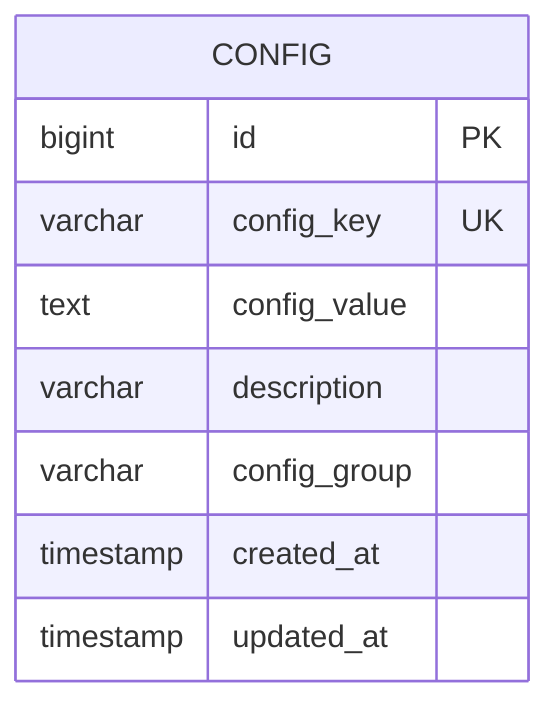
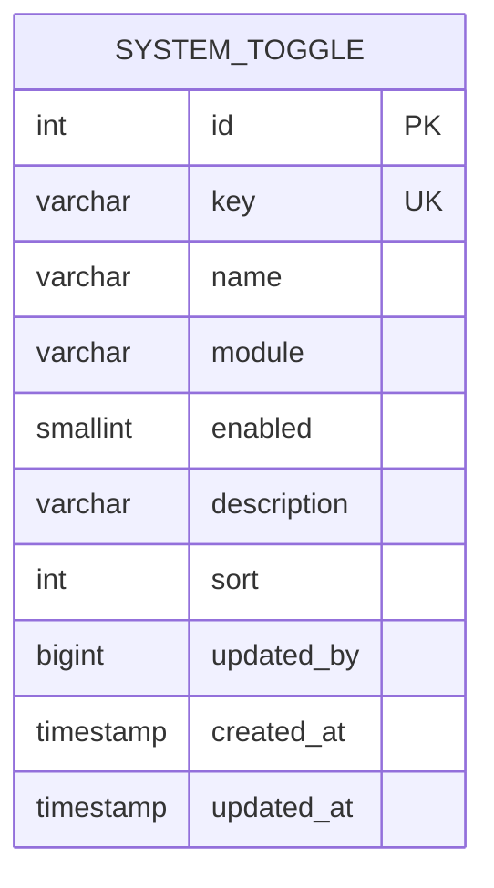
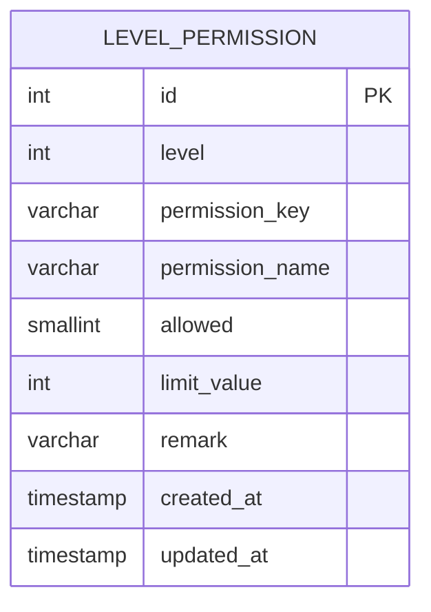
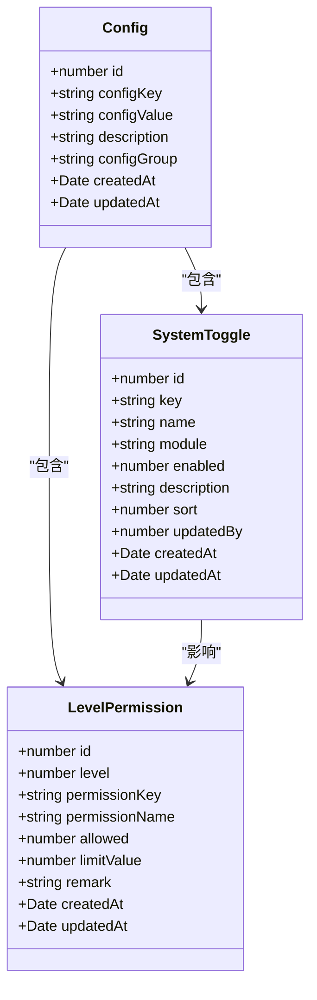
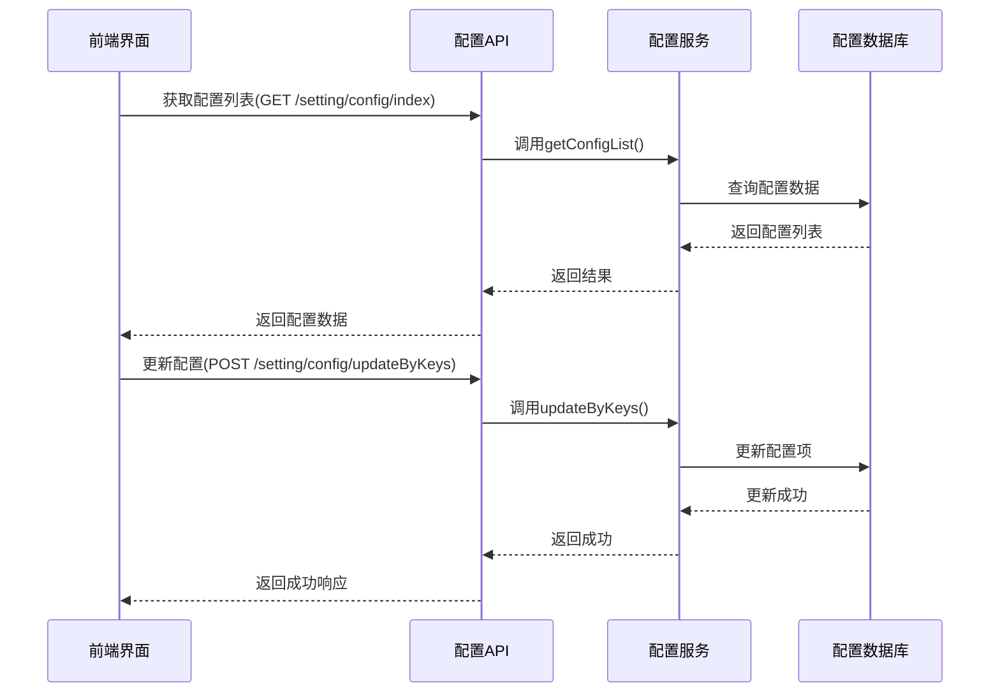
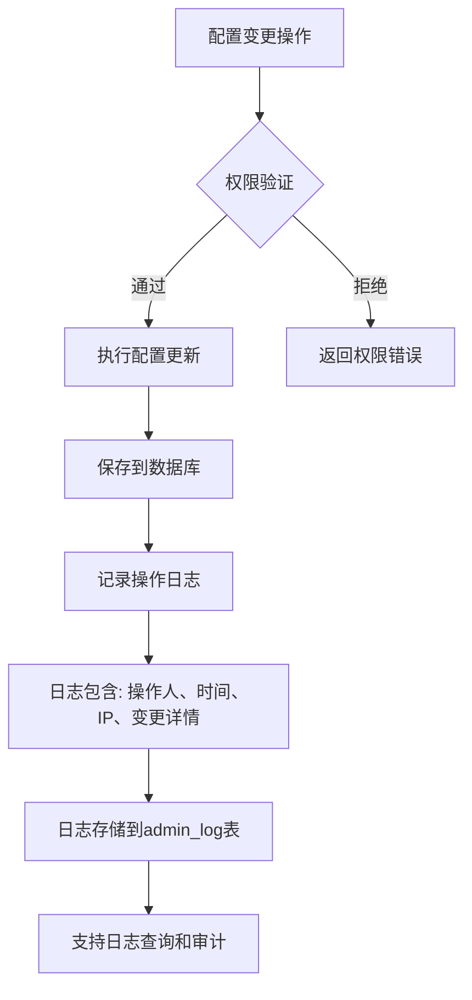
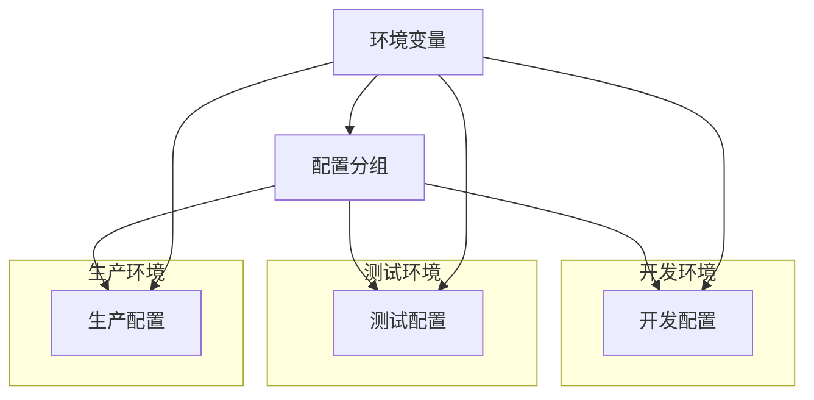
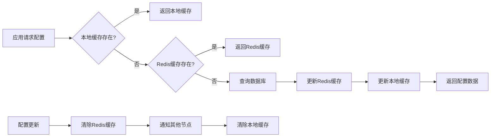
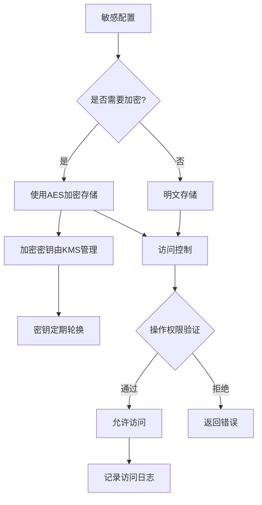
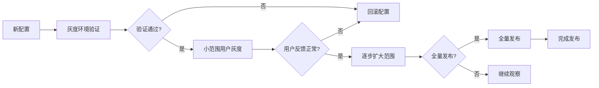

# 配置模型

<cite>
**本文档引用文件**  
- [config.entity.ts](file://agx-backend/src/entities/config.entity.ts)
- [system-toggle.entity.ts](file://agx-backend/src/entities/system-toggle.entity.ts)
- [level-permission.entity.ts](file://agx-backend/src/entities/level-permission.entity.ts)
- [system.service.ts](file://agx-backend/src/modules/system/system.service.ts)
- [admin.service.ts](file://agx-backend/src/modules/admin/admin.service.ts)
- [config.js](file://agx-admin/src/api/setting/config.js)
- [index.vue](file://agx-admin/src/views/setting/config/index.vue)
</cite>

## 目录
1. [简介](#简介)
2. [配置实体模型](#配置实体模型)
3. [系统开关实体](#系统开关实体)
4. [等级权限实体](#等级权限实体)
5. [配置与权限关系](#配置与权限关系)
6. [动态配置管理机制](#动态配置管理机制)
7. [配置变更审计追踪](#配置变更审计追踪)
8. [多环境配置管理策略](#多环境配置管理策略)
9. [配置读取缓存实现](#配置读取缓存实现)
10. [配置安全策略](#配置安全策略)
11. [配置灰度发布机制](#配置灰度发布机制)

## 简介
本系统采用基于数据库的集中式配置管理模型，通过`Config`、`SystemToggle`和`LevelPermission`三个核心实体实现系统配置、功能开关和用户等级权限的统一管理。配置系统支持动态更新、实时生效、多环境隔离和权限控制，确保系统灵活性和安全性。

## 配置实体模型

`Config`实体是系统核心配置存储模型，用于存储各种系统参数和业务配置项。

**字段说明：**
- `id`: 配置项ID，自增主键
- `configKey`: 配置键名，唯一标识，长度限制50字符
- `configValue`: 配置值，支持文本格式，用于存储各种类型的数据
- `description`: 配置描述，可选字段，最大长度100字符
- `configGroup`: 配置分组，用于分类管理，如"basic"、"email"、"sms"等
- `createdAt`: 创建时间戳
- `updatedAt`: 更新时间戳

**数据类型与分类：**
- 基础配置：系统名称、logo、版权信息等
- 服务配置：邮件服务、短信服务、支付服务等第三方集成配置
- 功能配置：各种业务功能的开关和参数设置
- 安全配置：密码策略、登录限制、验证码设置等

**Section sources**
- [config.entity.ts](file://agx-backend/src/entities/config.entity.ts#L1-L31)

## 系统开关实体

`SystemToggle`实体用于管理系统的功能开关，实现功能的动态开启和关闭。

**字段说明：**
- `id`: 开关ID，自增主键
- `key`: 开关键名，唯一标识，如"allow_post"、"allow_comment"
- `name`: 开关名称，用于显示
- `module`: 所属模块，如"social"、"trade"、"asset"
- `enabled`: 是否开启，0关闭，1开启
- `description`: 描述说明
- `sort`: 排序字段
- `updatedBy`: 最后修改人ID

**默认开关配置：**
- 社交模块：发帖、评论、点赞、加好友、私聊
- 交易模块：现货交易、合约交易、黄金交易
- 资产模块：充值、提现、划转

**Section sources**
- [system-toggle.entity.ts](file://agx-backend/src/entities/system-toggle.entity.ts#L1-L48)

## 等级权限实体

`LevelPermission`实体定义了不同用户等级的功能权限和使用限制。

**字段说明：**
- `id`: 权限记录ID，自增主键
- `level`: 用户等级，1=普通，2=银牌，3=金牌，4=钻石，5=黑金
- `permissionKey`: 权限键名，如"can_post"、"daily_post_limit"
- `permissionName`: 权限名称
- `allowed`: 是否允许，0不允许，1允许
- `limitValue`: 限制值，如每日发帖上限、好友数量上限
- `remark`: 备注说明

**等级定义：**
- 1级：普通用户
- 2级：银牌用户
- 3级：金牌用户
- 4级：钻石用户
- 5级：黑金用户

**Section sources**
- [level-permission.entity.ts](file://agx-backend/src/entities/level-permission.entity.ts#L1-L46)

## 配置与权限关系

配置系统通过`Config`、`SystemToggle`和`LevelPermission`三个实体的协同工作，实现多层次的权限控制。

**关系说明：**
- `Config`实体存储系统的基础配置和参数
- `SystemToggle`实体管理全局功能开关，控制功能的开启和关闭
- `LevelPermission`实体定义不同等级用户的权限和限制
- 功能开关和等级权限共同决定了用户的具体操作权限

**Section sources**
- [system.service.ts](file://agx-backend/src/modules/system/system.service.ts#L1-L187)

## 动态配置管理机制

系统提供完整的动态配置管理API，支持配置的增删改查和批量操作。

**主要API接口：**
- `GET /setting/config/index`: 获取配置列表
- `POST /setting/config/save`: 保存新配置
- `POST /setting/config/update`: 更新配置
- `POST /setting/config/updateByKeys`: 批量更新配置
- `DELETE /setting/config/delete`: 删除配置

**Section sources**
- [admin.service.ts](file://agx-backend/src/modules/admin/admin.service.ts#L1151-L1199)
- [config.js](file://agx-admin/src/api/setting/config.js#L1-L124)

## 配置变更审计追踪

系统通过管理日志记录所有配置变更操作，确保操作可追溯。

**审计信息包括：**
- 操作人ID
- 操作时间
- IP地址
- 用户代理
- 操作模块
- 操作动作
- 操作详情

**Section sources**
- [admin-log.entity.ts](file://agx-backend/src/entities/admin-log.entity.ts#L1-L40)

## 多环境配置管理策略

系统通过配置分组和环境变量实现多环境配置管理。

**实现方式：**
- 使用`.env`文件管理环境特定配置
- 配置分组区分不同环境的配置项
- 启动时根据环境变量加载对应配置
- 支持配置的导入导出和备份

**Section sources**
- [.env](file://agx-admin/.env)
- [.env.development](file://agx-admin/.env.development)
- [.env.production](file://agx-admin/.env.production)

## 配置读取缓存实现

系统采用Redis缓存配置数据，提高读取性能并保证一致性。

**缓存策略：**
- 一级缓存：应用本地内存缓存
- 二级缓存：Redis分布式缓存
- 缓存失效：配置更新时清除相关缓存
- 缓存同步：通过消息队列通知其他节点

**Section sources**
- [index.vue](file://agx-admin/src/views/system/monitor/cache/index.vue#L30-L126)

## 配置安全策略

系统实施严格的配置安全策略，保护敏感配置数据。

**安全措施：**
- 敏感配置加密存储
- 配置访问权限控制
- 操作日志记录
- 配置变更审批流程
- 定期安全审计

**Section sources**
- [config.entity.ts](file://agx-backend/src/entities/config.entity.ts#L1-L31)

## 配置灰度发布机制

系统支持配置的灰度发布，确保配置变更的安全性。

**灰度策略：**
- 按用户等级灰度
- 按地域灰度
- 按设备类型灰度
- 按随机比例灰度
- 支持快速回滚

**Section sources**
- [system.service.ts](file://agx-backend/src/modules/system/system.service.ts#L1-L187)