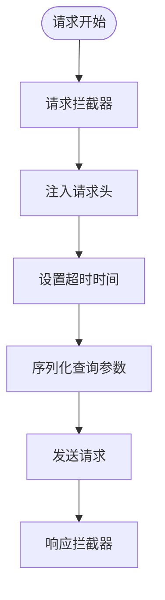

# HTTP通信

<cite>
**本文档引用的文件**   
- [request.js](file://agx-admin/src/utils/request.js)
- [user.js](file://agx-admin/src/api/system/user.js)
- [menu.js](file://agx-admin/src/api/system/menu.js)
- [common.js](file://agx-admin/src/api/common.js)
- [system.controller.ts](file://agx-backend/src/modules/system/system.controller.ts)
- [account.controller.ts](file://agx-backend/src/modules/account/account.controller.ts)
- [admin.controller.ts](file://agx-backend/src/modules/admin/admin.controller.ts)
- [.env.development](file://agx-admin/.env.development)
- [.env.production](file://agx-admin/.env.production)
- [vite.config.js](file://agx-admin/vite.config.js)
</cite>

## 目录
1. [HTTP客户端概述](#http客户端概述)
2. [请求/响应拦截器](#请求响应拦截器)
3. [错误处理机制](#错误处理机制)
4. [请求头自动注入](#请求头自动注入)
5. [createService与createExternalService](#createservice与createexternalservice)
6. [代理配置](#代理配置)
7. [API模块调用示例](#api模块调用示例)
8. [RESTful路由映射](#restful路由映射)
9. [最佳实践](#最佳实践)

## HTTP客户端概述

本文档详细说明了前端与后端之间的同步请求交互机制，重点介绍基于Axios封装的HTTP客户端实现。该客户端位于`agx-admin/src/utils/request.js`文件中，提供了完整的请求处理、错误处理和安全机制。

**HTTP客户端核心功能包括：**
- 基于Axios的请求封装
- 请求/响应拦截器
- 统一的错误处理机制
- 自动的请求头注入
- 代理配置支持
- 外部服务请求支持

**Section sources**
- [request.js](file://agx-admin/src/utils/request.js#L1-L165)

## 请求/响应拦截器

### 请求拦截器

在`request.js`中实现了请求拦截器，用于在请求发送前进行预处理。`createService`和`createExternalService`都配置了请求拦截器，但`createService`的拦截器更为完整。

请求拦截器的主要功能包括：
- 自动注入认证令牌（Authorization）
- 设置语言偏好（Accept-Language）
- 配置内容类型（Content-Type）
- 设置请求超时时间
- 查询参数序列化



**Diagram sources**
- [request.js](file://agx-admin/src/utils/request.js#L34-L42)

### 响应拦截器

响应拦截器负责处理服务器返回的响应数据，包括成功响应和错误响应的处理。

响应拦截器的主要功能：
- 检查响应内容类型
- 处理非JSON响应（如文件下载）
- 验证API响应状态码
- 显示错误消息
- 处理特定HTTP状态码


**Diagram sources**
- [request.js](file://agx-admin/src/utils/request.js#L44-L97)

## 错误处理机制

### HTTP状态码处理

HTTP客户端实现了全面的错误处理机制，针对不同的HTTP状态码提供相应的处理策略：


**Diagram sources**
- [request.js](file://agx-admin/src/utils/request.js#L62-L96)

### 特定状态码处理

#### 401未授权处理

当收到401状态码时，系统会执行以下操作：
1. 显示"登录状态已过期，需要重新登录"的消息
2. 清除本地存储的认证令牌
3. 重定向用户到登录页面

此过程通过节流函数(throttle)实现，防止在短时间内重复执行。

#### 403权限拒绝处理

当收到403状态码时，系统会显示"没有权限访问该资源"的错误消息，提示用户当前账户没有足够的权限访问请求的资源。

#### 404资源不存在处理

当收到404状态码时，系统会显示"服务器资源不存在"的错误消息，可能的原因包括：
- 请求的API端点不存在
- 请求的资源已被删除
- URL路径错误

#### 500服务器内部错误处理

当收到500状态码时，系统会显示"服务器内部错误"的错误消息，表示服务器在处理请求时发生了内部错误。

**Section sources**
- [request.js](file://agx-admin/src/utils/request.js#L72-L90)

## 请求头自动注入

### 认证令牌注入

HTTP客户端自动在每个请求中注入认证令牌，确保用户身份验证：

```javascript
Authorization: "Bearer " + token
```

令牌从本地存储中获取，使用环境变量`VITE_APP_TOKEN_PREFIX`作为键名前缀。

### 语言偏好设置

客户端自动注入用户的语言偏好设置：

```javascript
'Accept-Language': setting?.language || 'zh_CN'
```

语言设置从本地存储的`setting`对象中获取，如果未设置则默认使用中文(zh_CN)。

### 内容类型设置

默认的内容类型设置为：

```javascript
'Content-Type': 'application/json;charset=UTF-8'
```

如果请求中指定了其他内容类型，则使用请求中指定的值。


**Diagram sources**
- [request.js](file://agx-admin/src/utils/request.js#L130-L137)

## createService与createExternalService

### 功能区别

`createService`和`createExternalService`是两个不同的axios实例创建函数，用于处理不同类型的请求。

| 特性 | createService | createExternalService |
|------|---------------|----------------------|
| 用途 | 内部API请求 | 外部服务请求 |
| 错误处理 | 完整的错误处理和UI反馈 | 简单的错误传递 |
| 请求拦截 | 完整的请求预处理 | 无特殊处理 |
| 响应拦截 | 复杂的响应处理和错误显示 | 简单的响应传递 |

### 使用场景

#### createService使用场景

`createService`用于处理与本系统后端API的通信，适用于：
- 系统内部API调用
- 需要认证的请求
- 需要统一错误处理的请求
- 需要自动注入请求头的请求

#### createExternalService使用场景

`createExternalService`用于处理外部服务的请求，适用于：
- 第三方API调用
- 跨域请求
- 不需要特殊错误处理的请求
- 外部资源获取


**Section sources**
- [request.js](file://agx-admin/src/utils/request.js#L10-L28)
- [request.js](file://agx-admin/src/utils/request.js#L30-L99)

## 代理配置

### 环境变量配置

代理配置通过环境变量进行管理，支持不同环境的配置：

```env
VITE_APP_OPEN_PROXY = true
VITE_APP_BASE_URL = http://127.0.0.1:3000
VITE_APP_PROXY_PREFIX = /api
```

### 开发环境配置

在开发环境中，代理配置如下：
- 基础URL：`http://127.0.0.1:3000`
- 代理前缀：`/api`
- WebSocket URL：`ws://127.0.0.1:3000/ws`

### 生产环境配置

在生产环境中，代理配置如下：
- 基础URL：`https://agx.bi/api`
- 代理前缀：`/prod`
- WebSocket URL：`ws://127.0.0.1:9502/message.io`

### Vite代理设置

Vite配置中的代理设置实现了请求转发：

```javascript
proxy: {
  [proxyPrefix]: {
    target: env.VITE_APP_BASE_URL,
    changeOrigin: true,
    ws: true,
    toProxy: true,
    rewrite: path => path.replace(new RegExp(`^${proxyPrefix}`), ''),
  },
}
```

此配置将带有代理前缀的请求转发到目标服务器，并重写URL路径。


**Diagram sources**
- [.env.development](file://agx-admin/.env.development#L4-L6)
- [.env.production](file://agx-admin/.env.production#L6-L8)
- [vite.config.js](file://agx-admin/vite.config.js#L36-L43)

## API模块调用示例

### 用户管理API

用户管理API模块展示了如何使用`request`方法发起各种请求：

```javascript
import { request } from '@/utils/request.js'

export default {
  getPageList(params = {}) {
    return request({
      url: 'system/user/index',
      method: 'get',
      params
    })
  },
  
  save(params = {}) {
    return request({
      url: 'system/user/save',
      method: 'post',
      data: params
    })
  },
  
  update(id, data = {}) {
    return request({
      url: 'system/user/update/' + id,
      method: 'put',
      data
    })
  }
}
```

### 菜单管理API

菜单管理API展示了GET、POST、PUT和DELETE请求的使用：

```javascript
import { request } from '@/utils/request.js'

export default {
  getList(params = {}) {
    return request({
      url: 'system/menu/index',
      method: 'get',
      params
    })
  },
  
  save(params = {}) {
    return request({
      url: 'system/menu/save',
      method: 'post',
      data: params
    })
  },
  
  update(id, data = {}) {
    return request({
      url: 'system/menu/update/' + id,
      method: 'put',
      data
    })
  },
  
  deletes(data) {
    return request({
      url: 'system/menu/delete',
      method: 'delete',
      data
    })
  }
}
```

### 通用API

通用API模块提供了各种实用的请求方法：

```javascript
import { request } from '@/utils/request.js'

export default {
  uploadImage(data = {}) {
    return request({
      url: 'system/uploadImage',
      method: 'post',
      timeout: 30000,
      data
    })
  },
  
  download(url, method = 'post') {
    return request({ 
      url, 
      method, 
      responseType: 'blob' 
    })
  },
  
  getDict(code) {
    return request({
      url: 'system/dataDict/list?code=' + code,
      method: 'get'
    })
  }
}
```


**Diagram sources**
- [user.js](file://agx-admin/src/api/system/user.js#L8-L170)
- [menu.js](file://agx-admin/src/api/system/menu.js#L8-L123)
- [common.js](file://agx-admin/src/api/common.js#L8-L263)

## RESTful路由映射

### 系统管理模块

系统管理模块的RESTful路由映射：


对应的API端点：
- `GET /api/admin/system/toggles` - 获取功能开关
- `PUT /api/admin/system/toggles/:key` - 更新功能开关
- `GET /api/admin/system/permissions` - 获取权限设置
- `PUT /api/admin/system/permissions` - 更新权限设置

### 账户管理模块

账户管理模块的RESTful路由映射：


对应的API端点：
- `POST /api/account/register` - 用户注册
- `POST /api/account/login` - 用户登录
- `GET /api/account/profile` - 获取用户资料
- `PUT /api/account/profile` - 更新用户资料
- `POST /api/account/password` - 修改密码

### 管理员模块

管理员模块的RESTful路由映射：


对应的API端点：
- `POST /api/admin/login` - 管理员登录
- `GET /api/admin/user/list` - 获取用户列表
- `PUT /api/admin/user/:id/status` - 更新用户状态
- `GET /api/admin/currency/list` - 获取币种列表
- `POST /api/admin/currency` - 新增币种

**Section sources**
- [system.controller.ts](file://agx-backend/src/modules/system/system.controller.ts#L7-L78)
- [account.controller.ts](file://agx-backend/src/modules/account/account.controller.ts#L8-L160)
- [admin.controller.ts](file://agx-backend/src/modules/admin/admin.controller.ts#L32-L364)

## 最佳实践

### 自定义请求配置

在发起请求时，可以自定义各种配置选项：

```javascript
request({
  url: 'system/user/index',
  method: 'get',
  params: { page: 1, limit: 10 },
  timeout: 15000,
  headers: {
    'Custom-Header': 'custom-value'
  }
})
```

### 超时设置

可以根据请求类型设置不同的超时时间：

```javascript
// 普通请求 - 10秒超时
request({
  url: 'system/user/index',
  method: 'get'
})

// 文件上传 - 30秒超时
request({
  url: 'system/uploadImage',
  method: 'post',
  timeout: 30000,
  data: formData
})
```

### 查询参数序列化

查询参数会自动序列化为URL参数：

```javascript
request({
  url: 'system/user/index',
  method: 'get',
  params: {
    name: '张三',
    status: 1,
    dept: {
      id: 1,
      name: '技术部'
    }
  }
})
// 生成的URL: system/user/index?name=张三&status=1&dept[id]=1&dept[name]=技术部
```

### 错误处理最佳实践

在调用API时，应妥善处理可能的错误：

```javascript
async function loadUserData() {
  try {
    const response = await userApi.getPageList({ page: 1, limit: 10 })
    // 处理成功响应
    this.userData = response
  } catch (error) {
    // 错误已被request.js处理并显示消息
    // 这里可以进行额外的错误处理
    console.error('加载用户数据失败:', error)
  }
}
```

### 文件下载处理

下载文件时需要特殊处理响应类型：

```javascript
request({
  url: 'system/export/users',
  method: 'post',
  responseType: 'blob'
}).then(response => {
  const blob = new Blob([response], { type: 'application/octet-stream' })
  const url = window.URL.createObjectURL(blob)
  const a = document.createElement('a')
  a.href = url
  a.download = '用户列表.xlsx'
  a.click()
  window.URL.revokeObjectURL(url)
})
```

**Section sources**
- [request.js](file://agx-admin/src/utils/request.js#L124-L164)
- [common.js](file://agx-admin/src/api/common.js#L202-L204)