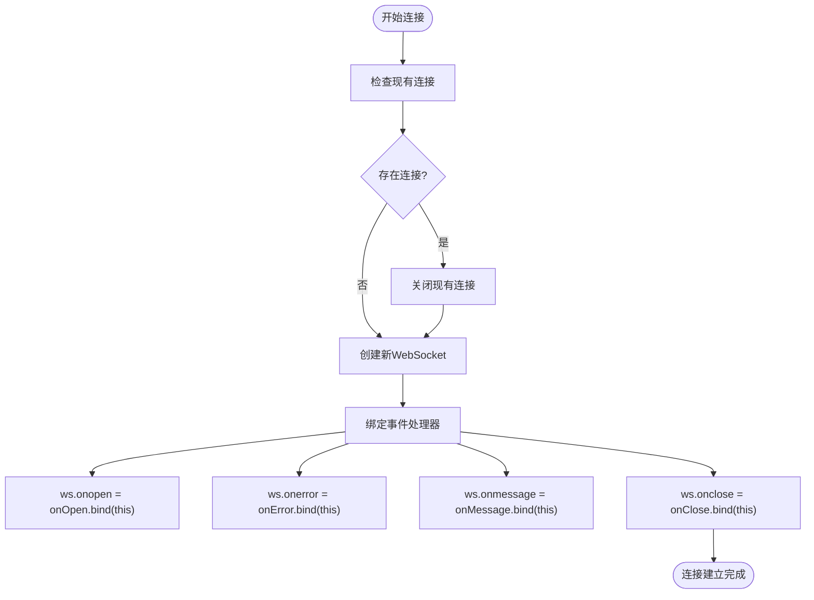

# WebSocket实时通信

<cite>
**本文档引用的文件**
- [Wsocket.js](file://agx-admin/src/utils/Wsocket.js)
- [market.gateway.ts](file://agx-backend/src/modules/market/market.gateway.ts)
- [market.service.ts](file://agx-backend/src/modules/market/market.service.ts)
- [message.js](file://agx-admin/src/ws-serve/message.js)
</cite>

## 目录
1. [简介](#简介)
2. [项目结构](#项目结构)
3. [核心组件](#核心组件)
4. [架构概述](#架构概述)
5. [详细组件分析](#详细组件分析)
6. [依赖分析](#依赖分析)
7. [性能考虑](#性能考虑)
8. [故障排除指南](#故障排除指南)
9. [结论](#结论)

## 简介
本文档详细介绍了AGX系统中的WebSocket实时通信机制，重点分析了客户端与服务器端的双向异步数据推送实现。文档涵盖了`Wsocket.js`中的连接管理、事件绑定、心跳机制、断线重连和消息分发等核心功能，以及后端NestJS WebSocket Gateway如何暴露事件通道和推送市场行情数据。通过本指南，开发者可以深入了解WebSocket的实现原理，掌握订阅特定事件、解析消息格式和管理连接生命周期的最佳实践，并获得性能监控和错误调试的建议。

## 项目结构
AGX系统的WebSocket实现在前后端分离的架构中完成。前端位于`agx-admin`目录，主要包含WebSocket客户端封装和使用；后端位于`agx-backend`目录，负责WebSocket服务端的实现和数据推送。


**图表来源**
- [Wsocket.js](file://agx-admin/src/utils/Wsocket.js)
- [market.gateway.ts](file://agx-backend/src/modules/market/market.gateway.ts)
- [market.service.ts](file://agx-backend/src/modules/market/market.service.ts)
- [message.js](file://agx-admin/src/ws-serve/message.js)

**章节来源**
- [Wsocket.js](file://agx-admin/src/utils/Wsocket.js)
- [market.gateway.ts](file://agx-backend/src/modules/market/market.gateway.ts)

## 核心组件
本系统的核心WebSocket组件包括前端的`Wsocket.js`封装类和后端的`market.gateway.ts`。`Wsocket.js`提供了连接管理、事件绑定、心跳检测和断线重连等高级功能，简化了WebSocket的使用。`market.gateway.ts`基于NestJS WebSocket Gateway实现了服务器端的事件处理和数据推送，支持实时市场行情更新。这两个组件共同构成了系统的实时通信基础。

**章节来源**
- [Wsocket.js](file://agx-admin/src/utils/Wsocket.js#L6-L194)
- [market.gateway.ts](file://agx-backend/src/modules/market/market.gateway.ts)

## 架构概述
系统采用客户端-服务器架构实现WebSocket实时通信。客户端通过`Wsocket`类建立和管理WebSocket连接，服务器端通过NestJS的WebSocket Gateway接收和处理客户端请求，并主动推送数据。


**图表来源**
- [Wsocket.js](file://agx-admin/src/utils/Wsocket.js#L76-L87)
- [market.gateway.ts](file://agx-backend/src/modules/market/market.gateway.ts)
- [market.service.ts](file://agx-backend/src/modules/market/market.service.ts#L11-L208)

**章节来源**
- [Wsocket.js](file://agx-admin/src/utils/Wsocket.js#L6-L194)
- [market.gateway.ts](file://agx-backend/src/modules/market/market.gateway.ts)

## 详细组件分析

### Wsocket.js 客户端封装分析
`Wsocket.js`是一个功能完整的WebSocket客户端封装类，提供了连接管理、事件处理、心跳检测和断线重连等高级功能。

#### 类结构分析


**图表来源**
- [Wsocket.js](file://agx-admin/src/utils/Wsocket.js#L6-L194)

#### 连接管理与事件绑定
`Wsocket`类通过`connection()`方法建立WebSocket连接，该方法首先检查并关闭现有连接，然后创建新的WebSocket实例并绑定事件处理器。事件绑定通过`on()`方法实现，允许客户端订阅特定的事件类型。



**图表来源**
- [Wsocket.js](file://agx-admin/src/utils/Wsocket.js#L76-L87)

**章节来源**
- [Wsocket.js](file://agx-admin/src/utils/Wsocket.js#L69-L71)
- [Wsocket.js](file://agx-admin/src/utils/Wsocket.js#L76-L87)

#### 心跳机制与断线重连
`Wsocket`类实现了完善的心跳检测和断线重连机制。心跳机制通过`sendHeartbeat()`方法实现，定期向服务器发送"PONG"消息以保持连接活跃。断线重连通过`reconnect()`方法实现，当连接意外断开时（状态码1006），会按照配置的间隔和重试次数自动尝试重新连接。


**图表来源**
- [Wsocket.js](file://agx-admin/src/utils/Wsocket.js#L147-L153)
- [Wsocket.js](file://agx-admin/src/utils/Wsocket.js#L158-L174)

**章节来源**
- [Wsocket.js](file://agx-admin/src/utils/Wsocket.js#L24-L28)
- [Wsocket.js](file://agx-admin/src/utils/Wsocket.js#L34-L39)
- [Wsocket.js](file://agx-admin/src/utils/Wsocket.js#L147-L174)

#### 消息分发机制
`Wsocket`类的消息分发机制通过`onMessage()`方法实现。该方法首先解析接收到的JSON数据，然后根据消息中的`event`字段查找对应的事件处理器并执行。如果找不到对应的事件处理器，则输出警告信息。


**图表来源**
- [Wsocket.js](file://agx-admin/src/utils/Wsocket.js#L137-L142)

**章节来源**
- [Wsocket.js](file://agx-admin/src/utils/Wsocket.js#L137-L142)

### market.gateway.ts 服务端分析
`market.gateway.ts`是基于NestJS WebSocket Gateway实现的服务器端组件，负责处理客户端连接和数据推送。

#### 事件通道暴露


**图表来源**
- [market.gateway.ts](file://agx-backend/src/modules/market/market.gateway.ts)

#### 市场行情数据推送


**图表来源**
- [market.gateway.ts](file://agx-backend/src/modules/market/market.gateway.ts)
- [market.service.ts](file://agx-backend/src/modules/market/market.service.ts#L39-L65)

**章节来源**
- [market.gateway.ts](file://agx-backend/src/modules/market/market.gateway.ts)
- [market.service.ts](file://agx-backend/src/modules/market/market.service.ts#L39-L65)

### 客户端订阅与消息格式
客户端通过发送包含`event`字段的消息来订阅特定事件，服务器端根据`event`字段进行相应的处理并返回数据。

#### 消息格式解析
```mermaid
erDiagram
MESSAGE {
string event PK
string message
object data
}
SUBSCRIBE_MARKET {
string event PK "market_subscribe"
string message "订阅市场行情"
object data {
string assetType "资产类型"
string subTab "子分类"
}
}
GET_UNREAD_MESSAGE {
string event PK "get_unread_message"
string message "获取未读消息"
object data ""
}
MARKET_DATA {
string event PK "market_data"
string message "市场行情数据"
object data {
array tickers "行情列表"
string assetType "资产类型"
}
}
MESSAGE ||--o{ SUBSCRIBE_MARKET : "包含"
MESSAGE ||--o{ GET_UNREAD_MESSAGE : "包含"
MESSAGE ||--o{ MARKET_DATA : "包含"
```

**图表来源**
- [Wsocket.js](file://agx-admin/src/utils/Wsocket.js#L138-L141)
- [message.js](file://agx-admin/src/ws-serve/message.js#L32)

**章节来源**
- [Wsocket.js](file://agx-admin/src/utils/Wsocket.js#L138-L141)
- [message.js](file://agx-admin/src/ws-serve/message.js#L32)

## 依赖分析
系统WebSocket功能的实现依赖于多个组件和库的协同工作。


**图表来源**
- [package.json](file://agx-backend/package.json)
- [Wsocket.js](file://agx-admin/src/utils/Wsocket.js)
- [market.gateway.ts](file://agx-backend/src/modules/market/market.gateway.ts)
- [market.service.ts](file://agx-backend/src/modules/market/market.service.ts)

**章节来源**
- [package.json](file://agx-backend/package.json)
- [Wsocket.js](file://agx-admin/src/utils/Wsocket.js)
- [market.gateway.ts](file://agx-backend/src/modules/market/market.gateway.ts)

## 性能考虑
在使用WebSocket实时通信时，需要考虑以下性能因素：

1. **连接管理**：避免频繁创建和销毁WebSocket连接，应重用连接实例。
2. **心跳频率**：合理设置心跳间隔，过短会增加服务器负载，过长可能导致连接被防火墙中断。
3. **消息大小**：控制推送消息的大小，避免一次性推送大量数据。
4. **事件订阅**：客户端应只订阅必要的事件，减少不必要的数据传输。
5. **错误处理**：实现完善的错误处理和重连机制，确保连接的稳定性。

## 故障排除指南
当WebSocket通信出现问题时，可以按照以下步骤进行排查：

1. **检查连接状态**：确认WebSocket连接是否成功建立。
2. **查看控制台日志**：检查浏览器控制台是否有错误信息。
3. **验证服务器地址**：确认WebSocket服务器地址配置正确。
4. **检查网络连接**：确保客户端与服务器之间的网络连接正常。
5. **验证认证信息**：如果需要认证，确认认证信息正确无误。
6. **查看服务器日志**：检查服务器端是否有相关错误日志。

**章节来源**
- [Wsocket.js](file://agx-admin/src/utils/Wsocket.js#L50-L54)
- [Wsocket.js](file://agx-admin/src/utils/Wsocket.js#L128-L130)
- [message.js](file://agx-admin/src/ws-serve/message.js#L16-L22)

## 结论
AGX系统的WebSocket实时通信机制通过前后端的紧密配合，实现了高效、稳定的双向数据推送。前端的`Wsocket.js`封装类提供了完整的连接管理、事件处理、心跳检测和断线重连功能，大大简化了WebSocket的使用。后端的`market.gateway.ts`基于NestJS WebSocket Gateway实现了服务器端的事件处理和数据推送，支持实时市场行情更新。通过本指南，开发者可以深入了解WebSocket的实现原理，掌握最佳实践，并有效进行性能优化和故障排除。