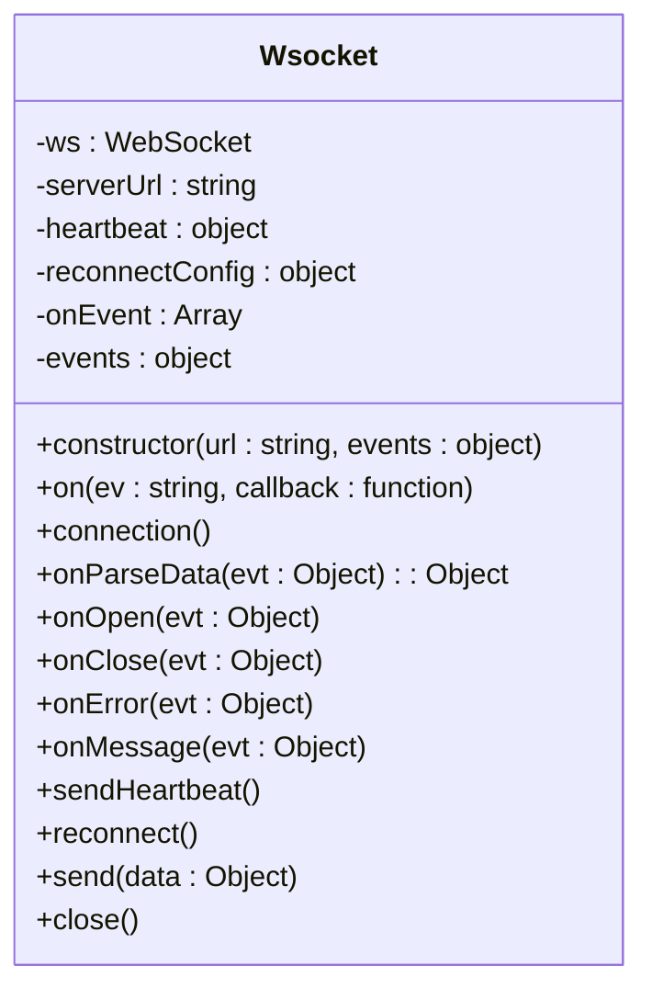
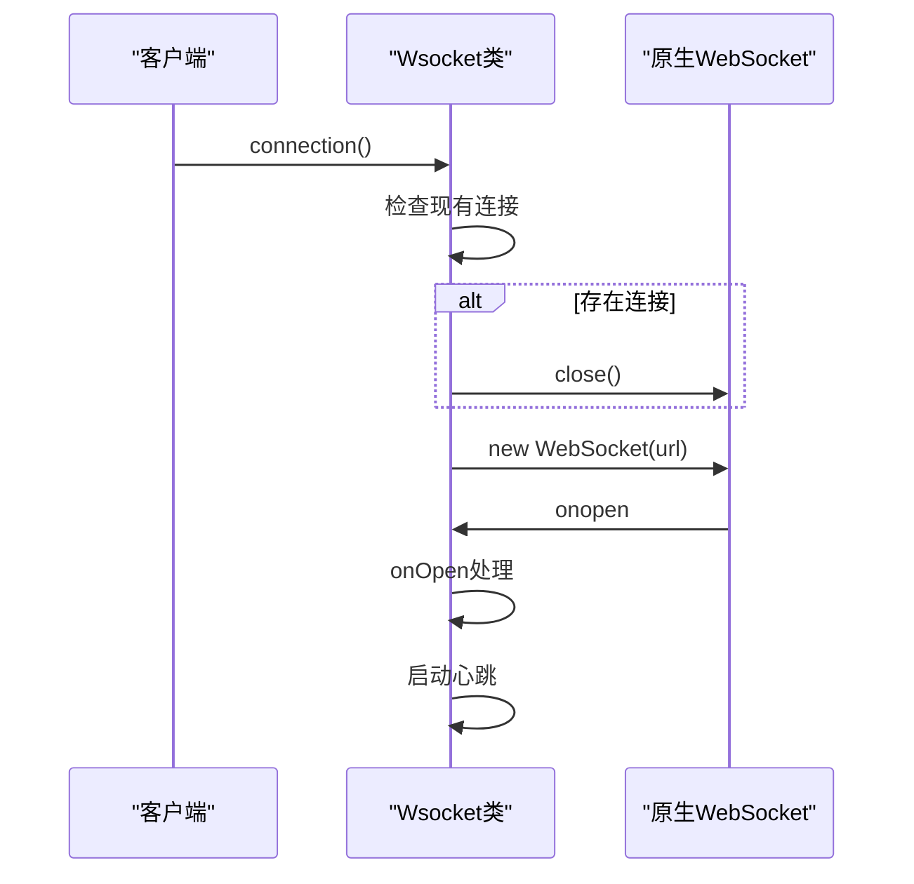
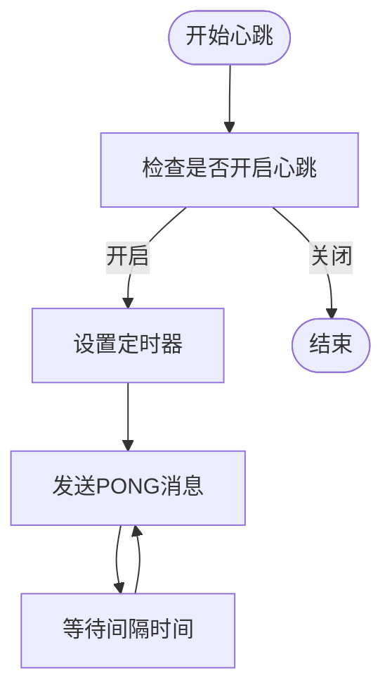
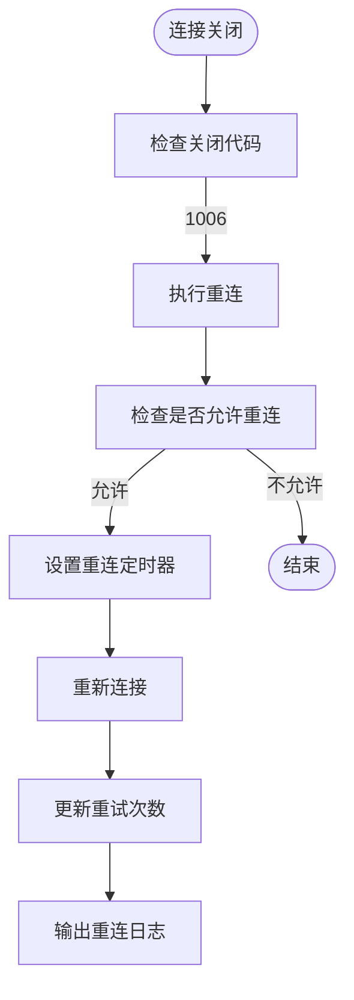
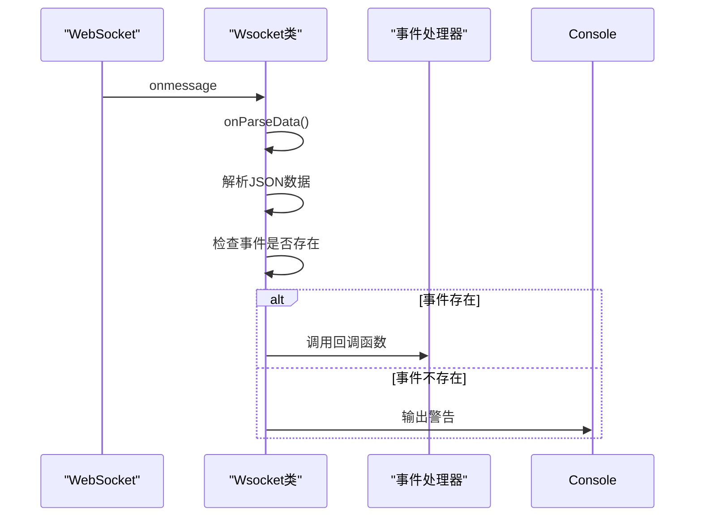
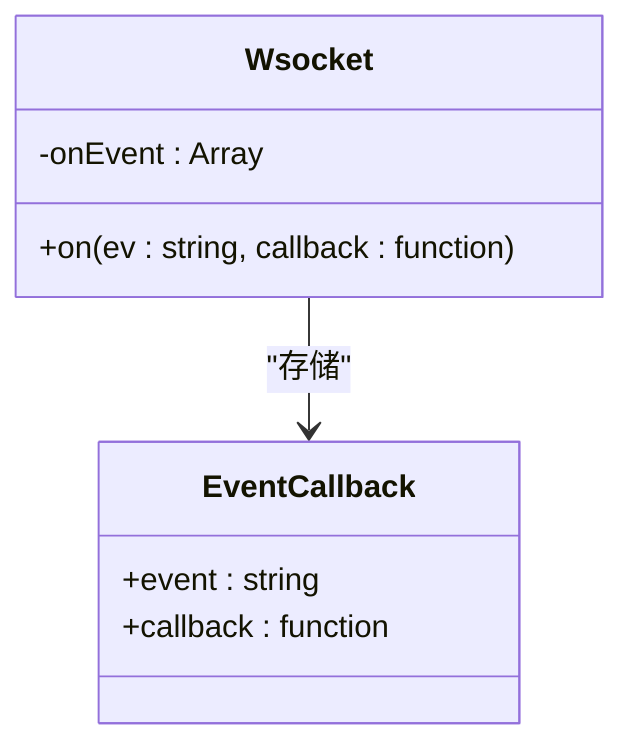
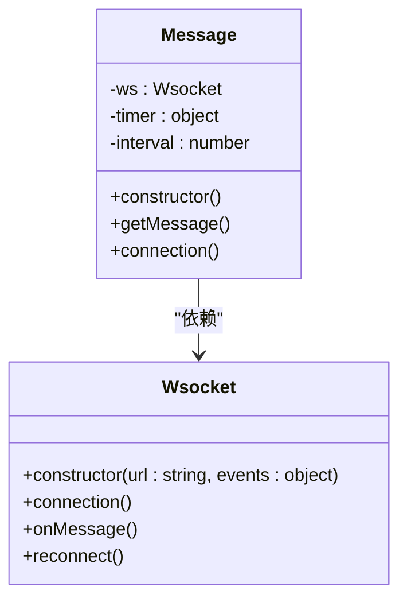
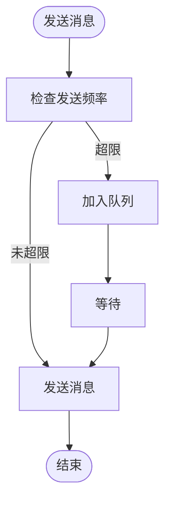
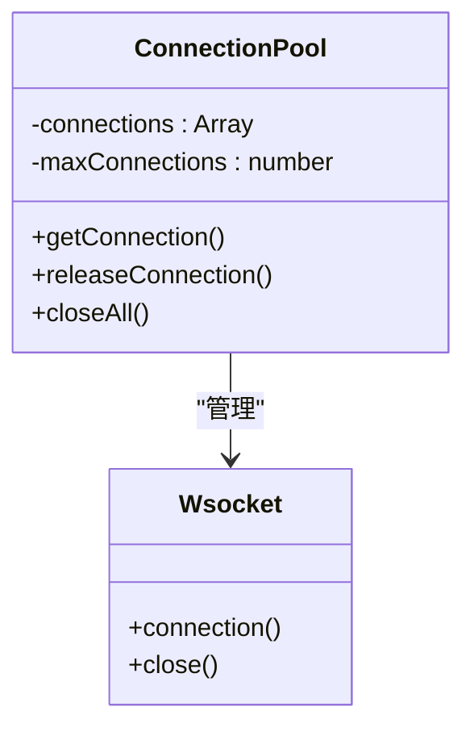

# WebSocket客户端实现

<cite>
**本文档引用的文件**
- [Wsocket.js](file://agx-admin/src/utils/Wsocket.js)
- [message.js](file://agx-admin/src/ws-serve/message.js)
</cite>

## 目录
1. [引言](#引言)
2. [核心组件分析](#核心组件分析)
3. [连接管理机制](#连接管理机制)
4. [心跳维持与断线重连](#心跳维持与断线重连)
5. [消息分发与事件处理](#消息分发与事件处理)
6. [Vue组件中的使用示例](#vue组件中的使用示例)
7. [性能优化建议](#性能优化建议)
8. [结论](#结论)

## 引言
WebSocket客户端实现基于`Wsocket.js`文件中的`Wsocket`类，该类作为单例模式的连接管理器，封装了原生WebSocket API，提供了更稳定的连接体验。本文档详细阐述其核心机制，包括连接建立、心跳维持、断线自动重连和消息分发等关键功能。

## 核心组件分析

`Wsocket`类是WebSocket客户端的核心组件，负责管理WebSocket连接的整个生命周期。它通过封装原生WebSocket API，提供了一套更稳定、易用的接口。

**图示来源**
- [Wsocket.js](file://agx-admin/src/utils/Wsocket.js#L6-L194)

**本节来源**
- [Wsocket.js](file://agx-admin/src/utils/Wsocket.js#L6-L194)

## 连接管理机制

`Wsocket`类通过`connection()`方法建立WebSocket连接。在建立连接前，会先检查是否存在已有的连接，如果存在则关闭旧连接，确保每次连接都是全新的。

**图示来源**
- [Wsocket.js](file://agx-admin/src/utils/Wsocket.js#L76-L87)

**本节来源**
- [Wsocket.js](file://agx-admin/src/utils/Wsocket.js#L76-L87)

## 心跳维持与断线重连

### 心跳机制
`Wsocket`类通过`sendHeartbeat()`方法实现心跳机制，定期向服务器发送"PONG"消息，以保持连接活跃。

**图示来源**
- [Wsocket.js](file://agx-admin/src/utils/Wsocket.js#L147-L152)

### 断线重连机制
当连接意外断开时（WebSocket关闭代码为1006），`Wsocket`类会触发`reconnect()`方法进行自动重连。

**图示来源**
- [Wsocket.js](file://agx-admin/src/utils/Wsocket.js#L158-L173)

**本节来源**
- [Wsocket.js](file://agx-admin/src/utils/Wsocket.js#L147-L173)

## 消息分发与事件处理

### 消息分发机制
`Wsocket`类通过`onMessage()`方法处理接收到的消息，解析数据后根据事件类型分发给相应的回调函数。

**图示来源**
- [Wsocket.js](file://agx-admin/src/utils/Wsocket.js#L137-L142)

### 事件处理机制
`Wsocket`类提供了`on()`方法用于绑定事件，通过`onEvent`对象存储事件回调函数。

**图示来源**
- [Wsocket.js](file://agx-admin/src/utils/Wsocket.js#L69-L71)

**本节来源**
- [Wsocket.js](file://agx-admin/src/utils/Wsocket.js#L137-L142)

## Vue组件中的使用示例

在Vue组件中，可以通过创建`Message`类的实例来使用WebSocket功能。`Message`类封装了`Wsocket`类，提供了更高级的接口。

**图示来源**
- [message.js](file://agx-admin/src/ws-serve/message.js#L4-L41)
- [Wsocket.js](file://agx-admin/src/utils/Wsocket.js#L6-L194)

**本节来源**
- [message.js](file://agx-admin/src/ws-serve/message.js#L4-L41)

## 性能优化建议

### 消息节流
在高并发场景下，可以通过限制消息发送频率来优化性能。

### 连接池管理
通过连接池管理多个WebSocket连接，提高资源利用率。

**本节来源**
- [Wsocket.js](file://agx-admin/src/utils/Wsocket.js#L6-L194)

## 结论
`Wsocket`类作为WebSocket客户端的核心实现，通过封装原生WebSocket API，提供了稳定、可靠的连接管理功能。其单例模式的设计确保了应用中只有一个WebSocket连接实例，避免了资源浪费。心跳机制和断线重连功能保证了连接的稳定性，而灵活的事件处理机制则使得消息分发更加高效。在Vue组件中使用时，通过`Message`类进一步封装，提供了更便捷的接口。在高并发场景下，结合消息节流和连接池管理等优化策略，可以进一步提升性能。