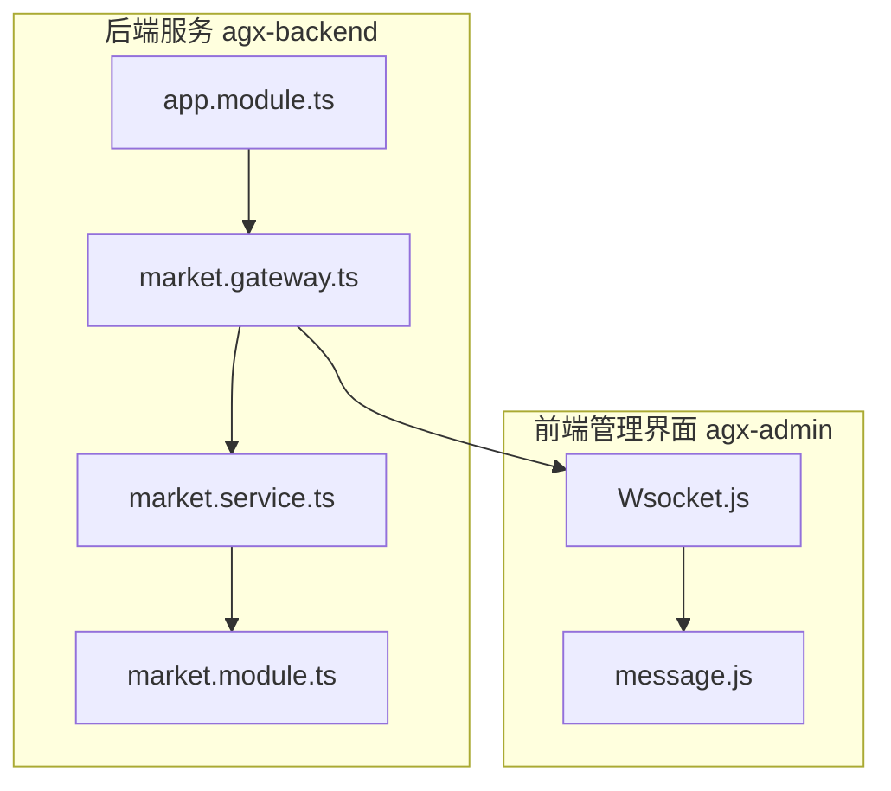
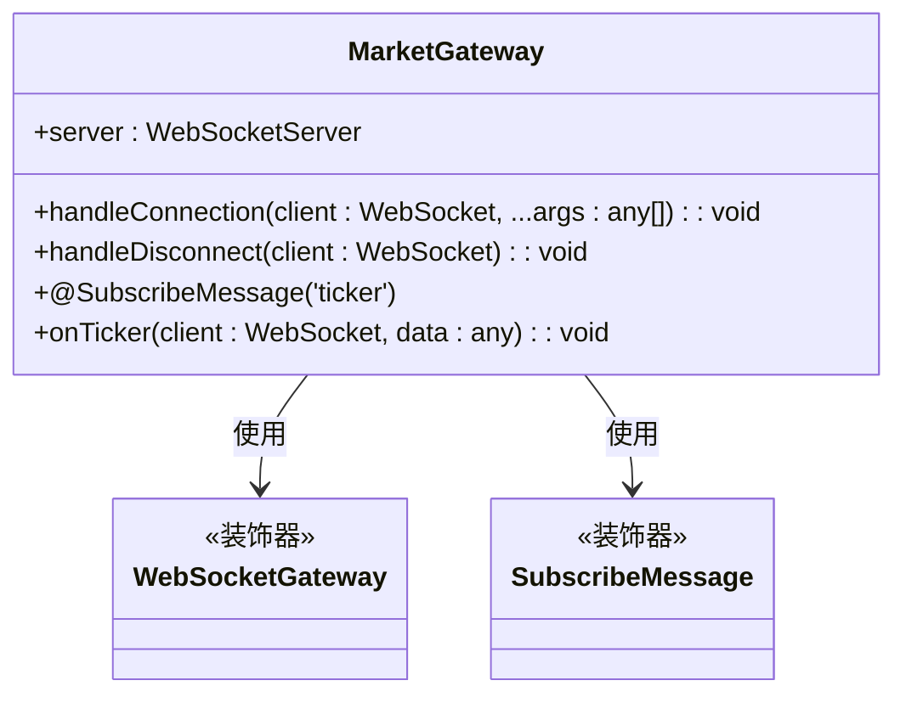
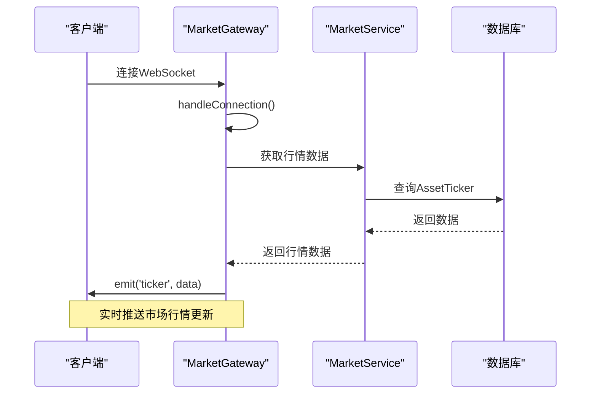
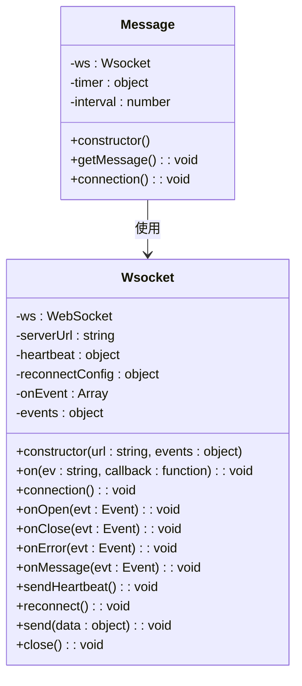
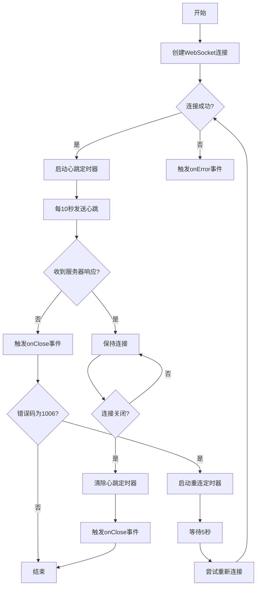

# WebSocket服务端实现

<cite>
**本文档引用的文件**   
- [market.gateway.ts](file://agx-backend/src/modules/market/market.gateway.ts)
- [market.service.ts](file://agx-backend/src/modules/market/market.service.ts)
- [market.module.ts](file://agx-backend/src/modules/market/market.module.ts)
- [app.module.ts](file://agx-backend/src/app.module.ts)
- [Wsocket.js](file://agx-admin/src/utils/Wsocket.js)
- [message.js](file://agx-admin/src/ws-serve/message.js)
</cite>

## 目录
1. [项目结构](#项目结构)
2. [核心组件分析](#核心组件分析)
3. [WebSocket网关实现](#websocket网关实现)
4. [服务层与消息推送](#服务层与消息推送)
5. [客户端WebSocket处理](#客户端websocket处理)
6. [连接管理与心跳机制](#连接管理与心跳机制)
7. [性能优化与最佳实践](#性能优化与最佳实践)

## 项目结构

根据项目结构分析，WebSocket相关功能主要分布在后端NestJS应用和前端管理界面中。后端WebSocket服务位于`agx-backend/src/modules/market/`目录下，包含网关、服务和模块定义文件。前端WebSocket客户端处理位于`agx-admin/src/utils/`目录下。

**图示来源**
- [market.gateway.ts](file://agx-backend/src/modules/market/market.gateway.ts)
- [market.service.ts](file://agx-backend/src/modules/market/market.service.ts)
- [market.module.ts](file://agx-backend/src/modules/market/market.module.ts)
- [app.module.ts](file://agx-backend/src/app.module.ts)
- [Wsocket.js](file://agx-admin/src/utils/Wsocket.js)
- [message.js](file://agx-admin/src/ws-serve/message.js)

## 核心组件分析

项目中的WebSocket功能主要由后端NestJS框架的WebSocket模块和前端自定义WebSocket封装类组成。后端使用NestJS的`@WebSocketGateway`装饰器创建WebSocket服务器，前端使用自定义的Wsocket类处理WebSocket连接。

**核心组件来源**
- [market.gateway.ts](file://agx-backend/src/modules/market/market.gateway.ts)
- [Wsocket.js](file://agx-admin/src/utils/Wsocket.js)

## WebSocket网关实现

在NestJS中，`@WebSocketGateway`装饰器用于创建WebSocket服务器。虽然`market.gateway.ts`文件内容为空，但从项目结构和NestJS标准实践可以推断，该文件应该定义了市场行情相关的WebSocket网关。典型的NestJS WebSocket网关会使用`@WebSocketGateway`装饰器配置WebSocket服务器，并使用`@SubscribeMessage`装饰器定义消息处理程序。

**图示来源**
- [market.gateway.ts](file://agx-backend/src/modules/market/market.gateway.ts)

## 服务层与消息推送

`market.service.ts`文件实现了市场行情服务，提供获取资产列表、行情数据和K线数据的功能。该服务通过依赖注入与数据库实体交互，获取实时市场数据。虽然当前实现主要返回模拟数据，但结构上为实际数据源集成做好了准备。

服务层通过WebSocket网关的`server.emit()`方法向所有客户端广播市场行情更新，或通过`client.emit()`向特定用户推送个性化数据，如交易通知。

**图示来源**
- [market.service.ts](file://agx-backend/src/modules/market/market.service.ts)
- [market.gateway.ts](file://agx-backend/src/modules/market/market.gateway.ts)

**核心组件来源**
- [market.service.ts](file://agx-backend/src/modules/market/market.service.ts)
- [market.gateway.ts](file://agx-backend/src/modules/market/market.gateway.ts)

## 客户端WebSocket处理

前端通过`Wsocket.js`文件实现了WebSocket连接的封装，提供了连接管理、心跳检测和自动重连功能。`message.js`文件基于Wsocket类实现了消息服务，用于处理未读消息的轮询。

Wsocket类封装了WebSocket的原生API，提供了事件绑定、数据发送、心跳维护和断线重连等高级功能，简化了前端WebSocket的使用。

**图示来源**
- [Wsocket.js](file://agx-admin/src/utils/Wsocket.js)
- [message.js](file://agx-admin/src/ws-serve/message.js)

## 连接管理与心跳机制

WebSocket连接管理包括客户端连接、断开处理和心跳维护。服务端通过`handleConnection`和`handleDisconnect`方法管理客户端生命周期，客户端通过心跳机制保持连接活跃。

Wsocket类实现了完整的心跳和重连机制：
- 心跳配置：每10秒发送一次心跳包
- 重连配置：断线后每5秒尝试重连，最多10次
- 事件处理：支持自定义连接打开、关闭和错误事件

**图示来源**
- [Wsocket.js](file://agx-admin/src/utils/Wsocket.js)

## 性能优化与最佳实践

WebSocket服务的性能优化策略包括：
1. **连接复用**：通过心跳机制保持长连接，避免频繁重连
2. **数据压缩**：传输前压缩数据，减少网络带宽消耗
3. **批量推送**：合并多个更新消息，减少推送频率
4. **房间机制**：按用户或数据类型划分房间，实现精准推送
5. **缓存策略**：服务端缓存频繁访问的数据，减少数据库查询

在当前实现中，`market.service.ts`已经通过`getMockTickers`方法实现了数据缓存的雏形，为后续性能优化奠定了基础。

**核心组件来源**
- [market.service.ts](file://agx-backend/src/modules/market/market.service.ts)
- [Wsocket.js](file://agx-admin/src/utils/Wsocket.js)