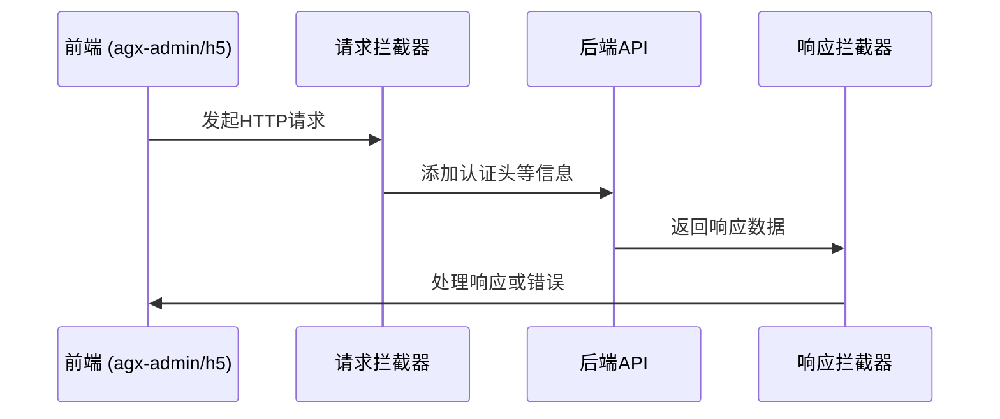
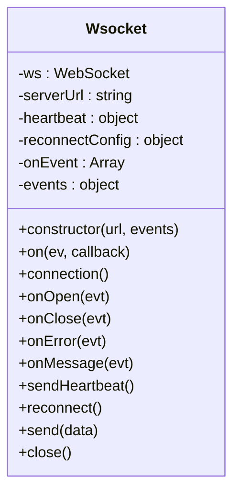
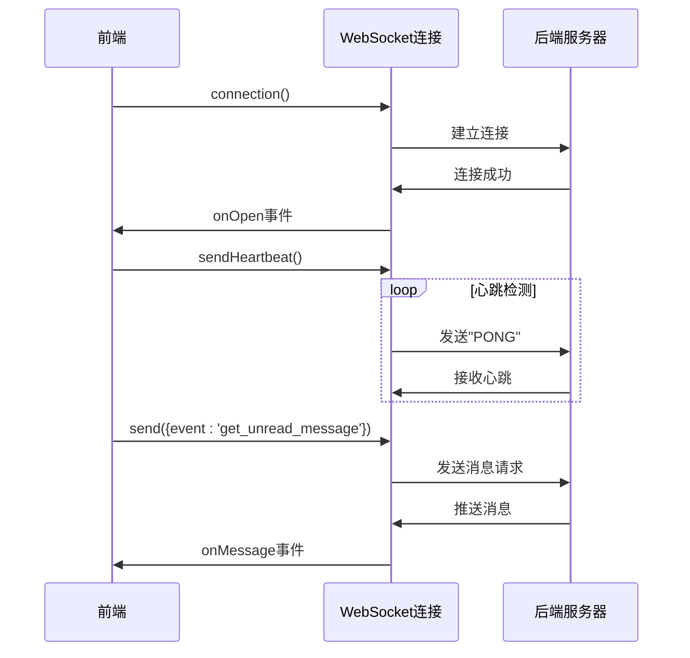
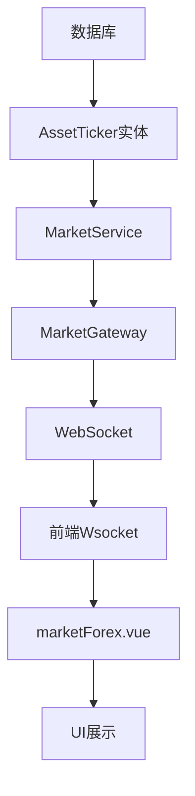
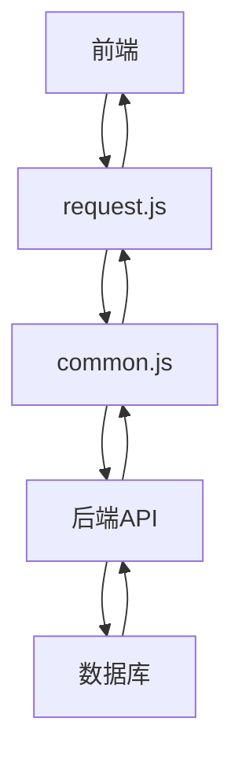
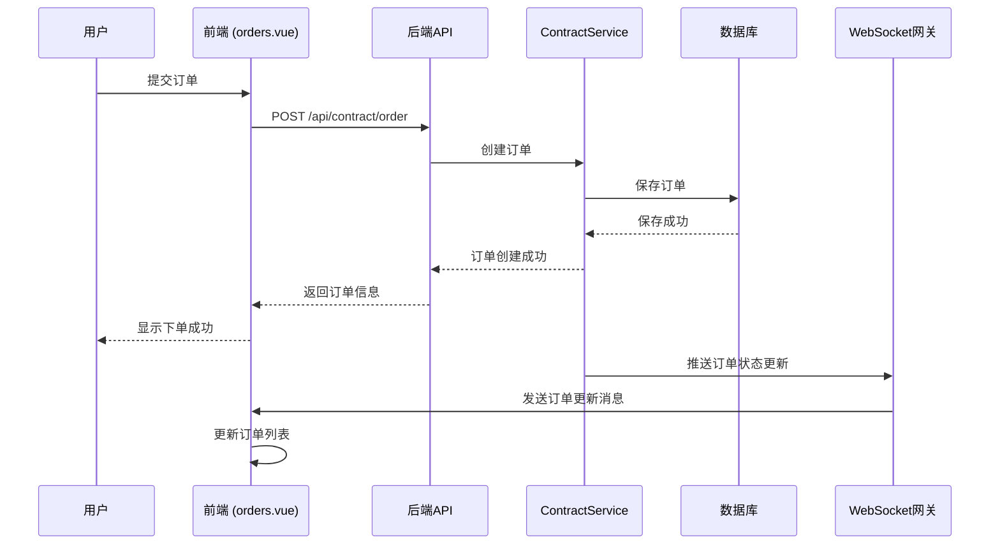

# 数据流与通信

<cite>
**本文档引用的文件**  
- [request.js](file://agx-admin/src/utils/request.js)
- [Wsocket.js](file://agx-admin/src/utils/Wsocket.js)
- [message.js](file://agx-admin/src/ws-serve/message.js)
- [common.js](file://agx-admin/src/api/common.js)
- [api.js](file://h5/src/utils/api.js)
- [market.js](file://h5/src/api/market.js)
- [orders.vue](file://agx-admin/src/views/trading/orders.vue)
- [Orders.vue](file://h5/src/views/Orders.vue)
- [marketForex.vue](file://agx-admin/src/views/agx/marketForex.vue)
- [market.gateway.ts](file://agx-backend/src/modules/market/market.gateway.ts)
- [asset-ticker.entity.ts](file://agx-backend/src/entities/asset-ticker.entity.ts)
- [market.service.ts](file://agx-backend/src/modules/market/market.service.ts)
</cite>

## 目录
1. [引言](#引言)
2. [前端与后端通信机制](#前端与后端通信机制)
3. [WebSocket实时数据通信](#websocket实时数据通信)
4. [数据流路径分析](#数据流路径分析)
5. [典型场景：用户下单流程](#典型场景用户下单流程)
6. [REST与WebSocket对比](#rest与websocket对比)
7. [连接管理与最佳实践](#连接管理与最佳实践)
8. [结论](#结论)

## 引言
本文档详细描述了AGX系统中各组件间的数据交互模式，重点关注前端（agx-admin, h5）如何通过HTTP请求与后端API通信，以及如何通过WebSocket接收实时数据（如市场行情、通知）。文档解释了数据从数据库到后端服务，再到前端展示的完整路径，并为初学者和开发者提供了相关技术的最佳实践。

## 前端与后端通信机制

### HTTP请求封装
系统前端使用axios库封装HTTP请求，提供了统一的请求处理机制。在`agx-admin`项目中，`request.js`文件定义了请求服务，包括请求和响应拦截器，用于处理认证、错误提示和超时等。



**图示来源**
- [request.js](file://agx-admin/src/utils/request.js#L1-L165)
- [api.js](file://h5/src/utils/api.js#L1-L182)

### 请求拦截器
请求拦截器在发送请求前自动添加认证信息（Bearer Token）和语言设置，确保每个请求都包含必要的上下文信息。

### 响应拦截器
响应拦截器统一处理API响应，根据状态码进行相应处理：
- 200系列：正常返回数据
- 401：登录过期，清除本地存储并跳转到登录页
- 403：权限不足
- 404：资源不存在
- 500：服务器内部错误

**本节来源**
- [request.js](file://agx-admin/src/utils/request.js#L1-L165)
- [api.js](file://h5/src/utils/api.js#L1-L182)

## WebSocket实时数据通信

### WebSocket封装
系统使用`Wsocket.js`封装WebSocket通信，提供了连接管理、心跳检测和重连机制。该封装类实现了完整的WebSocket生命周期管理。



**图示来源**
- [Wsocket.js](file://agx-admin/src/utils/Wsocket.js#L1-L195)

### 心跳机制
为了保持连接活跃，系统实现了心跳机制：
- 心跳间隔：10秒
- 心跳消息：发送"PONG"消息
- 心跳定时器在连接打开时启动，在连接关闭时清除

### 重连机制
当连接意外断开时，系统会自动尝试重连：
- 重连间隔：5秒
- 重连次数：10次
- 当收到状态码1006（连接异常关闭）时触发重连

### 消息处理
系统通过`message.js`管理WebSocket消息，定期向服务器发送获取未读消息的请求，实现消息推送功能。



**图示来源**
- [Wsocket.js](file://agx-admin/src/utils/Wsocket.js#L1-L195)
- [message.js](file://agx-admin/src/ws-serve/message.js#L1-L42)

**本节来源**
- [Wsocket.js](file://agx-admin/src/utils/Wsocket.js#L1-L195)
- [message.js](file://agx-admin/src/ws-serve/message.js#L1-L42)

## 数据流路径分析

### 市场行情数据流
市场行情数据从数据库到前端展示的完整路径如下：



**图示来源**
- [asset-ticker.entity.ts](file://agx-backend/src/entities/asset-ticker.entity.ts)
- [market.service.ts](file://agx-backend/src/modules/market/market.service.ts)
- [market.gateway.ts](file://agx-backend/src/modules/market/market.gateway.ts)
- [Wsocket.js](file://agx-admin/src/utils/Wsocket.js)
- [marketForex.vue](file://agx-admin/src/views/agx/marketForex.vue)

### 用户数据流
用户相关数据通过REST API进行交互：



**图示来源**
- [request.js](file://agx-admin/src/utils/request.js)
- [common.js](file://agx-admin/src/api/common.js)
- [数据库实体]

**本节来源**
- [asset-ticker.entity.ts](file://agx-backend/src/entities/asset-ticker.entity.ts)
- [market.service.ts](file://agx-backend/src/modules/market/market.service.ts)
- [market.gateway.ts](file://agx-backend/src/modules/market/market.gateway.ts)
- [Wsocket.js](file://agx-admin/src/utils/Wsocket.js)
- [marketForex.vue](file://agx-admin/src/views/agx/marketForex.vue)
- [common.js](file://agx-admin/src/api/common.js)

## 典型场景用户下单流程

### 下单流程序列图
用户下单的完整流程涉及多个组件的协同工作：



**图示来源**
- [orders.vue](file://agx-admin/src/views/trading/orders.vue)
- [Orders.vue](file://h5/src/views/Orders.vue)
- [market.gateway.ts](file://agx-backend/src/modules/market/market.gateway.ts)

### 订单状态更新
订单状态的实时更新通过WebSocket实现：
1. 后端服务在订单状态变化时，通过WebSocket网关推送更新
2. 前端WebSocket客户端接收消息
3. 前端更新UI显示最新的订单状态

**本节来源**
- [orders.vue](file://agx-admin/src/views/trading/orders.vue)
- [Orders.vue](file://h5/src/views/Orders.vue)
- [market.gateway.ts](file://agx-backend/src/modules/market/market.gateway.ts)

## REST与WebSocket对比

### REST API
REST API适用于请求-响应模式的通信，特点包括：
- 基于HTTP协议
- 无状态
- 适合获取静态数据和执行操作
- 使用JSON格式传输数据
- 通过状态码表示请求结果

### WebSocket
WebSocket适用于实时双向通信，特点包括：
- 基于TCP的持久连接
- 有状态
- 适合实时数据推送
- 支持双向通信
- 减少网络开销

### 应用场景
| 场景 | 推荐技术 | 原因 |
|------|----------|------|
| 获取用户信息 | REST | 静态数据，请求-响应模式 |
| 获取订单列表 | REST | 静态数据，请求-响应模式 |
| 市场行情推送 | WebSocket | 实时性要求高，频繁更新 |
| 订单状态更新 | WebSocket | 实时性要求高，需要及时通知 |
| 发送通知 | WebSocket | 需要即时推送给用户 |

**本节来源**
- [request.js](file://agx-admin/src/utils/request.js)
- [Wsocket.js](file://agx-admin/src/utils/Wsocket.js)
- [api.js](file://h5/src/utils/api.js)

## 连接管理与最佳实践

### 连接管理
系统实现了完善的连接管理机制：
- **连接建立**：在应用启动时建立WebSocket连接
- **心跳检测**：定期发送心跳消息保持连接活跃
- **自动重连**：连接断开时自动尝试重连
- **错误处理**：统一处理连接错误和超时

### 错误重试策略
系统采用指数退避算法进行错误重试：
- 初始重试间隔：5秒
- 重试次数限制：10次
- 避免无限重试导致资源浪费

### 消息序列化
所有WebSocket消息采用JSON格式序列化：
```json
{
  "event": "get_unread_message",
  "data": {}
}
```
这种格式易于解析和扩展，支持不同类型的消息事件。

### 性能监控
系统应实现以下性能监控：
- 连接建立时间
- 消息延迟
- 心跳响应时间
- 重连频率
- 内存使用情况

### 最佳实践
1. **连接复用**：避免频繁创建和销毁连接
2. **消息压缩**：对于大数据量的消息，考虑使用压缩
3. **连接池**：在高并发场景下使用连接池管理
4. **优雅关闭**：在应用关闭时正确关闭WebSocket连接
5. **安全考虑**：使用WSS（WebSocket Secure）加密通信

**本节来源**
- [Wsocket.js](file://agx-admin/src/utils/Wsocket.js)
- [message.js](file://agx-admin/src/ws-serve/message.js)

## 结论
AGX系统通过REST API和WebSocket两种通信方式，实现了高效的数据交互。REST API用于处理传统的请求-响应式操作，而WebSocket用于实时数据推送。系统通过精心设计的封装和管理机制，确保了通信的可靠性、实时性和可维护性。开发者应根据具体场景选择合适的通信方式，并遵循最佳实践来优化系统性能。