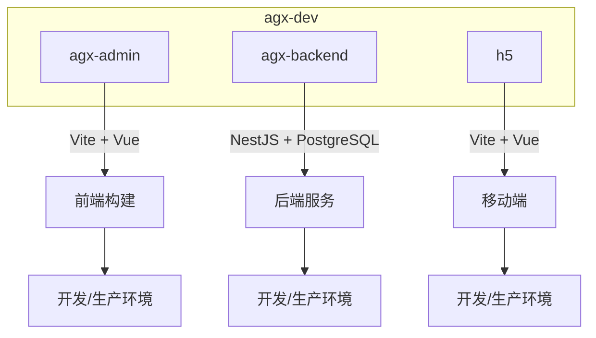
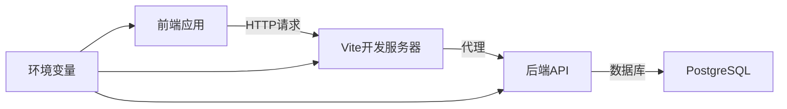
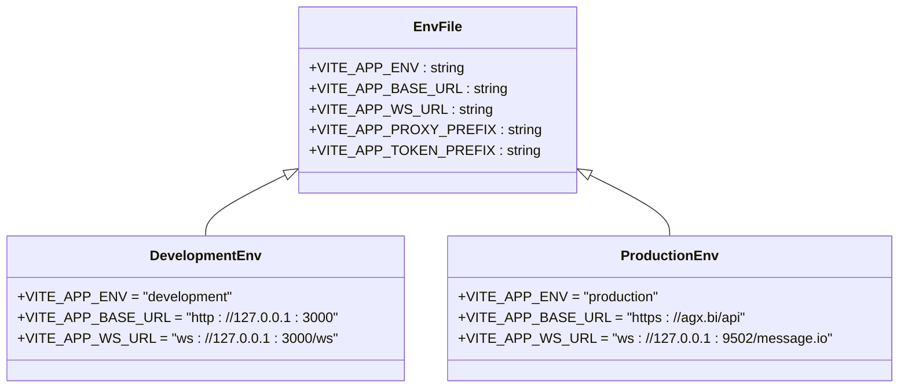
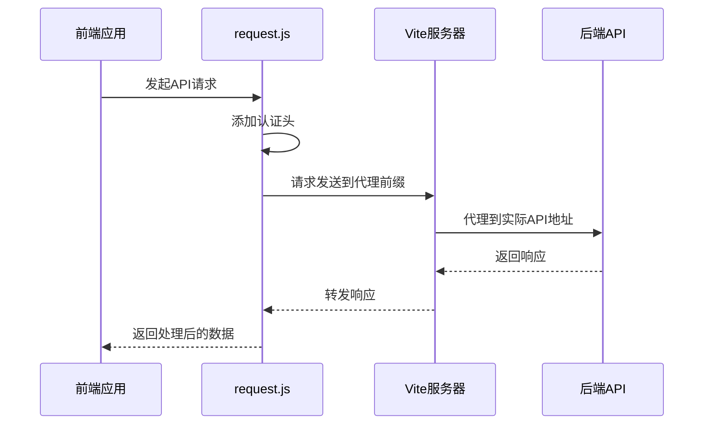
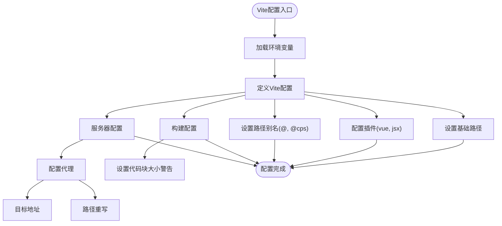
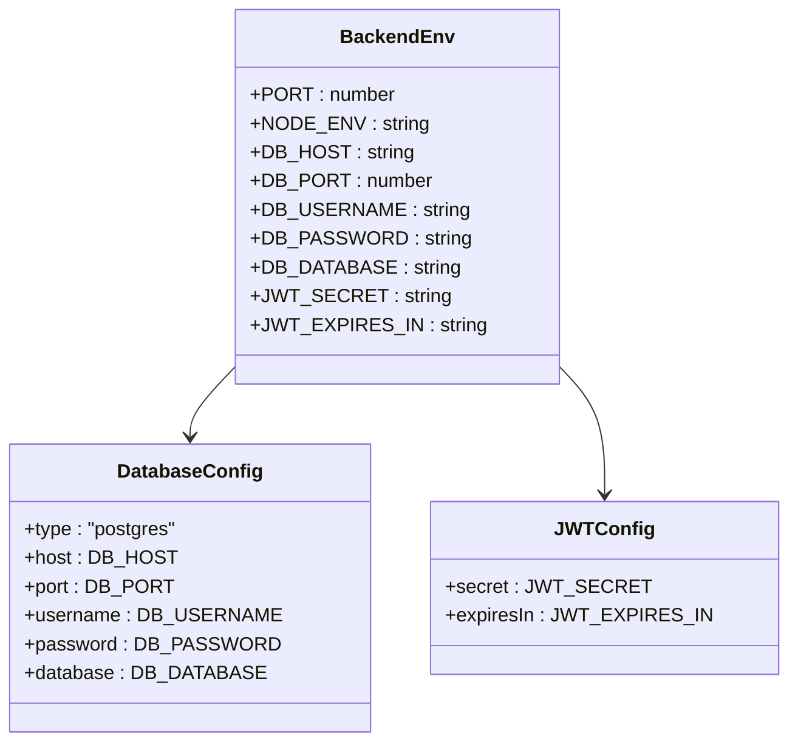
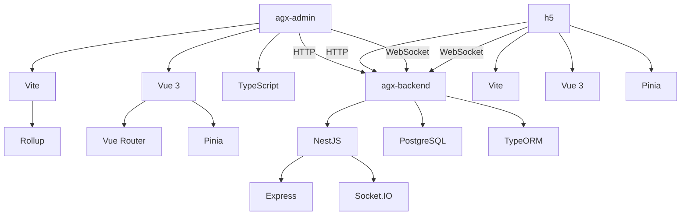

# 环境配置

<cite>
**本文档中引用的文件**  
- [.env.example](file://agx-admin/.env.example)
- [.env.development](file://agx-admin/.env.development)
- [.env.production](file://agx-admin/.env.production)
- [vite.config.js](file://agx-admin/vite.config.js)
- [tsconfig.json](file://agx-admin/tsconfig.json)
- [.env](file://agx-backend/.env)
- [.env](file://h5/.env)
- [package.json](file://agx-admin/package.json)
- [package.json](file://agx-backend/package.json)
- [package.json](file://h5/package.json)
- [vite.config.ts](file://agx-admin/vite.config.ts)
- [tsconfig.app.json](file://agx-admin/tsconfig.app.json)
- [tsconfig.node.json](file://agx-admin/tsconfig.node.json)
- [request.js](file://agx-admin/src/utils/request.js)
- [main.ts](file://agx-backend/src/main.ts)
- [config.entity.ts](file://agx-backend/src/entities/config.entity.ts)
- [admin.service.ts](file://agx-backend/src/modules/admin/admin.service.ts)
</cite>

## 目录
1. [简介](#简介)
2. [项目结构](#项目结构)
3. [核心组件](#核心组件)
4. [架构概述](#架构概述)
5. [详细组件分析](#详细组件分析)
6. [依赖分析](#依赖分析)
7. [性能考虑](#性能考虑)
8. [故障排除指南](#故障排除指南)
9. [结论](#结论)
10. [附录](#附录)（如有必要）

## 简介
本文档旨在为agx-dev项目提供全面的环境配置指导，涵盖开发、测试和生产环境的设置与管理。文档详细说明了`.env`文件中各环境变量的含义和配置方法，解释了`vite.config.js`和`tsconfig.json`等构建配置文件的作用和常见修改场景。同时，文档提供了从零开始配置本地开发环境的分步指南，包括环境变量的创建、数据库连接配置和API端点设置。此外，文档还为开发者提供了环境隔离、配置安全（避免泄露敏感信息）和多环境部署的最佳实践。

## 项目结构
agx-dev项目包含三个主要子项目：`agx-admin`（管理后台前端）、`agx-backend`（后端API服务）和`h5`（移动端H5应用）。每个子项目都有独立的环境配置文件和构建配置。

**图示来源**
- [agx-admin](file://agx-admin)
- [agx-backend](file://agx-backend)
- [h5](file://h5)

**章节来源**
- [agx-admin](file://agx-admin)
- [agx-backend](file://agx-backend)
- [h5](file://h5)

## 核心组件
本项目的核心组件包括环境变量管理、API请求代理、类型检查和构建配置。前端使用Vite作为构建工具，通过`.env`文件管理不同环境的配置；后端使用NestJS框架，通过`.env`文件配置数据库连接和JWT认证。

**章节来源**
- [.env.example](file://agx-admin/.env.example#L1-L5)
- [.env](file://agx-backend/.env#L1-L14)
- [vite.config.js](file://agx-admin/vite.config.js#L1-L48)

## 架构概述
项目采用前后端分离架构，前端通过环境变量配置API基础URL和WebSocket地址，后端提供RESTful API和WebSocket服务。构建工具Vite通过环境变量实现开发环境的代理转发，确保前后端分离开发的顺畅。

**图示来源**
- [vite.config.js](file://agx-admin/vite.config.js#L32-L45)
- [main.ts](file://agx-backend/src/main.ts#L1-L39)
- [.env](file://agx-backend/.env#L5-L9)

## 详细组件分析

### 环境变量配置分析
项目使用`.env`文件进行环境变量管理，支持多环境配置（开发、生产等）。环境变量前缀为`VITE_APP_`，在代码中通过`import.meta.env`访问。

#### 环境变量文件结构

**图示来源**
- [.env.development](file://agx-admin/.env.development#L1-L7)
- [.env.production](file://agx-admin/.env.production#L1-L9)
- [.env.example](file://agx-admin/.env.example#L1-L5)

#### API请求流程

**图示来源**
- [request.js](file://agx-admin/src/utils/request.js#L124-L158)
- [vite.config.js](file://agx-admin/vite.config.js#L36-L43)

#### 构建配置分析

**图示来源**
- [vite.config.js](file://agx-admin/vite.config.js#L1-L48)
- [tsconfig.json](file://agx-admin/tsconfig.json#L1-L37)

**章节来源**
- [vite.config.js](file://agx-admin/vite.config.js#L1-L48)
- [tsconfig.json](file://agx-admin/tsconfig.json#L1-L37)
- [request.js](file://agx-admin/src/utils/request.js#L1-L165)

### 后端环境配置
后端使用NestJS框架，通过`.env`文件配置数据库连接和JWT认证。

**图示来源**
- [.env](file://agx-backend/.env#L1-L14)
- [main.ts](file://agx-backend/src/main.ts#L1-L39)

**章节来源**
- [.env](file://agx-backend/.env#L1-L14)
- [main.ts](file://agx-backend/src/main.ts#L1-L39)

## 依赖分析
项目依赖关系清晰，前端、后端和移动端各自独立，通过API进行通信。构建工具和类型检查工具确保代码质量和一致性。

**图示来源**
- [package.json](file://agx-admin/package.json#L1-L58)
- [package.json](file://agx-backend/package.json#L1-L44)
- [package.json](file://h5/package.json#L1-L24)

**章节来源**
- [package.json](file://agx-admin/package.json#L1-L58)
- [package.json](file://agx-backend/package.json#L1-L44)
- [package.json](file://h5/package.json#L1-L24)

## 性能考虑
项目在构建配置中考虑了性能优化，如代码分割、缓存策略和类型检查优化。Vite的按需编译特性提高了开发效率，生产构建配置了代码块大小警告以控制包大小。

## 故障排除指南
当遇到环境配置问题时，可检查以下方面：
1. 确认`.env`文件是否正确命名和放置
2. 检查环境变量前缀是否正确（前端为`VITE_APP_`，后端直接使用）
3. 验证代理配置是否正确指向后端服务
4. 确认数据库连接信息是否正确
5. 检查JWT密钥是否匹配

**章节来源**
- [.env](file://agx-backend/.env#L1-L14)
- [vite.config.js](file://agx-admin/vite.config.js#L36-L43)
- [request.js](file://agx-admin/src/utils/request.js#L124-L158)

## 结论
agx-dev项目通过完善的环境配置机制，实现了开发、测试和生产环境的有效隔离。通过`.env`文件管理环境变量，结合Vite的代理功能，确保了前后端分离开发的顺畅。项目配置清晰，易于维护和扩展，为开发者提供了良好的开发体验。

## 附录

### 环境变量参考表
| 环境变量 | 说明 | 示例值 | 作用范围 |
|---------|------|--------|---------|
| VITE_APP_ENV | 应用环境 | development | agx-admin |
| VITE_APP_BASE_URL | API基础URL | http://127.0.0.1:3000 | agx-admin |
| VITE_APP_WS_URL | WebSocket地址 | ws://127.0.0.1:3000/ws | agx-admin |
| VITE_APP_PROXY_PREFIX | 代理前缀 | /api | agx-admin |
| VITE_APP_TOKEN_PREFIX | 令牌前缀 | agx_admin_token | agx-admin |
| PORT | 服务端口 | 3000 | agx-backend |
| DB_HOST | 数据库主机 | 127.0.0.1 | agx-backend |
| DB_PORT | 数据库端口 | 5432 | agx-backend |
| DB_USERNAME | 数据库用户名 | agx | agx-backend |
| DB_PASSWORD | 数据库密码 | AGX2025Pass | agx-backend |
| DB_DATABASE | 数据库名称 | agx | agx-backend |
| JWT_SECRET | JWT密钥 | agx-jwt-secret-2025 | agx-backend |
| JWT_EXPIRES_IN | JWT过期时间 | 7d | agx-backend |

### 配置文件作用说明
| 配置文件 | 作用 |
|---------|------|
| vite.config.js | Vite构建工具配置，包括代理、别名、构建选项等 |
| tsconfig.json | TypeScript编译配置，定义编译选项和路径映射 |
| .env | 环境变量配置文件，存储敏感信息和环境特定配置 |
| package.json | 项目依赖和脚本配置 |