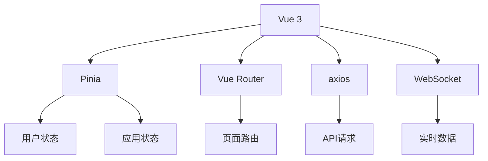
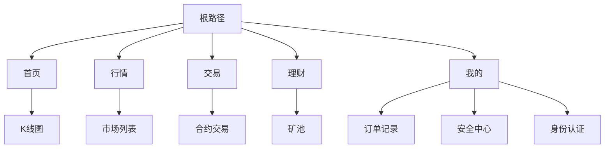
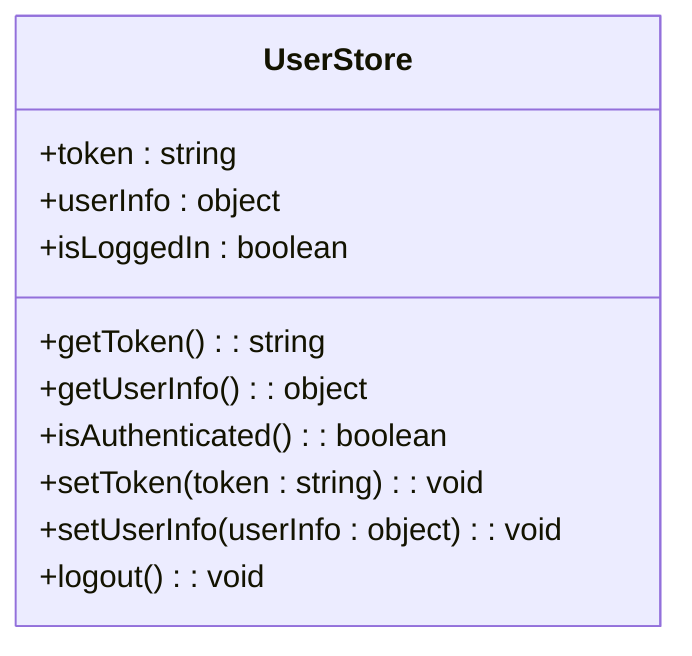
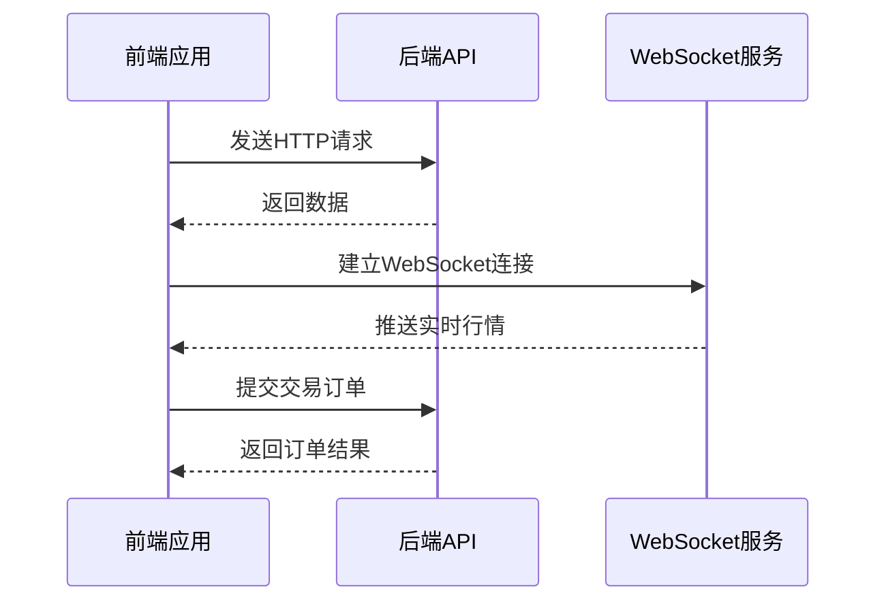

# 移动端架构

<cite>
**本文档引用的文件**   
- [main.js](file://h5/src/main.js)
- [router/index.js](file://h5/src/router/index.js)
- [user.js](file://h5/src/stores/user.js)
- [Orders.vue](file://h5/src/views/Orders.vue)
- [UserProfile.vue](file://h5/src/views/UserProfile.vue)
- [api.js](file://h5/src/utils/api.js)
- [IOSAlert.vue](file://h5/src/components/IOSAlert.vue)
- [alert.js](file://h5/src/utils/alert.js)
</cite>

## 目录
1. [简介](#简介)
2. [项目结构](#项目结构)
3. [核心架构](#核心架构)
4. [路由系统](#路由系统)
5. [状态管理](#状态管理)
6. [API与WebSocket集成](#api与websocket集成)
7. [用户界面与交互](#用户界面与交互)
8. [与agx-admin管理后台的区别](#与agx-admin管理后台的区别)
9. [开发最佳实践](#开发最佳实践)
10. [结论](#结论)

## 简介

本文档详细描述了基于Vue 3的移动端H5应用架构，重点分析其轻量级Vue架构和用户体验设计。该应用利用Vue 3和Pinia实现响应式数据绑定和状态管理，通过router/index.js处理移动端页面路由。文档将深入探讨其与后端API和WebSocket的集成方式，以实现实时行情和交易功能，并解释其与agx-admin管理后台在功能和设计上的区别，强调移动端的简洁性和易用性。

## 项目结构

该移动端H5应用采用标准的Vue项目结构，主要包含以下目录：

- `src/api/`: API接口定义
- `src/components/`: 可复用的UI组件
- `src/config/`: 应用配置
- `src/router/`: 路由配置
- `src/stores/`: Pinia状态管理
- `src/styles/`: 全局样式
- `src/utils/`: 工具函数
- `src/views/`: 页面组件
- `src/App.vue`: 根组件
- `src/main.js`: 应用入口

这种结构清晰地分离了不同类型的代码，便于维护和扩展。

**Section sources**
- [h5/src](file://h5/src)

## 核心架构

移动端H5应用采用Vue 3作为核心框架，结合Pinia进行状态管理，实现了轻量级、高性能的移动应用架构。应用入口文件main.js通过createApp创建Vue应用实例，并集成Pinia和Vue Router。

**Diagram sources**
- [h5/src/main.js](file://h5/src/main.js)

**Section sources**
- [h5/src/main.js](file://h5/src/main.js)

## 路由系统

路由系统由router/index.js文件定义，采用Vue Router 4实现。路由配置中包含了应用的所有页面，如首页、行情、交易、理财、我的等主要功能页面，以及充值、提现、设置、新币发行等辅助功能页面。

**Diagram sources**
- [h5/src/router/index.js](file://h5/src/router/index.js)

**Section sources**
- [h5/src/router/index.js](file://h5/src/router/index.js)

## 状态管理

应用使用Pinia进行状态管理，在src/stores/user.js中定义了用户状态存储。该存储包含用户token、用户信息和登录状态，并提供了相应的getter和action方法来访问和修改状态。

**Diagram sources**
- [h5/src/stores/user.js](file://h5/src/stores/user.js)

**Section sources**
- [h5/src/stores/user.js](file://h5/src/stores/user.js)

## API与WebSocket集成

应用通过axios与后端API进行通信，在src/utils/api.js中定义了统一的API接口。API客户端配置了请求和响应拦截器，自动处理token认证和错误响应。

**Diagram sources**
- [h5/src/utils/api.js](file://h5/src/utils/api.js)

**Section sources**
- [h5/src/utils/api.js](file://h5/src/utils/api.js)

## 用户界面与交互

应用的用户界面设计简洁直观，注重移动端用户体验。以Orders.vue和UserProfile.vue为例，展示了数据流和用户交互模式。

### 订单页面分析

Orders.vue页面展示了用户的订单记录，包含订单类型筛选、状态筛选和订单列表。页面使用computed属性实现数据过滤，确保响应式更新。

**Section sources**
- [h5/src/views/Orders.vue](file://h5/src/views/Orders.vue)

### 用户主页分析

UserProfile.vue页面展示了用户主页，包含用户信息、动态、喜欢和收藏等标签页。页面通过路由参数获取用户ID，动态加载用户数据。

**Section sources**
- [h5/src/views/UserProfile.vue](file://h5/src/views/UserProfile.vue)

## 与agx-admin管理后台的区别

移动端H5应用与agx-admin管理后台在功能和设计上有显著区别：

1. **功能定位**：移动端侧重于用户日常操作和实时交易，管理后台侧重于系统管理和数据监控。
2. **界面设计**：移动端采用简洁的移动端UI，管理后台采用复杂的桌面端UI。
3. **交互方式**：移动端优化触摸操作，管理后台支持鼠标和键盘操作。
4. **数据展示**：移动端展示关键指标，管理后台展示详细数据报表。

这种区别确保了移动端的简洁性和易用性，同时满足管理后台的复杂功能需求。

## 开发最佳实践

为开发者提供以下移动端开发最佳实践：

### 性能优化

- 使用懒加载路由提高首屏加载速度
- 合理使用computed和watch避免不必要的计算
- 优化图片和资源加载

### 离线处理

- 使用localStorage持久化用户状态
- 实现离线数据缓存和同步机制
- 提供离线状态提示

### 与原生功能集成

- 通过IOSAlert组件实现原生风格的弹窗
- 使用Web API访问设备功能
- 实现PWA支持离线使用

**Section sources**
- [h5/src/components/IOSAlert.vue](file://h5/src/components/IOSAlert.vue)
- [h5/src/utils/alert.js](file://h5/src/utils/alert.js)

## 结论

本文档全面分析了移动端H5应用的架构设计，展示了如何利用Vue 3和Pinia构建轻量级、高性能的移动应用。通过合理的路由设计、状态管理和API集成，实现了流畅的用户体验和实时功能。与管理后台的差异化设计确保了各自场景下的最佳使用体验。开发者应遵循文档中的最佳实践，持续优化应用性能和用户体验。