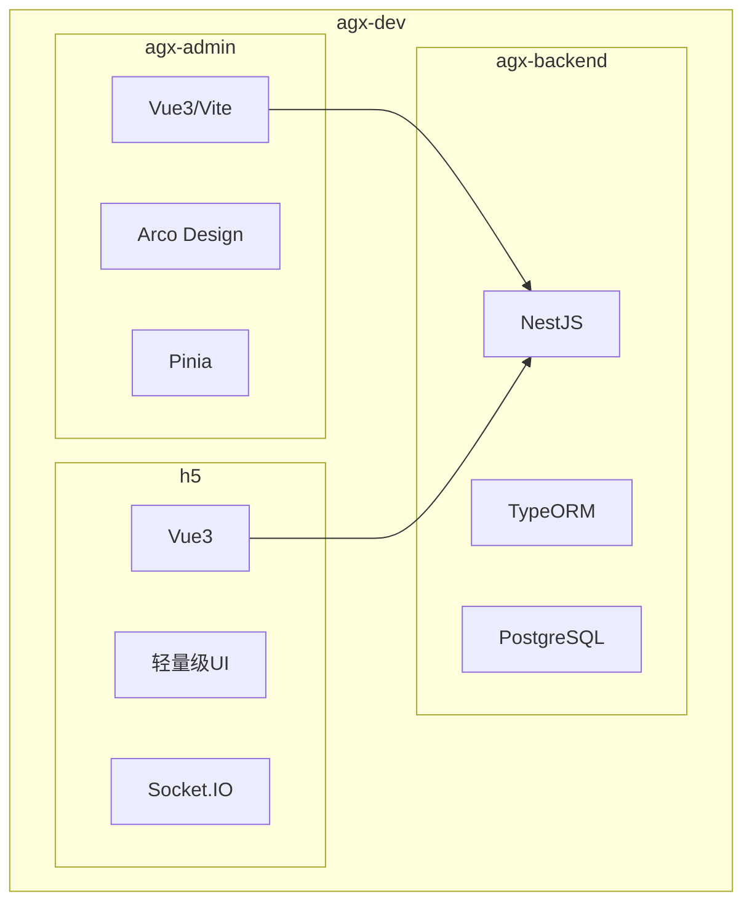
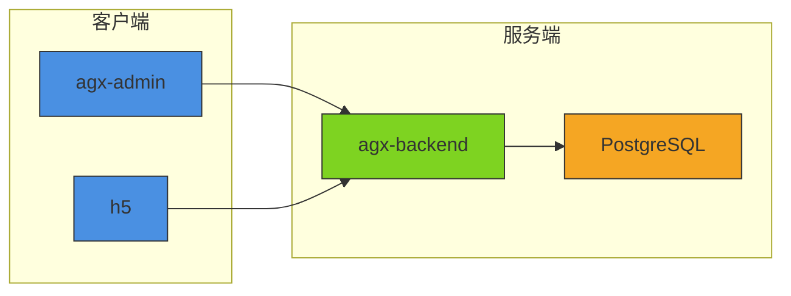
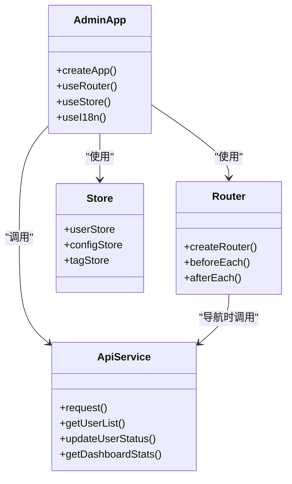
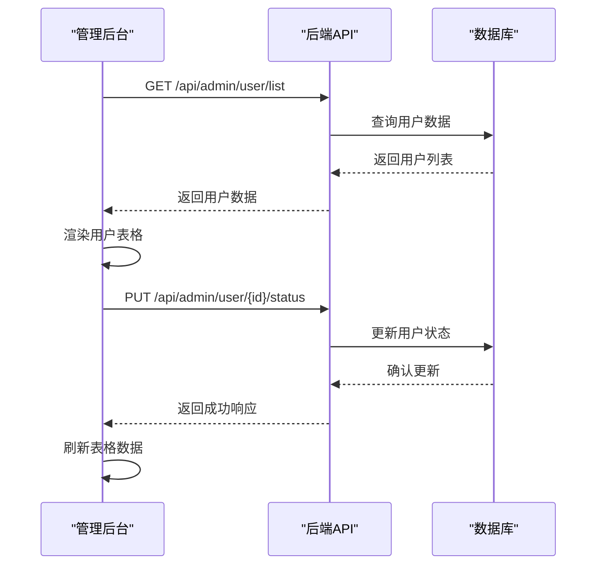
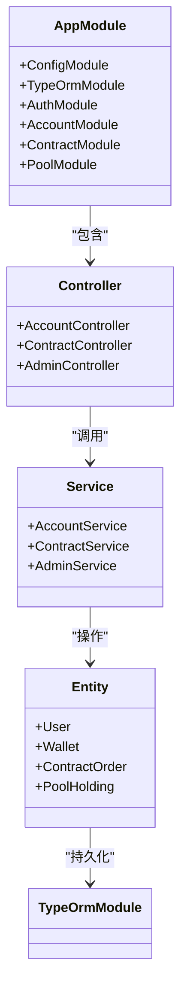
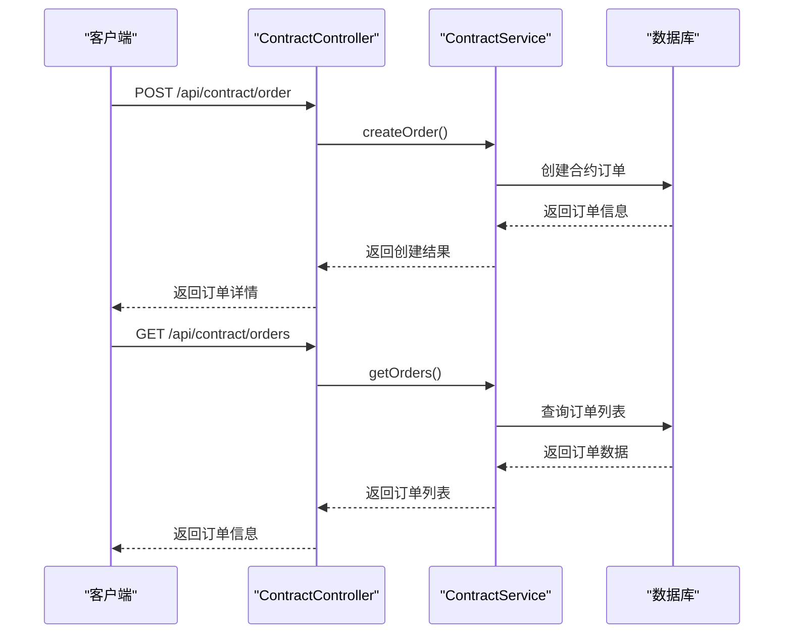
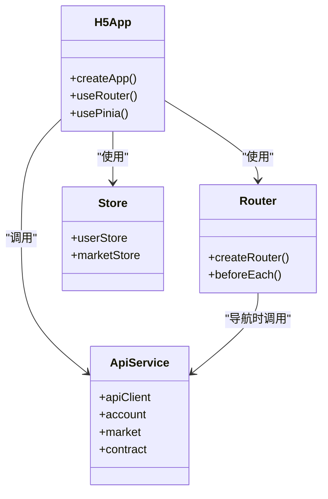
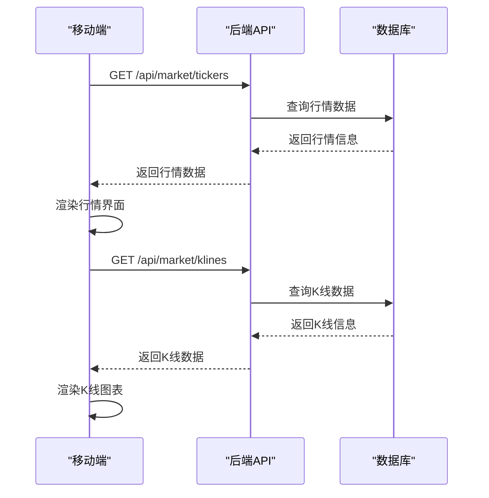
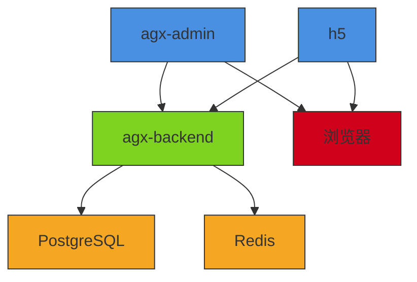

# 系统概述

<cite>
**本文档引用的文件**  
- [main.js](file://agx-admin/src/main.js)
- [package.json](file://agx-admin/package.json)
- [router/index.js](file://agx-admin/src/router/index.js)
- [users.vue](file://agx-admin/src/views/agx/users.vue)
- [dashboard.vue](file://agx-admin/src/views/agx/dashboard.vue)
- [main.ts](file://agx-backend/src/main.ts)
- [app.module.ts](file://agx-backend/src/app.module.ts)
- [contract.controller.ts](file://agx-backend/src/modules/contract/contract.controller.ts)
- [account.controller.ts](file://agx-backend/src/modules/account/account.controller.ts)
- [index.ts](file://agx-backend/src/entities/index.ts)
- [agx/index.js](file://agx-admin/src/api/agx/index.js)
- [main.js](file://h5/src/main.js)
- [package.json](file://h5/package.json)
- [router/index.js](file://h5/src/router/index.js)
- [api.js](file://h5/src/utils/api.js)
- [market.js](file://h5/src/api/market.js)
</cite>

## 目录
1. [简介](#简介)
2. [项目结构](#项目结构)
3. [核心组件](#核心组件)
4. [架构概览](#架构概览)
5. [详细组件分析](#详细组件分析)
6. [依赖分析](#依赖分析)
7. [性能考虑](#性能考虑)
8. [故障排除指南](#故障排除指南)
9. [结论](#结论)

## 简介

agx-dev全栈数字资产交易平台是一个集管理后台、后端服务和移动端H5应用于一体的综合解决方案。该系统为数字资产交易提供了完整的管理、业务处理和用户交互功能。平台由三个主要组件构成：agx-admin提供管理界面，agx-backend提供业务逻辑和API服务，h5提供移动端用户体验。系统支持用户管理、资产管理、交易系统、内容管理、系统监控等核心功能模块，采用现代化的技术架构，包括前端Vue3/Vite、后端NestJS/TypeORM和移动端轻量级Vue框架。

## 项目结构

agx-dev平台由三个主要子项目组成：agx-admin（管理后台）、agx-backend（后端服务）和h5（移动端H5应用）。每个子项目都有独立的目录结构和依赖管理。

**图示来源**  
- [package.json](file://agx-admin/package.json)
- [package.json](file://agx-backend/package.json)
- [package.json](file://h5/package.json)

**本节来源**  
- [package.json](file://agx-admin/package.json)
- [package.json](file://agx-backend/package.json)
- [package.json](file://h5/package.json)

## 核心组件

agx-dev平台的核心组件包括管理后台(agx-admin)、后端服务(agx-backend)和移动端应用(h5)。agx-admin基于Vue3和Vite构建，使用Arco Design作为UI组件库，为管理员提供全面的系统管理功能。agx-backend采用NestJS框架，结合TypeORM实现数据持久化，为整个系统提供RESTful API服务。h5应用是轻量级的移动端解决方案，使用Vue3构建，为用户提供便捷的移动交易体验。

**本节来源**  
- [package.json](file://agx-admin/package.json)
- [package.json](file://agx-backend/package.json)
- [package.json](file://h5/package.json)

## 架构概览

agx-dev平台采用典型的前后端分离架构，三个主要组件通过API进行通信。管理后台和移动端应用作为客户端，通过HTTP请求与后端服务交互，后端服务处理业务逻辑并访问数据库。

**图示来源**  
- [main.js](file://agx-admin/src/main.js)
- [main.ts](file://agx-backend/src/main.ts)
- [main.js](file://h5/src/main.js)

**本节来源**  
- [main.js](file://agx-admin/src/main.js)
- [main.ts](file://agx-backend/src/main.ts)
- [main.js](file://h5/src/main.js)

## 详细组件分析

### agx-admin管理后台分析

agx-admin是基于Vue3和Vite构建的管理后台，为系统管理员提供全面的管理功能。它使用Arco Design作为UI组件库，Pinia作为状态管理工具，支持用户管理、资产管理、交易监控、内容发布等核心功能。

#### 管理后台架构

**图示来源**  
- [main.js](file://agx-admin/src/main.js)
- [router/index.js](file://agx-admin/src/router/index.js)
- [agx/index.js](file://agx-admin/src/api/agx/index.js)

#### 用户管理功能

**图示来源**  
- [users.vue](file://agx-admin/src/views/agx/users.vue)
- [agx/index.js](file://agx-admin/src/api/agx/index.js)

### agx-backend后端服务分析

agx-backend是基于NestJS框架构建的后端服务，为整个系统提供业务逻辑处理和API接口。它采用模块化设计，包含用户、账户、合约、矿池等多个业务模块，使用TypeORM与PostgreSQL数据库交互。

#### 后端服务架构

**图示来源**  
- [app.module.ts](file://agx-backend/src/app.module.ts)
- [account.controller.ts](file://agx-backend/src/modules/account/account.controller.ts)
- [contract.controller.ts](file://agx-backend/src/modules/contract/contract.controller.ts)

#### 合约交易流程

**图示来源**  
- [contract.controller.ts](file://agx-backend/src/modules/contract/contract.controller.ts)
- [account.controller.ts](file://agx-backend/src/modules/account/account.controller.ts)

### h5移动端应用分析

h5是基于Vue3构建的轻量级移动端应用，为用户提供便捷的数字资产交易体验。它通过API与后端服务交互，支持行情查看、交易下单、资产管理和社交互动等功能。

#### 移动端应用架构

**图示来源**  
- [main.js](file://h5/src/main.js)
- [router/index.js](file://h5/src/router/index.js)
- [api.js](file://h5/src/utils/api.js)

#### 行情数据获取流程

**图示来源**  
- [market.js](file://h5/src/api/market.js)
- [api.js](file://h5/src/utils/api.js)

**本节来源**  
- [main.js](file://agx-admin/src/main.js)
- [router/index.js](file://agx-admin/src/router/index.js)
- [users.vue](file://agx-admin/src/views/agx/users.vue)
- [main.ts](file://agx-backend/src/main.ts)
- [app.module.ts](file://agx-backend/src/app.module.ts)
- [contract.controller.ts](file://agx-backend/src/modules/contract/contract.controller.ts)
- [account.controller.ts](file://agx-backend/src/modules/account/account.controller.ts)
- [main.js](file://h5/src/main.js)
- [router/index.js](file://h5/src/router/index.js)
- [api.js](file://h5/src/utils/api.js)

## 依赖分析

agx-dev平台的三个主要组件之间存在明确的依赖关系。管理后台和移动端应用都依赖于后端服务提供的API接口，后端服务则依赖于数据库存储数据。

**图示来源**  
- [package.json](file://agx-admin/package.json)
- [package.json](file://agx-backend/package.json)
- [package.json](file://h5/package.json)

**本节来源**  
- [package.json](file://agx-admin/package.json)
- [package.json](file://agx-backend/package.json)
- [package.json](file://h5/package.json)

## 性能考虑

agx-dev平台在设计时考虑了性能优化。后端服务采用NestJS框架，具有良好的性能表现和可扩展性。数据库使用PostgreSQL，支持复杂的查询和事务处理。前端应用采用Vue3的响应式系统，确保用户界面的流畅性。对于高频访问的数据，系统可以集成Redis等缓存机制来提高响应速度。

## 故障排除指南

当系统出现问题时，可以按照以下步骤进行排查：
1. 检查后端服务是否正常运行
2. 验证数据库连接是否正常
3. 检查API接口是否能够正常访问
4. 查看管理后台和移动端应用的网络请求
5. 检查日志文件以获取错误信息

**本节来源**  
- [main.ts](file://agx-backend/src/main.ts)
- [main.js](file://agx-admin/src/main.js)
- [main.js](file://h5/src/main.js)

## 结论

agx-dev全栈数字资产交易平台通过agx-admin、agx-backend和h5三个组件的协同工作，提供了一个完整的数字资产交易解决方案。系统采用现代化的技术栈，具有良好的可维护性和扩展性。管理后台为管理员提供了全面的管理功能，后端服务处理核心业务逻辑，移动端应用为用户提供了便捷的交易体验。这种三位一体的架构设计使得系统既强大又灵活，能够满足数字资产交易平台的各种需求。